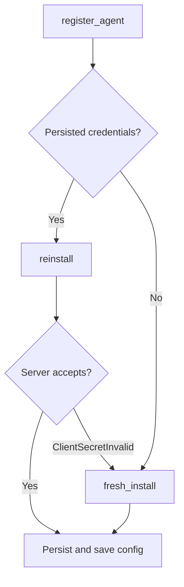

<!-- source-hash: 5a1dcf8c20d0c8f1fa048ac7610b3ac5 -->
Handles agent registration lifecycle, supporting both fresh installs and reinstalls using persisted machine credentials.

## Key Components

### `AgentRegistrationService`
Primary service struct (cloneable) that orchestrates the full registration flow with four dependencies:
- `RegistrationClient` — HTTP client for server-side registration calls
- `DeviceDataFetcher` — Collects local device metadata (hostname, OS type, agent version)
- `AgentConfigurationService` — Persists registration data post-registration
- `InitialConfigurationService` — Provides the initial key, org ID, and tags

### Key Methods

| Method | Description |
|---|---|
| `register_agent` | Main entry point; reads persisted credentials and routes to fresh or reinstall path |
| `read_persisted_credentials` | Retries up to 3 times (at 1s, 3s, 5s) before falling back to `None` |
| `fresh_install` | Registers with no prior identity; server generates `machine_id` and `client_secret` |
| `reinstall` | Sends saved credentials; falls back to `fresh_install` if server rejects the secret |
| `build_registration_request` | Assembles `AgentRegistrationRequest` from local device data |

## Usage Example

```rust
let service = AgentRegistrationService::new(
    registration_client,
    device_data_fetcher,
    config_service,
    initial_configuration_service,
);

match service.register_agent().await {
    Ok(response) => println!("Registered as machine: {}", response.machine_id),
    Err(e) => eprintln!("Registration failed: {:#}", e),
}
```

## Registration Flow



> **Source:** [`agent_registration_service.rs`](https://github.com/flamingo-stack/openframe-oss-tenant/blob/main/agent_registration_service.rs)