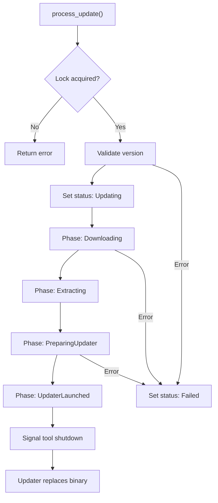

<!-- source-hash: fbfe4057dde6579e1cd8a0dfdfb60821 -->
Manages the end-to-end update lifecycle for the OpenFrame client binary, handling version validation, download orchestration, archive preparation, and updater process launch with concurrent update protection.

## Key Components

- **`OpenFrameClientUpdateService`** — Main service struct holding references to dependent services and a mutex-guarded `update_in_progress` flag to prevent race conditions
- **`process_update()`** — Public entry point; acquires the update lock and delegates to internal logic, releasing the lock on completion or error
- **`process_update_internal()`** — Validates version format, checks current client state, initializes `UpdateState` tracking, and orchestrates status transitions (`Updating` → `Failed`)
- **`execute_update()`** — Core update pipeline: resolves OS-specific download config → downloads/extracts binary → creates temp archive → launches platform updater → signals tool shutdown
- **`create_temp_archive()`** — Platform-conditional: creates a ZIP archive on Windows; writes the binary directly on Unix
- **`parse_version()` / `is_valid_version()`** — Semver helpers supporting `v`-prefixed strings (e.g., `v1.2.3`, `1.2.3-beta`)

## Usage Example

```rust
let service = OpenFrameClientUpdateService::new(
    client_info_service,
    github_download_service,
    update_state_service,
    tool_run_manager,
);

let message = OpenFrameClientUpdateMessage {
    version: "v1.5.0".to_string(),
    download_configurations: vec![/* OS-specific configs */],
};

service.process_update(message).await?;
// Service process will be replaced by the updater script after this point
```

## Update Phase Flow

