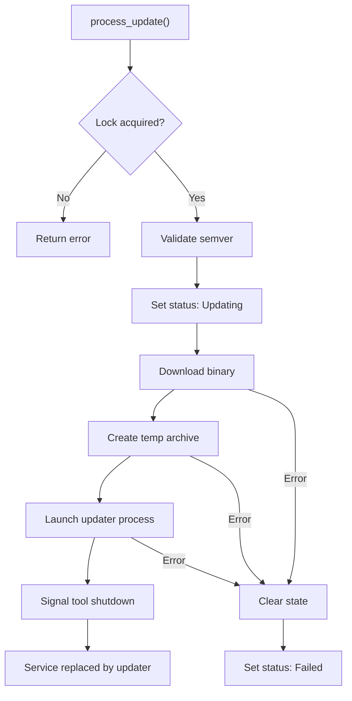

<!-- source-hash: fbfe4057dde6579e1cd8a0dfdfb60821 -->
Manages the end-to-end lifecycle of OpenFrame client self-updates, orchestrating version validation, binary download, archive preparation, and updater process launch with concurrency protection.

## Key Components

**`OpenFrameClientUpdateService`** — Main service struct holding injected dependencies and an `Arc<Mutex<bool>>` lock to prevent concurrent update races.

| Method | Description |
|--------|-------------|
| `new(...)` | Constructs the service with all required dependencies |
| `process_update(message)` | Public entry point; acquires the update lock before delegating |
| `process_update_internal(message)` | Validates version, tracks state, sets `Updating` status, delegates to `execute_update` |
| `execute_update(message, state)` | Downloads binary, creates platform archive, launches the updater process, signals tool shutdown |
| `create_temp_archive(bytes, name)` | Platform-specific: ZIP on Windows, raw binary on Unix |
| `parse_version(version)` | Parses `v`-prefixed or bare semver strings into `semver::Version` |
| `is_valid_version(version)` | Basic format guard before full semver parse |

## Usage Example

```rust
let svc = OpenFrameClientUpdateService::new(
    client_info_service,
    github_download_service,
    update_state_service,
    tool_run_manager,
);

let message = OpenFrameClientUpdateMessage {
    version: "v1.4.2".to_string(),
    download_configurations: vec![/* OS-specific configs */],
};

// Acquires lock, validates version, downloads, launches updater
svc.process_update(message).await?;
```

## Update Flow



> **Note:** On failure at any stage, update state is cleared and `ClientUpdateStatus::Failed` is set so the NATS message bus can retry delivery.