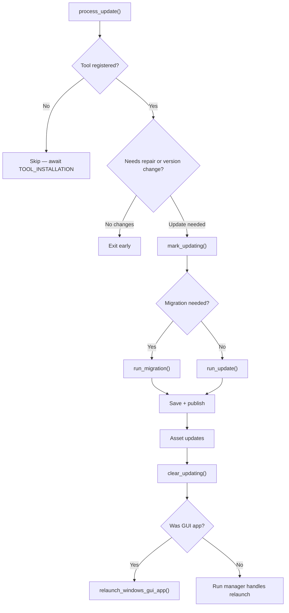

<!-- source-hash: 20cf0c9adb9ee0bc509c0f47de5d8ebc -->
Orchestrates the full lifecycle of tool agent updates, handling version checks, binary repairs, asset updates, installation type migrations, and platform-specific relaunch logic for managed tool agents.

## Key Components

### `ToolAgentUpdateService` (struct)

The primary service struct holding all dependencies required to coordinate tool agent updates.

**Dependencies injected via `new()`:**

| Field | Purpose |
|---|---|
| `github_download_service` | Downloads tool binaries from GitHub releases |
| `tool_agent_file_client` | Accesses tool agent file metadata |
| `installed_tools_service` | Reads/writes the installed tool registry |
| `tool_kill_service` | Stops running tool processes |
| `tool_run_manager` | Tracks update state and relaunches tools |
| `directory_manager` | Resolves paths and verifies binary presence |
| `config_service` | Reads agent configuration |
| `installed_agent_publisher` | Publishes post-update status messages |
| `command_params_resolver` | Resolves runtime command parameters |

### Key Methods

- **`process_update(message)`** — Entry point. Validates installation state, detects missing binaries, determines what needs updating (tool binary, assets, or both), coordinates the update sequence, and triggers relaunch.
- **`do_updates(...)`** — Sequences tool binary update followed by asset updates, stopping the tool process only once before asset changes.
- **`do_tool_update(...)`** — Handles OS-specific download config selection, detects installation type migrations (e.g., Standard → GuiApp), and persists updated metadata.
- **`do_legacy_update(...)`** — Fallback path for tools without `download_configurations`, supporting only `Standard` installation type.

## Usage Example

```rust
let service = ToolAgentUpdateService::new(
    github_download_service,
    tool_agent_file_client,
    installed_tools_service,
    tool_kill_service,
    tool_run_manager,
    directory_manager,
    config_service,
    installed_agent_publisher,
    command_params_resolver,
);

let message = ToolAgentUpdateMessage {
    tool_agent_id: "my-tool".to_string(),
    version: "1.2.0".to_string(),
    download_configurations: vec![/* OS-specific configs */],
    assets: None,
};

service.process_update(message).await?;
```

## Update Flow



> **Source:** [`tool_agent_update_service.rs`](https://github.com/flamingo-stack/openframe-oss-tenant/blob/main/src/services/tool_agent_update_service.rs)