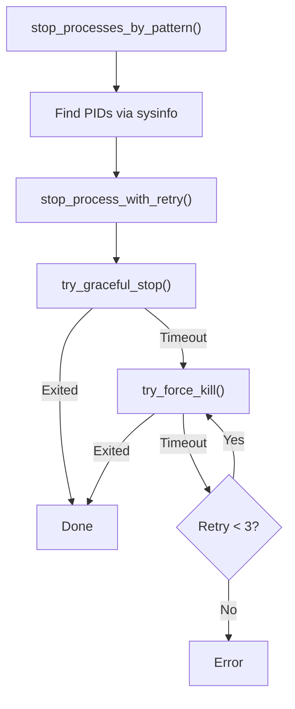

<!-- source-hash: 4bf2e09e6141c0a11441707c3b57e558 -->
Handles stopping and killing tool processes across Windows, macOS, and Linux, supporting graceful termination with fallback to force kill, retry logic, and multiple process-matching strategies.

## Key Components

### `ToolKillService`
The main service struct (cloneable, stateless) with the following public methods:

- **`stop_tool(tool_id)`** — Finds and stops processes matching a tool's command pattern
- **`stop_asset(asset_id, tool_id)`** — Stops processes matching an asset+tool command pattern
- **`stop_tool_by_path(executable_path)`** — Stops processes matching a specific executable path
- **`stop_installed_tool(tool)`** — Stops an `InstalledTool` by delegating to `stop_for_installation`
- **`stop_for_installation(tool_agent_id, installation)`** — Dispatches stop logic based on `Installation` variant (`GuiApp`, `Standard`, `Service`)
- **`stop_service(service_name)`** — Stops a system service via the OS-native service manager

### Constants

| Constant | Value | Purpose |
|---|---|---|
| `GRACEFUL_SHUTDOWN_TIMEOUT_SECS` | `5` | Max wait after SIGTERM |
| `FORCE_KILL_TIMEOUT_SECS` | `3` | Max wait after SIGKILL |
| `MAX_KILL_RETRIES` | `3` | Force kill retry limit |
| `PROCESS_CHECK_INTERVAL_MS` | `500` | Poll interval for exit check |

### Termination Flow



## Usage Example

```rust
let killer = ToolKillService::new();

// Stop all processes for a tool
killer.stop_tool("zabbix-agent").await?;

// Stop processes for a specific asset
killer.stop_asset("server-01", "zabbix-agent").await?;

// Stop based on installation metadata
killer.stop_installed_tool(&installed_tool).await?;

// Stop a system service directly
killer.stop_service("zabbix-agent2").await?;
```