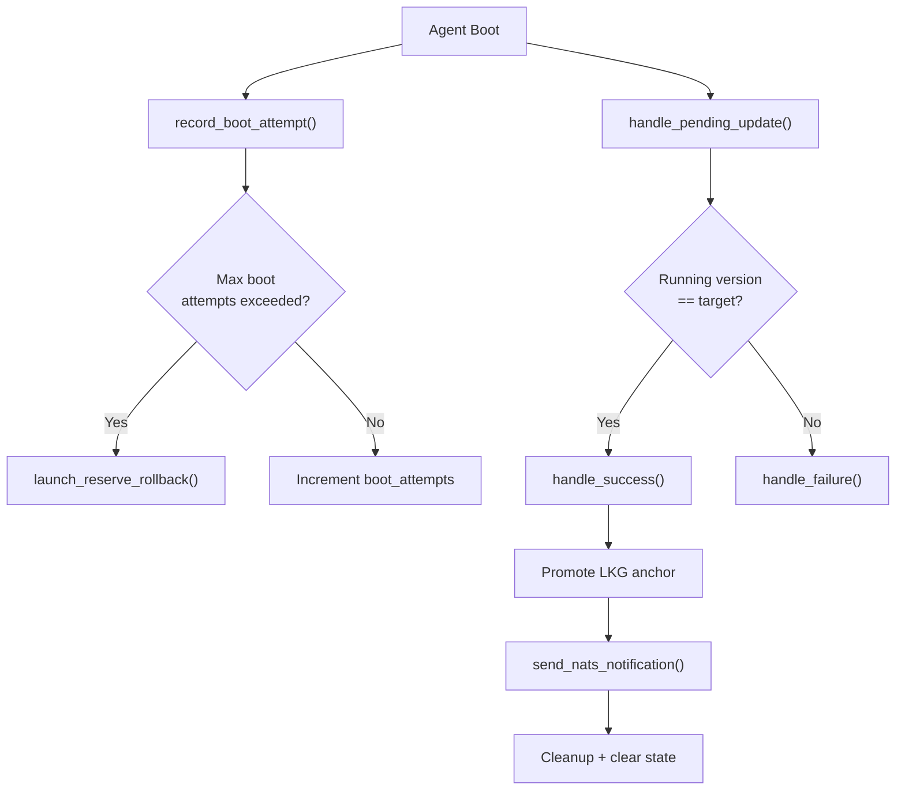

<!-- source-hash: 5f9b8e7b3fda2ea74c416bfb8de5bdf7 -->
Orchestrates the agent update lifecycle, handling boot attempt tracking, crash-loop detection, success/failure state transitions, and post-update notifications after an OpenFrame agent update.

## Key Components

### `UpdateHandlerService`

The primary struct that coordinates update state management across multiple dependent services:

| Field | Purpose |
|---|---|
| `state_service` | Loads/saves/clears persistent `UpdateState` |
| `client_info_service` | Tracks client version and update status |
| `cleanup_service` | Removes update artifacts post-transition |
| `last_known_good_service` | Manages LKG anchor promotion and rollback paths |
| `installed_agent_publisher` | Publishes NATS notifications on success |
| `config_service` | Provides machine identity for NATS payloads |

### Public Methods

- **`new(...)`** — Constructor; accepts all six service dependencies.
- **`record_boot_attempt()`** — Called at startup to detect crash-loops. Increments `boot_attempts` counter; if it reaches `CRASH_LOOP_MAX_BOOT_ATTEMPTS`, marks failure and triggers a reserve rollback.
- **`handle_pending_update()`** — Resolves the pending update state: if the running binary matches the target version, calls `handle_success`; otherwise routes to `handle_failure`.

### Private Methods

- **`handle_success()`** — Promotes the LKG anchor, updates version bookkeeping, sends a NATS notification, runs cleanup, and clears state.
- **`handle_failure()`** — Sets `ClientUpdateStatus::Failed`, runs cleanup, and clears state.
- **`launch_reserve_rollback()`** — Windows/macOS only; spawns the updater binary in rollback-only mode to restore the previous version.
- **`send_nats_notification()`** — Retries NATS publish up to 5 times with 1-second backoff.

## Usage Example

```rust
let handler = UpdateHandlerService::new(
    state_service,
    client_info_service,
    cleanup_service,
    last_known_good_service,
    installed_agent_publisher,
    config_service,
);

// On every agent boot — detects crash loops
handler.record_boot_attempt().await?;

// Resolve any pending update after services are ready
handler.handle_pending_update().await?;
```

## Update Flow



> **Source:** [`services/update_handler_service.rs`](https://github.com/flamingo-stack/openframe-oss-tenant/blob/main/services/update_handler_service.rs)