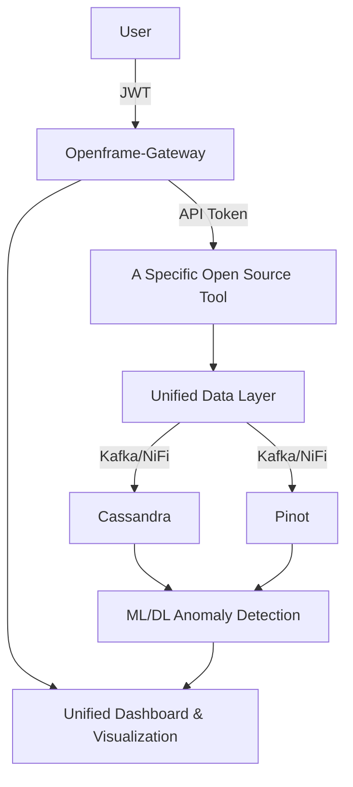
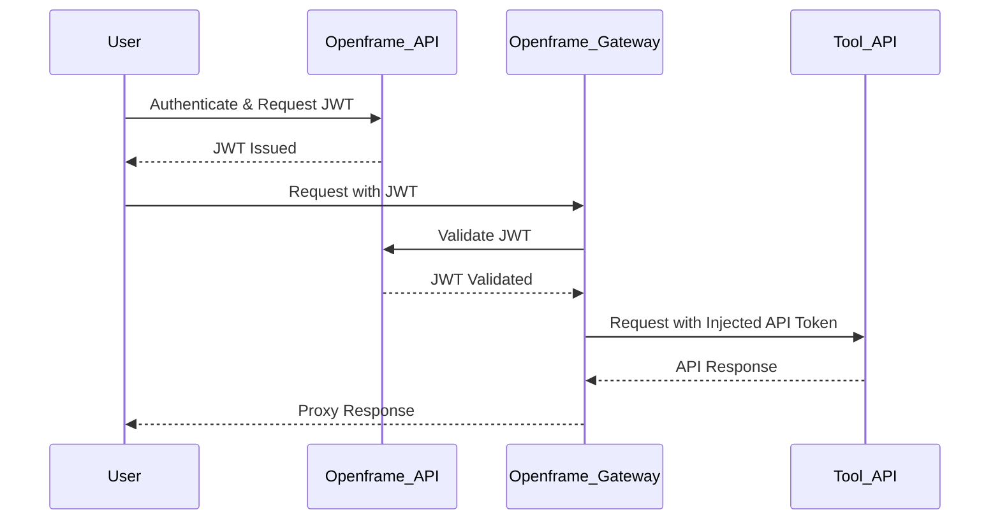
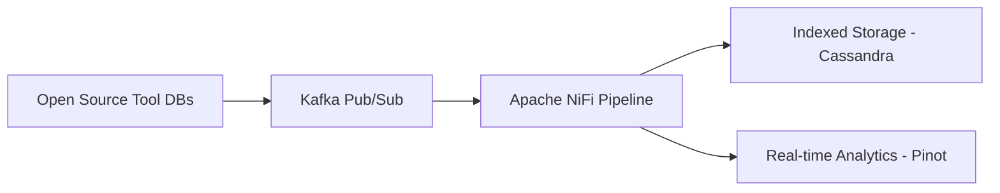
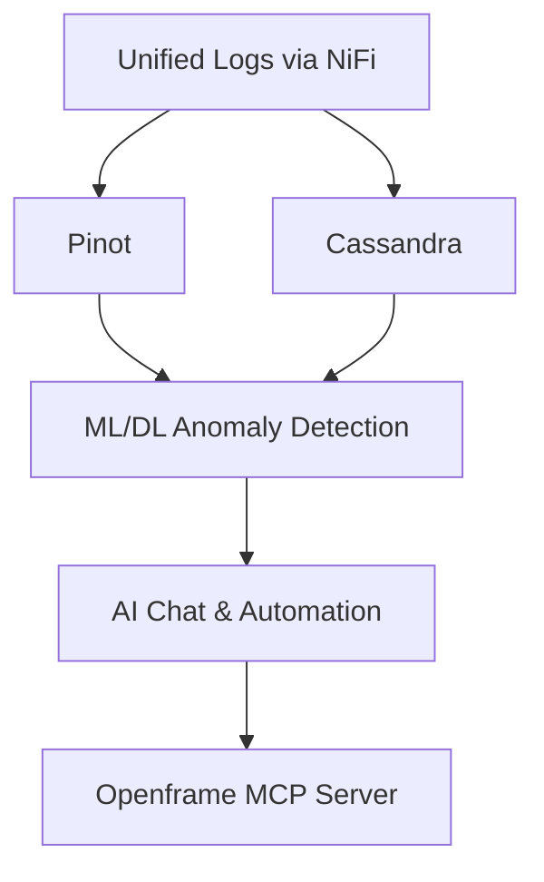
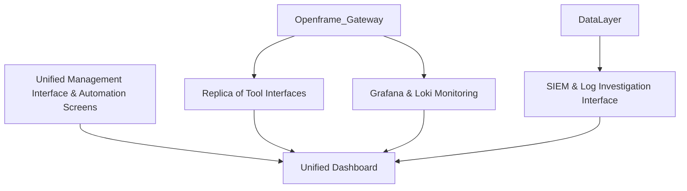
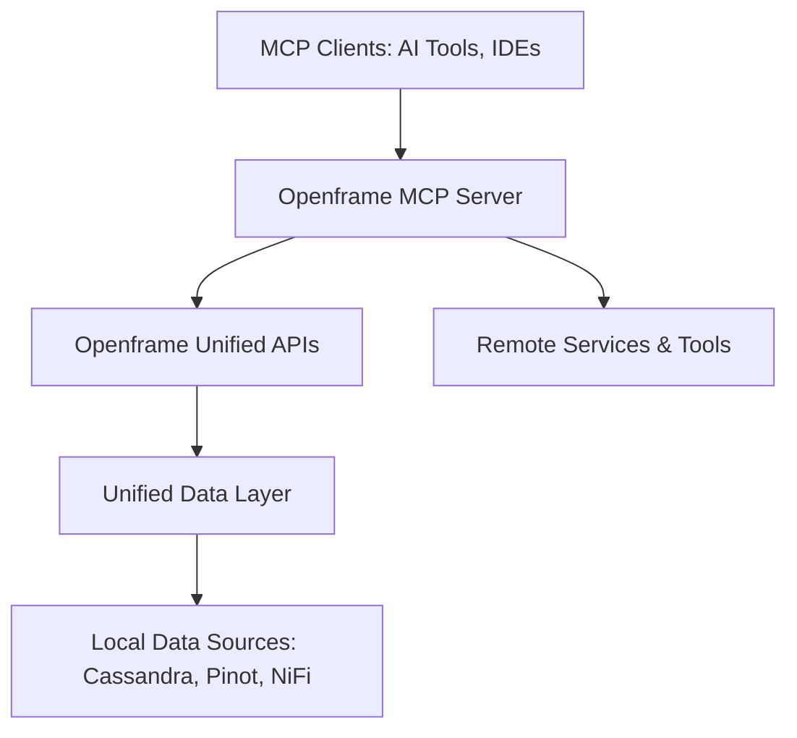

# OpenFrame Documentation

OpenFrame integrates a curated list of open-source IT and security products into a unified platform, providing cohesive management through a standardized data, API, AI, dashboard, and security layer. This unified approach enhances interoperability, simplifies security management, and streamlines operational processes.

## System Architecture

### Core Components

1. **Deployment Management**
   - Kubernetes (K8s) orchestrates deployment of internal microservices and open-source tools
   - Each tool deployment resides within a Virtual Private Cloud (VPC)
   - Secure, unique API keys generated upon initialization

2. **Secure API Access**
   - Openframe API generates JWT using Spring Security
   - Openframe Gateway (reactive reverse proxy) handles authentication and routing
   - All traffic securely routed through the gateway

3. **Unified Data Layer**
   - Data pipeline: Apache NiFi
   - PubSub mechanism: Kafka
   - Databases: Cassandra (indexed storage), Apache Pinot (real-time analytics)
   - Standardized logging via NiFi, queried through GraphQL

4. **AI & Automation**
   - ML/DL frameworks for real-time anomaly detection
   - AI-driven resolution chat system
   - Model Context Protocol (MCP) for AI workflow integration

5. **Dashboard & Visualization**
   - Replica View of existing tool interfaces
   - Grafana and Loki for monitoring
   - Unified Management Interface
   - SIEM/Log Investigation Interface
   - Automation Interfaces

### Architecture Diagrams

#### High-Level Architecture


#### Deployment Architecture
```mermaid
graph TD
    Kubernetes[Kubernetes (K8s)] --> Microservices[Openframe Microservices]
    Kubernetes --> Tools[Open Source Tools]
    subgraph VPC
        Microservices
        Tools --> APIKeys[Unique API Keys Generated]
    end
```

#### API & Security Flow


#### Data Pipeline and Storage


#### AI/ML Integration


#### Dashboard Architecture


#### MCP Integration


## Documentation Sections

### Getting Started
- [Introduction](getting-started/introduction.md) - Overview of OpenFrame
- [Quick Start](getting-started/quick-start.md) - Quick setup guide

### Development
- [Setup Guide](development/setup.md) - Development environment setup
- [Architecture](development/architecture.md) - System architecture and design
- [Code Style](development/code-style.md) - Coding standards and practices
- [Testing](development/testing.md) - Testing guidelines and practices
- [Contributing](development/contributing.md) - How to contribute to OpenFrame

### API Documentation
- [Overview](api/overview.md) - API architecture and principles
- [Authentication](api/authentication.md) - Authentication and authorization
- [Endpoints](api/endpoints.md) - Available API endpoints
- [WebSocket](api/websocket.md) - Real-time communication
- [Integration](api/integration.md) - Integration guidelines

### Deployment
- [Overview](deployment/deployment.md) - Deployment architecture
- [Kubernetes](deployment/kubernetes.md) - Kubernetes deployment guide

### Diagrams
- [System Overview](diagrams/system-overview.md) - System architecture diagrams
- [Kubernetes Architecture](diagrams/kubernetes-architecture.md) - Deployment architecture diagrams

## Technology Stack

### Backend
- **Core Runtime**: Spring Boot 3.2.x, OpenJDK 21
- **API Layer**: Netflix DGS Framework (GraphQL)
- **Gateway**: Spring Cloud Gateway
- **Security**: Spring Security with OAuth 2.0
- **Data Storage**: MongoDB, Cassandra
- **Event Streaming**: Apache Kafka
- **Caching**: Redis

### Frontend
- **Framework**: Vue.js 3 with TypeScript
- **State Management**: Vuex
- **Routing**: Vue Router
- **UI Framework**: Vuetify
- **Build Tool**: Vite

### Infrastructure
- **Container Orchestration**: Kubernetes
- **Service Mesh**: Istio
- **Monitoring**: Prometheus, Grafana
- **Logging**: Loki
- **CI/CD**: GitHub Actions

## Contributing to Documentation

We welcome contributions to the documentation! Please see our [Contributing Guide](development/contributing.md) for details on how to contribute.

## Documentation Updates

The documentation is continuously updated. If you find any issues or have suggestions for improvements, please:

1. Check if there's an existing issue
2. Create a new issue if needed
3. Submit a pull request with your changes

## Building Documentation

The documentation is built using MkDocs. To build locally:

```bash
pip install mkdocs-material
mkdocs serve
```

## License

This documentation is licensed under the [Apache License 2.0](LICENSE). 