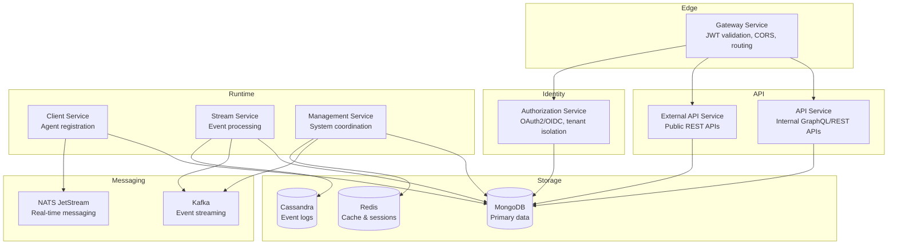

# OpenFrame OSS Tenant Documentation

Welcome to the comprehensive documentation for **OpenFrame OSS Tenant**, the complete open-source backend platform that powers AI-driven MSP automation. This documentation provides everything you need to understand, deploy, develop, and extend the OpenFrame platform.

## 📚 Table of Contents

### Getting Started
Complete guides to get you up and running with OpenFrame OSS Tenant:

- **[Introduction](getting-started/introduction.md)** - Platform overview, features, and architecture introduction
- **[Prerequisites](getting-started/prerequisites.md)** - Required tools and environment setup
- **[Quick Start](getting-started/quick-start.md)** - Get OpenFrame running locally in 5 minutes
- **[First Steps](getting-started/first-steps.md)** - Explore key features and configuration options

### Development
Comprehensive development guides for contributors and integrators:

- **[Development Overview](development/README.md)** - Development environment and workflow overview
- **[Environment Setup](development/setup/environment.md)** - Configure your development environment with required tools
- **[Local Development](development/setup/local-development.md)** - Clone, build, and run OpenFrame locally with hot reload
- **[Architecture Guide](development/architecture/README.md)** - High-level system design and service interactions
- **[Security Guide](development/security/README.md)** - Authentication, authorization, and security best practices
- **[Testing Overview](development/testing/README.md)** - Test structure, running tests, and writing new test cases

### Reference Documentation
Technical reference documentation for OpenFrame's microservices architecture:

- **[Platform Overview](./architecture/README.md)** - Complete repository overview and end-to-end architecture
- **[API Service Core](./architecture/api-service-core/api-service-core.md)** - Internal GraphQL/REST API layer for platform UI
- **[API Contracts and Mapping](./architecture/api-contracts-and-mapping/api-contracts-and-mapping.md)** - DTOs, filters, pagination, and entity mapping
- **[Authorization Service Core](./architecture/authorization-service-core/authorization-service-core.md)** - OAuth2/OIDC provider with multi-tenant support
- **[Gateway Service Core](./architecture/gateway-service-core/gateway-service-core.md)** - Edge gateway with JWT validation and routing
- **[External API Service Core](./architecture/external-api-service-core/external-api-service-core.md)** - Public REST APIs for integrations
- **[Client Service Core](./architecture/client-service-core/client-service-core.md)** - Agent authentication and registration service
- **[Stream Service Core](./architecture/stream-service-core/stream-service-core.md)** - Real-time event processing and enrichment engine
- **[Management Service Core](./architecture/management-service-core/management-service-core.md)** - Tool lifecycle and system coordination service
- **[Data Mongo Core](./architecture/data-mongo-core/data-mongo-core.md)** - MongoDB persistence layer with multi-tenant support
- **[Security OAuth Core](./architecture/security-oauth-core/security-oauth-core.md)** - JWT encoding/decoding and OAuth2 utilities
- **[Platform Applications](./architecture/platform-applications/platform-applications.md)** - Deployable Spring Boot application entry points

### Architecture Diagrams
Visual documentation of system components and interactions:

- **[System Diagrams](./architecture/diagrams/)** - Mermaid diagrams showing service architecture, data flows, and interactions

### CLI Tools

The OpenFrame CLI tools are maintained in a separate repository:
- **Repository**: [flamingo-stack/openframe-cli](https://github.com/flamingo-stack/openframe-cli)
- **Installation**: [Installation Guide](https://github.com/flamingo-stack/openframe-cli#installation)
- **Documentation**: [CLI Documentation](https://github.com/flamingo-stack/openframe-cli/tree/main/docs)

**Note**: CLI tools are NOT located in this repository. Always refer to the external repository for installation and usage.

## 🚀 Quick Navigation

### For New Users
1. Start with the **[Introduction](getting-started/introduction.md)** to understand OpenFrame's purpose and architecture
2. Review **[Prerequisites](getting-started/prerequisites.md)** to set up your environment
3. Follow the **[Quick Start Guide](getting-started/quick-start.md)** to get OpenFrame running locally
4. Explore key features with **[First Steps](getting-started/first-steps.md)**

### For Developers
1. Review the **[Development Overview](development/README.md)** for workflow and architecture principles
2. Set up your environment with **[Environment Setup](development/setup/environment.md)**
3. Get coding with **[Local Development](development/setup/local-development.md)**
4. Understand the system with **[Architecture Guide](development/architecture/README.md)**

### For System Architects
1. Study the **[Platform Overview](./architecture/README.md)** for complete system understanding
2. Review **[API Service Core](./architecture/api-service-core/api-service-core.md)** for internal API architecture
3. Understand security with **[Authorization Service Core](./architecture/authorization-service-core/authorization-service-core.md)**
4. Explore data persistence with **[Data Mongo Core](./architecture/data-mongo-core/data-mongo-core.md)**

### For Integration Developers
1. Review **[External API Service Core](./architecture/external-api-service-core/external-api-service-core.md)** for public APIs
2. Understand event processing with **[Stream Service Core](./architecture/stream-service-core/stream-service-core.md)**
3. Learn about agent communication with **[Client Service Core](./architecture/client-service-core/client-service-core.md)**
4. Follow **[Security Guide](development/security/README.md)** for secure integrations

## 🏗️ Architecture Overview

OpenFrame OSS Tenant implements a sophisticated microservices architecture:

```mermaid
flowchart TD
    subgraph Edge
        Gateway[Gateway Service<br/>JWT validation, CORS, routing]
    end

    subgraph Identity
        Authz[Authorization Service<br/>OAuth2/OIDC, tenant isolation]
    end

    subgraph API
        Api[API Service<br/>Internal GraphQL/REST APIs]
        ExternalApi[External API Service<br/>Public REST APIs]
    end

    subgraph Runtime
        Client[Client Service<br/>Agent registration]
        Stream[Stream Service<br/>Event processing]
        Management[Management Service<br/>System coordination]
    end

    subgraph Storage
        Mongo[(MongoDB<br/>Primary data)]
        Cassandra[(Cassandra<br/>Event logs)]
        Redis[(Redis<br/>Cache & sessions)]
    end

    subgraph Messaging
        Kafka[Kafka<br/>Event streaming]
        Nats[NATS JetStream<br/>Real-time messaging]
    end

    Gateway --> Api
    Gateway --> ExternalApi
    Gateway --> Authz

    Api --> Mongo
    ExternalApi --> Mongo
    Authz --> Mongo
    Client --> Mongo
    Management --> Mongo
    Stream --> Mongo

    Stream --> Kafka
    Client --> Nats
    Management --> Kafka

    Stream --> Cassandra
    Management --> Redis
```

### Key Features

- **🏢 Multi-Tenant SaaS Architecture**: Complete tenant isolation with per-tenant configuration
- **🤖 AI-Powered Automation**: Mingo AI for technicians, Fae for clients
- **🔐 Enterprise Security**: OAuth2/OIDC with JWT tokens and API key authentication
- **🚀 Microservices Design**: Event-driven architecture with Kafka and NATS
- **📊 Real-Time Processing**: Stream processing with Kafka Streams and Cassandra storage
- **🛡️ Edge Security**: Gateway-based security enforcement with rate limiting

## 🛠️ Technology Stack

### Backend Services (Spring Boot 3.3.0)
- **Java 21** with modern language features
- **Spring Security OAuth2** for authentication and authorization
- **Netflix DGS** for GraphQL API development
- **MongoDB** for primary data storage with multi-tenant support
- **Apache Kafka** for event streaming and messaging
- **Redis** for caching and session management

### AI & Automation Layer
- **Anthropic AI SDK** for intelligent automation
- **VoltAgent Core** for agent orchestration
- **Node.js 18+** for tooling and AI integration

### Infrastructure
- **Docker & Docker Compose** for local development
- **Prometheus & Micrometer** for monitoring and metrics
- **Spring Cloud Config** for configuration management

## 📖 Quick Links

### Project Information
- **[Project README](../README.md)** - Main project overview and quick start
- **[Contributing Guidelines](../CONTRIBUTING.md)** - How to contribute to OpenFrame development
- **[License Information](../LICENSE.md)** - Licensing terms and conditions

### External Resources
- **[OpenFrame Website](https://www.flamingo.run/openframe)** - Official OpenFrame product information
- **[Flamingo Platform](https://flamingo.run)** - Parent company and platform overview
- **[OpenMSP Community](https://www.openmsp.ai/)** - Open MSP community website

### Community Support
- **[OpenMSP Slack](https://join.slack.com/t/openmsp/shared_invite/zt-36bl7mx0h-3~U2nFH6nqHqoTPXMaHEHA)** - Join our developer community for discussions and support

> **Note**: We use our OpenMSP Slack community for all discussions, support, and feature requests. GitHub Issues and Discussions are not monitored.

## 🔍 Documentation Structure

This documentation is organized into logical sections:

### 📘 Getting Started
Step-by-step guides to get OpenFrame running quickly, from installation through basic configuration.

### 🔧 Development
Comprehensive development guides covering environment setup, architecture understanding, testing practices, and security considerations.

### 📚 Reference
Detailed technical documentation for each service, including API specifications, data models, and integration points.

### 🎯 Architecture Diagrams
Visual representations of system components, data flows, and service interactions using Mermaid diagrams.

## 🆕 What's New

OpenFrame OSS Tenant represents the complete backend platform powering the next generation of MSP automation:

- **Complete Multi-Tenant Architecture**: Production-ready backend with tenant isolation
- **AI-Powered Automation**: Intelligent technician and client support with Mingo AI and Fae
- **Comprehensive MSP Operations**: Device management, log aggregation, and tool integration
- **Enterprise-Grade Security**: OAuth2/OIDC with multi-tenant JWT token management
- **Event-Driven Design**: Real-time processing with Kafka Streams and NATS JetStream

## 🤝 Contributing to Documentation

Documentation improvements are always welcome! To contribute:

1. **Join the Community**: Connect with us on [OpenMSP Slack](https://join.slack.com/t/openmsp/shared_invite/zt-36bl7mx0h-3~U2nFH6nqHqoTPXMaHEHA)
2. **Follow Contributing Guidelines**: Review our [Contributing Guide](../CONTRIBUTING.md)
3. **Submit Improvements**: Create pull requests for documentation enhancements
4. **Report Issues**: Let us know about outdated or incorrect information

---

*Documentation generated by [OpenFrame Doc Orchestrator](https://github.com/flamingo-stack/openframe-oss-tenant)*

**Ready to get started?** Begin with the [Introduction](getting-started/introduction.md) or jump straight to the [Quick Start Guide](getting-started/quick-start.md)!