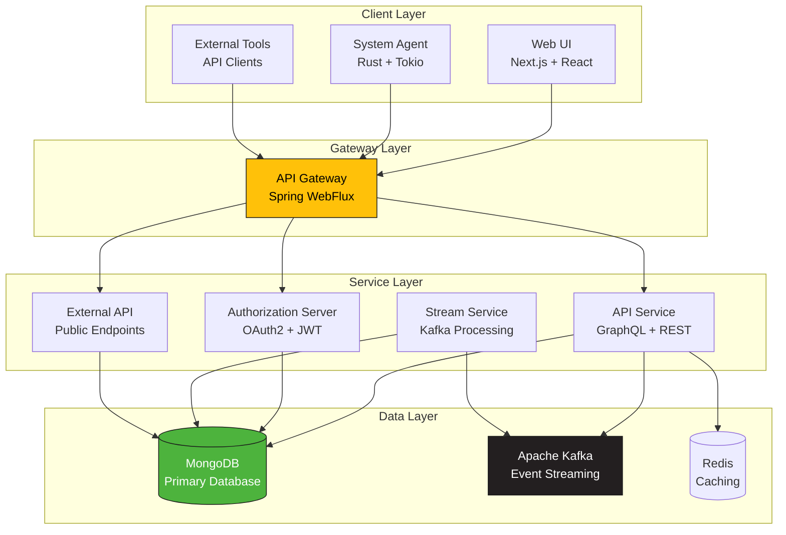

# OpenFrame OSS Tenant Documentation

Welcome to the comprehensive documentation for **OpenFrame OSS Tenant** - the multi-tenant, open-source backbone of Flamingo's AI-powered MSP platform.

OpenFrame creates a unified layer for data, APIs, automation, and AI on top of carefully selected open-source projects, simplifying IT and security operations through a single, cohesive platform.

## 📚 Table of Contents

### 🚀 Getting Started

Start here if you're new to OpenFrame:

- **[Introduction](./getting-started/introduction.md)** - What is OpenFrame and why use it?
- **[Prerequisites](./getting-started/prerequisites.md)** - System requirements and dependencies
- **[Quick Start](./getting-started/quick-start.md)** - Get OpenFrame running in 5 minutes
- **[First Steps](./getting-started/first-steps.md)** - Essential configuration and next actions

### 🛠️ Development

For contributors and developers working on OpenFrame:

- **[Development Overview](./development/README.md)** - Development section index and quick navigation
- **[Environment Setup](./development/setup/environment.md)** - Configure your development environment
- **[Local Development](./development/setup/local-development.md)** - Run OpenFrame locally for development
- **[Architecture Overview](./development/architecture/overview.md)** - System design and microservices architecture  
- **[Microservices Guide](./development/architecture/microservices.md)** - Individual service components and interactions
- **[Security Architecture](./development/architecture/security.md)** - Authentication, authorization, and security model
- **[Data Flow](./development/architecture/data-flow.md)** - How data moves through the system
- **[Testing Guide](./development/testing/overview.md)** - Testing strategies and best practices
- **[Contributing Guidelines](./development/contributing/guidelines.md)** - How to contribute code and documentation
- **[Code Style Guide](./development/contributing/code-style.md)** - Coding standards and conventions
- **[Development Scripts](./development/tools/scripts.md)** - Useful development automation scripts
- **[Rust Client Development](./development/client-agent/rust-development.md)** - Working on the Rust system agent

### 📖 Reference

Technical reference documentation and architecture deep-dives:

- **[Architecture Overview](./reference/architecture/overview.md)** - High-level platform architecture
- **[API Service Core](./reference/architecture/api_service_core.md)** - GraphQL/REST API service architecture
- **[Authorization Service Core](./reference/architecture/authorization_service_core.md)** - OAuth2/OIDC authorization server
- **[Gateway Service Core](./reference/architecture/gateway_service_core.md)** - API gateway and routing layer
- **[Stream Processing Core](./reference/architecture/stream_processing_core.md)** - Real-time event processing
- **[External API Service Core](./reference/architecture/external_api_service_core.md)** - Public API endpoints
- **[Data MongoDB Core](./reference/architecture/data_mongo_core.md)** - MongoDB data persistence layer
- **[Kafka Integration Core](./reference/architecture/kafka_integration_core.md)** - Event streaming infrastructure
- **[Security Core](./reference/architecture/security_core.md)** - Cryptographic primitives and JWT handling
- **[Service Applications](./reference/architecture/service_applications.md)** - Deployable Spring Boot applications
- **[Client Application](./reference/architecture/client_application.md)** - Rust system agent architecture

### 📊 Visual Documentation

Architecture diagrams and visual guides:

- **System Architecture Diagrams** - Mermaid diagrams showing service interactions
- **Data Flow Visualizations** - How information moves through OpenFrame
- **Security Model Diagrams** - Authentication and authorization flows
- **Deployment Topologies** - Various deployment configurations

### 🔧 CLI Tools

The OpenFrame CLI tools provide command-line access to platform functionality:

- **Repository**: [flamingo-stack/openframe-cli](https://github.com/flamingo-stack/openframe-cli)
- **Installation Guide**: [CLI Installation](https://github.com/flamingo-stack/openframe-cli#installation)
- **Documentation**: [CLI Documentation](https://github.com/flamingo-stack/openframe-cli/tree/main/docs)
- **Usage Examples**: [CLI Usage Guide](https://github.com/flamingo-stack/openframe-cli/blob/main/docs/usage.md)

> **⚠️ Important**: CLI tools are maintained in a **separate repository** and are NOT located in this project. Always refer to the external repository for installation, updates, and usage instructions.

## 🏗️ Architecture at a Glance

OpenFrame implements a modern microservices architecture with these key components:

```mermaid
graph TB
    subgraph "Client Layer"
        WebUI[Web UI<br/>Next.js + React]
        RustAgent[System Agent<br/>Rust + Tokio]
        ExternalTools[External Tools<br/>API Clients]
    end
    
    subgraph "Gateway Layer"
        Gateway[API Gateway<br/>Spring WebFlux]
    end
    
    subgraph "Service Layer"
        API[API Service<br/>GraphQL + REST]
        Auth[Authorization Server<br/>OAuth2 + JWT]
        Stream[Stream Service<br/>Kafka Processing]
        ExternalAPI[External API<br/>Public Endpoints]
    end
    
    subgraph "Data Layer"
        MongoDB[(MongoDB<br/>Primary Database)]
        Kafka[Apache Kafka<br/>Event Streaming]
        Redis[(Redis<br/>Caching)]
    end
    
    WebUI --> Gateway
    RustAgent --> Gateway
    ExternalTools --> Gateway
    
    Gateway --> API
    Gateway --> Auth
    Gateway --> ExternalAPI
    
    API --> MongoDB
    API --> Kafka
    Auth --> MongoDB
    Stream --> Kafka
    Stream --> MongoDB
    ExternalAPI --> MongoDB
    
    API --> Redis
    
    style Gateway fill:#FFC109,stroke:#1A1A1A,color:#000
    style MongoDB fill:#4DB33D,stroke:#1A1A1A,color:#fff
    style Kafka fill:#231F20,stroke:#1A1A1A,color:#fff
```

## 🎯 Key Concepts

### Multi-Tenant Architecture
OpenFrame is built from the ground up with multi-tenancy in mind:
- **Tenant Isolation**: Complete data and configuration separation
- **Per-Tenant Authentication**: Individual OAuth2 configurations and JWT signing keys
- **Resource Scaling**: Independent scaling per tenant workload

### Event-Driven Processing
Real-time responsiveness through Apache Kafka:
- **Event Streaming**: All system events flow through Kafka topics
- **Stream Processing**: Real-time event enrichment and normalization
- **Integration Events**: CDC (Change Data Capture) from external tools

### Security-First Design
Enterprise-grade security throughout the platform:
- **OAuth2/OIDC**: Standards-based authentication and authorization
- **JWT Tokens**: Stateless authentication with per-tenant signing keys
- **API Key Management**: Secure external API access with rate limiting
- **Audit Logging**: Comprehensive security event tracking

## 📖 Quick Navigation

### By Role

#### 🆕 New Users
1. [Introduction](./getting-started/introduction.md) → [Prerequisites](./getting-started/prerequisites.md) → [Quick Start](./getting-started/quick-start.md)

#### 👨‍💻 Developers
1. [Development Overview](./development/README.md) → [Environment Setup](./development/setup/environment.md) → [Contributing Guidelines](./development/contributing/guidelines.md)

#### 🏗️ Architects  
1. [Architecture Overview](./reference/architecture/overview.md) → [Microservices Guide](./development/architecture/microservices.md) → [Security Architecture](./development/architecture/security.md)

#### 🔧 Platform Engineers
1. [Service Applications](./reference/architecture/service_applications.md) → [Local Development](./development/setup/local-development.md) → [Development Scripts](./development/tools/scripts.md)

### By Technology

#### ☕ Java/Spring Boot
- [API Service Core](./reference/architecture/api_service_core.md)
- [Authorization Service](./reference/architecture/authorization_service_core.md)  
- [Gateway Service](./reference/architecture/gateway_service_core.md)
- [Spring Boot Applications](./reference/architecture/service_applications.md)

#### 🦀 Rust Development
- [Client Application Architecture](./reference/architecture/client_application.md)
- [Rust Development Guide](./development/client-agent/rust-development.md)

#### 🍃 MongoDB & Data
- [MongoDB Core](./reference/architecture/data_mongo_core.md)
- [Data Flow Architecture](./development/architecture/data-flow.md)

#### 🔄 Kafka & Streaming  
- [Stream Processing Core](./reference/architecture/stream_processing_core.md)
- [Kafka Integration](./reference/architecture/kafka_integration_core.md)
- [Event Streaming Pipeline](./development/architecture/integrated-tools-event-streaming-pipeline.md)

## 🚀 Quick Links

### Essential Resources
- **[Project README](../README.md)** - Main project overview and quick start
- **[Contributing Guide](../CONTRIBUTING.md)** - How to contribute to OpenFrame
- **[License](../LICENSE.md)** - The Flamingo AI Unified License v1.0

### External Resources  
- **[OpenFrame Website](https://openframe.ai)** - Official product website
- **[Flamingo Platform](https://flamingo.run)** - Parent platform and company
- **[OpenMSP Community](https://join.slack.com/t/openmsp/shared_invite/zt-36bl7mx0h-3~U2nFH6nqHqoTPXMaHEHA)** - Join our Slack community
- **[Knowledge Base](https://www.flamingo.run/knowledge-base)** - User guides and tutorials

## 🤝 Community & Support

### Getting Help

1. **📖 Search Documentation**: Use the search function or browse sections above
2. **💬 OpenMSP Slack**: Join our [community Slack](https://join.slack.com/t/openmsp/shared_invite/zt-36bl7mx0h-3~U2nFH6nqHqoTPXMaHEHA) for real-time help
3. **🔍 Code Examples**: Check the reference documentation for implementation patterns
4. **👥 Community Calls**: Participate in weekly community discussions

### Contributing to Documentation

Documentation improvements are always welcome! To contribute:

1. **Report Issues**: Found outdated or incorrect information? Let us know in Slack
2. **Suggest Improvements**: Ideas for better organization or missing topics
3. **Submit Changes**: Follow the [Contributing Guidelines](../CONTRIBUTING.md) for documentation updates
4. **Translation**: Help translate docs for international users

> **⚠️ Note**: We don't use GitHub Issues or Discussions. All support, questions, and community interaction happens in our [OpenMSP Slack workspace](https://join.slack.com/t/openmsp/shared_invite/zt-36bl7mx0h-3~U2nFH6nqHqoTPXMaHEHA).

---

*Documentation generated by [OpenFrame Doc Orchestrator](https://github.com/flamingo-stack/openframe-oss-tenant)*

**Last Updated**: 2024 | **Version**: Latest | **License**: [Flamingo AI Unified License v1.0](../LICENSE.md)