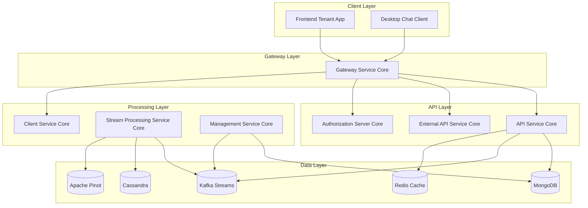

# OpenFrame Documentation

Welcome to the comprehensive documentation for **OpenFrame** - the AI-powered MSP platform that replaces expensive proprietary software with open-source alternatives enhanced by intelligent automation.

## 📚 Table of Contents

### Getting Started
Complete setup and onboarding guides for new users:

- **[Introduction](getting-started/introduction.md)** - What is OpenFrame and how it revolutionizes MSP operations
- **[Prerequisites](getting-started/prerequisites.md)** - System requirements and preparation
- **[Quick Start](getting-started/quick-start.md)** - Get OpenFrame running in under 5 minutes
- **[First Steps](getting-started/first-steps.md)** - Essential configuration and initial setup

### Development
Comprehensive guides for developers and contributors:

- **[Development Overview](development/README.md)** - Complete development documentation index
- **[Environment Setup](development/setup/environment.md)** - Configure your development environment
- **[Local Development](development/setup/local-development.md)** - Run and develop OpenFrame locally
- **[Architecture Overview](development/architecture/README.md)** - System design and architectural patterns
- **[Security Guidelines](development/security/README.md)** - Security patterns and best practices
- **[Testing Overview](development/testing/README.md)** - Test structure, coverage, and best practices
- **[Contributing Guidelines](development/contributing/guidelines.md)** - Code standards and contribution process

### Reference Documentation
Technical reference documentation generated from source code analysis:

#### Core Services
- **[API Service Core](./architecture/api_service_core/api_service_core.md)** - GraphQL + REST orchestration layer
- **[Gateway Service Core](./architecture/gateway_service_core/gateway_service_core.md)** - Reactive routing and authentication gateway
- **[Authorization Server Core](./architecture/authorization_server_core/authorization_server_core.md)** - Multi-tenant OAuth2/OIDC server
- **[External API Service Core](./architecture/external_api_service_core/external_api_service_core.md)** - Public REST API with rate limiting
- **[Client Service Core](./architecture/client_service_core/client_service_core.md)** - Agent authentication and management
- **[Stream Processing Service Core](./architecture/stream_processing_service_core/stream_processing_service_core.md)** - Real-time event processing with Kafka
- **[Management Service Core](./architecture/management_service_core/management_service_core.md)** - System administration and job scheduling

#### Security & Authentication
- **[Security OAuth and JWT Core](./architecture/security_oauth_and_jwt_core/security_oauth_and_jwt_core.md)** - JWT handling and OAuth2 utilities

#### Data Infrastructure
- **[Data Platform Core](./architecture/data_platform_core/data_platform_core.md)** - Cassandra and Pinot analytics integration
- **[Data Persistence Mongo](./architecture/data_persistence_mongo/data_persistence_mongo.md)** - MongoDB document models and repositories
- **[Data Messaging Kafka](./architecture/data_messaging_kafka/data_messaging_kafka.md)** - Event streaming and Kafka configuration
- **[Data Cache Redis](./architecture/data_cache_redis/data_cache_redis.md)** - Caching and session management

#### Frontend & Client Applications
- **[Frontend Tenant App Core](./architecture/frontend_tenant_app_core/frontend_tenant_app_core.md)** - Next.js tenant application
- **[Chat Client OpenFrame Chat](./architecture/chat_client_openframe_chat/chat_client_openframe_chat.md)** - Tauri desktop chat client

#### Infrastructure & Contracts
- **[Service Entrypoints](./architecture/service_entrypoints/service_entrypoints.md)** - Spring Boot service entry points
- **[API Contracts and Mapping](./architecture/api_contracts_and_mapping/api_contracts_and_mapping.md)** - Shared DTOs and data contracts

### Architecture Diagrams
Visual documentation of system components and data flows:

- **[Architecture Diagrams](./architecture/diagrams/)** - Comprehensive collection of Mermaid diagrams showing:
  - Service interactions and dependencies
  - Data flow patterns
  - Authentication flows
  - Event processing pipelines
  - Component relationships

View individual service diagrams and system-wide architectural visualizations.

### CLI Tools

The OpenFrame CLI tools are maintained in a separate repository:
- **Repository**: [flamingo-stack/openframe-cli](https://github.com/flamingo-stack/openframe-cli)
- **Installation**: [Installation Guide](https://github.com/flamingo-stack/openframe-cli#installation)
- **Documentation**: [CLI Documentation](https://github.com/flamingo-stack/openframe-cli/tree/main/docs)

**Note**: CLI tools are NOT located in this repository. Always refer to the external repository for installation and usage.

## 🚀 Quick Navigation

### For New Users
1. Start with **[Introduction](getting-started/introduction.md)** to understand OpenFrame
2. Follow **[Prerequisites](getting-started/prerequisites.md)** to prepare your environment
3. Use **[Quick Start](getting-started/quick-start.md)** to get running in 5 minutes
4. Complete **[First Steps](getting-started/first-steps.md)** for essential configuration

### For Developers
1. Review **[Development Overview](development/README.md)** for the complete development guide
2. Set up with **[Environment Setup](development/setup/environment.md)**
3. Understand the system via **[Architecture Overview](development/architecture/README.md)**
4. Learn contribution process in **[Contributing Guidelines](development/contributing/guidelines.md)**

### For System Architects
1. Study **[Architecture Reference](./architecture/)** for detailed technical documentation
2. Review **[Architecture Diagrams](./architecture/diagrams/)** for visual system understanding
3. Examine service-specific documentation for implementation details

## 🏗️ Platform Overview

OpenFrame is a comprehensive multi-tenant MSP platform built with modern microservices architecture:

```mermaid
graph TB
    subgraph "Client Layer"
        WebApp[Frontend Tenant App]
        Desktop[Desktop Chat Client]
    end
    
    subgraph "Gateway Layer" 
        Gateway[Gateway Service Core]
    end
    
    subgraph "API Layer"
        API[API Service Core]
        ExtAPI[External API Service Core]
        Auth[Authorization Server Core]
    end
    
    subgraph "Processing Layer"
        Client[Client Service Core]
        Stream[Stream Processing Service Core]
        Management[Management Service Core]
    end
    
    subgraph "Data Layer"
        Mongo[(MongoDB)]
        Kafka[(Kafka Streams)]
        Redis[(Redis Cache)]
        Cassandra[(Cassandra)]
        Pinot[(Apache Pinot)]
    end
    
    WebApp --> Gateway
    Desktop --> Gateway
    Gateway --> API
    Gateway --> ExtAPI  
    Gateway --> Auth
    Gateway --> Client
    
    API --> Mongo
    API --> Kafka
    API --> Redis
    
    Stream --> Kafka
    Stream --> Cassandra
    Stream --> Pinot
    
    Management --> Mongo
    Management --> Kafka
```

### Key Features Documented
- **Multi-Tenant Architecture**: Per-tenant isolation and JWT signing keys
- **AI-Powered Automation**: Mingo AI for technicians, Fae AI for clients
- **Event-Driven Processing**: Real-time data streams with Kafka
- **Tool Integrations**: Fleet MDM, Tactical RMM, MeshCentral
- **Modern Stack**: Spring Boot 3.3, Java 21, Next.js, React 18

## 🔍 Documentation Features

### Generated from Source Code
All reference documentation is automatically generated from actual source code analysis, ensuring accuracy and up-to-date information.

### Comprehensive Coverage
- **Architecture**: Complete system design and patterns
- **APIs**: GraphQL and REST endpoint documentation
- **Security**: Authentication, authorization, and data protection
- **Performance**: Caching strategies, database optimization
- **Testing**: Unit, integration, and E2E testing approaches

### Visual Documentation  
Extensive use of Mermaid diagrams to illustrate:
- System architecture and service relationships
- Data flow patterns and event processing
- Authentication and authorization flows
- Component interactions and dependencies

## 📖 Quick Links

### Essential Documentation
- **[Project README](../README.md)** - Main project overview and quick start
- **[Contributing Guide](../CONTRIBUTING.md)** - How to contribute to OpenFrame
- **[License](../LICENSE.md)** - Flamingo AI Unified License v1.0

### Community & Support
- **[OpenMSP Slack Community](https://www.openmsp.ai/)** - Join our community
- **[Slack Invite](https://join.slack.com/t/openmsp/shared_invite/zt-36bl7mx0h-3~U2nFH6nqHqoTPXMaHEHA)** - Direct invite link
- **[GitHub Repository](https://github.com/flamingo-stack/openframe-oss-tenant)** - Source code and issues

### External Resources
- **[Flamingo Website](https://www.flamingo.run/openframe)** - Official product page
- **[OpenFrame CLI](https://github.com/flamingo-stack/openframe-cli)** - Command line tools

---

*Documentation generated by [OpenFrame Doc Orchestrator](https://github.com/flamingo-stack/openframe-oss-tenant) from CodeWiki analysis and automated technical documentation generation.*

**Version**: Latest • **Last Updated**: Auto-generated from source code