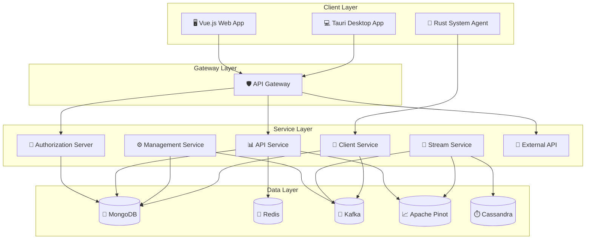

# OpenFrame Documentation

Welcome to the comprehensive documentation for **OpenFrame** - the unified, AI-powered platform that transforms MSP operations through open-source innovation.

## 📚 Table of Contents

### Getting Started
Start here if you're new to OpenFrame:

- **[Introduction](./getting-started/introduction.md)** - What is OpenFrame and why use it?
- **[Prerequisites](./getting-started/prerequisites.md)** - System requirements and dependencies
- **[Quick Start](./getting-started/quick-start.md)** - Get OpenFrame running in 5 minutes
- **[First Steps](./getting-started/first-steps.md)** - Explore key features and capabilities

### Development
For contributors and developers:

- **[Development Overview](./development/README.md)** - Development section index and roadmap
- **[Environment Setup](./development/setup/environment.md)** - Set up your local development environment
- **[Local Development](./development/setup/local-development.md)** - Run OpenFrame locally for development
- **[Architecture Overview](./development/architecture/overview.md)** - System architecture and design principles
- **[Testing Guide](./development/testing/overview.md)** - Testing strategies and best practices
- **[Contributing Guidelines](./development/contributing/guidelines.md)** - How to contribute to the project

### Reference
Technical reference documentation:

- **[API Reference](./reference/README.md)** - Complete API documentation
- **[Configuration Reference](./reference/config-server-core.md)** - Configuration options and settings
- **[Data Layer Documentation](./reference/data-layer-mongo.md)** - Database schemas and data models
- **[Security Documentation](./reference/security-oauth-web.md)** - Authentication and authorization
- **[Service Architecture](./reference/overview.md)** - Detailed service documentation

### Service Documentation
Individual service references:

- **[Authorization Service](./reference/authorization-service-core.md)** - OAuth2/OIDC authentication service
- **[API Service](./reference/api-service-core-graphql-rest.md)** - GraphQL and REST API service
- **[Gateway Service](./reference/gateway-service-core.md)** - API gateway and routing
- **[Stream Service](./reference/stream-service-core.md)** - Event streaming and processing
- **[Management Service](./reference/management-service-core.md)** - System administration
- **[Client Service](./reference/client-service-core.md)** - Agent communication service

### CLI Tools

The OpenFrame CLI tools are maintained in a separate repository:

- **Repository**: [flamingo-stack/openframe-cli](https://github.com/flamingo-stack/openframe-cli)
- **Installation**: [Installation Guide](https://github.com/flamingo-stack/openframe-cli#installation)
- **Documentation**: [CLI Documentation](https://github.com/flamingo-stack/openframe-cli/tree/main/docs)

**Note**: CLI tools are **NOT** located in this repository. Always refer to the external repository for installation and usage instructions.

## 🚀 Quick Navigation

### For New Users
1. **[Introduction](./getting-started/introduction.md)** → **[Prerequisites](./getting-started/prerequisites.md)** → **[Quick Start](./getting-started/quick-start.md)**

### For Developers
1. **[Architecture Overview](./development/architecture/overview.md)** → **[Environment Setup](./development/setup/environment.md)** → **[Contributing](./development/contributing/guidelines.md)**

### For System Administrators
1. **[Prerequisites](./getting-started/prerequisites.md)** → **[Configuration Reference](./reference/config-server-core.md)** → **[Security Guide](./reference/security-oauth-web.md)**

## 🏗️ Architecture at a Glance

OpenFrame is built on a modern microservices architecture:

```mermaid
flowchart TD
    subgraph "Client Layer"
        Web[🖥️ Vue.js Web App]
        Desktop[💻 Tauri Desktop App] 
        Agent[🤖 Rust System Agent]
    end

    subgraph "Gateway Layer"
        Gateway[🛡️ API Gateway]
    end

    subgraph "Service Layer"
        Auth[🔐 Authorization Server]
        API[📊 API Service]
        Management[⚙️ Management Service]
        Stream[🌊 Stream Service]
        Client[👤 Client Service]
        External[🔌 External API]
    end

    subgraph "Data Layer"
        Mongo[(📄 MongoDB)]
        Redis[(🔄 Redis)]
        Kafka[(📡 Kafka)]
        Pinot[(📈 Apache Pinot)]
        Cassandra[(⏱️ Cassandra)]
    end

    Web --> Gateway
    Desktop --> Gateway
    Agent --> Client
    
    Gateway --> Auth
    Gateway --> API
    Gateway --> External
    
    Auth --> Mongo
    API --> Mongo
    API --> Redis
    API --> Pinot
    
    Management --> Mongo
    Management --> Kafka
    
    Stream --> Kafka
    Stream --> Cassandra
    Stream --> Pinot
    
    Client --> Kafka
    Client --> Mongo
```

## 🛠️ Technology Stack

| Component | Technology | Purpose |
|-----------|------------|---------|
| **Backend** | Spring Boot 3.3 + Java 21 | Core runtime & APIs |
| **Frontend** | Vue 3 + TypeScript + PrimeVue | Modern web interface |
| **Agent** | Rust + Tokio | Cross-platform system agent |
| **API Layer** | GraphQL + Netflix DGS | Unified data access |
| **Message Queue** | Apache Kafka 3.6 | Event streaming |
| **Databases** | MongoDB + Cassandra + Pinot + Redis | Multi-model data storage |
| **Monitoring** | Prometheus + Grafana + Loki | Observability stack |

## 📖 Documentation Structure

This documentation is organized into four main sections:

### 📚 Getting Started
Perfect for new users, MSP administrators, and anyone wanting to understand what OpenFrame can do. Includes step-by-step guides to get you up and running quickly.

### 🛠️ Development 
Comprehensive guides for developers who want to contribute to OpenFrame, customize it for their needs, or integrate it with other systems.

### 📋 Reference
Technical specifications, API documentation, configuration options, and detailed service information. Great for system administrators and integration developers.

### 🎯 Quick Links
- **[Project README](../README.md)** - Main project overview and highlights
- **[Contributing Guide](../CONTRIBUTING.md)** - How to contribute to OpenFrame
- **[License](../LICENSE.md)** - Licensing information and terms

## 🤝 Contributing to Documentation

Found an error or want to improve the documentation?

1. **Quick Fixes**: Use GitHub's web editor for small changes
2. **Major Changes**: Follow the [Contributing Guide](../CONTRIBUTING.md)
3. **New Sections**: Create an issue first to discuss the addition

All documentation follows Markdown standards and should include:
- Clear headings and structure
- Code examples with proper syntax highlighting
- Mermaid diagrams for complex concepts
- Cross-references to related sections

## 💬 Getting Help

- **Community**: [OpenMSP Slack](https://join.slack.com/t/openmsp/shared_invite/zt-36bl7mx0h-3~U2nFH6nqHqoTPXMaHEHA)
- **Website**: [https://www.flamingo.run/openframe](https://www.flamingo.run/openframe)
- **Knowledge Base**: [https://www.flamingo.run/knowledge-base](https://www.flamingo.run/knowledge-base)

## 🔄 Documentation Updates

This documentation is continuously updated as OpenFrame evolves. Key update patterns:

- **Weekly**: Getting started guides and tutorials
- **Monthly**: API references and configuration docs  
- **Per Release**: Architecture changes and new features
- **As Needed**: Bug fixes and clarifications

**Last Updated**: Generated automatically by OpenFrame Doc Orchestrator

---

*Documentation generated by [OpenFrame Doc Orchestrator](https://github.com/flamingo-stack/openframe-oss-tenant)*