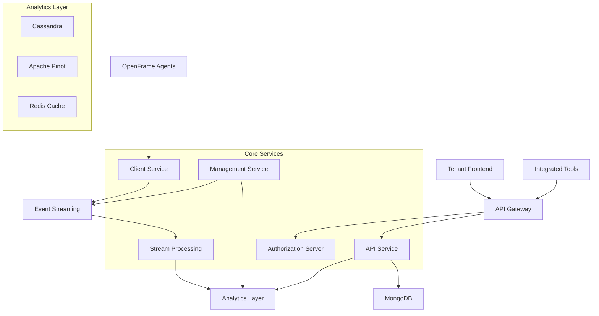

# OpenFrame Documentation

Welcome to the comprehensive documentation for **OpenFrame**, the AI-powered MSP platform that unifies multiple tools into a single, intelligent interface.

## 📚 Table of Contents

### Getting Started
Start here if you're new to OpenFrame:

- [Introduction](./getting-started/introduction.md) - What is OpenFrame and how it works
- [Prerequisites](./getting-started/prerequisites.md) - System requirements and dependencies
- [Quick Start](./getting-started/quick-start.md) - Get OpenFrame running in 5 minutes
- [First Steps](./getting-started/first-steps.md) - Initial configuration and exploration

### Development
For contributors and developers:

- [Development Overview](./development/README.md) - Complete development guide and setup
- [Environment Setup](./development/setup/environment.md) - Configure your development environment
- [Local Development](./development/setup/local-development.md) - Run and debug OpenFrame locally
- [Architecture Overview](./development/architecture/overview.md) - System architecture and design decisions
- [Microservices](./development/architecture/microservices.md) - Service architecture details
- [Data Flow](./development/architecture/data-flow.md) - How data moves through the system
- [Integration Architecture](./development/architecture/integration.md) - External tool integrations
- [Security Architecture](./development/architecture/security.md) - Security design and implementation
- [Testing Overview](./development/testing/overview.md) - Testing strategies and best practices
- [Contributing Guidelines](./development/contributing/guidelines.md) - How to contribute to the project
- [Code Style](./development/contributing/code-style.md) - Coding standards and conventions
- [Rust Development](./development/client-agent/rust-development.md) - Client agent development
- [Tools & Scripts](./development/tools/scripts.md) - Development utilities and automation

### Reference
Technical reference documentation:

- [Architecture Overview](./reference/architecture/overview.md) - High-level platform architecture
- [OpenFrame API Service](./reference/architecture/openframe_api_service.md) - Core API service details
- [OpenFrame Client Service](./reference/architecture/openframe_client_service.md) - Client service architecture
- [Management Service](./reference/architecture/management_service.md) - Platform management service
- [Authorization Service](./reference/architecture/authorization_service_core.md) - Authentication and authorization
- [Data Layer](./reference/architecture/data_layer_mongo_documents_and_repositories.md) - Database architecture
- [Security Components](./reference/architecture/shared_security_jwt_oauth.md) - Security implementation details
- [Frontend Application](./reference/architecture/tenant_frontend_application.md) - Web application architecture
- [External Integrations](./reference/architecture/vendor_sdks_fleetmdm_and_tacticalrmm.md) - Third-party integrations

### CLI Tools

The OpenFrame CLI tools are maintained in a separate repository:
- **Repository**: [flamingo-stack/openframe-cli](https://github.com/flamingo-stack/openframe-cli)
- **Installation**: [Installation Guide](https://github.com/flamingo-stack/openframe-cli#installation)
- **Documentation**: [CLI Documentation](https://github.com/flamingo-stack/openframe-cli/tree/main/docs)

**Important**: CLI tools are NOT located in this repository. Always refer to the external repository for installation and usage instructions.

## 🏗️ Architecture Overview

OpenFrame is built as a distributed, multi-tenant platform with the following key components:

```mermaid
flowchart TD
    Frontend[Tenant Frontend] --> Gateway[API Gateway]
    Agents[OpenFrame Agents] --> Client[Client Service]
    Tools[Integrated Tools] --> Gateway
    
    Gateway --> API[API Service]
    Gateway --> Auth[Authorization Server]
    
    Client --> Kafka[Event Streaming]
    Kafka --> Stream[Stream Processing]
    Stream --> Analytics[Analytics Layer]
    
    API --> MongoDB[MongoDB]
    API --> Analytics
    
    Management[Management Service] --> Analytics
    Management --> Kafka
    
    subgraph "Analytics Layer"
        Cassandra[Cassandra]
        Pinot[Apache Pinot]
        Redis[Redis Cache]
    end
    
    subgraph "Core Services"
        API
        Auth
        Client
        Stream
        Management
    end
```

### Key Design Principles

- **Multi-tenant Architecture**: Secure isolation between MSP tenants
- **Event-Driven Design**: Kafka-based event streaming for scalability
- **Microservices Pattern**: Independent, scalable service components
- **API-First Approach**: GraphQL and REST APIs for all interactions
- **Security-First**: JWT-based authentication with comprehensive authorization

## 🚀 Quick Navigation

### New Users
1. Start with [Introduction](./getting-started/introduction.md) to understand OpenFrame
2. Check [Prerequisites](./getting-started/prerequisites.md) to verify your environment
3. Follow [Quick Start](./getting-started/quick-start.md) to get running

### Developers
1. Review [Architecture Overview](./development/architecture/overview.md) to understand the system
2. Set up your [Development Environment](./development/setup/environment.md)
3. Run OpenFrame [Locally](./development/setup/local-development.md) for development

### Operators
1. Understand the [System Architecture](./reference/architecture/overview.md)
2. Review security and deployment considerations
3. Explore integration possibilities with your existing tools

## 🛠️ Technology Stack

| Component | Technology | Version | Purpose |
|-----------|------------|---------|---------|
| **Backend** | Java, Spring Boot | 21, 3.3 | Core services and APIs |
| **Frontend** | Next.js, React, TypeScript | 15, 19, 5.8 | Web application |
| **API** | GraphQL (Netflix DGS) | 7.0 | Unified data access |
| **Security** | JWT, OAuth2, Spring Security | Latest | Authentication & authorization |
| **Data** | MongoDB, Cassandra, Pinot | Latest | Multi-model data storage |
| **Streaming** | Apache Kafka | 3.6 | Event processing |
| **Cache** | Redis | Latest | High-performance caching |
| **Agent** | Rust | 1.75+ | Cross-platform monitoring |
| **Container** | Docker, Kubernetes | Latest | Orchestration and deployment |

## 📖 Documentation Standards

This documentation follows these conventions:

- **Getting Started**: Step-by-step guides for new users
- **Development**: Technical guides for contributors
- **Reference**: Detailed technical specifications
- **Examples**: Practical code examples and use cases

### Content Types

- 🚀 **Quick Start**: Get up and running fast
- 🏗️ **Architecture**: System design and patterns
- 🔧 **Development**: Building and contributing
- 📚 **Reference**: Technical specifications
- 🛡️ **Security**: Security implementation details
- 🔌 **Integration**: External tool connections

## 🤝 Community Resources

### Getting Help

- **GitHub Issues**: [Report bugs and request features](https://github.com/flamingo-stack/openframe-oss-tenant/issues)
- **OpenMSP Slack**: [Join the community](https://join.slack.com/t/openmsp/shared_invite/zt-36bl7mx0h-3~U2nFH6nqHqoTPXMaHEHA)
- **Documentation**: Browse these comprehensive guides
- **Knowledge Base**: [flamingo.run/knowledge-base](https://www.flamingo.run/knowledge-base)

### Contributing

- **[Contributing Guide](../CONTRIBUTING.md)**: How to contribute to OpenFrame
- **[Development Setup](./development/setup/environment.md)**: Get your dev environment ready
- **[Code Guidelines](./development/contributing/code-style.md)**: Coding standards and practices

## 📋 Quick Links

### Project Information
- **[Main README](../README.md)**: Project overview and quick start
- **[License](../LICENSE.md)**: Flamingo AI Unified License v1.0
- **[Contributing](../CONTRIBUTING.md)**: Contribution guidelines and process

### External Resources
- **Website**: [flamingo.run](https://www.flamingo.run)
- **Community**: [openmsp.ai](https://www.openmsp.ai/)
- **GitHub**: [flamingo-stack](https://github.com/flamingo-stack)
- **LinkedIn**: [OpenFrame](https://www.linkedin.com/showcase/openframemsp/about/)

## 🔄 Documentation Updates

This documentation is actively maintained and updated. If you find errors, outdated information, or areas for improvement:

1. **Create an issue**: Report documentation problems
2. **Submit a PR**: Contribute improvements directly
3. **Join discussions**: Suggest enhancements in the community

---

*Documentation generated by [OpenFrame Doc Orchestrator](https://github.com/flamingo-stack/openframe-oss-tenant)*

**Last Updated**: 2024  
**Version**: OpenFrame OSS Tenant Platform