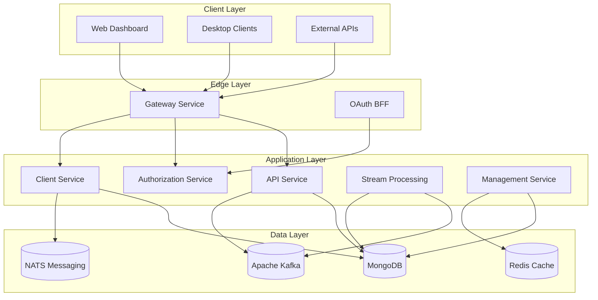

# OpenFrame Documentation

Welcome to the comprehensive documentation for **OpenFrame** - the unified AI-powered MSP platform that replaces expensive proprietary software with open-source alternatives enhanced by intelligent automation.

OpenFrame serves as the complete backend platform powering **Flamingo**, integrating multiple MSP tools into a single AI-driven interface with Mingo AI for technicians and Fae for client interactions.

## 📚 Table of Contents

### Getting Started

Quick start guides to get you up and running with OpenFrame:

- **[Introduction](./getting-started/introduction.md)** - Overview of OpenFrame and its capabilities
- **[Prerequisites](./getting-started/prerequisites.md)** - System requirements and preparation
- **[Quick Start](./getting-started/quick-start.md)** - 5-minute installation and setup guide
- **[First Steps](./getting-started/first-steps.md)** - Initial configuration and basic operations

### Development

Comprehensive guides for developers contributing to or building upon OpenFrame:

- **[Development Overview](./development/README.md)** - Complete development documentation
- **[Environment Setup](./development/setup/environment.md)** - IDE configuration and development tools
- **[Local Development](./development/setup/local-development.md)** - Running OpenFrame in development mode
- **[Architecture Overview](./development/architecture/README.md)** - System design and component relationships
- **[Security Guidelines](./development/security/README.md)** - Security patterns and best practices
- **[Testing Guide](./development/testing/README.md)** - Testing strategies and procedures
- **[Contributing Guidelines](./development/contributing/guidelines.md)** - Code standards and contribution process

### Reference Documentation

Technical reference documentation for all OpenFrame services and components:

- **[API Service Core](./architecture/api-service-core/api-service-core.md)** - Primary GraphQL + REST APIs for devices, events, organizations
- **[Authorization Service Core](./architecture/authorization-service-core/authorization-service-core.md)** - Multi-tenant OAuth2 authorization server
- **[Gateway Service Core](./architecture/gateway-service-core/gateway-service-core.md)** - Reactive Spring Cloud Gateway with JWT validation
- **[Client Service Core](./architecture/client-service-core/client-service-core.md)** - Agent lifecycle and machine presence management
- **[External API Service Core](./architecture/external-api-service-core/external-api-service-core.md)** - Versioned external REST API with cursor pagination
- **[Management Service Core](./architecture/management-service-core/management-service-core.md)** - Operational orchestration and distributed job scheduling
- **[Stream Processing Core](./architecture/stream-processing-core/stream-processing-core.md)** - Real-time event normalization pipeline
- **[Security JWT Core](./architecture/security-jwt-core/security-jwt-core.md)** - Cryptographic foundation for JWT handling
- **[Security OAuth BFF](./architecture/security-oauth-bff/security-oauth-bff.md)** - Backend-for-frontend OAuth orchestrator
- **[Data Mongo Core](./architecture/data-mongo-core/data-mongo-core.md)** - MongoDB persistence foundation with multi-tenant support
- **[Data Kafka Core](./architecture/data-kafka-core/data-kafka-core.md)** - Kafka infrastructure and event streaming
- **[Data Redis Cache](./architecture/data-redis-cache/data-redis-cache.md)** - Redis caching and session management
- **[API Contracts and Mapping](./architecture/api-contracts-and-mapping/api-contracts-and-mapping.md)** - Shared DTOs, filters, and mapping contracts
- **[Service Applications](./architecture/service-applications/service-applications.md)** - Runnable Spring Boot microservice applications
- **[Frontend Tenant API Clients](./architecture/frontend-tenant-api-clients/frontend-tenant-api-clients.md)** - Frontend communication and authentication layer

### Architecture Diagrams

Visual documentation showing system architecture and component relationships:

- **System Diagrams**: View Mermaid diagrams in [./architecture/diagrams/](./architecture/diagrams/)
- **Service Interactions**: Detailed service-to-service communication flows
- **Data Flow**: Event processing and data persistence patterns
- **Authentication Flow**: Multi-tenant OAuth2 and JWT validation sequences

### CLI Tools

The OpenFrame CLI tools are maintained in a separate repository:

- **Repository**: [flamingo-stack/openframe-cli](https://github.com/flamingo-stack/openframe-cli)
- **Installation**: [Installation Guide](https://github.com/flamingo-stack/openframe-cli#installation)
- **Documentation**: [CLI Documentation](https://github.com/flamingo-stack/openframe-cli/tree/main/docs)

**Note**: CLI tools are NOT located in this repository. Always refer to the external repository for installation and usage instructions.

## 🚀 What is OpenFrame?

OpenFrame is a modular, event-driven microservice architecture that provides:

### 🔐 **Identity & Security Layer**
- Multi-tenant OAuth2 Authorization Server with dynamic SSO
- JWT-based authentication with tenant-scoped RSA signing keys
- Secure API gateway with comprehensive rate limiting and validation

### 🌐 **Unified API Layer**  
- GraphQL and REST APIs for comprehensive MSP operations
- External integration APIs for tool connectivity
- Real-time WebSocket support for live updates

### 🤖 **AI-Powered Automation**
- Mingo AI for intelligent technical operations
- Fae client assistant for automated customer interactions
- Event correlation and automated incident response

### 📊 **Real-Time Data Processing**
- Apache Kafka-based event streaming and CDC processing
- Stream processing with Redis-based enrichment
- Unified event model across all integrated platforms

### 🔧 **Agent Management**
- Cross-platform client agents (Windows, macOS, Linux)
- OAuth-based agent authentication and lifecycle management  
- Tool-agnostic device control and synchronization

## 🏗 System Architecture

OpenFrame follows a modern microservices architecture with clear separation of concerns:

```mermaid
flowchart TD
    subgraph "Client Layer"
        Browser[Web Dashboard]
        Agent[Desktop Clients] 
        External[External APIs]
    end

    subgraph "Edge Layer"
        Gateway[Gateway Service]
        BFF[OAuth BFF]
    end

    subgraph "Application Layer"
        API[API Service]
        AuthSvc[Authorization Service]
        ClientSvc[Client Service]
        StreamSvc[Stream Processing]
        MgmtSvc[Management Service]
    end

    subgraph "Data Layer"
        MongoDB[(MongoDB)]
        Kafka[(Apache Kafka)]
        Redis[(Redis Cache)]
        NATS[(NATS Messaging)]
    end

    Browser --> Gateway
    Agent --> Gateway
    External --> Gateway
    
    Gateway --> API
    Gateway --> AuthSvc
    Gateway --> ClientSvc
    
    BFF --> AuthSvc
    
    API --> MongoDB
    API --> Kafka
    
    ClientSvc --> MongoDB
    ClientSvc --> NATS
    
    StreamSvc --> Kafka
    StreamSvc --> MongoDB
    
    MgmtSvc --> MongoDB
    MgmtSvc --> Redis
```

## 💻 Technology Stack

- **Backend**: Java 21, Spring Boot 3.3.0, Spring Cloud Gateway
- **Authentication**: OAuth2/OIDC with multi-tenant JWT validation  
- **Database**: MongoDB with reactive drivers and multi-tenant isolation
- **Event Streaming**: Apache Kafka with Kafka Streams processing
- **Real-Time Messaging**: NATS and JetStream for agent communication
- **Caching**: Redis with distributed locking and session management
- **APIs**: GraphQL (Netflix DGS), REST with OpenAPI documentation
- **Client Agents**: Rust-based cross-platform agents
- **Build & Deploy**: Maven, Docker, Docker Compose

## 🔄 Key Architectural Patterns

### Multi-Tenant Design
- **Tenant Isolation**: Complete data and configuration separation
- **Tenant-Scoped JWTs**: RSA keys and issuer resolution per tenant
- **Resource Isolation**: Tenant-specific Redis keys, MongoDB collections, and Kafka topics

### Event-Driven Architecture
- **CDC Processing**: Debezium-based change data capture from integrated tools
- **Stream Processing**: Real-time event normalization and correlation
- **Async Communication**: Event-based service coordination

### Security-First Approach
- **Zero Trust**: Every request authenticated and authorized
- **Defense in Depth**: Multiple security layers with validation at each tier
- **Secure by Default**: All endpoints require authentication unless explicitly public

## 📖 Quick Links

### Essential Resources
- **[Project README](../README.md)** - Main project overview and quick start
- **[Contributing Guide](../CONTRIBUTING.md)** - How to contribute to OpenFrame
- **[License Information](../LICENSE.md)** - Flamingo AI Unified License v1.0

### Community & Support
- **OpenFrame Website**: https://openframe.ai
- **Flamingo Platform**: https://www.flamingo.run/openframe
- **OpenMSP Community**: https://www.openmsp.ai/
- **Slack Community**: [Join OpenMSP Slack](https://join.slack.com/t/openmsp/shared_invite/zt-36bl7mx0h-3~U2nFH6nqHqoTPXMaHEHA)

> **Important**: We don't use GitHub Issues or GitHub Discussions. All support, feature requests, and community interaction happens through our OpenMSP Slack community.

### External Repositories
- **OpenFrame CLI**: [flamingo-stack/openframe-cli](https://github.com/flamingo-stack/openframe-cli) - Command-line tools for OpenFrame management

## 🚀 Getting Started

New to OpenFrame? Follow this recommended learning path:

1. **[Read the Introduction](./getting-started/introduction.md)** - Understand what OpenFrame is and its capabilities
2. **[Check Prerequisites](./getting-started/prerequisites.md)** - Ensure your system is ready
3. **[Follow Quick Start](./getting-started/quick-start.md)** - Get OpenFrame running in 5 minutes
4. **[Complete First Steps](./getting-started/first-steps.md)** - Configure your first tenant and explore features
5. **[Join the Community](https://join.slack.com/t/openmsp/shared_invite/zt-36bl7mx0h-3~U2nFH6nqHqoTPXMaHEHA)** - Connect with other OpenFrame users and contributors

## 🏗 For Developers

Ready to contribute or build upon OpenFrame?

1. **[Set up Development Environment](./development/setup/environment.md)** - Configure your IDE and tools
2. **[Run OpenFrame Locally](./development/setup/local-development.md)** - Start developing with local services
3. **[Understand the Architecture](./development/architecture/README.md)** - Learn the system design patterns
4. **[Review Security Guidelines](./development/security/README.md)** - Follow secure development practices
5. **[Read Contributing Guidelines](./development/contributing/guidelines.md)** - Learn our development workflow

## 📊 Documentation Status

This documentation is continuously updated as OpenFrame evolves. Key areas include:

- ✅ **Getting Started**: Complete and up-to-date
- ✅ **Development Guides**: Comprehensive developer resources
- ✅ **Reference Documentation**: Detailed service specifications
- ✅ **Architecture Diagrams**: Visual system documentation
- 🔄 **API Documentation**: OpenAPI specs and GraphQL schemas (in progress)
- 🔄 **Integration Guides**: Tool-specific integration documentation (in progress)

## 🤝 Contributing to Documentation

Help improve OpenFrame documentation:

- **Report Issues**: Share feedback in our [Slack community](https://join.slack.com/t/openmsp/shared_invite/zt-36bl7mx0h-3~U2nFH6nqHqoTPXMaHEHA)
- **Suggest Improvements**: Discuss ideas in the `#documentation` channel
- **Submit Changes**: Follow our [contributing guidelines](../CONTRIBUTING.md) for documentation updates
- **Add Examples**: Contribute real-world usage examples and tutorials

---

*Documentation generated by [OpenFrame Doc Orchestrator](https://github.com/flamingo-stack/openframe-oss-tenant)*

**Questions or feedback?** Join our [OpenMSP Slack community](https://join.slack.com/t/openmsp/shared_invite/zt-36bl7mx0h-3~U2nFH6nqHqoTPXMaHEHA) and let us know how we can improve! 🚀