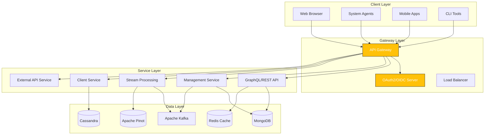

# OpenFrame OSS Tenant Documentation

Welcome to the comprehensive documentation for OpenFrame OSS Tenant - the open-source, multi-tenant backend stack that powers Flamingo's unified AI-driven MSP platform.

## 📚 Table of Contents

### 🚀 Getting Started
Start here if you're new to OpenFrame:
- [Introduction](./getting-started/introduction.md) - What is OpenFrame and why use it?
- [Prerequisites](./getting-started/prerequisites.md) - System requirements and dependencies
- [Quick Start](./getting-started/quick-start.md) - Get OpenFrame running in 5 minutes
- [First Steps](./getting-started/first-steps.md) - Explore the platform and key features

### 🔧 Development
For contributors and developers:
- [Development Overview](./development/README.md) - Development section index and workflow
- [Environment Setup](./development/setup/environment.md) - Configure your development environment
- [Local Development](./development/setup/local-development.md) - Run OpenFrame locally for development
- [Architecture Overview](./development/architecture/overview.md) - System architecture and design patterns
- [Microservices](./development/architecture/microservices.md) - Service architecture and communication
- [Data Flow](./development/architecture/data-flow.md) - How data flows through the system
- [Integration Patterns](./development/architecture/integration.md) - Third-party tool integration patterns
- [Security Architecture](./development/architecture/security.md) - Authentication, authorization, and security
- [Testing Overview](./development/testing/overview.md) - Testing strategy and guidelines
- [Contributing Guidelines](./development/contributing/guidelines.md) - How to contribute to the project
- [Code Style Guide](./development/contributing/code-style.md) - Coding standards and best practices
- [Client Agent Development](./development/client-agent/rust-development.md) - Rust client development guide
- [Development Tools](./development/tools/scripts.md) - Available scripts and development tools

### 📖 Reference
Technical reference documentation:
- [Architecture Overview](./reference/architecture/overview.md) - High-level system architecture
- [Core Services](./reference/architecture/openframe_api_service_core.md) - Core API service documentation
- [Gateway Service](./reference/architecture/gateway_service_core.md) - API gateway and routing
- [Authorization Server](./reference/architecture/openframe_authorization_server_service.md) - OAuth2/OIDC implementation
- [Management Service](./reference/architecture/openframe_management_service.md) - Platform management and configuration
- [Client Services](./reference/architecture/client_core.md) - Agent and client management
- [Data Layer](./reference/architecture/data_mongo.md) - MongoDB data persistence
- [Caching Layer](./reference/architecture/data_redis_cache.md) - Redis caching implementation
- [Event Streaming](./reference/architecture/data_kafka.md) - Kafka-based event processing
- [Security Core](./reference/architecture/security_core.md) - Security utilities and patterns
- [External APIs](./reference/architecture/external_api_service_core.md) - Third-party API integrations
- [Tool SDKs](./reference/architecture/tool_sdks.md) - Integrated tool software development kits
- [Notification Services](./reference/architecture/notification_mail.md) - Email and notification systems

### 🔗 CLI Tools

The OpenFrame CLI tools are maintained in a separate repository:
- **Repository**: [flamingo-stack/openframe-cli](https://github.com/flamingo-stack/openframe-cli)
- **Installation**: [Installation Guide](https://github.com/flamingo-stack/openframe-cli#installation)
- **Documentation**: [CLI Documentation](https://github.com/flamingo-stack/openframe-cli/tree/main/docs)

**Note**: CLI tools are NOT located in this repository. Always refer to the external repository for installation and usage.

## 🗂️ Documentation Sections

### For New Users
If you're new to OpenFrame, start with our **Getting Started** section. It will walk you through:
- Understanding what OpenFrame is and its benefits
- Setting up your environment
- Getting the platform running locally
- Exploring key features and capabilities

### For Developers
The **Development** section provides everything you need to contribute to OpenFrame:
- Development environment setup
- Architecture deep-dives
- Testing strategies
- Contribution workflow
- Code style guidelines

### For Integrators & Architects
The **Reference** section contains detailed technical documentation:
- Service architecture and APIs
- Data models and flow
- Security implementation
- Integration patterns
- Extension points

## 🏗️ Platform Architecture

OpenFrame follows a modern microservices architecture:

```mermaid
flowchart TB
    subgraph "Client Layer"
        Browser[Web Browser]
        Agent[System Agents]
        Mobile[Mobile Apps]
        CLI[CLI Tools]
    end
    
    subgraph "Gateway Layer"
        Gateway[API Gateway]
        Auth[OAuth2/OIDC Server]
        LB[Load Balancer]
    end
    
    subgraph "Service Layer"
        API[GraphQL/REST API]
        Management[Management Service]
        Stream[Stream Processing]
        Client[Client Service]
        External[External API Service]
    end
    
    subgraph "Data Layer"
        MongoDB[(MongoDB)]
        Cassandra[(Cassandra)]
        Redis[(Redis Cache)]
        Kafka[Apache Kafka]
        Pinot[(Apache Pinot)]
    end
    
    Browser --> Gateway
    Agent --> Gateway
    Mobile --> Gateway
    CLI --> Gateway
    
    Gateway --> Auth
    Gateway --> API
    Gateway --> Management
    Gateway --> Stream
    Gateway --> Client
    Gateway --> External
    
    API --> MongoDB
    API --> Redis
    Management --> MongoDB
    Management --> Kafka
    Stream --> Kafka
    Stream --> Pinot
    Client --> Cassandra
    
    style Gateway fill:#FFC109,stroke:#1A1A1A,color:#FAFAFA
    style Auth fill:#FFC109,stroke:#1A1A1A,color:#FAFAFA
```

## 🚀 Quick Navigation

### I want to...

**🎯 Get OpenFrame running quickly**
→ [Quick Start Guide](./getting-started/quick-start.md)

**🔧 Set up a development environment**
→ [Development Environment Setup](./development/setup/environment.md)

**🏗️ Understand the system architecture**
→ [Architecture Overview](./reference/architecture/overview.md)

**🤝 Contribute to the project**
→ [Contributing Guidelines](./development/contributing/guidelines.md)

**📊 Learn about data flow and storage**
→ [Data Flow Architecture](./development/architecture/data-flow.md)

**🔐 Understand security implementation**
→ [Security Architecture](./development/architecture/security.md)

**🔌 Integrate with external tools**
→ [Integration Patterns](./development/architecture/integration.md)

### By Role

| Role | Recommended Starting Points |
|------|----------------------------|
| **MSP Operator** | [Introduction](./getting-started/introduction.md) → [Quick Start](./getting-started/quick-start.md) → [First Steps](./getting-started/first-steps.md) |
| **Developer** | [Development Setup](./development/setup/environment.md) → [Architecture Overview](./development/architecture/overview.md) → [Contributing](./development/contributing/guidelines.md) |
| **DevOps Engineer** | [Prerequisites](./getting-started/prerequisites.md) → [Architecture](./reference/architecture/overview.md) → [Local Development](./development/setup/local-development.md) |
| **Solution Architect** | [Architecture Overview](./reference/architecture/overview.md) → [Integration Patterns](./development/architecture/integration.md) → [Security](./development/architecture/security.md) |

## 🌟 Key Features Covered

This documentation covers all major OpenFrame features:

- **🤖 AI-Powered Automation**: Mingo AI and autonomous agents
- **🔧 Unified MSP Platform**: Single interface for all MSP operations
- **🏗️ Microservices Architecture**: Scalable, cloud-native design
- **🔐 Enterprise Security**: OAuth2/OIDC, JWT, encryption at rest
- **📊 Real-time Analytics**: Apache Kafka and Pinot integration
- **🔄 Tool Integration**: Tactical RMM, MeshCentral, Fleet MDM
- **👥 Multi-tenant Support**: MSP client isolation and management
- **📱 Cross-platform Clients**: Web, mobile, CLI, and system agents

## 📖 Quick Links

- [Project README](../README.md) - Main project overview and setup
- [Contributing Guidelines](../CONTRIBUTING.md) - How to contribute to OpenFrame
- [License](../LICENSE.md) - Flamingo AI Unified License v1.0
- [Changelog](../CHANGELOG.md) - Version history and release notes

## 🆘 Support & Community

- **Community Slack**: [OpenMSP Community](https://join.slack.com/t/openmsp/shared_invite/zt-36bl7mx0h-3~U2nFH6nqHqoTPXMaHEHA)
- **Website**: [OpenFrame Platform](https://openframe.ai)
- **Company**: [Flamingo](https://www.flamingo.run)

> **Note**: We don't use GitHub Issues or Discussions. All support and collaboration happens in our OpenMSP Slack community.

## 📝 Contributing to Documentation

Found an error or want to improve the documentation? 

1. **For minor fixes**: Edit files directly and submit a pull request
2. **For major changes**: Join our [Slack community](https://join.slack.com/t/openmsp/shared_invite/zt-36bl7mx0h-3~U2nFH6nqHqoTPXMaHEHA) to discuss first
3. **For new sections**: Follow our [Contributing Guidelines](../CONTRIBUTING.md)

All documentation follows the [Flamingo Markdown Standards](./contributing/markdown-standards.md) for consistency.

---

*Documentation generated by [OpenFrame Doc Orchestrator](https://github.com/flamingo-stack/openframe-oss-tenant)*

**Welcome to OpenFrame!** 🚀 Whether you're an MSP looking to modernize your stack, a developer wanting to contribute, or an architect planning integration, this documentation will guide you through your OpenFrame journey.