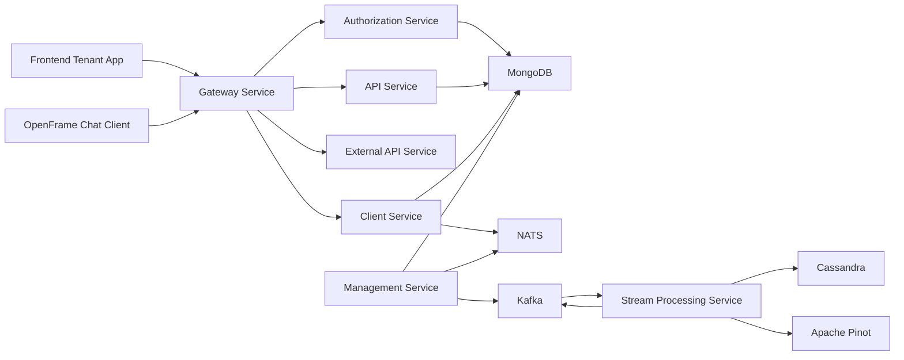

# OpenFrame OSS Tenant Documentation

Welcome to the comprehensive documentation for OpenFrame OSS Tenant - a distributed platform that creates a unified layer for data, APIs, automation, and AI on top of carefully selected open-source projects.

## 📚 Table of Contents

### Getting Started

New to OpenFrame? Start here to get up and running quickly:

- [Introduction](./getting-started/introduction.md) - Overview of OpenFrame and core concepts
- [Prerequisites](./getting-started/prerequisites.md) - System requirements and dependencies
- [Quick Start](./getting-started/quick-start.md) - Get OpenFrame running in minutes
- [First Steps](./getting-started/first-steps.md) - Essential tasks after installation

### Development

Comprehensive guides for developers working on the OpenFrame platform:

- [Development Overview](./development/README.md) - Development workflow and guidelines
- [Environment Setup](./development/setup/environment.md) - Local development environment configuration
- [Local Development](./development/setup/local-development.md) - Running OpenFrame locally
- [Architecture Guide](./development/architecture/README.md) - System design and architectural patterns
- [Security Guidelines](./development/security/README.md) - Security best practices and implementation
- [Testing Guide](./development/testing/README.md) - Testing strategies and frameworks
- [Contributing Guidelines](./development/contributing/guidelines.md) - How to contribute to the project

### Reference

Technical reference documentation for all core modules and services:

- [API Service Core](./architecture/api_service_core/api_service_core.md) - REST and GraphQL API implementation
- [Authorization Service Core](./architecture/authz_service_core/authz_service_core.md) - Multi-tenant OAuth2 authorization server
- [Gateway Service Core](./architecture/gateway_service_core/gateway_service_core.md) - Secure reactive API gateway
- [Client Service Core](./architecture/client_service_core/client_service_core.md) - Agent registration and lifecycle management
- [Stream Processing Core](./architecture/stream_processing_core/stream_processing_core.md) - Real-time event processing with Kafka
- [Management Service Core](./architecture/management_service_core/management_service_core.md) - Control plane and orchestration
- [External API Service Core](./architecture/external_api_service_core/external_api_service_core.md) - Public API surface for integrations
- [Frontend Tenant App Core](./architecture/frontend_tenant_app_core/frontend_tenant_app_core.md) - Next.js frontend application
- [Chat Client Core](./architecture/chat_client_core/chat_client_core.md) - Desktop AI chat client
- [Data Layer MongoDB](./architecture/data_layer_mongo/data_layer_mongo.md) - Primary document persistence
- [Data Layer Kafka](./architecture/data_layer_kafka/data_layer_kafka.md) - Event streaming configuration
- [Data Layer Core Services](./architecture/data_layer_core_services/data_layer_core_services.md) - Cassandra and Pinot analytics
- [Security Shared](./architecture/security_shared/security_shared.md) - Common security utilities and patterns
- [Service Entrypoints](./architecture/service_entrypoints/service_entrypoints.md) - Spring Boot application definitions

### Diagrams

Visual documentation to understand system architecture and data flows:
- Architecture diagrams are embedded within the reference documentation above
- Additional Mermaid diagrams are available in `./architecture/diagrams/`

### CLI Tools

The OpenFrame CLI tools are maintained in a separate repository:
- **Repository**: [flamingo-stack/openframe-cli](https://github.com/flamingo-stack/openframe-cli)
- **Installation**: [Installation Guide](https://github.com/flamingo-stack/openframe-cli#installation)  
- **Documentation**: [CLI Documentation](https://github.com/flamingo-stack/openframe-cli/tree/main/docs)

**Note**: CLI tools are NOT located in this repository. Always refer to the external repository for installation and usage.

## 🏗️ Architecture Overview

OpenFrame is built as a microservices platform with clear separation of concerns:

```mermaid
flowchart LR
    Frontend["Frontend Tenant App"] --> Gateway["Gateway Service"]
    ChatClient["OpenFrame Chat Client"] --> Gateway

    Gateway --> Authz["Authorization Service"]
    Gateway --> Api["API Service"]
    Gateway --> ExternalApi["External API Service"]
    Gateway --> ClientSvc["Client Service"]

    Authz --> Mongo["MongoDB"]
    Api --> Mongo
    ClientSvc --> Mongo
    Management --> Mongo

    ClientSvc --> Nats["NATS"]
    Stream --> Kafka["Kafka"]
    Kafka --> Stream["Stream Processing Service"]

    Stream --> Cassandra["Cassandra"]
    Stream --> Pinot["Apache Pinot"]

    Management["Management Service"] --> Kafka
    Management --> Nats
```

### Key Architectural Principles

- **Multi-tenant Security**: Complete tenant isolation with per-tenant RSA keys
- **Event-driven Architecture**: Real-time processing with Kafka and NATS
- **Microservices Design**: Domain-driven service boundaries with clear responsibilities
- **Reactive Programming**: Non-blocking I/O throughout the gateway and processing layers
- **Tool-agnostic Integration**: Framework for connecting various MSP tools and systems

## 🔗 External Resources

### Community & Support

- **OpenMSP Community**: [https://www.openmsp.ai/](https://www.openmsp.ai/)
- **Slack Community**: [Join OpenMSP Slack](https://join.slack.com/t/openmsp/shared_invite/zt-36bl7mx0h-3~U2nFH6nqHqoTPXMaHEHA)
- **Flamingo Website**: [https://www.flamingo.run](https://www.flamingo.run)
- **Knowledge Base**: [https://www.flamingo.run/knowledge-base](https://www.flamingo.run/knowledge-base)

### Development Resources

- **Main Repository**: [flamingo-stack/openframe-oss-tenant](https://github.com/flamingo-stack/openframe-oss-tenant)
- **CLI Repository**: [flamingo-stack/openframe-cli](https://github.com/flamingo-stack/openframe-cli)
- **Issue Tracking**: All coordination happens on Slack (we don't use GitHub Issues)

## 📖 Quick Links

- [Project README](../README.md) - Main project overview and setup
- [Contributing](../CONTRIBUTING.md) - How to contribute to the project
- [License](../LICENSE.md) - License information and terms

## 🚀 Getting Support

Need help? Here's how to get support:

1. **Check the documentation** - Start with the relevant section above
2. **Search existing discussions** - Look through Slack channels for similar questions  
3. **Join our community** - Ask questions in the [OpenMSP Slack](https://join.slack.com/t/openmsp/shared_invite/zt-36bl7mx0h-3~U2nFH6nqHqoTPXMaHEHA)
4. **Contact the team** - Reach out in the `#general` Slack channel

### Recommended Learning Path

For new contributors and users:

1. **Start with [Introduction](./getting-started/introduction.md)** - Understand what OpenFrame is and does
2. **Follow [Quick Start](./getting-started/quick-start.md)** - Get a working installation  
3. **Explore [Architecture Guide](./development/architecture/README.md)** - Understand system design
4. **Read [API Service Core](./architecture/api_service_core/api_service_core.md)** - Learn the main API patterns
5. **Check [Contributing Guidelines](./development/contributing/guidelines.md)** - Start contributing

---

*Documentation generated by [OpenFrame Doc Orchestrator](https://github.com/flamingo-stack/openframe-oss-tenant)*

  Built with 💛 by the <a href="https://www.flamingo.run/about"><b>Flamingo</b></a> team

