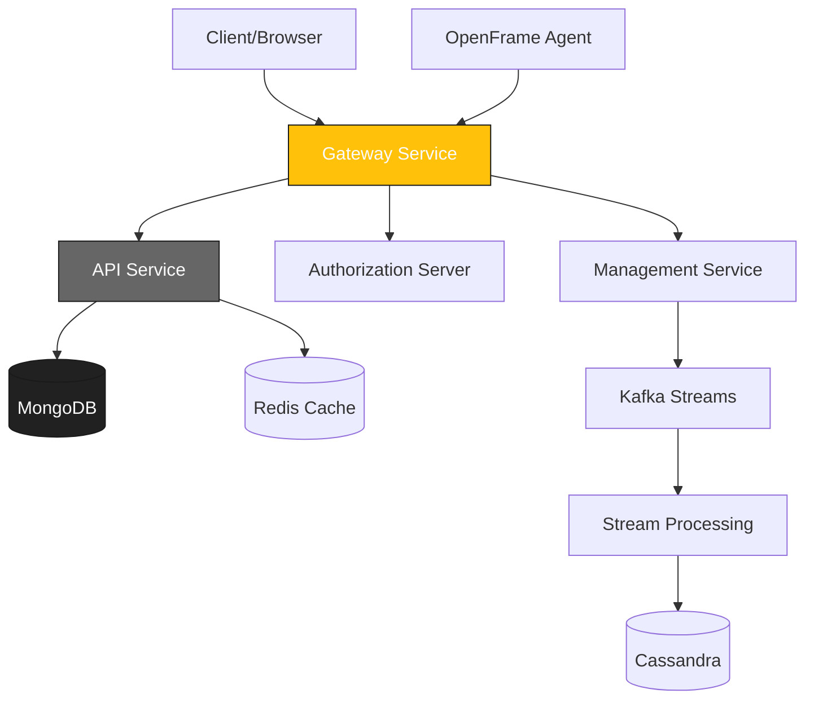

# OpenFrame OSS Tenant Documentation

Welcome to the comprehensive documentation for **OpenFrame OSS Tenant** - the multi-tenant, open-source backend stack that powers OpenFrame and Flamingo's AI-powered MSP platform.

## 📚 Table of Contents

### Getting Started
Start here if you're new to OpenFrame:

- [Introduction](./getting-started/introduction.md) - What is OpenFrame and why use it?
- [Prerequisites](./getting-started/prerequisites.md) - System requirements and preparation
- [Quick Start](./getting-started/quick-start.md) - Get running in 5 minutes
- [First Steps](./getting-started/first-steps.md) - Initial configuration and next steps

### Development
For contributors and developers:

- [Development Overview](./development/README.md) - Development section index
- [Environment Setup](./development/setup/environment.md) - Set up your development environment
- [Local Development](./development/setup/local-development.md) - Run OpenFrame locally
- [Architecture](./development/architecture/overview.md) - System design and components
- [Testing](./development/testing/overview.md) - Testing strategies and guidelines
- [Contributing](./development/contributing/guidelines.md) - How to contribute code and documentation

### Reference
Technical reference documentation:

- [Architecture Overview](./reference/overview.md) - High-level system architecture
- [Service Entrypoints](./reference/service_entrypoints.md) - Runnable Spring Boot applications
- [Gateway Service Core](./reference/gateway_service_core.md) - API gateway and routing
- [Security Shared Core](./reference/security_shared_core.md) - Authentication and authorization
- [Data Layers](./reference/data_mongo_layer.md) - MongoDB persistence layer
- [Stream Processing](./reference/stream_processing_core.md) - Real-time event processing
- [JWT Security](./reference/jwt_security.md) - JWT token handling
- [OAuth Support](./reference/oauth_bff_support.md) - OAuth2/OIDC implementation
- [API Contracts](./reference/api_contracts_and_domain_services.md) - Service contracts and domain logic
- [Management Service](./reference/management_service_core.md) - System administration and automation
- [Kafka Configuration](./reference/kafka_shared_config_and_models.md) - Message streaming setup
- [Redis Cache Layer](./reference/data_redis_cache_layer.md) - Caching and session management
- [OAuth Constants](./reference/oauth_security_constants.md) - Security configuration constants
- [PKCE Utils](./reference/pkce_utils.md) - Proof Key for Code Exchange utilities
- [MongoDB Configuration](./reference/Mongo Configuration.md) - Database setup and configuration

### CLI Tools

The OpenFrame CLI tools are maintained in a separate repository:
- **Repository**: [flamingo-stack/openframe-cli](https://github.com/flamingo-stack/openframe-cli)
- **Installation**: [Installation Guide](https://github.com/flamingo-stack/openframe-cli#installation)
- **Documentation**: [CLI Documentation](https://github.com/flamingo-stack/openframe-cli/tree/main/docs)

**Note**: CLI tools are NOT located in this repository. Always refer to the external repository for installation and usage instructions.

## 🏗️ Architecture Quick Reference

OpenFrame follows a layered microservices architecture:


```mermaid
graph TD
    A[Client/Browser] --> B[Gateway Service]
    C[OpenFrame Agent] --> B
    
    B --> D[API Service]
    B --> E[Authorization Server]
    B --> F[Management Service]
    
    D --> G[(MongoDB)]
    D --> H[(Redis Cache)]
    
    F --> I[Kafka Streams]
    I --> J[Stream Processing]
    J --> K[(Cassandra)]
    
    style B fill:#FFC109,stroke:#1A1A1A,color:#FAFAFA
    style D fill:#666666,stroke:#1A1A1A,color:#FAFAFA
    style G fill:#212121,stroke:#1A1A1A,color:#FAFAFA
```

### Core Components

| Component | Purpose | Documentation |
|-----------|---------|---------------|
| **Gateway Service** | API routing, authentication, WebSocket proxy | [Gateway Service Core](./reference/gateway_service_core.md) |
| **API Service** | Main business logic, GraphQL endpoint | [API Contracts](./reference/api_contracts_and_domain_services.md) |
| **Authorization Server** | OAuth2/OIDC identity provider | [OAuth Support](./reference/oauth_bff_support.md) |
| **Management Service** | System administration, scheduled tasks | [Management Service](./reference/management_service_core.md) |
| **Stream Processing** | Real-time event processing | [Stream Processing](./reference/stream_processing_core.md) |
| **Data Layers** | MongoDB, Redis, Kafka persistence | [Data Layers](./reference/data_mongo_layer.md) |

## 🚀 Quick Navigation

### For New Users
1. Read the [Introduction](./getting-started/introduction.md) to understand OpenFrame
2. Check [Prerequisites](./getting-started/prerequisites.md) to prepare your environment
3. Follow the [Quick Start Guide](./getting-started/quick-start.md) for rapid deployment

### For Developers
1. Set up your [Development Environment](./development/setup/environment.md)
2. Understand the [Architecture](./development/architecture/overview.md)
3. Review [Contributing Guidelines](./development/contributing/guidelines.md)

### For System Architects
1. Study the [Architecture Overview](./reference/overview.md)
2. Review [Security Implementation](./reference/security_shared_core.md)
3. Understand [Data Flow](./reference/stream_processing_core.md)

## 🛠️ Technology Stack

OpenFrame is built with modern, enterprise-grade technologies:

| Layer | Technology | Purpose |
|-------|------------|---------|
| **Frontend** | Next.js 15, React 19, TypeScript | Modern web interface |
| **Backend** | Spring Boot 3.3, Java 21 | Microservices runtime |
| **API** | GraphQL, Netflix DGS | Unified data access |
| **Client** | Rust, Tokio | Cross-platform agent |
| **Messaging** | Apache Kafka 3.6 | Event streaming |
| **Databases** | MongoDB, Cassandra, Apache Pinot | Multi-model storage |
| **Cache** | Redis | High-performance caching |
| **Monitoring** | Prometheus, Grafana, Loki | Observability |

## 💡 Common Use Cases

### MSP Operations
- **Device Management** - Monitor and manage client devices across multiple locations
- **Automated Workflows** - Set up intelligent automation for routine IT tasks
- **Client Portals** - Provide clients with self-service capabilities through AI assistants

### Development & Integration
- **Custom Tools** - Build custom MSP tools using OpenFrame APIs
- **Third-party Integration** - Connect existing tools through standardized interfaces
- **Multi-tenant Applications** - Develop SaaS solutions with built-in isolation

### Enterprise Deployments
- **High Availability** - Deploy across multiple data centers for resilience
- **Scalability** - Handle thousands of clients and devices with horizontal scaling
- **Security Compliance** - Meet enterprise security requirements with built-in controls

## 🔧 Development Workflows

### Backend Development (Java)
```bash
# Start development environment
mvn spring-boot:run -pl openframe/services/openframe-api
mvn spring-boot:run -pl openframe/services/openframe-gateway

# Run tests
mvn test

# Build for production
mvn clean package -P production
```

### Frontend Development (TypeScript)
```bash
# Start development server
cd openframe/services/openframe-frontend
npm run dev

# Type checking
npm run type-check

# Build for production
npm run build
```

### Client Agent Development (Rust)
```bash
# Development build
cd client
cargo build

# Run tests
cargo test

# Production build
cargo build --release
```

## 📖 Learning Path

### Beginner Track
1. **[Introduction](./getting-started/introduction.md)** - Understand the platform
2. **[Prerequisites](./getting-started/prerequisites.md)** - Prepare your system
3. **[Quick Start](./getting-started/quick-start.md)** - Deploy your first instance

### Intermediate Track
1. **[Local Development](./development/setup/local-development.md)** - Set up development environment
2. **[Architecture Overview](./development/architecture/overview.md)** - Understand system design
3. **[Testing](./development/testing/overview.md)** - Learn testing strategies

### Advanced Track
1. **[Security Implementation](./reference/security_shared_core.md)** - Deep-dive into security
2. **[Stream Processing](./reference/stream_processing_core.md)** - Real-time data processing
3. **[Custom Integrations](./reference/api_contracts_and_domain_services.md)** - Build custom solutions

## 🤝 Community & Support

### Get Help
- **💬 Community Slack**: [OpenMSP Slack](https://join.slack.com/t/openmsp/shared_invite/zt-36bl7mx0h-3~U2nFH6nqHqoTPXMaHEHA)
- **🌐 OpenMSP Community**: [www.openmsp.ai](https://www.openmsp.ai/)
- **📖 Knowledge Base**: [Flamingo Documentation](https://www.flamingo.run/knowledge-base)

### Contribute
- **🔧 Report Issues**: Join our Slack community to report bugs or request features
- **🚀 Submit Code**: See our [Contributing Guidelines](./development/contributing/guidelines.md)
- **📝 Improve Docs**: Help make documentation better for everyone

### Important Note
We do **NOT** use GitHub Issues or GitHub Discussions. Everything is managed through our **OpenMSP Slack Community**. Please join our Slack for support, discussions, and collaboration.

## 📋 Quick Links

### Project Information
- [Project README](../README.md) - Main project overview
- [Contributing Guidelines](../CONTRIBUTING.md) - How to contribute
- [License](../LICENSE.md) - License information

### External Resources
- [OpenFrame Website](https://openframe.ai) - Official product website
- [Flamingo Platform](https://www.flamingo.run) - Parent company and commercial offerings
- [GitHub Repository](https://github.com/flamingo-stack/openframe-oss-tenant) - Source code

### Related Projects
- [OpenFrame CLI](https://github.com/flamingo-stack/openframe-cli) - Command-line tools
- [OpenFrame Libraries](https://github.com/flamingo-stack/openframe-oss-lib) - Shared libraries (dependency)

---

## 🔄 Documentation Updates

This documentation is continuously updated to reflect the latest changes in OpenFrame. Key areas of focus:

- **API Changes** - New endpoints and schema updates
- **Architecture Evolution** - System design improvements
- **Security Enhancements** - New security features and best practices
- **Performance Optimizations** - Scalability and efficiency improvements

*Last Updated: Generated by OpenFrame Doc Orchestrator*

---

*Documentation generated by [OpenFrame Doc Orchestrator](https://github.com/flamingo-stack/openframe-oss-tenant)*