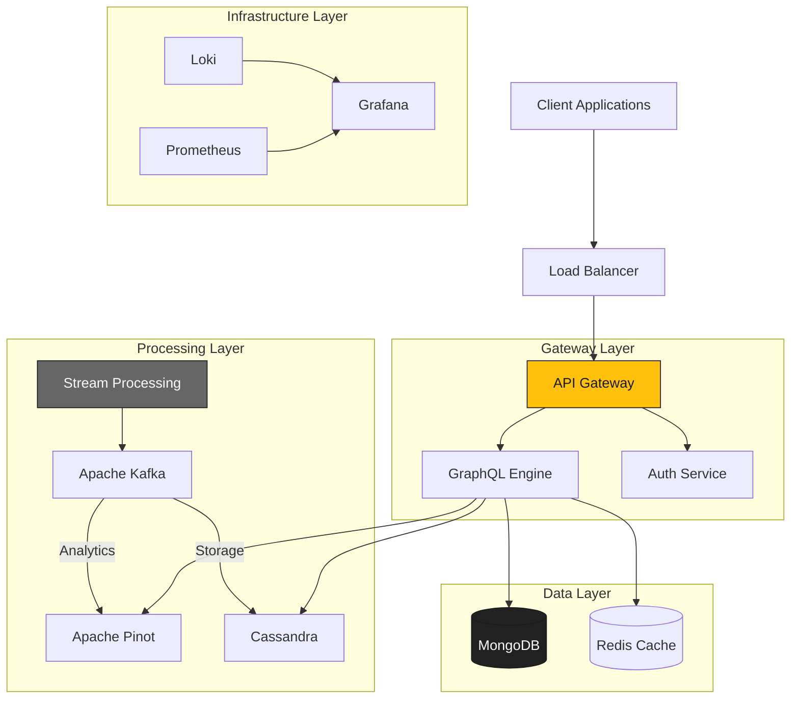

# OpenFrame Documentation

Welcome to the comprehensive documentation for OpenFrame, the open-source unified MSP platform that creates a distributed layer for data, APIs, automation, and AI.

## 🎯 Quick Navigation

| I Want To... | Go To | Time Needed |
|--------------|-------|-------------|
| **Get started quickly** | [Quick Start](./getting-started/quick-start.md) | 5 minutes |
| **Understand the platform** | [Introduction](./getting-started/introduction.md) | 15 minutes |
| **Set up development** | [Development Setup](./development/setup/environment.md) | 30 minutes |
| **Contribute code** | [Contributing Guidelines](./development/contributing/guidelines.md) | 15 minutes |
| **Learn the architecture** | [Architecture Overview](./reference/architecture/overview.md) | 45 minutes |

## 📚 Documentation Sections

### 🚀 Getting Started
Perfect for new users and quick setup:

- **[Introduction](./getting-started/introduction.md)** - What is OpenFrame and why use it?
- **[Prerequisites](./getting-started/prerequisites.md)** - System requirements and dependencies
- **[Quick Start](./getting-started/quick-start.md)** - Get running in 5 minutes
- **[First Steps](./getting-started/first-steps.md)** - Essential configuration and initial tasks

### 🏗️ Development
For contributors and developers:

- **[Development Overview](./development/README.md)** - Complete development guide index
- **[Environment Setup](./development/setup/environment.md)** - Configure your development workspace
- **[Local Development](./development/setup/local-development.md)** - Build, run, and debug locally
- **[Architecture Overview](./development/architecture/overview.md)** - System design and components
- **[Microservices Architecture](./development/architecture/microservices.md)** - Service breakdown
- **[Security Architecture](./development/architecture/security.md)** - Security design patterns
- **[Data Flow](./development/architecture/data-flow.md)** - How data moves through the system
- **[Integration Architecture](./development/architecture/integration.md)** - External tool integrations
- **[Testing Overview](./development/testing/overview.md)** - Testing strategy and best practices
- **[Contributing Guidelines](./development/contributing/guidelines.md)** - Code standards and PR process
- **[Code Style](./development/contributing/code-style.md)** - Formatting and conventions
- **[Rust Client Development](./development/client-agent/rust-development.md)** - Cross-platform agent development
- **[Development Tools](./development/tools/scripts.md)** - Scripts and automation

### 📖 Reference
Technical reference documentation:

- **[Architecture Overview](./reference/architecture/overview.md)** - High-level system architecture
- **[Security Core + OAuth BFF](./reference/architecture/security-core%20+%20oauth-bff.md)** - Authentication and authorization
- **[Gateway Service Core](./reference/architecture/gateway-service-core%20(routing+security+ws%20proxy).md)** - API gateway and routing
- **[API Service Core](./reference/architecture/api-lib%20(shared%20api%20contracts%20+%20mappers).md)** - Shared API contracts
- **[External API Service Core](./reference/architecture/external-api-service-core%20(public%20REST%20api).md)** - Public REST API
- **[Management Service Core](./reference/architecture/management-service-core%20(initializers+schedulers+tool%20management).md)** - System management
- **[Data MongoDB](./reference/architecture/data-mongo%20(documents+repositories).md)** - Document storage
- **[Data Redis](./reference/architecture/data-redis%20(caching).md)** - Caching layer
- **[Data Kafka](./reference/architecture/data-kafka%20(kafka%20infra+retry).md)** - Event streaming
- **[Configuration Server](./reference/architecture/config-server-core.md)** - Centralized configuration
- **[SDK Integrations](./reference/architecture/sdk-integrations%20(fleetmdm+tacticalrmm).md)** - FleetDM and Tactical RMM
- **[IDP Configuration](./reference/architecture/idp-configuration.md)** - Identity provider setup
- **[Chat Client](./reference/architecture/openframe-chat-client%20(chat%20runtime%20services).md)** - AI chat services
- **[Supported Models Service](./reference/architecture/Supported%20Models%20Service.md)** - AI model management
- **[Processors](./reference/architecture/Processors.md)** - Data processing components
- **[Core Utils](./reference/architecture/core-utils.md)** - Shared utilities

### CLI Tools

OpenFrame CLI tools are maintained in a separate repository:

- **Repository**: [flamingo-stack/openframe-cli](https://github.com/flamingo-stack/openframe-cli)
- **Installation**: [Installation Guide](https://github.com/flamingo-stack/openframe-cli#installation)
- **Documentation**: [CLI Documentation](https://github.com/flamingo-stack/openframe-cli/tree/main/docs)

**Note**: CLI tools are **NOT** located in this repository. Always refer to the external repository for installation and usage instructions.

## 🎥 Video Resources

### Platform Overview

Get a comprehensive look at OpenFrame's capabilities:

### Latest Features

See autonomous AI agents in action:

## 🛠️ Technology Stack

OpenFrame is built on modern, proven technologies:

### Backend
- **Runtime**: Java 21 + Spring Boot 3.3
- **API**: GraphQL (Netflix DGS Framework)
- **Security**: OAuth 2.0 + JWT
- **Database**: MongoDB (documents), Cassandra (time-series), Pinot (analytics)
- **Cache**: Redis
- **Messaging**: Apache Kafka
- **Monitoring**: Prometheus + Grafana + Loki

### Frontend
- **Framework**: Vue.js 3 + TypeScript 5.8
- **UI Library**: PrimeVue
- **State Management**: Pinia
- **Build Tool**: Vite
- **GraphQL Client**: Apollo Client

### Client Agent
- **Language**: Rust + Tokio
- **Cross-platform**: Windows, macOS, Linux
- **Real-time**: WebSocket communication

## 🏗️ System Architecture

```mermaid
flowchart TB
    Client[Client Applications] --> LB[Load Balancer]
    LB --> Gateway[API Gateway]
    
    subgraph "Gateway Layer"
        Gateway --> GraphQL[GraphQL Engine]
        Gateway --> Auth[Auth Service]
    end
    
    subgraph "Processing Layer"
        Stream[Stream Processing] --> Kafka[Apache Kafka]
        Kafka --> |Analytics| Pinot[Apache Pinot]
        Kafka --> |Storage| Cassandra[Cassandra]
    end
    
    subgraph "Data Layer"
        GraphQL --> MongoDB[(MongoDB)]
        GraphQL --> Cassandra
        GraphQL --> Pinot
        GraphQL --> Redis[(Redis Cache)]
    end
    
    subgraph "Infrastructure Layer"
        Loki       --> Grafana
        Prometheus --> Grafana
    end
    
    style Gateway fill:#FFC109,stroke:#1A1A1A,color:#1A1A1A
    style Stream fill:#666666,stroke:#1A1A1A,color:#FAFAFA
    style MongoDB fill:#212121,stroke:#1A1A1A,color:#FAFAFA
```

## 🚀 Getting Started Paths

Choose your path based on your goal:

### 👤 End User
You want to use OpenFrame for MSP operations:
1. [Prerequisites](./getting-started/prerequisites.md) - Check system requirements
2. [Quick Start](./getting-started/quick-start.md) - Install and run OpenFrame
3. [First Steps](./getting-started/first-steps.md) - Basic configuration

### 👩‍💻 Developer
You want to contribute to OpenFrame development:
1. [Quick Start](./getting-started/quick-start.md) - Get the platform running
2. [Development Setup](./development/setup/environment.md) - Configure development environment
3. [Local Development](./development/setup/local-development.md) - Build and run from source
4. [Contributing Guidelines](./development/contributing/guidelines.md) - Contribution process

### 🏢 Enterprise
You want to deploy OpenFrame in production:
1. [Architecture Overview](./reference/architecture/overview.md) - Understand the system
2. [Security Architecture](./development/architecture/security.md) - Security considerations
3. [Prerequisites](./getting-started/prerequisites.md) - Infrastructure requirements

## 📖 Quick Reference Links

### Essential Resources
- **[Project README](../README.md)** - Main project overview and features
- **[Contributing Guide](../CONTRIBUTING.md)** - How to contribute to the project
- **[License Information](../LICENSE.md)** - License terms and conditions

### Community & Support
- **[OpenMSP Community](https://www.openmsp.ai/)** - Join our Slack community
- **[Knowledge Base](https://www.flamingo.run/knowledge-base)** - Additional documentation
- **[GitHub Repository](https://github.com/flamingo-stack/openframe-oss-tenant)** - Source code and issues

### External Tools
- **[OpenFrame CLI](https://github.com/flamingo-stack/openframe-cli)** - Command-line tools (separate repository)
- **[Flamingo Platform](https://www.flamingo.run)** - Commercial MSP platform

## 🆘 Getting Help

### Community Support
- **Slack Community**: [Join OpenMSP](https://join.slack.com/t/openmsp/shared_invite/zt-36bl7mx0h-3~U2nFH6nqHqoTPXMaHEHA)
- **GitHub Discussions**: Repository discussions for technical questions
- **GitHub Issues**: Bug reports and feature requests

### Documentation Issues
Found a problem with the documentation?
1. **Quick fix**: Edit the file directly and submit a PR
2. **Discussion**: Start a discussion in the repository  
3. **Issue**: Create a documentation issue with details

### Response Times
- **Community Questions**: Best effort from community members
- **Bug Reports**: 3-5 business days from maintainers
- **Security Issues**: Within 24 hours (email security@flamingo.run)

## 📊 Documentation Status

| Section | Status | Last Updated |
|---------|--------|--------------|
| Getting Started | ✅ Complete | Current |
| Development | ✅ Complete | Current |
| Reference | ✅ Complete | Current |
| API Documentation | 🔄 In Progress | Current |
| Deployment | 📝 Planned | Q1 2025 |
| Operations | 📝 Planned | Q1 2025 |

---

**Need help?** Join our [OpenMSP Community](https://www.openmsp.ai/) or check the [Knowledge Base](https://www.flamingo.run/knowledge-base)

*Documentation generated by [OpenFrame Doc Orchestrator](https://github.com/flamingo-stack/openframe-oss-tenant)*

