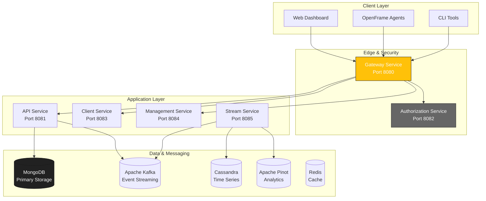

# OpenFrame Documentation

Welcome to the complete documentation for **OpenFrame**, the AI-powered, multi-tenant MSP platform that replaces expensive proprietary tools with intelligent automation.

## 📚 Table of Contents

### Getting Started
Start here if you're new to OpenFrame:

| Guide | Description |
|-------|-------------|
| **[Introduction](./getting-started/introduction.md)** | What is OpenFrame and why use it? |
| **[Prerequisites](./getting-started/prerequisites.md)** | System requirements and dependencies |
| **[Quick Start](./getting-started/quick-start.md)** | Get running in 5 minutes |
| **[First Steps](./getting-started/first-steps.md)** | Explore core features and initial setup |

### Development
For contributors, developers, and system administrators:

| Guide | Description |
|-------|-------------|
| **[Development Overview](./development/README.md)** | Development section index and overview |
| **[Environment Setup](./development/setup/environment.md)** | Set up your development environment |
| **[Local Development](./development/setup/local-development.md)** | Run OpenFrame locally |
| **[Architecture Overview](./development/architecture/overview.md)** | System design and components |
| **[Microservices](./development/architecture/microservices.md)** | Service breakdown and interactions |
| **[Data Flow](./development/architecture/data-flow.md)** | How data moves through the system |
| **[Security Architecture](./development/architecture/security.md)** | Security model and implementation |
| **[Testing Overview](./development/testing/overview.md)** | Testing strategies and guidelines |
| **[Rust Development](./development/client-agent/rust-development.md)** | OpenFrame agent development |
| **[Contributing Guidelines](./development/contributing/guidelines.md)** | How to contribute to the project |
| **[Code Style](./development/contributing/code-style.md)** | Coding standards and conventions |
| **[Development Scripts](./development/tools/scripts.md)** | Useful development utilities |

### Reference Documentation
Technical architecture and service specifications:

| Section | Description |
|---------|-------------|
| **[Architecture Overview](./reference/architecture/overview.md)** | High-level system architecture |
| **[Gateway Service](./reference/architecture/gateway_service_app.md)** | API gateway and routing |
| **[Authorization Service](./reference/architecture/authz_service_core_auth_flow_and_processors.md)** | OAuth2/OIDC authentication |
| **[API Service](./reference/architecture/api_service_core_graphql_fetchers_loaders.md)** | GraphQL and REST APIs |
| **[Management Service](./reference/architecture/management_service_core.md)** | Platform control plane |
| **[Stream Service](./reference/architecture/stream_service_core_kafka_processing.md)** | Event processing and analytics |
| **[Security Configuration](./reference/architecture/Security%20Configuration.md)** | Security setup and policies |
| **[Shared Libraries](./reference/architecture/shared_kafka_library.md)** | Common components and utilities |

## 🏗️ Architecture at a Glance

OpenFrame uses a **gateway-first microservices architecture** with strong security boundaries:


```mermaid
flowchart TB
    subgraph "Client Layer"
        Web[Web Dashboard]
        Agent[OpenFrame Agents]
        CLI[CLI Tools]
    end
    
    subgraph "Edge & Security"
        Gateway[Gateway Service<br/>Port 8080]
        Auth[Authorization Service<br/>Port 8082]
    end
    
    subgraph "Application Layer"
        API[API Service<br/>Port 8081]
        Client[Client Service<br/>Port 8083]
        Management[Management Service<br/>Port 8084]
        Stream[Stream Service<br/>Port 8085]
    end
    
    subgraph "Data & Messaging"
        MongoDB[(MongoDB<br/>Primary Storage)]
        Kafka[(Apache Kafka<br/>Event Streaming)]
        Cassandra[(Cassandra<br/>Time Series)]
        Pinot[(Apache Pinot<br/>Analytics)]
        Redis[(Redis<br/>Cache)]
    end
    
    Web --> Gateway
    Agent --> Gateway
    CLI --> Gateway
    
    Gateway --> Auth
    Gateway --> API
    Gateway --> Client
    Gateway --> Management
    
    API --> MongoDB
    API --> Kafka
    Stream --> Kafka
    Stream --> Cassandra
    Stream --> Pinot
    
    style Gateway fill:#FFC109,stroke:#1A1A1A,color:#FAFAFA
    style Auth fill:#666666,stroke:#1A1A1A,color:#FAFAFA
    style MongoDB fill:#212121,stroke:#1A1A1A,color:#FAFAFA
```

## 🚀 Quick Navigation

### For New Users
1. **[Start with the Introduction](./getting-started/introduction.md)** to understand OpenFrame's purpose
2. **[Check Prerequisites](./getting-started/prerequisites.md)** to ensure your system is ready
3. **[Follow the Quick Start](./getting-started/quick-start.md)** to get running immediately
4. **[Explore First Steps](./getting-started/first-steps.md)** to learn core features

### For Developers
1. **[Review Architecture Overview](./development/architecture/overview.md)** for system design
2. **[Set up Development Environment](./development/setup/environment.md)** for coding
3. **[Read Contributing Guidelines](./development/contributing/guidelines.md)** for collaboration
4. **[Check Testing Overview](./development/testing/overview.md)** for quality assurance

### For System Administrators
1. **[Understand Security Architecture](./development/architecture/security.md)** for deployment planning
2. **[Review Local Development Setup](./development/setup/local-development.md)** for testing
3. **[Explore Management Service](./reference/architecture/management_service_core.md)** for operations
4. **[Study Data Flow](./development/architecture/data-flow.md)** for troubleshooting

## 🛠️ CLI Tools

The OpenFrame CLI is maintained in a separate repository for easier distribution:

- **Repository**: [flamingo-stack/openframe-cli](https://github.com/flamingo-stack/openframe-cli)
- **Installation Guide**: [CLI Installation](https://github.com/flamingo-stack/openframe-cli#installation)
- **Documentation**: [CLI Documentation](https://github.com/flamingo-stack/openframe-cli/tree/main/docs)

**Important**: The CLI tools are **NOT** located in this repository. Always refer to the external repository for installation, usage, and documentation.

### Quick CLI Usage

```bash
# Install OpenFrame CLI (see external repository for instructions)
# https://github.com/flamingo-stack/openframe-cli#installation

# Bootstrap complete OpenFrame environment
openframe bootstrap --non-interactive --verbose

# Check status
openframe status

# View logs
openframe logs --service=all
```

## 🔧 Development Quick Reference

### Core Technologies

| Component | Technology Stack |
|-----------|------------------|
| **Backend** | Spring Boot 3.3, Java 21, Spring Security |
| **Frontend** | Next.js 15, React 19, TypeScript 5.8 |
| **Client Agent** | Rust 1.70+, Tokio async runtime |
| **API Layer** | GraphQL (Netflix DGS), REST endpoints |
| **Messaging** | Apache Kafka 3.6, NATS |
| **Databases** | MongoDB, Cassandra, Apache Pinot |
| **Caching** | Redis 7.0+ |
| **Monitoring** | Prometheus, Grafana, Loki |

### Service Ports

| Service | Port | Purpose |
|---------|------|---------|
| **Gateway** | 8080 | Single entry point, authentication, routing |
| **API Service** | 8081 | GraphQL/REST APIs, business logic |
| **Authorization** | 8082 | OAuth2/OIDC, multi-tenant auth |
| **Client Service** | 8083 | Agent management, device registration |
| **Management** | 8084 | Platform control plane, orchestration |
| **Stream Service** | 8085 | Event processing, analytics |

### Essential Commands

```bash
# Build all services
mvn clean install

# Run backend services
docker-compose up -d  # Infrastructure
mvn spring-boot:run   # Individual services

# Frontend development
cd openframe/services/openframe-frontend
npm install && npm run dev

# Agent development
cd client
cargo build --release && cargo test

# Run tests
mvn test              # Java tests
npm run test         # Frontend tests
cargo test           # Rust tests
```

## 📖 Additional Resources

### External Links

| Resource | Description |
|----------|-------------|
| **[Project README](../README.md)** | Main project overview and quick start |
| **[Contributing Guide](../CONTRIBUTING.md)** | How to contribute to OpenFrame |
| **[License](../LICENSE.md)** | Flamingo AI Unified License v1.0 |
| **[OpenFrame Website](https://www.flamingo.run/openframe)** | Product website and marketing |
| **[Flamingo Knowledge Base](https://www.flamingo.run/knowledge-base)** | User documentation and guides |
| **[OpenMSP Community](https://www.openmsp.ai/)** | MSP community and discussions |

### Community Support

| Channel | Purpose | Link |
|---------|---------|------|
| **Slack Community** | Questions, discussions, support | [Join OpenMSP Slack](https://join.slack.com/t/openmsp/shared_invite/zt-36bl7mx0h-3~U2nFH6nqHqoTPXMaHEHA) |
| **GitHub Issues** | Bug reports, feature requests | [OpenFrame Issues](https://github.com/flamingo-stack/openframe-oss-tenant/issues) |
| **GitHub Discussions** | Community discussions | Managed via OpenMSP Slack |
| **Documentation** | Technical documentation | This repository |

## 🎯 What's Next?

Based on your role and interests:

**👨‍💻 New Developer:**
→ [Introduction](./getting-started/introduction.md) → [Prerequisites](./getting-started/prerequisites.md) → [Environment Setup](./development/setup/environment.md)

**🏗️ Architect/Lead:**
→ [Architecture Overview](./development/architecture/overview.md) → [Security Architecture](./development/architecture/security.md) → [Reference Docs](./reference/architecture/overview.md)

**🧪 QA/Tester:**
→ [Quick Start](./getting-started/quick-start.md) → [Testing Overview](./development/testing/overview.md) → [Local Development](./development/setup/local-development.md)

**🛠️ DevOps/SysAdmin:**
→ [Architecture Overview](./development/architecture/overview.md) → [Management Service](./reference/architecture/management_service_core.md) → [CLI Tools](https://github.com/flamingo-stack/openframe-cli)

**🤝 Contributor:**
→ [Contributing Guidelines](./development/contributing/guidelines.md) → [Code Style](./development/contributing/code-style.md) → [Development Overview](./development/README.md)

## 📝 Documentation Updates

This documentation is continuously updated. Key areas of active development:

- **Getting Started Guides**: Regular updates for new features
- **Architecture Documentation**: Detailed service specifications  
- **Development Guides**: Best practices and tooling improvements
- **Reference Documentation**: API specifications and configurations

---

*Documentation generated by [OpenFrame Doc Orchestrator](https://github.com/flamingo-stack/openframe-oss-tenant)*

**Need help?** Join our [OpenMSP Slack community](https://join.slack.com/t/openmsp/shared_invite/zt-36bl7mx0h-3~U2nFH6nqHqoTPXMaHEHA) or check the [project README](../README.md) for support options.