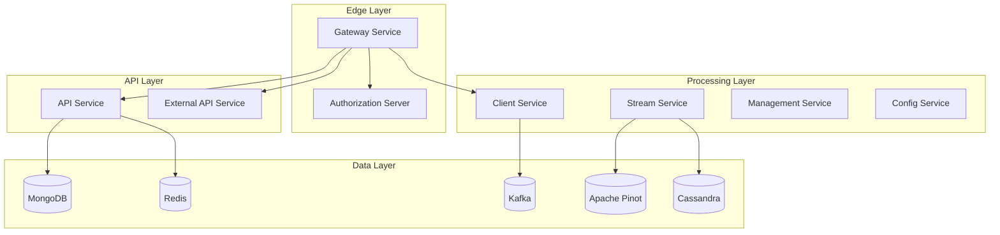

# OpenFrame OSS Tenant Documentation

Welcome to the comprehensive documentation for **OpenFrame OSS Tenant** — the open-source, multi-tenant foundation of the OpenFrame platform.

## 📚 Table of Contents

### Getting Started
Getting Started documentation is being generated. Check back soon for setup guides, quick start tutorials, and initial configuration instructions.

### Development
Development documentation is being generated. Check back soon for development workflows, contribution guidelines, and local environment setup.

### Reference Documentation

Comprehensive technical reference documentation covering the complete OpenFrame architecture:

#### **Service Entrypoints**
Core microservice bootstrap modules:
- [API Service Entrypoint](./architecture/api_service_entrypoint/api_service_entrypoint.md) - Main API microservice bootstrap
- [Authorization Server Entrypoint](./architecture/authorization_server_entrypoint/authorization_server_entrypoint.md) - OAuth2/OIDC identity provider
- [Gateway Service Entrypoint](./architecture/gateway_service_entrypoint/gateway_service_entrypoint.md) - Edge gateway and routing
- [Client Service Entrypoint](./architecture/client_service_entrypoint/client_service_entrypoint.md) - Agent lifecycle management
- [Stream Service Entrypoint](./architecture/stream_service_entrypoint/stream_service_entrypoint.md) - Event processing pipeline
- [Management Service Entrypoint](./architecture/management_service_entrypoint/management_service_entrypoint.md) - Tool and config management
- [External API Service Entrypoint](./architecture/external_api_service_entrypoint/external_api_service_entrypoint.md) - External tool integration
- [Config Service Entrypoint](./architecture/config_service_entrypoint/config_service_entrypoint.md) - Configuration management

#### **Service Core Libraries**
Business logic and domain services:
- [Authorization Server Core](./architecture/authorization_server_core/authorization_server_core.md) - OAuth2/OIDC core implementation
- [Gateway Service Core](./architecture/gateway_service_core/gateway_service_core.md) - Gateway routing and security logic
- [Client Service Core](./architecture/client_service_core/client_service_core.md) - Agent registration and lifecycle
- [Stream Processing Core](./architecture/stream_processing_core/stream_processing_core.md) - Event processing engine
- [Management Service Core](./architecture/management_service_core/management_service_core.md) - Tool and version management
- [External API Service Core](./architecture/external_api_service_core/external_api_service_core.md) - External API integration
- [Config Service Core](./architecture/config_service_core/config_service_core.md) - Configuration service logic

#### **API Layer**
REST and GraphQL API implementations:
- [API Service REST Controllers](./architecture/api_service_rest_controllers/api_service_rest_controllers.md) - REST endpoint implementations
- [API Service GraphQL Layer](./architecture/api_service_graphql_layer/api_service_graphql_layer.md) - GraphQL schema and resolvers
- [API Service Domain Services and Processors](./architecture/api_service_domain_services_and_processors/api_service_domain_services_and_processors.md) - Business logic layer
- [API Service Config and Security](./architecture/api_service_config_and_security/api_service_config_and_security.md) - API security configuration
- [API Service DTOs](./architecture/api_service_dtos/api_service_dtos.md) - Data transfer objects
- [API Contracts and Mapping](./architecture/api_contracts_and_mapping/api_contracts_and_mapping.md) - API contract definitions

#### **GraphQL Components**
Advanced GraphQL implementation details:
- [Data Fetchers](./architecture/api_service_graphql_layer/data_fetchers.md) - GraphQL data fetchers
- [Data Loaders](./architecture/api_service_graphql_layer/api_service_graphql_layer/data_loaders/data_loaders.md) - Efficient data loading patterns

#### **Data & Infrastructure**
Storage, caching, and messaging layers:
- [Data Persistence Mongo](./architecture/data_persistence_mongo/data_persistence_mongo.md) - MongoDB integration and repositories
- [Data Cache Redis](./architecture/data_cache_redis/data_cache_redis.md) - Redis caching layer
- [Data Transport Kafka](./architecture/data_transport_kafka/data_transport_kafka.md) - Kafka messaging integration
- [Data Platform and Pinot Cassandra](./architecture/data_platform_and_pinot_cassandra/data_platform_and_pinot_cassandra.md) - Analytics and event storage

#### **Shared Libraries**
Cross-cutting concerns and utilities:
- [Shared Security and OAuth BFF](./architecture/shared_security_and_oauth_bff/shared_security_and_oauth_bff.md) - Security and OAuth backend-for-frontend
- [Shared Core Utilities](./architecture/shared_core_utilities/shared_core_utilities.md) - Common utilities and helpers
- [Notification Mail](./architecture/notification_mail/notification_mail.md) - Email notification service

#### **Frontend**
Desktop chat application:
- [Frontend Chat Client](./architecture/frontend_chat_client/frontend_chat_client.md) - React + Tauri desktop application

### Architecture Diagrams

Visual documentation with Mermaid diagrams covering system architecture, data flows, and component interactions:

📊 **Explore Visual Architecture**: [Architecture Diagrams](./architecture/diagrams/)

The diagrams directory contains comprehensive visual documentation for all services and components, including:
- Service interaction flows
- Data processing pipelines  
- Authentication workflows
- Component relationships
- System architecture overviews

### CLI Tools

The OpenFrame CLI tools are maintained in a separate repository:
- **Repository**: [flamingo-stack/openframe-cli](https://github.com/flamingo-stack/openframe-cli)
- **Installation**: [Installation Guide](https://github.com/flamingo-stack/openframe-cli#installation)
- **Documentation**: [CLI Documentation](https://github.com/flamingo-stack/openframe-cli/tree/main/docs)

**Note**: CLI tools are NOT located in this repository. Always refer to the external repository for installation and usage.

## 🏗️ Architecture Overview

OpenFrame OSS Tenant implements a **microservices architecture** with clear separation of concerns:

```mermaid
flowchart TD
    subgraph "Edge Layer"
        Gateway[Gateway Service]
        Auth[Authorization Server]
    end
    
    subgraph "API Layer" 
        API[API Service]
        ExtAPI[External API Service]
    end
    
    subgraph "Processing Layer"
        Client[Client Service]
        Stream[Stream Service] 
        Management[Management Service]
        Config[Config Service]
    end
    
    subgraph "Data Layer"
        Mongo[(MongoDB)]
        Redis[(Redis)]
        Kafka[(Kafka)]
        Pinot[(Apache Pinot)]
        Cassandra[(Cassandra)]
    end
    
    Gateway --> API
    Gateway --> ExtAPI
    Gateway --> Client
    Gateway --> Auth
    
    API --> Mongo
    API --> Redis
    Client --> Kafka
    Stream --> Pinot
    Stream --> Cassandra
```

## 🔍 Key Architectural Patterns

- **Multi-Tenant Architecture** - Tenant isolation at data and security layers
- **Event-Driven Design** - Kafka + NATS for reliable event propagation  
- **CQRS with Analytics** - Operational data in MongoDB, analytics in Pinot
- **Reactive Edge** - Spring WebFlux gateway for high performance
- **Clean Architecture** - Layered design with clear boundaries
- **OAuth2 First** - Comprehensive identity and authorization management

## 📖 Quick Links

- [Project README](../README.md) - Main project overview and setup
- [Contributing Guidelines](../CONTRIBUTING.md) - How to contribute to the project
- [License Information](../LICENSE.md) - License terms and conditions
- [OpenMSP Community](https://www.openmsp.ai/) - Community hub and resources

## 🤝 Community & Support

- **OpenMSP Slack**: [Join the community](https://join.slack.com/t/openmsp/shared_invite/zt-36bl7mx0h-3~U2nFH6nqHqoTPXMaHEHA)
- **Community Hub**: [openmsp.ai](https://www.openmsp.ai/)
- **Commercial Support**: [flamingo.run](https://flamingo.run)

---
*Documentation generated by [OpenFrame Doc Orchestrator](https://github.com/flamingo-stack/openframe-oss-tenant)*