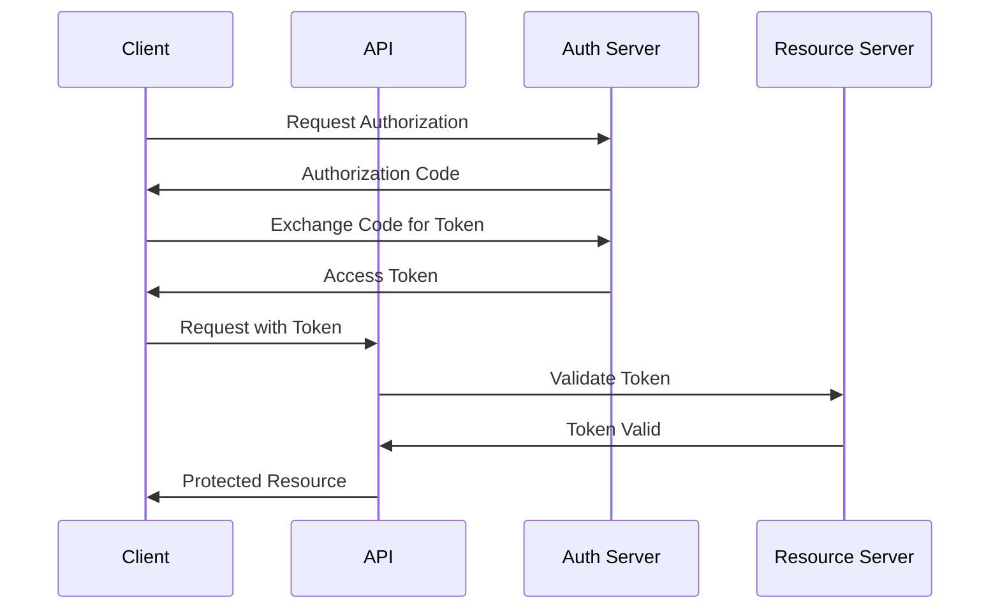
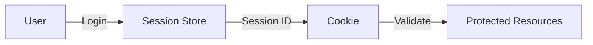
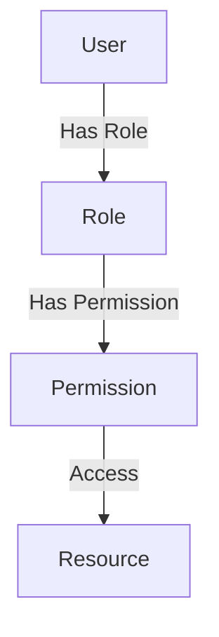

# API Authentication

This document details the authentication mechanisms supported by the OpenFrame API.

## Authentication Methods

### 1. OAuth 2.0



#### Supported OAuth Flows
- Authorization Code Flow
- Client Credentials Flow
- Refresh Token Flow
- Implicit Flow (deprecated)

### 2. API Keys

API keys are used for service-to-service authentication:

```yaml
# Example API Key Configuration
api_key:
  prefix: "of_"
  length: 32
  expiration: 365d
  scopes:
    - read
    - write
    - admin
```

#### Key Management
- Key rotation
- Scope-based access
- Expiration handling
- Usage tracking

### 3. JWT Tokens

JWT tokens are used for user authentication:

```json
{
  "header": {
    "alg": "RS256",
    "typ": "JWT"
  },
  "payload": {
    "sub": "user_id",
    "name": "User Name",
    "roles": ["admin", "user"],
    "iat": 1516239022,
    "exp": 1516242622
  },
  "signature": "..."
}
```

#### Token Features
- Role-based access
- Time-based expiration
- Refresh token support
- Token revocation

### 4. Session-based Authentication

Used for web applications:



#### Session Management
- Secure session storage
- Session timeout
- Concurrent sessions
- Session invalidation

## Authorization

### Role-Based Access Control (RBAC)



#### Role Hierarchy
- Super Admin
- Admin
- Manager
- User
- Guest

### Resource-Based Authorization

```yaml
# Example Resource Policy
resource:
  type: "device"
  actions:
    - read
    - write
    - delete
  conditions:
    - owner: "${user.id}"
    - status: "active"
```

## Security Best Practices

### 1. Token Security
- Secure storage
- HTTPS only
- Short expiration
- Regular rotation

### 2. Password Security
- Strong password policy
- Brute force protection
- Password hashing
- MFA support

### 3. Session Security
- Secure cookies
- CSRF protection
- XSS prevention
- Session fixation protection

## Implementation Examples

### OAuth 2.0 Implementation

```python
# Example OAuth 2.0 Client
from oauthlib.oauth2 import WebApplicationClient

client = WebApplicationClient(client_id)
authorization_url = client.prepare_request_uri(
    authorization_endpoint,
    redirect_uri=redirect_uri,
    scope=['read', 'write']
)
```

### JWT Implementation

```python
# Example JWT Generation
import jwt

token = jwt.encode(
    payload,
    private_key,
    algorithm='RS256'
)
```

## Error Handling

### Authentication Errors

```json
{
  "error": "unauthorized",
  "error_description": "Invalid or expired token",
  "error_code": "AUTH_001"
}
```

### Authorization Errors

```json
{
  "error": "forbidden",
  "error_description": "Insufficient permissions",
  "error_code": "AUTH_002"
}
```

## Next Steps

- [Endpoints](endpoints.md) - API endpoint reference
- [WebSocket](websocket.md) - WebSocket authentication
- [Integration](integration.md) - Integration patterns 