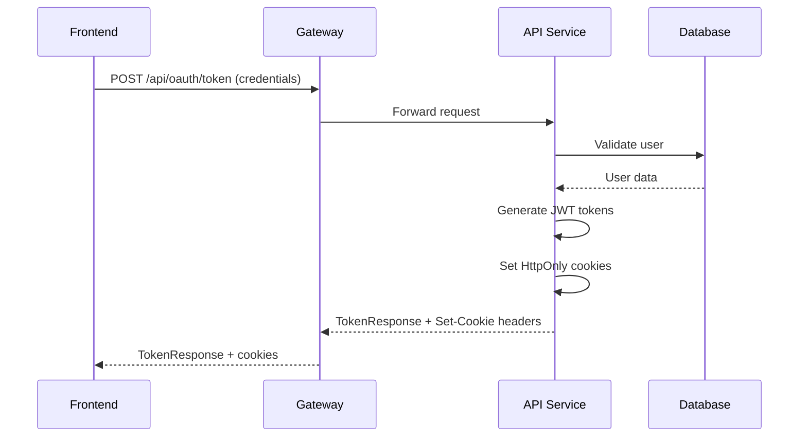
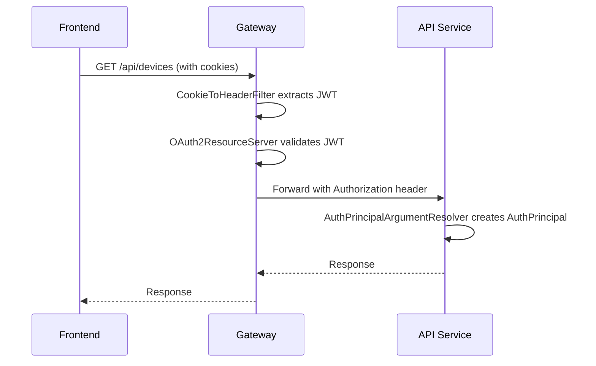
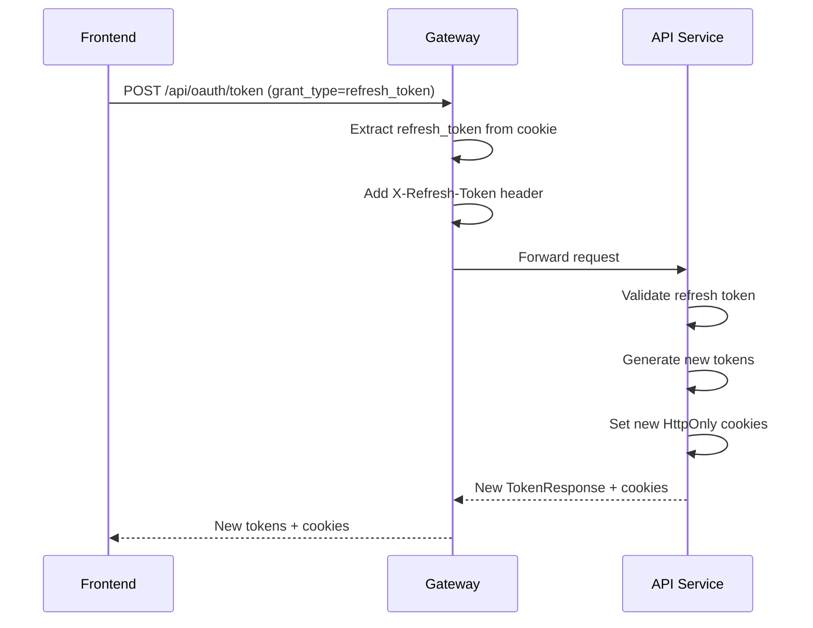

# Authentication Architecture

This document describes the current authentication architecture in OpenFrame, including JWT token management, cookie
handling, and security patterns.

## Overview

OpenFrame uses a secure, cookie-based JWT authentication system with Spring Security OAuth2 Resource Server. The
architecture provides:

- **HttpOnly Cookies**: Secure token storage protected from XSS attacks
- **JWT Tokens**: Stateless authentication with user claims
- **OAuth2 Resource Server**: Standard Spring Security JWT validation
- **AuthPrincipal Wrapper**: Clean abstraction over raw JWT tokens
- **Gateway Security**: Centralized authentication and authorization

## Architecture Components

### 1. Gateway Security Layer

The OpenFrame Gateway (`openframe-gateway`) serves as the security entry point:

```
┌─────────────────┐    ┌─────────────────┐    ┌─────────────────┐
│   Browser       │    │    Gateway      │    │   API Service   │
│                 │    │                 │    │                 │
│ HttpOnly Cookie │───▶│ Security Filter │───▶│ AuthPrincipal   │
│                 │    │                 │    │                 │
└─────────────────┘    └─────────────────┘    └─────────────────┘
```

**Key Components:**

- `CookieToHeaderFilter`: Extracts JWT from cookies and adds Authorization header
- `OAuth2ResourceServer`: Validates JWT tokens using standard Spring Security
- `JwtDecoder`: Decodes and validates JWT signatures

### 2. JWT Token Structure

OpenFrame uses two types of JWT tokens:

#### Access Token

```json
{
  "sub": "user123",
  "email": "user@example.com",
  "given_name": "John",
  "family_name": "Doe",
  "roles": [
    "USER",
    "ADMIN"
  ],
  "grant_type": "password",
  "iat": 1640995200,
  "exp": 1640998800
}
```

#### Refresh Token

```json
{
  "sub": "user123",
  "refresh_count": 2,
  "grant_type": "password",
  "iat": 1640995200,
  "exp": 1643587200
}
```

### 3. Cookie Management

Tokens are stored as HttpOnly cookies for maximum security:

#### Access Token Cookie

- **Name**: `access_token`
- **HttpOnly**: `true` (prevents XSS)
- **Secure**: `true` (HTTPS only in production)
- **SameSite**: `Lax` (CSRF protection)
- **Path**: `/` (available to all endpoints)
- **Expiration**: 15 minutes

#### Refresh Token Cookie

- **Name**: `refresh_token`
- **HttpOnly**: `true`
- **Secure**: `true`
- **SameSite**: `Lax`
- **Path**: `/api/oauth/token` (restricted to refresh endpoint only)
- **Expiration**: 30 days

## Authentication Flow

### 1. Login Flow



### 2. API Request Flow



### 3. Token Refresh Flow



## Security Components

### 1. Gateway Security Configuration

```java

@Configuration
@EnableWebFluxSecurity
public class GatewaySecurityConfig {

    @Bean
    public SecurityWebFilterChain securityWebFilterChain(ServerHttpSecurity http) {
        return http
                .oauth2ResourceServer(oauth2 -> oauth2
                        .jwt(jwtSpec -> jwtSpec
                                .jwtDecoder(jwtDecoder())
                                .jwtAuthenticationConverter(jwtAuthenticationConverter())
                        )
                )
                .addFilterBefore(cookieToHeaderFilter, SecurityWebFiltersOrder.AUTHENTICATION)
                .authorizeExchange(exchanges -> exchanges
                        .pathMatchers("/api/oauth/**").permitAll()
                        .pathMatchers("/api/health").permitAll()
                        .anyExchange().authenticated()
                )
                .build();
    }
}
```

### 2. Cookie to Header Adapter

The `CookieToHeaderFilter` bridges cookie-based tokens with standard Authorization headers:

```java

@Component
public class CookieToHeaderFilter implements WebFilter {

    @Override
    public Mono<Void> filter(ServerWebExchange exchange, WebFilterChain chain) {
        // Extract access_token from cookies
        String accessToken = cookieService.getAccessTokenFromCookies(exchange);

        if (accessToken != null) {
            // Add Authorization: Bearer header
            ServerHttpRequest modifiedRequest = exchange.getRequest()
                    .mutate()
                    .header(HttpHeaders.AUTHORIZATION, "Bearer " + accessToken)
                    .build();

            return chain.filter(exchange.mutate().request(modifiedRequest).build());
        }

        return chain.filter(exchange);
    }
}
```

### 3. AuthPrincipal Wrapper

Controllers use clean `AuthPrincipal` objects instead of raw JWT:

```java

@Data
@Builder
public class AuthPrincipal {
    private final String id;           // from 'sub' claim
    private final String email;        // from 'email' claim  
    private final String firstName;    // from 'given_name' claim
    private final String lastName;     // from 'family_name' claim
    private final List<String> roles;  // from 'roles' claim
    private final List<String> scopes; // from 'scope' claim

    // Utility methods
    public String getDisplayName() { /* ... */ }

    public boolean hasRole(String role) { /* ... */ }

    public boolean hasScope(String scope) { /* ... */ }
}
```

### 4. Controller Usage

```java

@RestController
@RequestMapping("/api-keys")
public class ApiKeyController {

    @GetMapping
    public List<ApiKeyResponse> getApiKeys(@AuthenticationPrincipal AuthPrincipal principal) {
        return apiKeyService.getApiKeysForUser(principal.getId());
    }

    @PostMapping
    public CreateApiKeyResponse createApiKey(
            @Valid @RequestBody CreateApiKeyRequest request,
            @AuthenticationPrincipal AuthPrincipal principal) {
        return apiKeyService.createApiKey(principal.getId(), request);
    }
}
```

## OAuth2 Grant Types

### 1. Password Grant

For direct username/password authentication:

```
POST /api/oauth/token
grant_type=password&username=user@example.com&password=secret
```

### 2. Authorization Code Grant

For third-party integrations:

```
POST /api/oauth/token
grant_type=authorization_code&code=abc123&client_id=app
```

### 3. Refresh Token Grant

For token renewal:

```
POST /api/oauth/token
grant_type=refresh_token
```

*(refresh token automatically extracted from cookies)*

### 4. Social OAuth (Google, Microsoft, etc.)

Handled by `SocialAuthController` with provider-specific strategies.

## Token Security Features

### 1. Automatic Expiration

- **Access tokens**: 15 minutes (short-lived)
- **Refresh tokens**: 30 days (long-lived)
- **Automatic cleanup**: Expired tokens are rejected

### 2. Refresh Token Limits

- **Max refresh count**: Configurable limit to prevent infinite refresh
- **Incremental counting**: Each refresh increments the count
- **Forced re-authentication**: After max refreshes reached

### 3. Secure Cookie Attributes

- **HttpOnly**: Prevents JavaScript access (XSS protection)
- **Secure**: HTTPS-only transmission
- **SameSite**: CSRF protection
- **Path restrictions**: Refresh token limited to specific endpoints

### 4. JWT Signature Validation

- **RS256 algorithm**: Asymmetric encryption
- **Public key validation**: Gateway validates signatures
- **Key rotation**: Support for key rotation

## Error Handling

### Authentication Errors

- **401 Unauthorized**: Invalid or expired tokens
- **403 Forbidden**: Valid token but insufficient permissions
- **400 Bad Request**: Malformed requests

### Token Refresh Errors

- **Expired refresh token**: User must log in again
- **Max refresh count**: User must log in again
- **Invalid client**: Client authentication failed

## Configuration

### JWT Configuration

```yaml
# application.yml
security:
  oauth2:
    token:
      access:
        expiration-seconds: 900  # 15 minutes
      refresh:
        expiration-seconds: 2592000  # 30 days
        max-refresh-count: 10

openframe:
  security:
    cookie:
      secure: true  # Set to false for local HTTP development
```

### JWT Keys

- **Private key**: Used by API service to sign tokens
- **Public key**: Used by Gateway to validate tokens
- **Key rotation**: Keys can be rotated without downtime

## Development vs Production

### Development Environment

- `secure: false` - Allows HTTP cookies for local development
- Relaxed CORS settings
- Detailed debug logging

### Production Environment

- `secure: true` - HTTPS-only cookies
- Strict CORS policies
- Minimal logging for security

## API Integration Patterns

### 1. Frontend Applications

Use automatic cookie-based authentication:

```javascript
// Cookies are automatically sent
fetch('/api/devices')
  .then(response => response.json())
```

### 2. External API Clients

Use API keys for external access:

```bash
curl -H "X-API-Key: ak_abc123.sk_def456" \
     https://api.openframe.com/external-api/devices
```

### 3. Server-to-Server

Use client credentials grant:

```bash
curl -X POST https://api.openframe.com/api/oauth/token \
     -d "grant_type=client_credentials&client_id=server&client_secret=secret"
```

## Monitoring and Audit

### Security Events

- Login attempts (success/failure)
- Token refresh operations
- Permission denied events
- Suspicious activity detection

### Metrics

- Authentication success/failure rates
- Token expiration patterns
- API endpoint usage
- Security violation counts

## Best Practices

### For Developers

1. **Always use `@AuthenticationPrincipal AuthPrincipal`** in controllers
2. **Never handle raw JWT tokens** in business logic
3. **Use `principal.hasRole()`** for authorization checks
4. **Test authentication flows** thoroughly
5. **Handle authentication errors** gracefully

### For Deployment

1. **Use HTTPS in production** for secure cookies
2. **Rotate JWT keys regularly**
3. **Monitor authentication metrics**
4. **Configure proper CORS settings**
5. **Set appropriate token expiration times**

### For Security

1. **HttpOnly cookies only** - never store tokens in localStorage
2. **Validate all requests** - don't trust client-side checks
3. **Use RBAC** - implement role-based access control
4. **Audit security events** - log and monitor
5. **Plan for key rotation** - have procedures in place 