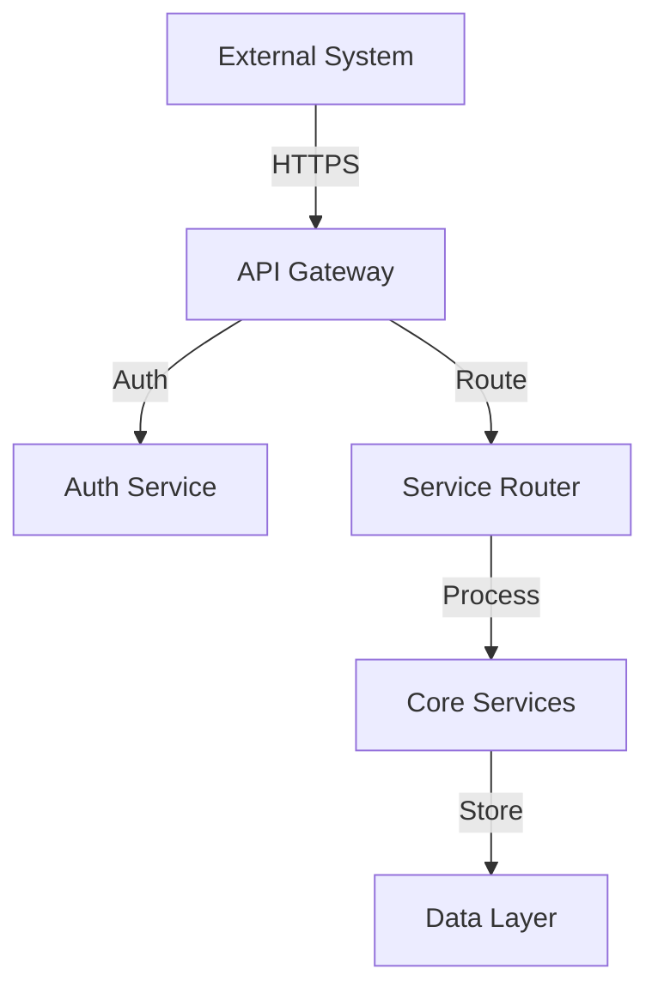
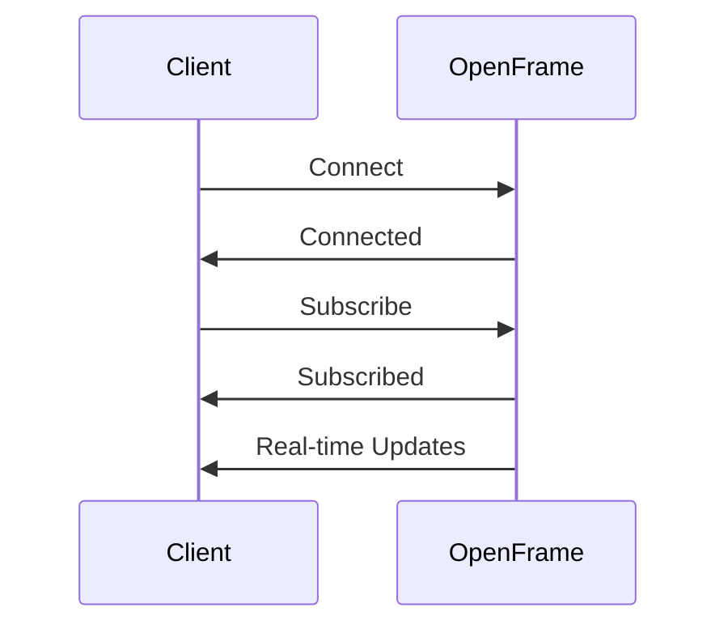
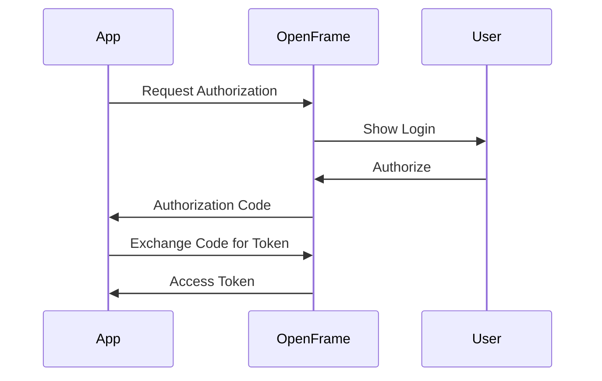

# API Integration

This document provides guidance on integrating OpenFrame with various systems and tools.

## Integration Patterns

### 1. REST API Integration



#### Example: Python Integration

```python
import requests
import json

class OpenFrameClient:
    def __init__(self, api_key, base_url="https://api.openframe.io/v1"):
        self.api_key = api_key
        self.base_url = base_url
        self.headers = {
            "Authorization": f"Bearer {api_key}",
            "Content-Type": "application/json"
        }

    def get_devices(self, page=1, per_page=10):
        response = requests.get(
            f"{self.base_url}/devices",
            headers=self.headers,
            params={"page": page, "per_page": per_page}
        )
        return response.json()

    def create_alert(self, title, severity, device_id):
        data = {
            "title": title,
            "severity": severity,
            "device_id": device_id
        }
        response = requests.post(
            f"{self.base_url}/alerts",
            headers=self.headers,
            json=data
        )
        return response.json()

# Usage example
client = OpenFrameClient("your_api_key")
devices = client.get_devices()
```

### 2. WebSocket Integration



#### Example: Node.js Integration

```javascript
const WebSocket = require('ws');
const EventEmitter = require('events');

class OpenFrameWebSocket extends EventEmitter {
    constructor(token, url = 'wss://api.openframe.io/v1/ws') {
        super();
        this.token = token;
        this.url = url;
        this.ws = null;
        this.reconnectAttempts = 0;
        this.maxReconnectAttempts = 5;
    }

    connect() {
        this.ws = new WebSocket(this.url, {
            headers: {
                'Authorization': `Bearer ${this.token}`
            }
        });

        this.ws.on('open', () => {
            this.reconnectAttempts = 0;
            this.emit('connected');
        });

        this.ws.on('message', (data) => {
            const message = JSON.parse(data);
            this.emit('message', message);
        });

        this.ws.on('close', () => {
            this.handleReconnect();
        });
    }

    handleReconnect() {
        if (this.reconnectAttempts < this.maxReconnectAttempts) {
            this.reconnectAttempts++;
            setTimeout(() => this.connect(), 1000 * this.reconnectAttempts);
        }
    }

    subscribe(topics) {
        this.ws.send(JSON.stringify({
            type: 'subscribe',
            topics: topics
        }));
    }
}

// Usage example
const client = new OpenFrameWebSocket('your_token');
client.on('connected', () => {
    client.subscribe(['devices', 'alerts']);
});
client.on('message', (message) => {
    console.log('Received:', message);
});
client.connect();
```

### 3. OAuth Integration



#### Example: OAuth Flow Implementation

```python
from oauthlib.oauth2 import WebApplicationClient
from requests_oauthlib import OAuth2Session

class OpenFrameOAuth:
    def __init__(self, client_id, client_secret, redirect_uri):
        self.client_id = client_id
        self.client_secret = client_secret
        self.redirect_uri = redirect_uri
        self.authorization_base_url = 'https://api.openframe.io/v1/oauth/authorize'
        self.token_url = 'https://api.openframe.io/v1/oauth/token'
        self.scope = ['read', 'write']

    def get_authorization_url(self):
        oauth = OAuth2Session(
            self.client_id,
            redirect_uri=self.redirect_uri,
            scope=self.scope
        )
        authorization_url, state = oauth.authorization_url(
            self.authorization_base_url
        )
        return authorization_url, state

    def get_token(self, authorization_response):
        oauth = OAuth2Session(
            self.client_id,
            redirect_uri=self.redirect_uri,
            scope=self.scope
        )
        token = oauth.fetch_token(
            self.token_url,
            authorization_response=authorization_response,
            client_id=self.client_id,
            client_secret=self.client_secret
        )
        return token

# Usage example
oauth = OpenFrameOAuth(
    client_id='your_client_id',
    client_secret='your_client_secret',
    redirect_uri='https://your-app.com/callback'
)
auth_url, state = oauth.get_authorization_url()
```

## Integration Examples

### 1. SIEM Integration

```python
class OpenFrameSIEM:
    def __init__(self, api_key):
        self.client = OpenFrameClient(api_key)
        self.ws = OpenFrameWebSocket(api_key)

    def start_monitoring(self):
        self.ws.subscribe(['alerts', 'security_events'])
        self.ws.on('message', self.handle_event)

    def handle_event(self, event):
        if event['type'] == 'security_event':
            # Process security event
            self.process_security_event(event['data'])
        elif event['type'] == 'alert':
            # Process alert
            self.process_alert(event['data'])

    def process_security_event(self, event):
        # Forward to SIEM
        self.forward_to_siem(event)

    def process_alert(self, alert):
        # Create SIEM alert
        self.create_siem_alert(alert)
```

### 2. ITSM Integration

```python
class OpenFrameITSM:
    def __init__(self, api_key, itsm_config):
        self.client = OpenFrameClient(api_key)
        self.itsm_config = itsm_config

    def sync_alerts(self):
        alerts = self.client.get_alerts(status='open')
        for alert in alerts['data']:
            self.create_itsm_ticket(alert)

    def create_itsm_ticket(self, alert):
        ticket_data = {
            'title': alert['title'],
            'description': alert['description'],
            'priority': self.map_severity(alert['severity']),
            'category': 'security'
        }
        # Create ticket in ITSM system
        self.create_ticket(ticket_data)

    def map_severity(self, severity):
        severity_map = {
            'critical': 'P1',
            'high': 'P2',
            'medium': 'P3',
            'low': 'P4'
        }
        return severity_map.get(severity, 'P3')
```

## Best Practices

### 1. Error Handling
- Implement retry logic
- Handle rate limits
- Log errors appropriately
- Monitor integration health

### 2. Security
- Secure credential storage
- Implement proper authentication
- Use HTTPS/SSL
- Follow least privilege principle

### 3. Performance
- Implement caching
- Use connection pooling
- Handle timeouts
- Monitor resource usage

### 4. Monitoring
- Track integration metrics
- Set up alerts
- Monitor error rates
- Track API usage

## Next Steps

- [Authentication](authentication.md) - Authentication details
- [Endpoints](endpoints.md) - API endpoints
- [WebSocket](websocket.md) - WebSocket API 