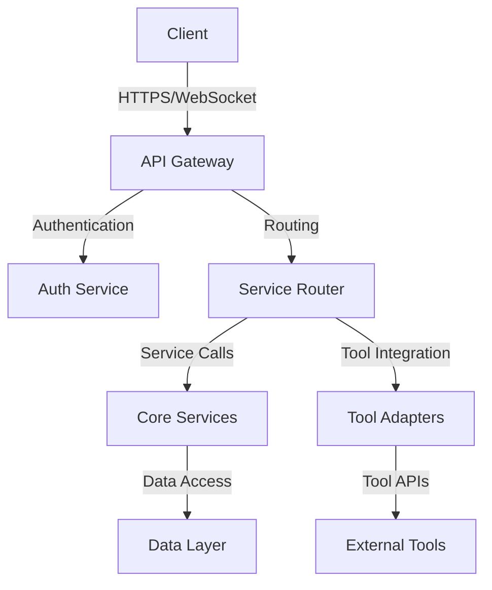

# API Overview

The OpenFrame API provides a comprehensive interface for interacting with the platform's core services and integrated tools. This document outlines the API architecture, principles, and key concepts.

## Architecture

## API Principles

### 1. RESTful Design
- Resource-based URLs
- Standard HTTP methods (GET, POST, PUT, DELETE)
- Consistent response formats
- Proper status codes

### 2. GraphQL Support
- Flexible querying
- Schema-based validation
- Efficient data fetching
- Real-time subscriptions

### 3. WebSocket Integration
- Real-time updates
- Bi-directional communication
- Event-based architecture
- Connection management

## Authentication

The API supports multiple authentication methods:
- OAuth 2.0
- API Keys
- JWT Tokens
- Session-based auth

## Rate Limiting

API requests are rate-limited based on:
- User tier
- Endpoint type
- Service load

## Versioning

The API is versioned through:
- URL versioning (e.g., `/v1/`)
- Header-based versioning
- Deprecation notices

## Error Handling

Standardized error responses include:
- Error codes
- Detailed messages
- Stack traces (in development)
- Error documentation links

## API Documentation

API documentation is available through:
- OpenAPI/Swagger UI
- Interactive documentation
- Code examples
- SDK documentation

## Security

Security measures include:
- HTTPS enforcement
- CORS policies
- Input validation
- Output sanitization
- Rate limiting
- IP filtering

## Monitoring

API monitoring includes:
- Request/response metrics
- Error rates
- Latency tracking
- Usage analytics
- Health checks

## Next Steps

- [Authentication](authentication.md) - Detailed authentication documentation
- [Endpoints](endpoints.md) - API endpoint reference
- [WebSocket](websocket.md) - WebSocket API documentation
- [Integration](integration.md) - Integration patterns and examples 