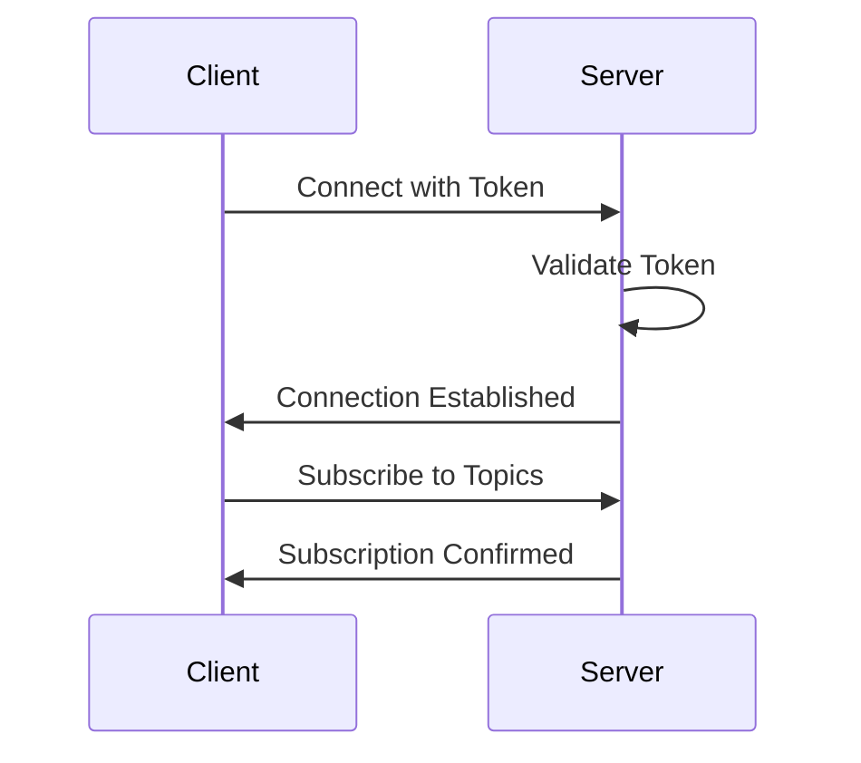

# WebSocket API

This document describes the WebSocket API for real-time communication with OpenFrame.

## Connection

### WebSocket URL

```
wss://api.openframe.io/v1/ws
```

### Connection Headers

```http
Authorization: Bearer <token>
```

## Authentication

### Connection Flow



## Message Format

### Client Messages

```json
{
  "type": "subscribe",
  "topics": ["devices", "alerts"],
  "filters": {
    "severity": ["high", "critical"]
  }
}
```

### Server Messages

```json
{
  "type": "event",
  "topic": "alerts",
  "data": {
    "id": "alert_id",
    "title": "New Alert",
    "severity": "high"
  },
  "timestamp": "2024-03-20T10:00:00Z"
}
```

## Topics

### 1. Devices

```json
{
  "type": "device_update",
  "data": {
    "id": "device_id",
    "status": "online",
    "last_seen": "2024-03-20T10:00:00Z"
  }
}
```

### 2. Alerts

```json
{
  "type": "alert_created",
  "data": {
    "id": "alert_id",
    "title": "Security Alert",
    "severity": "high",
    "device_id": "device_id"
  }
}
```

### 3. System Status

```json
{
  "type": "system_status",
  "data": {
    "status": "healthy",
    "metrics": {
      "cpu_usage": 45,
      "memory_usage": 60
    }
  }
}
```

## Subscription Management

### Subscribe

```json
{
  "type": "subscribe",
  "topics": ["devices", "alerts"],
  "filters": {
    "severity": ["high", "critical"]
  }
}
```

### Unsubscribe

```json
{
  "type": "unsubscribe",
  "topics": ["devices"]
}
```

### Subscription Confirmation

```json
{
  "type": "subscription_confirmed",
  "topics": ["devices", "alerts"],
  "timestamp": "2024-03-20T10:00:00Z"
}
```

## Error Handling

### Connection Errors

```json
{
  "type": "error",
  "code": "CONNECTION_ERROR",
  "message": "Connection failed",
  "timestamp": "2024-03-20T10:00:00Z"
}
```

### Authentication Errors

```json
{
  "type": "error",
  "code": "AUTH_ERROR",
  "message": "Invalid token",
  "timestamp": "2024-03-20T10:00:00Z"
}
```

### Subscription Errors

```json
{
  "type": "error",
  "code": "SUBSCRIPTION_ERROR",
  "message": "Invalid topic",
  "timestamp": "2024-03-20T10:00:00Z"
}
```

## Implementation Examples

### Python Client

```python
import websockets
import asyncio
import json

async def connect_websocket():
    uri = "wss://api.openframe.io/v1/ws"
    headers = {
        "Authorization": "Bearer your_token"
    }
    
    async with websockets.connect(uri, extra_headers=headers) as websocket:
        # Subscribe to topics
        await websocket.send(json.dumps({
            "type": "subscribe",
            "topics": ["devices", "alerts"]
        }))
        
        # Handle messages
        while True:
            message = await websocket.recv()
            data = json.loads(message)
            print(f"Received: {data}")

# Run the client
asyncio.get_event_loop().run_until_complete(connect_websocket())
```

### JavaScript Client

```javascript
const ws = new WebSocket('wss://api.openframe.io/v1/ws');

ws.onopen = () => {
    // Subscribe to topics
    ws.send(JSON.stringify({
        type: 'subscribe',
        topics: ['devices', 'alerts']
    }));
};

ws.onmessage = (event) => {
    const data = JSON.parse(event.data);
    console.log('Received:', data);
};

ws.onerror = (error) => {
    console.error('WebSocket error:', error);
};

ws.onclose = () => {
    console.log('WebSocket connection closed');
};
```

## Best Practices

### 1. Connection Management
- Implement reconnection logic
- Handle connection timeouts
- Validate connection state
- Monitor connection health

### 2. Message Handling
- Validate message format
- Handle message types appropriately
- Implement error handling
- Process messages asynchronously

### 3. Resource Management
- Clean up subscriptions
- Close connections properly
- Handle memory leaks
- Monitor resource usage

## Next Steps

- [Integration](integration.md) - Integration patterns and examples
- [Authentication](authentication.md) - Authentication details
- [Endpoints](endpoints.md) - REST API endpoints 