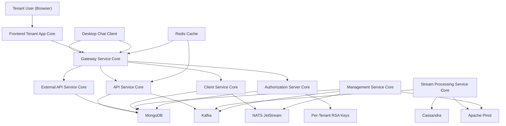
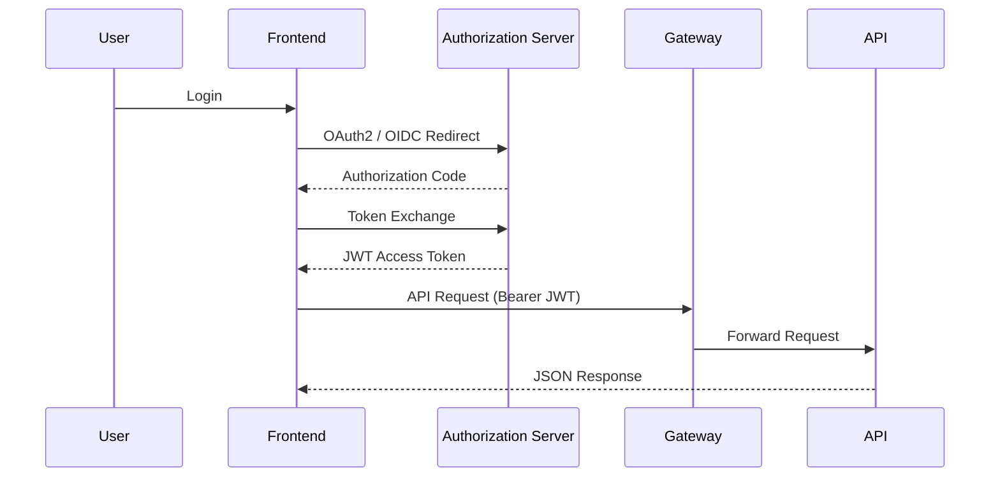
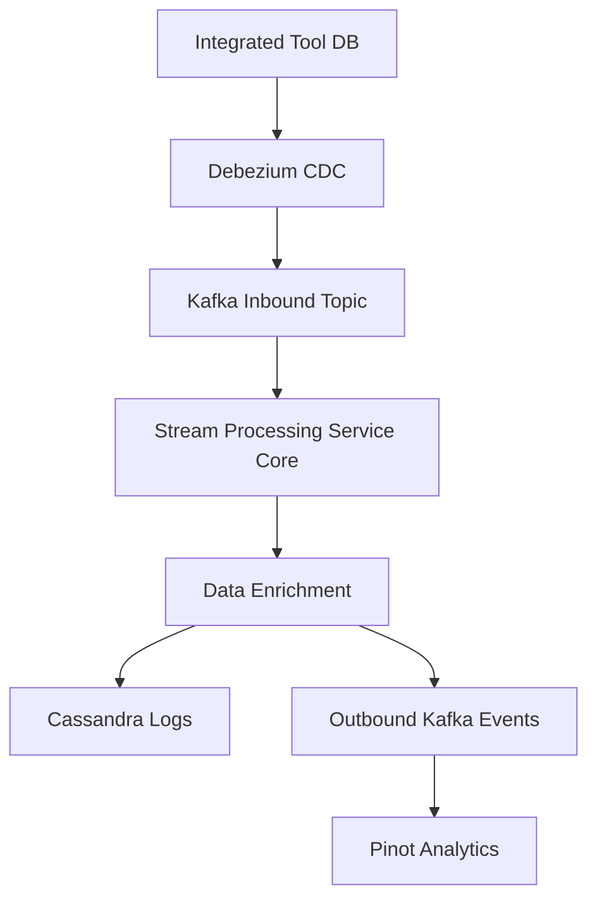
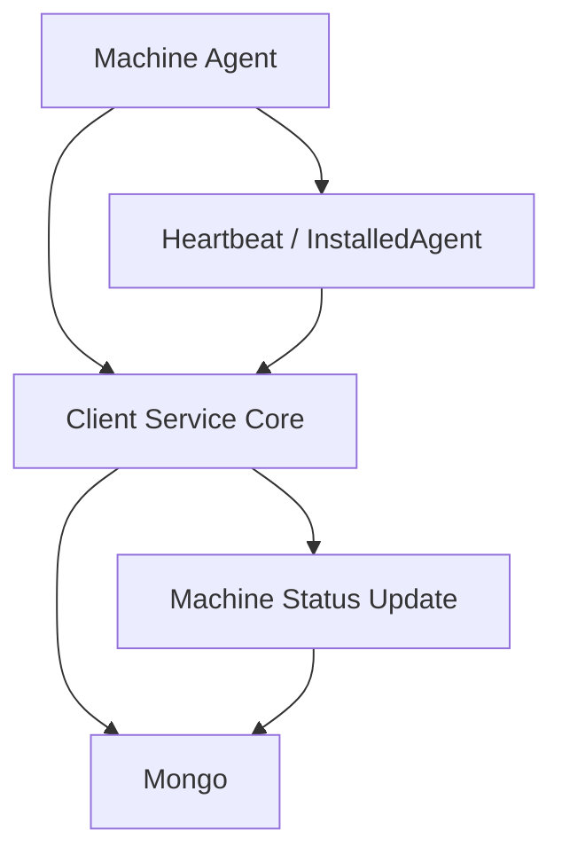

# OpenFrame OSS Tenant – Repository Overview

The `openframe-oss-tenant` repository is the **multi-service, multi-tenant backend and frontend stack** powering OpenFrame — Flamingo’s AI-driven MSP platform.  

It delivers:

- ✅ Multi-tenant OAuth2 / OIDC authentication  
- ✅ Secure API Gateway and external API surface  
- ✅ Internal GraphQL + REST orchestration layer  
- ✅ Real-time stream processing and analytics  
- ✅ Agent lifecycle and tool integrations  
- ✅ Redis caching and Kafka messaging infrastructure  
- ✅ Tenant frontend and desktop chat client  

This repository represents a **complete production-ready distributed platform**, not just a single service.

---

# 1. Purpose of the Repository

`openframe-oss-tenant` provides a **tenant-isolated SaaS architecture** for:

- MSP IT operations
- Device and organization management
- Tool integrations (Fleet, Tactical RMM, MeshCentral)
- AI-assisted operations (Mingo)
- External API integrations
- Secure OAuth-based authentication

It implements a **microservice architecture** composed of:

- Identity services
- Gateway and routing
- API orchestration
- Client/agent service
- Stream processing
- Management and orchestration
- Data platform infrastructure
- Frontend tenant application
- Desktop chat client

---

# 2. End-to-End Architecture

Below is the full system view of the OpenFrame OSS Tenant stack.



---

# 3. Service-Level Architecture

## 3.1 Authentication & Identity Flow



- Multi-tenant JWT issuers  
- Per-tenant RSA signing keys  
- PKCE support  
- SSO (Google, Microsoft)  
- Invitation & onboarding flows  

---

## 3.2 Event & Stream Processing Flow



- Tool-agnostic event normalization  
- Unified event types  
- Device + organization enrichment  
- Real-time analytics  

---

## 3.3 Agent & Machine Lifecycle



- Agent authentication
- Secure registration
- Tool ID transformation
- Real-time heartbeat tracking

---

# 4. Core Modules Documentation

Below is the logical breakdown of the repository modules.

---

## 4.1 Identity & Security

### Authorization Server Core
- Multi-tenant OAuth2 Authorization Server
- OIDC login
- Per-tenant JWT signing keys
- Dynamic client registration
- Invitation-based onboarding
- Password reset flows

### Security OAuth and JWT Core
- RSA key loading
- JWT encoder/decoder
- PKCE utilities
- OAuth BFF controller
- Token lifecycle handling

---

## 4.2 Edge & Routing

### Gateway Service Core
- Reactive Spring Cloud Gateway
- JWT validation with dynamic issuer resolution
- API key authentication + rate limiting
- WebSocket proxying for tools
- CORS and header normalization

---

## 4.3 API Layer

### API Service Core
- Internal REST endpoints
- GraphQL API (Netflix DGS)
- Business orchestration
- SSO management
- User lifecycle management
- Organization logic
- API key management

### External API Service Core
- `/api/v1/**` public REST surface
- API key-based authentication
- Tool proxying
- Cursor-based pagination
- OpenAPI documentation

### API Contracts and Mapping
- Shared DTOs
- Filter models
- Cursor pagination
- Mappers
- Device, event, log contracts

---

## 4.4 Agent & Client Domain

### Client Service Core
- Agent authentication (`/oauth/token`)
- Machine registration
- NATS event listeners
- Tool agent file distribution
- Tool ID normalization
- Durable JetStream consumers

---

## 4.5 Stream & Analytics

### Stream Processing Service Core
- Debezium event ingestion
- Kafka Streams enrichment
- Unified event mapping
- Cassandra log persistence
- Outbound integration events

### Data Platform Core
- Cassandra configuration
- Pinot integration
- Machine tag event publishing
- Tool secret retrieval
- Multi-tenant keyspace normalization

---

## 4.6 Data Infrastructure

### Data Persistence Mongo
- Document models (users, devices, organizations)
- Cursor pagination
- Custom repositories
- Auditing
- OAuth client persistence

### Data Messaging Kafka
- OSS tenant Kafka configuration
- Topic auto-registration
- Debezium message model
- Producer recovery handler

### Data Cache Redis
- Spring Cache integration
- Tenant-aware key prefixes
- Reactive + blocking Redis templates
- Distributed locking support

---

## 4.7 Management & Operations

### Management Service Core
- Pinot schema deployment
- Debezium connector provisioning
- NATS stream provisioning
- Tool initialization
- Scheduled jobs with ShedLock
- API key stats sync

---

## 4.8 Frontend & Clients

### Frontend Tenant App Core
- Next.js App Router
- Device management UI
- GraphQL ticketing
- AI-powered Mingo chat
- Remote desktop (MeshCentral)
- Tool integrations (Fleet, Tactical RMM)
- Token refresh logic

### Chat Client (Openframe Chat)
- Tauri-based desktop client
- GraphQL dialog management
- Token lifecycle via Tauri bridge
- AI model discovery
- Tool execution rendering

---

## 4.9 Service Entrypoints

Executable Spring Boot services:

- `openframe-api`
- `openframe-authorization-server`
- `openframe-gateway`
- `openframe-external-api`
- `openframe-client`
- `openframe-management`
- `openframe-stream`
- `openframe-config`

Each service defines its own `@ComponentScan` boundary and deployment unit.

---

# 5. Multi-Tenant Design Principles

✅ Per-tenant JWT issuers  
✅ Per-tenant RSA signing keys  
✅ Tenant-aware Redis key prefixes  
✅ Tenant-scoped Cassandra keyspaces  
✅ Topic namespaced Kafka configuration  
✅ Strict separation of edge and core logic  
✅ Cursor-based pagination for scale  
✅ Pluggable processors via `@ConditionalOnMissingBean`  

---

# 6. Repository Structure (Conceptual)

```text
openframe-oss-tenant/
│
├── services/
│   ├── openframe-api
│   ├── openframe-authorization-server
│   ├── openframe-gateway
│   ├── openframe-external-api
│   ├── openframe-client
│   ├── openframe-management
│   ├── openframe-stream
│   └── openframe-config
│
├── openframe-oss-lib/
│   ├── api-service-core
│   ├── authorization-service-core
│   ├── gateway-service-core
│   ├── external-api-service-core
│   ├── client-core
│   ├── stream-service-core
│   ├── management-service-core
│   ├── data-mongo
│   ├── data-kafka
│   ├── data-redis
│   ├── data (Cassandra + Pinot)
│   └── security-*
│
├── services/openframe-frontend
└── clients/openframe-chat
```

---

# 7. Conclusion

The `openframe-oss-tenant` repository is a **complete tenant-isolated SaaS platform** implementing:

- Identity & OAuth2 infrastructure  
- API gateway and rate limiting  
- Internal and external APIs  
- Agent lifecycle management  
- Real-time stream processing  
- Distributed data platform (Mongo, Kafka, Cassandra, Pinot, Redis)  
- AI-powered tenant frontend  
- Desktop conversational client  

It is designed for:

- Scalability  
- Multi-tenant isolation  
- Extensibility  
- Tool-agnostic integrations  
- Production-grade distributed operation  

This repository forms the core runtime stack behind OpenFrame and Flamingo’s AI-powered MSP platform.