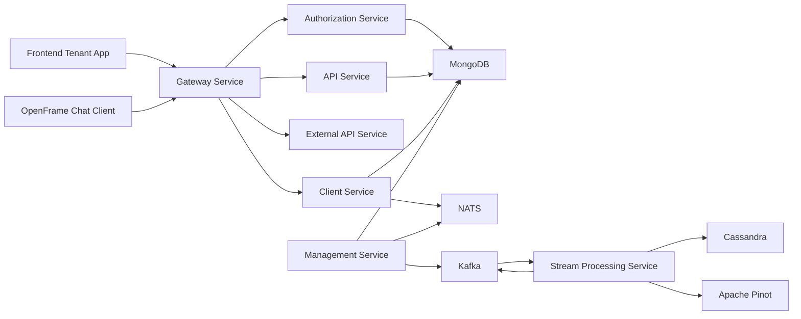
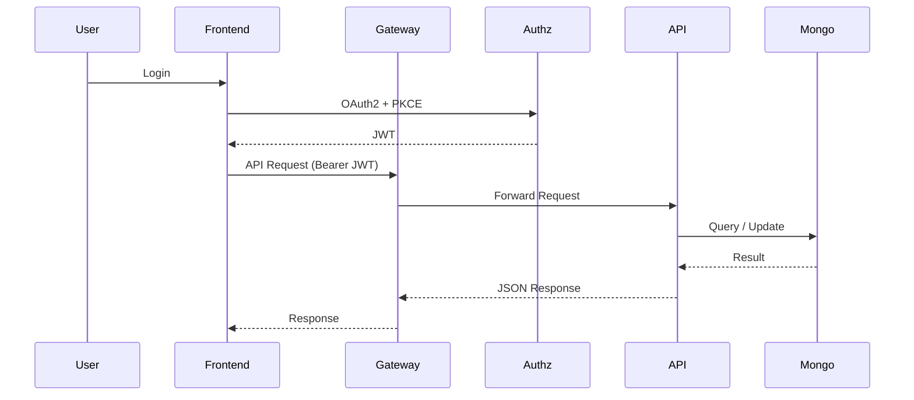
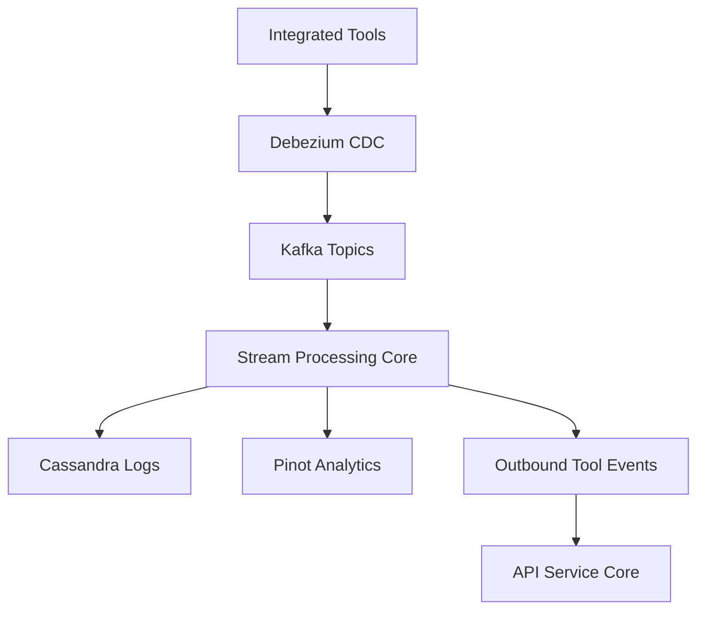
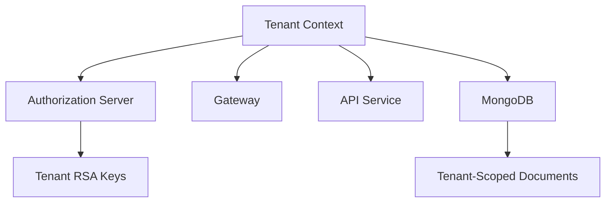

# OpenFrame OSS Tenant Repository Overview

The **`openframe-oss-tenant`** repository contains the complete open-source, multi-tenant backend and frontend platform powering OpenFrame.

It provides:

- A multi-tenant OAuth2 authorization server  
- A secure reactive API gateway  
- Domain-driven REST + GraphQL APIs  
- Agent lifecycle and tool integration services  
- Event streaming and real-time processing  
- MongoDB, Kafka, Pinot, and Cassandra data layers  
- A tenant-facing frontend application  
- A desktop chat client powered by AI (OpenFrame Chat)

This repository represents a **full-stack, microservices-based MSP platform** designed for extensibility, security, and tenant isolation.

---

# 1. High-Level Purpose

OpenFrame OSS Tenant enables:

- ✅ Multi-tenant identity and authorization  
- ✅ Secure API access via JWT and API keys  
- ✅ Device and organization management  
- ✅ Tool integrations (Fleet, Tactical RMM, etc.)  
- ✅ Event ingestion and stream processing  
- ✅ Real-time machine lifecycle tracking  
- ✅ External API access for integrations  
- ✅ AI-powered desktop chat interface  

It is designed to be deployed as a set of Spring Boot microservices, backed by MongoDB, Kafka, NATS, Redis, Pinot, and Cassandra.

---

# 2. End-to-End Architecture

## 2.1 System Architecture Overview

---

## 2.2 Request Flow (User → Data)

---

## 2.3 Event & Streaming Flow

---

# 3. Repository Structure & Core Modules

The repository is organized into modular layers.

---

# 3.1 Client Applications

## ✅ Frontend Tenant App Core  
**Path:** `openframe/services/openframe-frontend/src`

Responsible for:

- Centralized API communication (`ApiClient`)
- OAuth and SSO handling (`AuthApiClient`)
- Tool-specific adapters (Fleet, Tactical)
- Deployment-aware behavior
- Token refresh orchestration

**Documentation:**  
See module: `frontend_tenant_app_core`

---

## ✅ Chat Client Core  
**Path:** `clients/openframe-chat/src`

Desktop Tauri + React AI chat client for tenants.

Features:

- Token-aware GraphQL client
- Streaming AI responses
- Tool execution visualization
- Supported model discovery
- Debug mode for development

Integrates with:

- API Service Core  
- Authorization Service Core  
- Gateway Service Core  

**Documentation:**  
See module: `chat_client_core`

---

# 3.2 Edge & Security Layer

## ✅ Gateway Service Core  
**Path:** `openframe-oss-lib/openframe-gateway-service-core`

Responsibilities:

- OAuth2 resource server
- Multi-tenant JWT validation
- API key authentication
- Rate limiting
- REST + WebSocket proxying
- Tool routing

**Documentation:**  
See module: `gateway_service_core`

---

## ✅ Authorization Service Core  
**Path:** `openframe-oss-lib/openframe-authorization-service-core`

Provides:

- Multi-tenant OAuth2 Authorization Server
- OIDC support
- RSA key per tenant
- Invitation & onboarding flows
- SSO (Google, Microsoft)
- PKCE support

**Documentation:**  
See module: `authz_service_core`

---

## ✅ Security Shared  
**Path:** `openframe-oss-lib/openframe-security-core`

Provides:

- JWT encoding/decoding
- RSA key parsing
- PKCE utilities
- OAuth constants

**Documentation:**  
See module: `security_shared`

---

# 3.3 Business API Layer

## ✅ API Service Core  
**Path:** `openframe-oss-lib/openframe-api-service-core`

Exposes:

- REST endpoints (users, orgs, API keys, SSO)
- GraphQL (devices, events, logs, tools)
- DataLoader-based query optimization
- Processor extension model

**Documentation:**  
See module: `api_service_core`

---

## ✅ External API Service Core  
**Path:** `openframe-oss-lib/openframe-external-api-service-core`

Public API surface:

- `/external-api/api/v1/**`
- API key authentication
- Cursor pagination
- Tool proxying
- OpenAPI documentation

**Documentation:**  
See module: `external_api_service_core`

---

# 3.4 Agent & Tool Integration Layer

## ✅ Client Service Core  
**Path:** `openframe-oss-lib/openframe-client-core`

Handles:

- Agent registration
- OAuth-style token issuance for agents
- NATS event listeners
- Installed agent ingestion
- Tool connection synchronization
- Tool-specific ID transformation

**Documentation:**  
See module: `client_service_core`

---

## ✅ Management Service Core  
**Path:** `openframe-oss-lib/openframe-management-service-core`

Control-plane responsibilities:

- Integrated tool lifecycle management
- Debezium connector provisioning
- NATS stream initialization
- Release version propagation
- Distributed scheduling via ShedLock

**Documentation:**  
See module: `management_service_core`

---

# 3.5 Stream & Data Layer

## ✅ Stream Processing Core  
**Path:** `openframe-oss-lib/openframe-stream-service-core`

Provides:

- Kafka ingestion
- Tool-specific deserialization
- Unified event normalization
- Enrichment via Redis cache
- Kafka + Cassandra publishing
- Kafka Streams activity joins

**Documentation:**  
See module: `stream_processing_core`

---

## ✅ Data Layer Mongo  
**Path:** `openframe-oss-lib/openframe-data-mongo`

Primary document persistence:

- Users
- Organizations
- Devices
- Events
- OAuth clients
- Tools
- Tags

Supports:

- Reactive + blocking repositories
- Cursor pagination
- Soft delete patterns
- Multi-tenant indexing

**Documentation:**  
See module: `data_layer_mongo`

---

## ✅ Data Layer Kafka  
**Path:** `openframe-oss-lib/openframe-data-kafka`

Provides:

- OSS tenant Kafka configuration
- Topic auto-registration
- Debezium message model
- Producer & consumer factories

**Documentation:**  
See module: `data_layer_kafka`

---

## ✅ Data Layer Core Services  
**Path:** `openframe-oss-lib/openframe-data`

Provides:

- Cassandra enablement
- Apache Pinot analytical repositories
- Tool credential abstraction
- Shared integrated tool types

**Documentation:**  
See module: `data_layer_core_services`

---

# 3.6 Service Entrypoints

**Path:** `openframe/services`

Defines Spring Boot applications:

- `ApiApplication`
- `OpenFrameAuthorizationServerApplication`
- `GatewayApplication`
- `ExternalApiApplication`
- `ClientApplication`
- `ManagementApplication`
- `StreamApplication`
- `ConfigServerApplication`

These compose the core modules into deployable microservices.

**Documentation:**  
See module: `service_entrypoints`

---

# 4. Multi-Tenant Model

Isolation mechanisms:

- Per-tenant RSA signing keys  
- Issuer-based JWT validation  
- Compound unique indexes (tenantId + email)  
- Tenant-aware stream processing  
- Scoped API keys  

---

# 5. Core Design Principles

- ✅ Microservice isolation  
- ✅ Domain-driven service boundaries  
- ✅ Multi-tenant security model  
- ✅ Event-driven architecture  
- ✅ Cursor-based pagination  
- ✅ Reactive gateway  
- ✅ Processor-based extension model  
- ✅ Tool-agnostic integration framework  
- ✅ At-least-once stream processing  

---

# 6. Repository Summary

The **`openframe-oss-tenant`** repository is a complete multi-tenant SaaS backend and frontend platform providing:

- Identity & OAuth2 infrastructure  
- Secure API routing  
- Domain management APIs  
- Agent lifecycle orchestration  
- Tool integration framework  
- Real-time event ingestion  
- Analytical data pipelines  
- AI-powered desktop chat client  
- Deployment-ready microservices  

It is modular, extensible, and production-ready — designed to support MSP environments and scalable tenant isolation across a distributed architecture.

---

If you are exploring the repository, start with:

- `service_entrypoints` (to understand runtime boundaries)  
- `gateway_service_core` (edge security model)  
- `authz_service_core` (multi-tenant OAuth)  
- `api_service_core` (business APIs)  
- `stream_processing_core` (event backbone)  

This layered architecture forms the foundation of the OpenFrame platform.