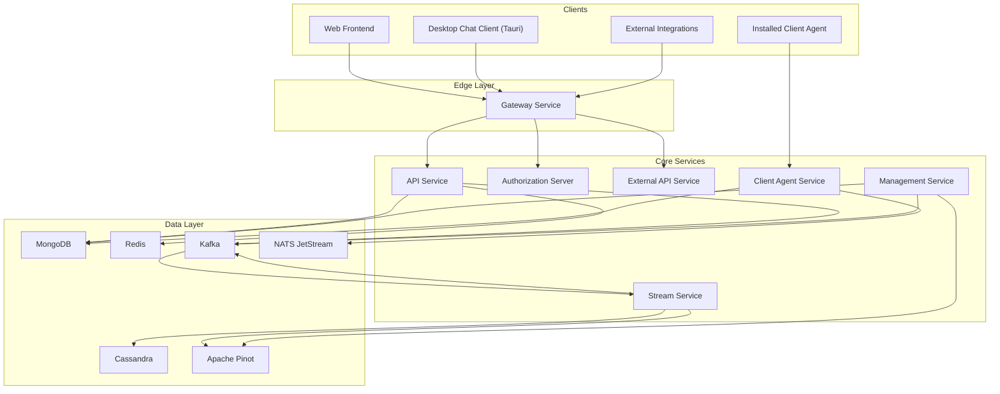
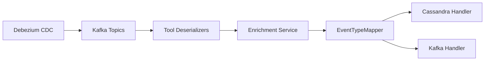
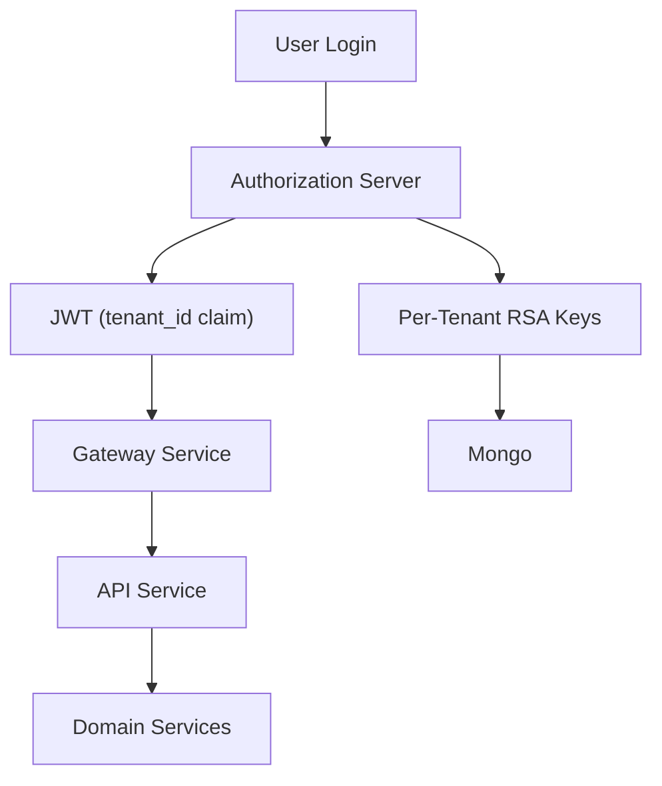
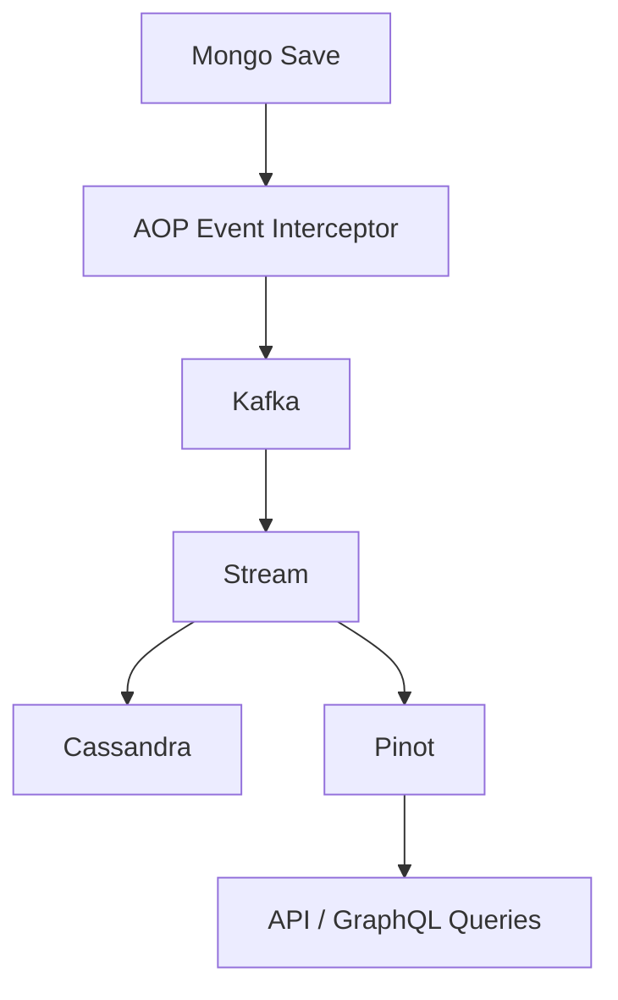

# OpenFrame OSS Tenant – Repository Overview

The **`openframe-oss-tenant`** repository contains the full multi-service, multi-tenant backend and frontend stack that powers the OpenFrame platform.

OpenFrame is an AI-powered MSP platform that unifies:

- Device and organization management
- OAuth2/OIDC authentication
- Tool integrations (Fleet MDM, Tactical RMM, MeshCentral)
- Event streaming and analytics
- API key–based external integrations
- AI-driven chat (Mingo)
- Multi-tenant isolation across the entire stack

This repository includes:

- ✅ All backend core libraries  
- ✅ All microservice entrypoints  
- ✅ Frontend application  
- ✅ Desktop chat client  
- ✅ Streaming and analytics infrastructure  

---

# 1. End-to-End Architecture

OpenFrame follows a **modular, multi-service, event-driven architecture**.



---

# 2. Repository Structure (Logical View)

The repository is organized into:

## A. Frontend Layer

### 1️⃣ Web Application  
**Path:** `openframe/services/openframe-frontend`

Core components:
- `ApiClient`
- `AuthApiClient`
- `FleetApiClient`
- `TacticalApiClient`
- `MingoApiService`
- `MingoMessagesStore`
- `DialogDetailsStore`

Responsible for:
- Authentication-aware HTTP abstraction
- Tool integrations
- AI chat orchestration (Mingo)
- GraphQL ticket dialog handling
- Real-time streaming UI state

---

### 2️⃣ Desktop Chat Client  
**Path:** `clients/openframe-chat`

Core components:
- `TokenService`
- `DialogGraphQLService`
- `SupportedModelsService`
- `MockChatService`
- `DebugModeContext`

Responsible for:
- Tauri-native token integration
- GraphQL dialog fetching
- Streaming AI message rendering
- Tool execution visualization
- AI model metadata loading

---

## B. Edge & Security Layer

### 3️⃣ Gateway Service Core  
**Module:** `openframe-gateway-service-core`

- JWT validation
- API key authentication
- Rate limiting
- WebSocket proxying
- Dynamic issuer resolution
- CORS and origin sanitization

---

### 4️⃣ Authorization Server Core  
**Module:** `openframe-authorization-service-core`

- OAuth2 / OIDC flows
- PKCE support
- Multi-tenant JWT issuance
- Per-tenant RSA key management
- SSO (Google, Microsoft)
- Invitation & onboarding flows

---

### 5️⃣ Shared Security OAuth Client Support  
**Module:** `openframe-security-core`

- RSA JWT encoder/decoder
- PKCE utilities
- OAuth constants
- Centralized JWT configuration

---

## C. API Layer

### 6️⃣ API Service Core

Split into several modules:

- Runtime & Security
- REST Controllers
- GraphQL Fetchers & DataLoaders
- Domain Services & Processors

Responsibilities:
- User lifecycle management
- Organization management
- Device and tool management
- SSO configuration
- GraphQL pagination & batching
- Domain rule enforcement

---

### 7️⃣ API Contracts (DTOs & Mappers)  
**Module:** `openframe-api-lib`

- Shared DTO contracts
- Filter models
- Cursor pagination
- Mapping logic
- DataLoader-friendly service methods

---

### 8️⃣ External API Service Core  
Public API layer for third-party integrations:

- API key authentication
- Cursor pagination
- Filtering & sorting
- Tool proxy endpoints
- OpenAPI documentation

---

## D. Client & Agent Runtime

### 9️⃣ Client Agent Service Core  
Handles:

- Agent registration
- OAuth-based agent authentication
- NATS event consumption
- Installed agent tracking
- Tool connection lifecycle
- Tool ID transformation (Fleet, MeshCentral)

---

## E. Event & Streaming Layer

### 🔟 Stream Processing Service Core

Responsible for:

- Kafka consumption
- Debezium CDC ingestion
- Tool event normalization
- Event enrichment (Redis)
- Cassandra persistence
- Kafka republishing
- Kafka Streams joins



---

## F. Data Layer

### 1️⃣1️⃣ Mongo Data Layer  
**Module:** `openframe-data-mongo`

- Domain documents
- Custom repositories
- Cursor pagination
- Reactive + blocking support
- Soft delete patterns

---

### 1️⃣2️⃣ Cassandra & Pinot Core  
**Module:** `openframe-data`

- Cassandra configuration
- Pinot analytics queries
- AOP-based machine-tag event interception
- Kafka propagation

---

### 1️⃣3️⃣ Kafka Infrastructure  
**Module:** `openframe-data-kafka`

- Tenant-aware Kafka configuration
- Topic auto-creation
- Debezium message model
- Recovery handler

---

### 1️⃣4️⃣ Redis Cache Layer  
**Module:** `openframe-data-redis`

- Spring Cache integration
- Tenant-aware key prefixing
- Blocking + reactive templates
- 6-hour default TTL

---

## G. Operational Control Plane

### 1️⃣5️⃣ Management Service Core

Responsible for:

- Pinot schema deployment
- Debezium connector provisioning
- NATS stream initialization
- Agent version publishing
- Distributed scheduling (ShedLock + Redis)
- Tool lifecycle automation

---

## H. Service Entrypoints

Located under:

```
openframe/services
```

Microservices:

- `openframe-api`
- `openframe-authorization-server`
- `openframe-gateway`
- `openframe-external-api`
- `openframe-management`
- `openframe-stream`
- `openframe-client`
- `openframe-config`

These assemble shared modules into deployable Spring Boot applications.

---

# 3. Multi-Tenant Security Model



Key properties:

- Per-tenant RSA key pairs
- `tenant_id` embedded in every JWT
- Gateway dynamic issuer resolution
- Tenant-scoped Redis keys
- Tenant-aware Mongo and Cassandra isolation

---

# 4. Event-Driven Backbone



This guarantees:

- Near real-time analytics
- Decoupled write and query paths
- Scalable ingestion from external tools
- Unified event taxonomy across integrations

---

# 5. Design Principles

✅ Multi-tenant by default  
✅ Event-driven architecture  
✅ CQRS-style read/write separation  
✅ Reactive + blocking compatibility  
✅ Strict separation of concerns  
✅ Extensibility via processor hooks  
✅ Infrastructure as configuration  
✅ Secure-by-design OAuth2 + PKCE  

---

# 6. Repository Purpose Summary

The `openframe-oss-tenant` repository is the **complete open-source, multi-tenant backend and frontend implementation of the OpenFrame platform**.

It provides:

- A fully modular microservice architecture
- OAuth2/OIDC multi-tenant authorization
- Secure edge routing with rate limiting
- Device and organization management
- AI chat orchestration
- Tool ecosystem integration
- Stream-based event normalization
- Distributed analytics with Pinot
- Automated operational control plane
- Agent lifecycle management
- Tenant-aware distributed caching

It is not a single service — it is an entire **platform runtime**.

---

If deployed together, the services in this repository form a production-ready, horizontally scalable, multi-tenant MSP automation and AI orchestration platform.