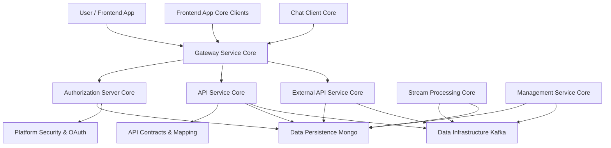
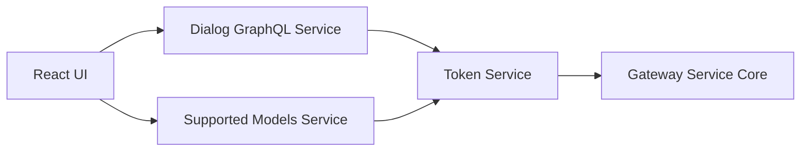
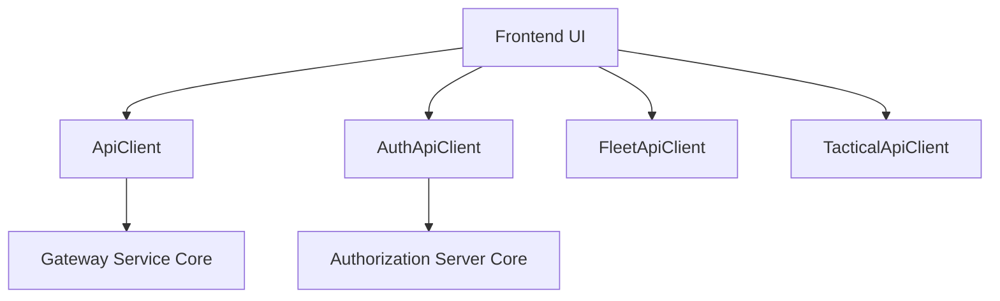
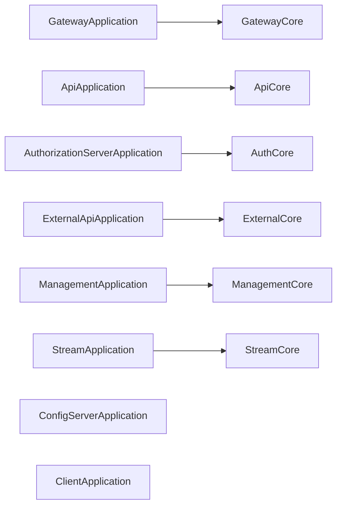
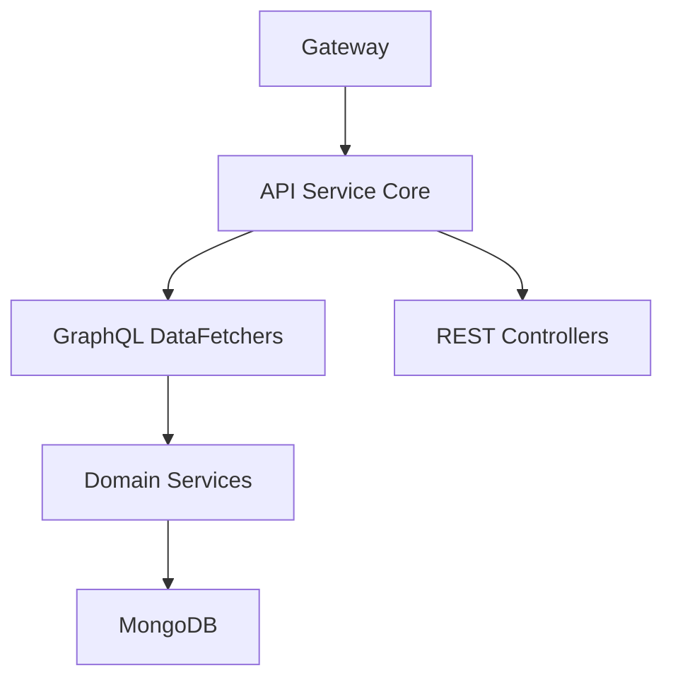
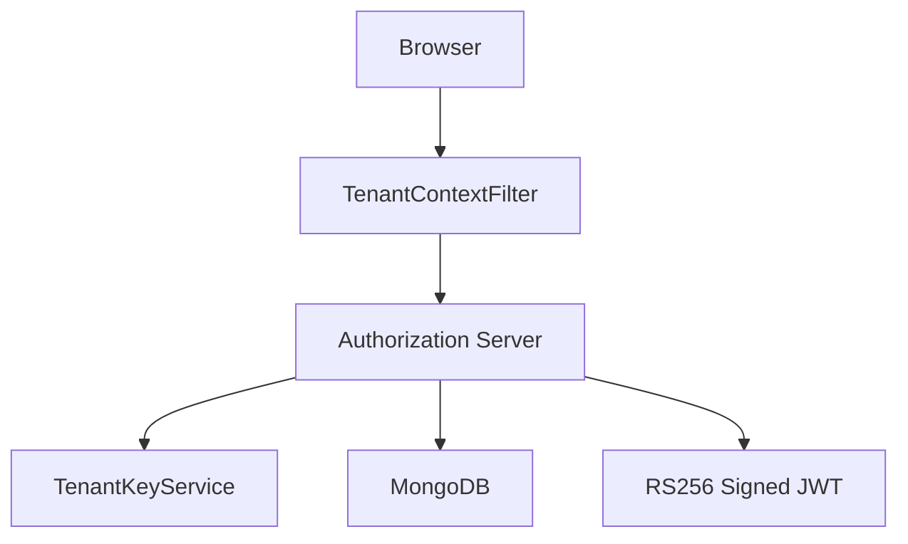
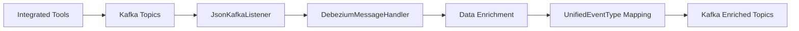
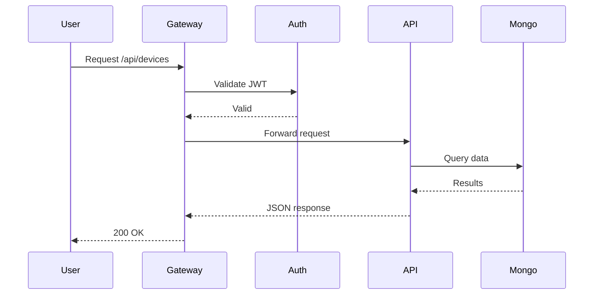
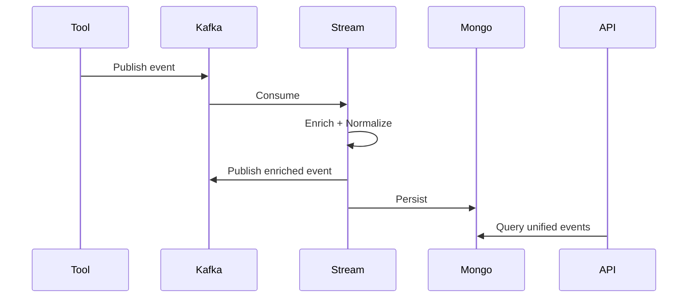

# OpenFrame OSS Tenant – Repository Overview

The **`openframe-oss-tenant`** repository is the multi-tenant, open-source foundation of the OpenFrame platform. It assembles all core backend services, frontend clients, infrastructure layers, and shared libraries required to run a full AI-powered MSP platform.

It delivers:

- ✅ Multi-tenant OAuth2 / OIDC authentication
- ✅ Secure API gateway with JWT and API key enforcement
- ✅ Internal GraphQL + REST API services
- ✅ External versioned REST API
- ✅ Kafka-based real-time stream processing
- ✅ MongoDB-backed persistence layer
- ✅ Tool integrations (Fleet, Tactical, etc.)
- ✅ Desktop chat client (Tauri + React)
- ✅ Frontend HTTP client abstraction
- ✅ Operational management & initialization services

This repository is structured as a **modular microservices architecture**, where each service is independently deployable but shares common infrastructure modules.

---

# High-Level End-to-End Architecture

The repository forms a complete SaaS stack from frontend to data layer.



---

# Repository Structure

The repository is composed of three major layers:

1. **Client Applications**
2. **Service Entrypoints (Executable Microservices)**
3. **Shared Core Libraries (Infrastructure & Domain)**

---

# 1️⃣ Client Applications

## Chat Client Core  
`clients/openframe-chat/src`

Desktop chat client built with **Tauri + React**.

### Responsibilities

- Token & API base URL management (Tauri bridge)
- GraphQL dialog communication
- Supported AI model discovery
- Debug mode context management



**Core Modules:**
- `DebugModeContextType`
- `DialogGraphQLService`
- `SupportedModelsService`
- `TokenService`

---

## Frontend App Core Clients  
`openframe/services/openframe-frontend/src/lib`

Typed HTTP client layer for the frontend.

### Responsibilities

- Automatic JWT refresh
- Cookie + header-based auth support
- Tool API adapters
- OAuth BFF integration



**Core Modules:**
- `ApiClient`
- `AuthApiClient`
- `FleetApiClient`
- `TacticalApiClient`

---

# 2️⃣ Service Entrypoints (Deployable Microservices)

Located under:

```text
openframe/services
```

Each is a Spring Boot application composing shared modules.



### Services

| Service | Purpose |
|----------|----------|
| **Gateway** | Entry point, JWT validation, routing |
| **Authorization Server** | OAuth2/OIDC, multi-tenant identity |
| **API Service** | Internal REST + GraphQL business APIs |
| **External API** | Versioned public REST API |
| **Management** | Initialization, orchestration |
| **Stream** | Kafka consumers, event enrichment |
| **Config Server** | Centralized configuration |
| **Client Service** | Client-facing orchestration |

---

# 3️⃣ Shared Core Modules

Located under:

```text
openframe-oss-lib/
```

These modules form the reusable backbone of the platform.

---

## API Service Core  
`openframe-api-service-core`

Business logic orchestration layer.

- GraphQL via Netflix DGS
- REST controllers
- DataLoader optimization
- JWT Resource Server support



---

## API Contracts & Mapping  
`openframe-api-lib`

Defines:

- DTOs
- Filter contracts
- Cursor pagination
- Entity-to-DTO mappers

This module ensures **API consistency across services**.

---

## Authorization Server Core  
`openframe-authorization-service-core`

Implements multi-tenant OAuth2 / OIDC.



Features:

- Dynamic SSO (Google, Microsoft)
- Per-tenant RSA keys
- Invitation onboarding
- Password reset
- Mongo-backed client storage

---

## Gateway Service Core  
`openframe-gateway-service-core`

Reactive Spring Cloud Gateway.

Responsibilities:

- Multi-issuer JWT validation
- API key authentication
- WebSocket proxying
- Tool routing
- Rate limiting
- CORS enforcement

---

## External API Service Core  
`openframe-external-api-service-core`

Public API façade under:

```text
/api/v1/**
```

- API key protected
- Cursor-based pagination
- Stable DTO responses
- Tool proxying support

---

## Management Service Core  
`openframe-management-service-core`

Operational control plane.

- Tool configuration
- Agent bootstrap
- NATS stream provisioning
- Debezium connector initialization
- Distributed locking (ShedLock + Redis)

---

## Stream Processing Core  
`openframe-stream-service-core`

Real-time Kafka processing.



- CDC handling
- Tool → unified event normalization
- Redis-based enrichment
- Kafka Streams window joins

---

## Data Persistence Mongo  
`openframe-data-mongo`

MongoDB persistence backbone.

- Blocking + reactive repositories
- Cursor pagination
- Compound indexes
- Multi-tenant modeling
- Soft deletes

---

## Data Infrastructure Kafka  
`openframe-data-kafka`

Kafka infrastructure layer.

- Producer & consumer factories
- Topic auto-creation
- Header standardization
- Recovery logging

---

## Platform Security & OAuth  
`openframe-security-core`
`openframe-security-oauth`

Shared JWT & OAuth logic.

- RS256 token encoding/decoding
- PKCE utilities
- OAuth BFF controller
- Cookie-based auth
- Dev ticket exchange

---

# End-to-End Request Flow

## Authenticated Dashboard Request



---

## Tool Event Ingestion Flow



---

# Architectural Characteristics

The repository follows strong architectural principles:

- ✅ **Multi-Tenancy First**
- ✅ **Clear Service Boundaries**
- ✅ **Shared Infrastructure Modules**
- ✅ **Reactive Edge (Gateway)**
- ✅ **Event-Driven Core**
- ✅ **Cursor-Based Pagination**
- ✅ **Per-Tenant Cryptographic Isolation**
- ✅ **Infrastructure as Code Initialization**
- ✅ **Strict Separation of Contracts and Entities**

---

# Core Module Documentation References

Each module has detailed internal documentation:

- **Chat Client Core**
- **Frontend App Core Clients**
- **API Service Core**
- **API Contracts and Mapping**
- **Authorization Server Core**
- **Gateway Service Core**
- **External API Service Core**
- **Management Service Core**
- **Stream Processing Core**
- **Data Persistence Mongo**
- **Data Infrastructure Kafka**
- **Platform Security and OAuth**
- **Service Entrypoints**

These documents describe:

- Internal class-level responsibilities
- Security models
- Multi-tenant flows
- Pagination and filtering models
- Event handling architecture
- Deployment boundaries

---

# Conclusion

The **`openframe-oss-tenant`** repository is a complete, production-grade, multi-tenant SaaS platform foundation.

It combines:

- Identity & security
- API orchestration
- Gateway routing
- Real-time stream processing
- Infrastructure configuration
- Tool integration
- Frontend + desktop client layers

All implemented in a cleanly layered, modular architecture that allows:

- Independent service deployment
- Horizontal scalability
- Tenant isolation
- Secure OAuth flows
- Extensible event-driven processing

This repository forms the operational core of the OpenFrame ecosystem.