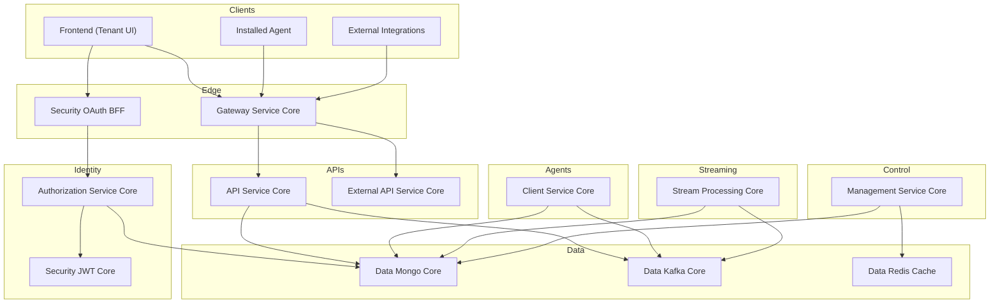
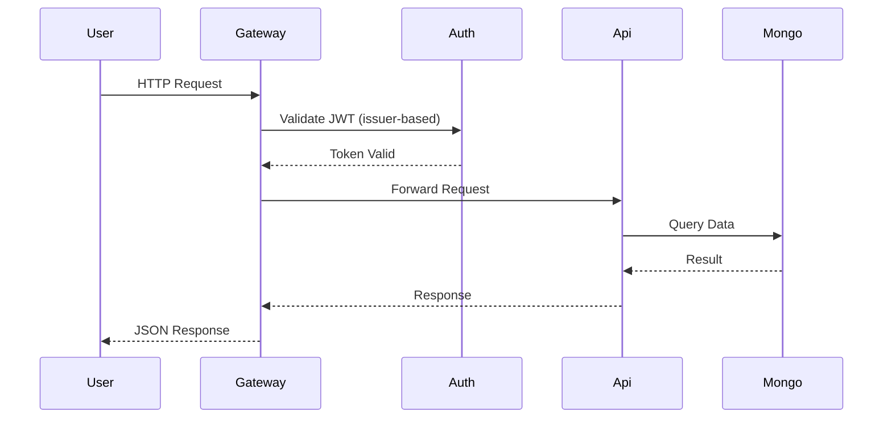
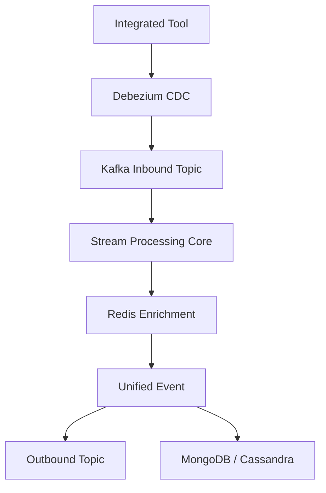

# OpenFrame OSS Tenant – Repository Overview

The **`openframe-oss-tenant`** repository contains the complete multi-service, multi-tenant backend platform powering **OpenFrame**, the unified AI-driven MSP stack behind Flamingo.

It is a modular, event-driven microservice architecture composed of:

- Identity & multi-tenant authorization
- Secure API gateway
- Tenant-facing APIs (GraphQL + REST)
- External integration APIs
- Agent & device lifecycle management
- Stream processing & event normalization
- Infrastructure modules (MongoDB, Kafka, Redis)
- Frontend tenant API clients

This repository represents the **entire runtime stack** required to operate an OpenFrame tenant.

---

# 🎯 Purpose of the Repository

The repository provides:

✅ Multi-tenant OAuth2 + OIDC identity platform  
✅ Secure API gateway with JWT + API key enforcement  
✅ Tenant-scoped business APIs (devices, events, organizations, tools)  
✅ External integration APIs for MSP automation  
✅ Agent registration & lifecycle management  
✅ CDC-based stream ingestion and normalization  
✅ Unified persistence layer (MongoDB)  
✅ Event-driven infrastructure (Kafka + NATS)  
✅ Distributed scheduling & control-plane orchestration  
✅ Frontend API communication layer  

In short, this repository is the **full backend control-plane and data-plane** of OpenFrame.

---

# 🏗 High-Level System Architecture

Below is the end-to-end view of how all services interact.

---

# 🧩 Repository Structure & Core Modules

The repository is composed of reusable **core libraries** and **service applications**.

---

# 1️⃣ Identity & Security Layer

## 🔐 `authorization-service-core`
Multi-tenant OAuth2 Authorization Server.

- OAuth2 Authorization Code + PKCE
- OIDC support
- Dynamic SSO (Google, Microsoft)
- Tenant-scoped RSA signing keys
- Mongo-backed token persistence
- Invitation & onboarding flows

📘 See: **Authorization Service Core documentation**

---

## 🔑 `security-jwt-core`
Cryptographic foundation:

- RSA-based JWT encoding/decoding
- PKCE utilities
- OAuth constants
- Externalized issuer & key configuration

📘 See: **Security JWT Core documentation**

---

## 🛡 `security-oauth-bff`
Backend-for-Frontend OAuth orchestrator:

- Login redirects
- Code exchange
- Secure HTTP-only cookies
- Token refresh & logout
- Dev ticket mode

📘 See: **Security OAuth BFF documentation**

---

# 2️⃣ Edge Layer

## 🌐 `gateway-service-core`
Reactive Spring Cloud Gateway:

- JWT validation (multi-tenant issuer resolver)
- API key authentication
- Rate limiting
- WebSocket proxying
- Tool API proxying
- Header normalization

📘 See: **Gateway Service Core documentation**

---

# 3️⃣ Tenant Business APIs

## 📡 `api-service-core`
Primary internal API (GraphQL + REST):

- Devices
- Events
- Logs
- Organizations
- Tools
- Users
- SSO configuration
- DataLoaders (N+1 prevention)
- Processor extension points

📘 See: **API Service Core documentation**

---

## 🌍 `external-api-service-core`
Versioned external REST API:

- `/api/v1/**`
- API key access
- Cursor pagination
- Tool proxying
- OpenAPI documentation

📘 See: **External API Service Core documentation**

---

## 📦 `api-contracts-and-mapping`
Shared DTOs, filters, mappers, pagination contracts.

- Device filters
- Event filters
- Organization mapping
- CursorPaginationInput
- Default processors

📘 See: **API Contracts and Mapping documentation**

---

# 4️⃣ Agent & Device Layer

## 🖥 `client-service-core`
Agent lifecycle & machine presence:

- Agent registration
- OAuth-based agent authentication
- Tool connection synchronization
- Heartbeat tracking
- NATS & JetStream listeners
- Tool-specific agent ID transformers

📘 See: **Client Service Core documentation**

---

# 5️⃣ Data Infrastructure

## 🗄 `data-mongo-core`
MongoDB persistence foundation:

- Domain documents (User, Device, Organization, Event, OAuth, Tenant)
- Blocking + reactive repositories
- Custom filtering
- Cursor pagination
- Multi-tenant uniqueness constraints

📘 See: **Data Mongo Core documentation**

---

## 📨 `data-kafka-core`
Kafka infrastructure:

- Producer/consumer factories
- Topic auto-creation
- Debezium CDC modeling
- Tenant-specific configuration
- Recovery handling

📘 See: **Data Kafka Core documentation**

---

## ⚡ `data-redis-cache`
Redis infrastructure:

- Spring Cache integration
- Reactive + blocking templates
- Tenant-aware key builder
- Distributed locking support

📘 See: **Data Redis Cache documentation**

---

# 6️⃣ Stream & Event Processing

## 🔄 `stream-processing-core`
Real-time event normalization pipeline:

- Debezium CDC ingestion
- Event type mapping
- Redis-based enrichment
- Kafka Streams joins
- Cassandra/Kafka routing
- Unified event model

📘 See: **Stream Processing Core documentation**

---

# 7️⃣ Control Plane

## 🎛 `management-service-core`
Operational orchestration layer:

- Integrated tool management
- Debezium connector provisioning
- NATS stream initialization
- Agent version publishing
- Distributed scheduled jobs (ShedLock)
- Health checks & stats sync

📘 See: **Management Service Core documentation**

---

# 8️⃣ Service Applications

## 🚀 `service-applications`
Runnable Spring Boot entrypoints:

- API Service
- Authorization Server
- Gateway
- Client Service
- Stream Service
- Management Service
- External API Service
- Config Server

Each application composes core modules into a deployable microservice.

📘 See: **Service Applications documentation**

---

# 9️⃣ Frontend Tenant Layer

## 🧠 `frontend-tenant-api-clients`
Frontend communication layer:

- ApiClient (tenant API calls)
- AuthApiClient (OAuth + SSO)
- Automatic token refresh
- Dev ticket support
- Multi-tenant URL resolution

📘 See: **Frontend Tenant API Clients documentation**

---

# 🔁 End-to-End Request Lifecycle

Below is a simplified user request lifecycle.

---

# 🔄 Event Processing Lifecycle

---

# 🧠 Architectural Characteristics

### ✅ Multi-Tenant by Design
- Tenant-scoped JWT issuers
- Tenant RSA keys
- Tenant-specific Redis key prefixes
- Compound unique indexes in Mongo

### ✅ Event-Driven
- Kafka-based CDC ingestion
- Stream normalization
- Version publishing
- Tool lifecycle events

### ✅ Stateless & Horizontally Scalable
- All services stateless
- Shared infrastructure (Mongo, Kafka, Redis)
- Distributed locking for scheduled jobs

### ✅ Extensible
- Processor extension points
- Pluggable transformers
- Post-save hooks
- Conditional beans

---

# 📌 Summary

The **`openframe-oss-tenant`** repository is the full backend platform for OpenFrame tenants.

It provides:

- Identity and multi-tenant authorization
- Secure edge routing
- Business APIs for MSP operations
- Agent lifecycle management
- Real-time event ingestion and normalization
- Persistent multi-tenant data storage
- Distributed control-plane orchestration
- Frontend authentication-aware API clients

Together, these modules form a **secure, scalable, event-driven, multi-tenant MSP platform** capable of replacing legacy proprietary systems with a unified, AI-enhanced architecture.