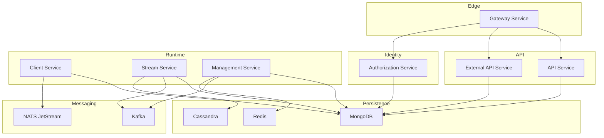
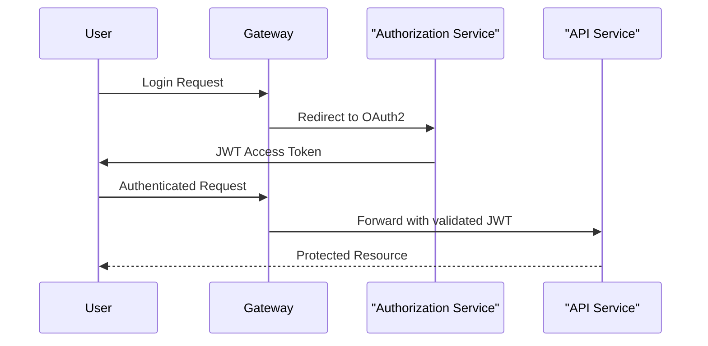
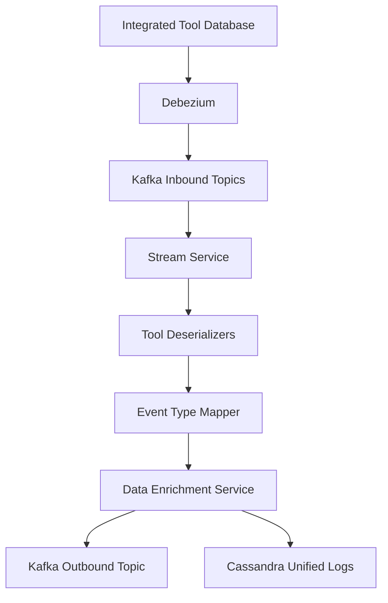
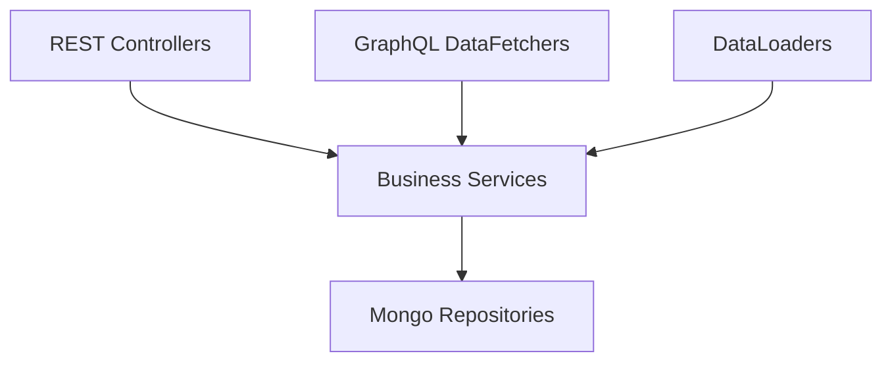
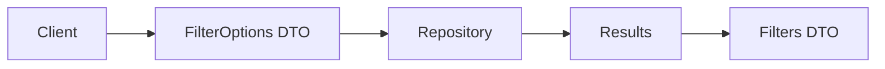
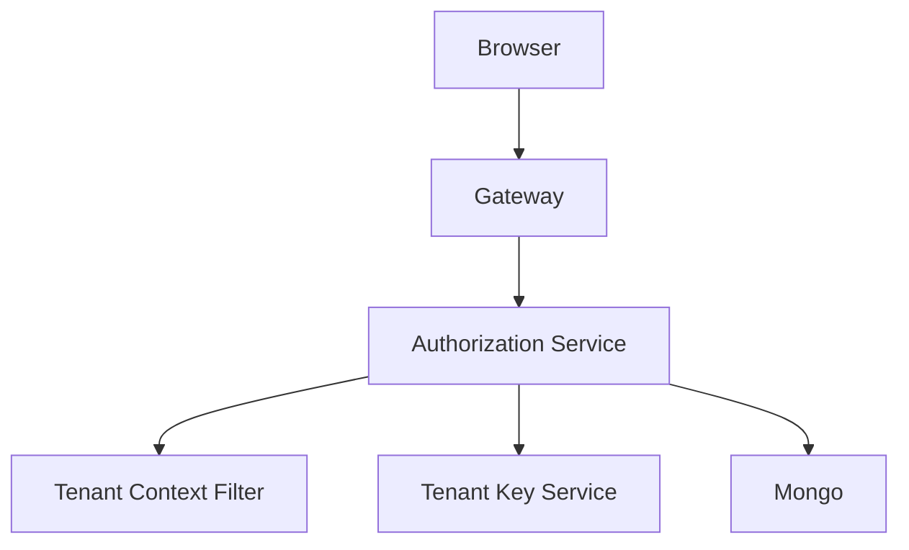
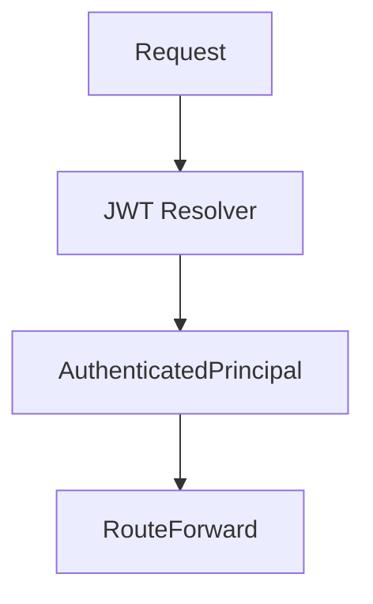
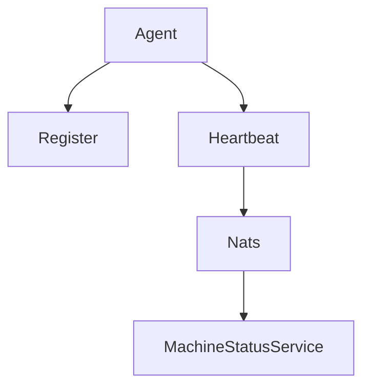
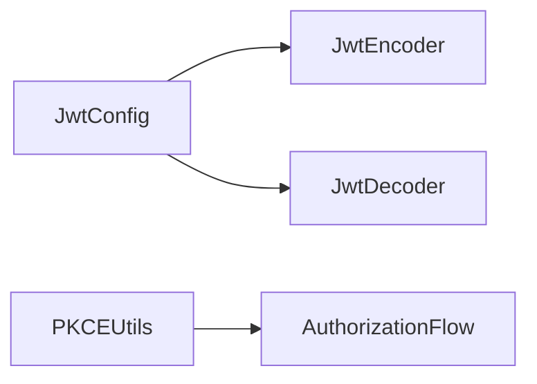

# OpenFrame OSS Tenant – Repository Overview

The **`openframe-oss-tenant`** repository contains the full multi-tenant backend stack of the OpenFrame platform. It implements a production-grade, modular microservices architecture that powers:

- Multi-tenant identity and OAuth2 authorization
- Internal and external APIs (REST + GraphQL)
- Agent lifecycle and machine management
- Tool integrations and CDC event streaming
- Real-time enrichment pipelines
- Distributed scheduling and infrastructure orchestration
- MongoDB-based persistence layer
- Gateway-based security and routing

This repository represents the **complete backend runtime** of OpenFrame in an open-source, tenant-aware deployment model.

---

# 1. Purpose of the Repository

The repository provides:

✅ A **multi-tenant SaaS backend architecture**  
✅ Secure OAuth2 / OIDC identity provider  
✅ Edge gateway with JWT and API key enforcement  
✅ Internal business APIs (GraphQL + REST)  
✅ External integration APIs  
✅ Real-time event ingestion and normalization  
✅ MongoDB persistence layer  
✅ Agent registration and heartbeat processing  
✅ Tool lifecycle management  
✅ Infrastructure bootstrap (Kafka, NATS, Debezium, Pinot)  

It is structured as:

- Reusable **core modules**
- Deployable **platform applications**
- Shared **data and security layers**

---

# 2. End-to-End Architecture

The OpenFrame tenant runtime is composed of multiple independently deployable services that integrate through Kafka, NATS, MongoDB, and REST APIs.

## 2.1 High-Level Platform Architecture



---

## 2.2 Security & Authentication Flow



Security layers:

- **Authorization Service Core** → Token issuance
- **Security OAuth Core** → JWT + PKCE primitives
- **Gateway Service Core** → Token validation + routing
- **API Service Core** → Business logic with authenticated principal

---

## 2.3 Event Streaming & Enrichment Pipeline



The **Stream Service Core** normalizes tool-specific events into unified platform events.

---

# 3. Repository Structure

The repository is organized into:

```text
openframe-oss-tenant/
├── openframe-oss-lib/
│   ├── api-service-core
│   ├── api-contracts-and-mapping
│   ├── authorization-service-core
│   ├── gateway-service-core
│   ├── external-api-service-core
│   ├── management-service-core
│   ├── stream-service-core
│   ├── client-service-core
│   ├── data-mongo-core
│   └── security-oauth-core
│
└── services/
    ├── openframe-api
    ├── openframe-authorization-server
    ├── openframe-client
    ├── openframe-config
    ├── openframe-external-api
    ├── openframe-gateway
    ├── openframe-management
    └── openframe-stream
```

- `openframe-oss-lib` → Reusable core modules
- `services/` → Spring Boot application entry points

---

# 4. Core Modules Documentation

Below are the core modules that compose the system.

---

## 4.1 API Service Core

**Location:**  
`openframe-oss-lib/openframe-api-service-core`

### Responsibilities

- Internal REST endpoints
- GraphQL API (Netflix DGS)
- Business orchestration layer
- User, organization, device management
- SSO configuration management
- API key lifecycle
- GraphQL DataLoaders to prevent N+1 queries

### Architecture



📖 See: `api-service-core` documentation

---

## 4.2 API Contracts and Mapping

**Location:**  
`openframe-oss-lib/openframe-api-lib`

Defines:

- DTOs (Device, Organization, Event, Log, Tool)
- Filter + FilterOptions pattern
- Cursor-based pagination
- Entity ↔ DTO mappers
- Batch services for GraphQL



📖 See: `api-contracts-and-mapping` documentation

---

## 4.3 Authorization Service Core

**Location:**  
`openframe-oss-lib/openframe-authorization-service-core`

Implements:

- OAuth2 Authorization Server
- OpenID Connect provider
- Multi-tenant issuer resolution
- Per-tenant RSA key generation
- Mongo-backed token persistence
- SSO (Google, Microsoft)
- Invitation and tenant onboarding flows



📖 See: `authorization-service-core` documentation

---

## 4.4 Gateway Service Core

**Location:**  
`openframe-oss-lib/openframe-gateway-service-core`

Provides:

- JWT validation (multi-issuer)
- API key validation + rate limiting
- WebSocket proxying
- REST proxying to integrated tools
- CORS enforcement
- Token injection strategies



📖 See: `gateway-service-core` documentation

---

## 4.5 External API Service Core

**Location:**  
`openframe-oss-lib/openframe-external-api-service-core`

Exposes:

- Public REST APIs
- Devices, events, logs, organizations, tools
- Cursor pagination
- Filtering + sorting
- Tool proxy endpoint
- OpenAPI documentation

📖 See: `external-api-service-core` documentation

---

## 4.6 Client Service Core

**Location:**  
`openframe-oss-lib/openframe-client-core`

Machine-facing service:

- Agent authentication
- Agent registration
- Heartbeat ingestion (NATS)
- Installed agent tracking
- Tool connection tracking
- Tool agent ID normalization



📖 See: `client-service-core` documentation

---

## 4.7 Stream Service Core

**Location:**  
`openframe-oss-lib/openframe-stream-service-core`

Real-time event engine:

- Kafka consumers
- Tool-specific deserializers
- Unified event type mapping
- Redis-based enrichment
- Cassandra unified logs
- Kafka Streams joins

📖 See: `stream-service-core` documentation

---

## 4.8 Management Service Core

**Location:**  
`openframe-oss-lib/openframe-management-service-core`

Operational control plane:

- Tool lifecycle management
- Debezium connector initialization
- NATS stream configuration
- Pinot schema deployment
- Distributed scheduled jobs (ShedLock + Redis)

📖 See: `management-service-core` documentation

---

## 4.9 Data Mongo Core

**Location:**  
`openframe-oss-lib/openframe-data-mongo`

Persistence foundation:

- MongoDB configuration
- Documents (User, Organization, Device, Event, OAuth, Tenant)
- Blocking + reactive repositories
- Custom cursor pagination
- Compound index initialization
- Multi-tenant support

📖 See: `data-mongo-core` documentation

---

## 4.10 Security OAuth Core

**Location:**  
`openframe-oss-lib/openframe-security-core`

Provides:

- RSA-based JWT encoder/decoder
- PKCE utilities
- OAuth constants
- Configuration-driven key loading



📖 See: `security-oauth-core` documentation

---

# 5. Platform Applications

Located in:

```text
openframe/services/
```

Each is a thin Spring Boot entry point:

- `openframe-api`
- `openframe-authorization-server`
- `openframe-client`
- `openframe-config`
- `openframe-external-api`
- `openframe-gateway`
- `openframe-management`
- `openframe-stream`

They compose the reusable core modules into deployable microservices.

---

# 6. Design Principles

- ✅ Multi-tenant by design  
- ✅ Event-driven architecture  
- ✅ Strong separation of concerns  
- ✅ Cursor-based pagination everywhere  
- ✅ JWT-based stateless authentication  
- ✅ Distributed-safe scheduling  
- ✅ Extensibility via processors & hooks  
- ✅ Reactive + blocking support  

---

# 7. Summary

The **`openframe-oss-tenant`** repository represents a complete, modular, production-ready, multi-tenant backend platform.

It includes:

- Identity provider
- Gateway security boundary
- Internal & external APIs
- Agent runtime services
- Event streaming engine
- Infrastructure orchestration
- MongoDB persistence
- Kafka & NATS messaging integration

Together, these modules form the **OpenFrame SaaS backend architecture**, enabling scalable, secure, tenant-aware MSP platform deployments.