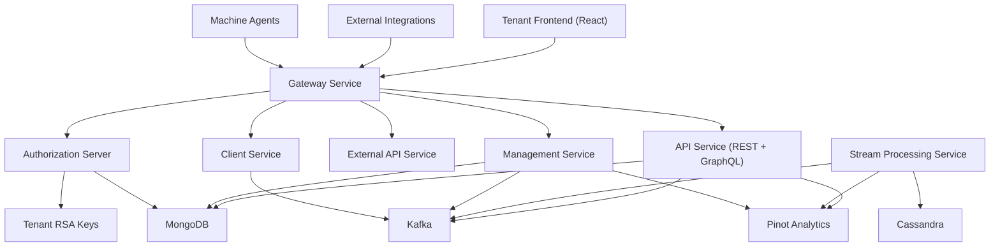
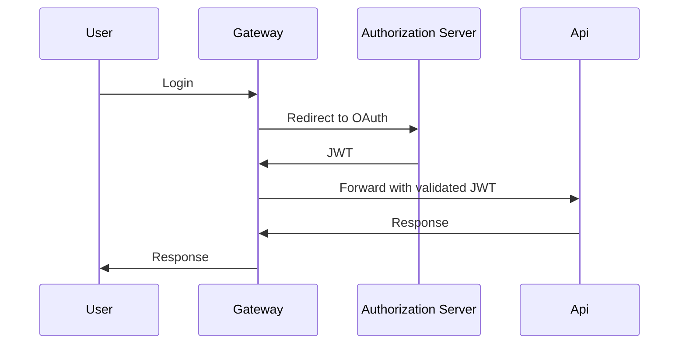
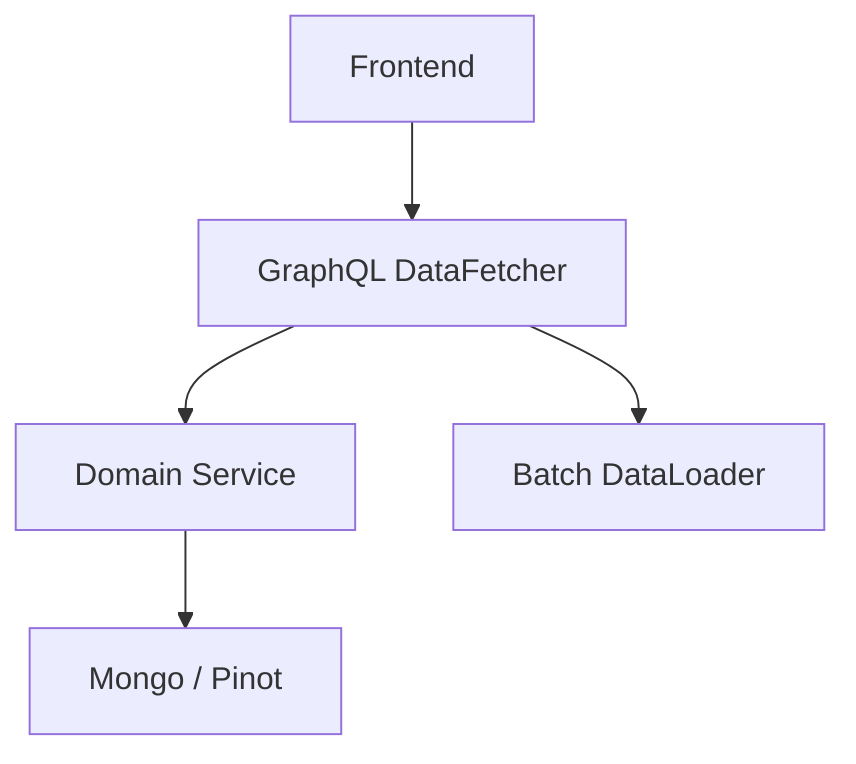
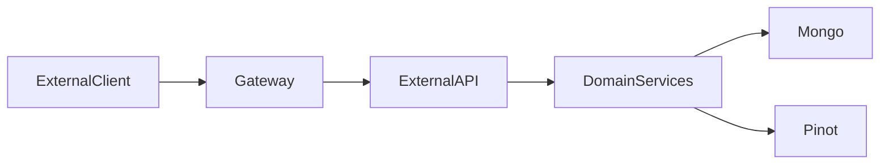
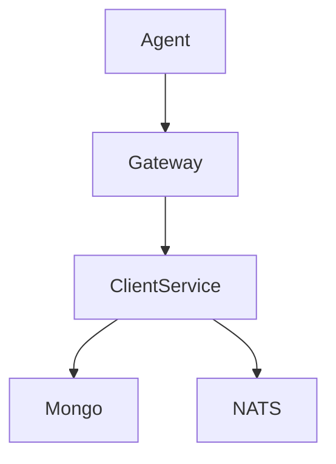
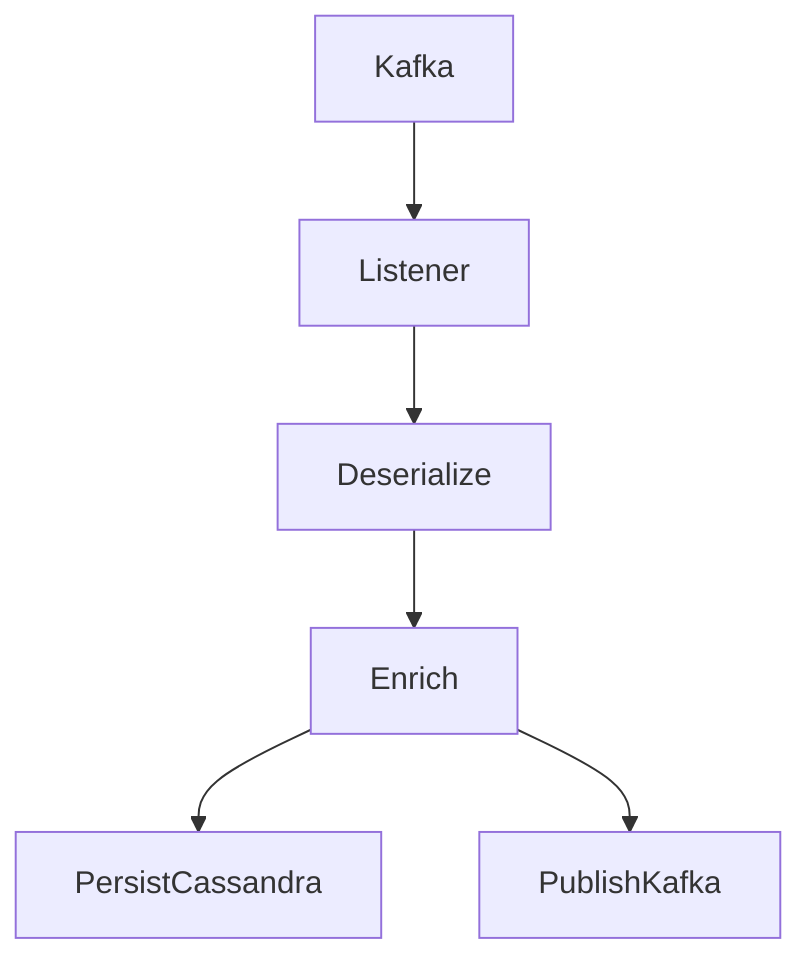
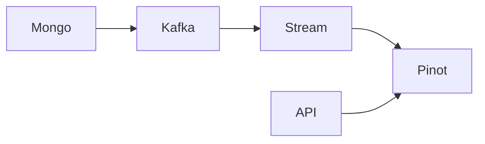
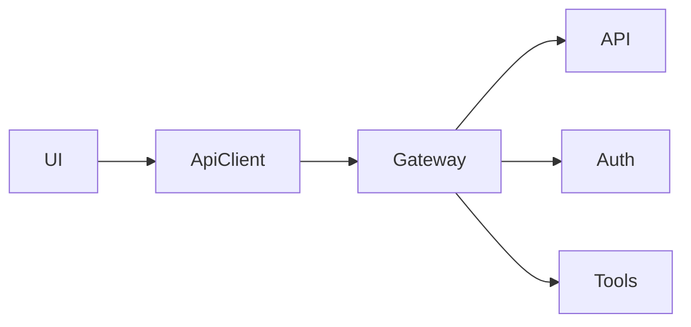
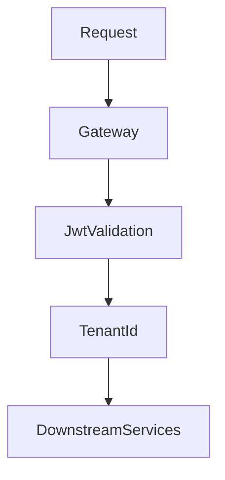

# OpenFrame OSS Tenant – Repository Overview

The **`openframe-oss-tenant`** repository contains the full multi-service, multi-tenant backend and frontend stack that powers the OpenFrame platform.

It delivers:

- ✅ Multi-tenant identity & authorization (OAuth2 / OIDC)
- ✅ Gateway-based edge security (JWT + API keys + rate limiting)
- ✅ Internal REST + GraphQL APIs
- ✅ Public External API layer
- ✅ Real-time stream processing (Kafka + Debezium)
- ✅ Analytics (Pinot) + operational storage (Mongo + Cassandra)
- ✅ Agent & tool integration layer
- ✅ Management control plane
- ✅ Tenant frontend application
- ✅ Config server & distributed scheduling

This repository is the **complete OSS reference implementation** of OpenFrame’s tenant architecture.

---

# 1. End-to-End System Architecture

Below is the full high-level architecture of the OpenFrame OSS Tenant stack:



---

# 2. Repository Structure

The repository is organized into:

## A. Core Libraries (`openframe-oss-lib/`)

Reusable modules shared across services:

| Module | Purpose |
|--------|---------|
| `openframe-api-service-core` | Internal REST + GraphQL API layer |
| `openframe-api-lib` | DTOs, mappers, domain services |
| `openframe-authorization-service-core` | OAuth2 / OIDC authorization server |
| `openframe-gateway-service-core` | Reactive edge gateway |
| `openframe-external-api-service-core` | Public API key–secured REST API |
| `openframe-client-core` | Agent registration + lifecycle |
| `openframe-management-service-core` | Initialization + scheduling |
| `openframe-stream-service-core` | Kafka ingestion + enrichment |
| `openframe-data-mongo` | Mongo documents + repositories |
| `openframe-data-kafka` | Kafka infrastructure |
| `openframe-data` | Pinot + Cassandra configuration |
| `openframe-security-core` | JWT + PKCE + security utilities |
| `openframe-security-oauth` | OAuth BFF + redirect logic |

---

## B. Deployable Services (`openframe/services/`)

Each service is independently deployable:

| Service | Entrypoint | Responsibility |
|----------|------------|----------------|
| API | `ApiApplication` | Internal REST + GraphQL |
| Authorization | `OpenFrameAuthorizationServerApplication` | OAuth2 / OIDC |
| Gateway | `GatewayApplication` | Edge routing + JWT validation |
| External API | `ExternalApiApplication` | Public API |
| Client | `ClientApplication` | Agent registration |
| Management | `ManagementApplication` | Initialization + scheduling |
| Stream | `StreamApplication` | Kafka processing |
| Config | `ConfigServerApplication` | Centralized configuration |
| Frontend | React app | Tenant UI |

---

# 3. Core Architectural Layers

The platform is built using layered microservices.

---

## 3.1 Edge & Security Layer

### Gateway Service Core
- JWT validation (multi-tenant issuer resolution)
- API key authentication
- Rate limiting
- WebSocket proxying
- Tool proxy routing

### Authorization Server Core
- OAuth2 Authorization Code + PKCE
- OIDC login
- Google & Microsoft SSO
- Tenant-aware JWT signing
- Per-tenant RSA keys
- Mongo-backed OAuth persistence

Security Flow:



---

## 3.2 Internal API Layer

### API Service Core (REST + GraphQL)

Provides:
- GraphQL queries (Netflix DGS)
- REST mutations
- Cursor-based pagination
- DataLoader batching
- SSO configuration management
- Device, organization, event querying

GraphQL Execution Flow:



---

## 3.3 External API Layer

### External API Service Core

- API key secured
- Cursor pagination
- Filtering & sorting
- OpenAPI documented
- Tool proxy support

External API Flow:



---

## 3.4 Agent & Tool Integration Layer

### Client Service Core

Handles:
- Agent registration
- OAuth token issuance
- Machine heartbeat tracking
- Tool agent synchronization
- NATS event subscriptions

Agent Flow:



---

## 3.5 Stream Processing Layer

### Stream Processing Core

- Kafka CDC ingestion
- Debezium event handling
- Tool-specific deserializers
- Unified event mapping
- Redis-backed enrichment
- Cassandra persistence
- Kafka re-publication
- Fleet activity join (Kafka Streams)

Stream Pipeline:



---

## 3.6 Data Platform Layer

### MongoDB
- Users
- Organizations
- Devices
- OAuth clients
- Tool metadata

### Cassandra
- Operational distributed storage
- Keyspace normalization

### Pinot
- Real-time analytics
- Device filters
- Log queries
- Aggregations

Analytics Flow:



---

## 3.7 Management & Initialization

### Management Service Core

Handles:

- Pinot schema deployment
- NATS stream creation
- Debezium connector initialization
- Tool lifecycle management
- Distributed scheduled jobs (ShedLock + Redis)
- Agent version publishing

---

## 3.8 Frontend (Tenant Application)

Located at:

```
openframe/services/openframe-frontend/src
```

Provides:

- ApiClient with automatic token refresh
- AuthApiClient for OAuth flows
- Fleet & Tactical tool clients
- Zustand-based state stores
- Mingo AI chat integration
- GraphQL ticket dialog handling

Frontend Communication Flow:



---

# 4. Cross-Cutting Infrastructure

## Kafka Infrastructure (`data_kafka_integration`)
- Tenant-aware Kafka config
- Topic auto-creation
- Debezium message modeling
- Producer recovery strategy

## Security Core
- RSA JWT encoder/decoder
- PKCE utilities
- OAuth BFF controller
- Redirect resolver

## Mongo Repositories
- Cursor pagination
- Multi-tenant isolation
- Soft delete support
- Reactive + blocking repos

---

# 5. Multi-Tenancy Model

Tenant isolation is implemented through:

- JWT claim: `tenant_id`
- ThreadLocal TenantContext (Auth server)
- Tenant-aware Mongo documents
- Per-tenant RSA keys
- Tenant-scoped Redis locks
- Tenant-specific issuer validation

Tenant Context Flow:



---

# 6. Deployment Model

Each service is:

- Independently deployable
- Horizontally scalable
- Container-ready
- Config-server driven
- Kafka-integrated
- Mongo-backed
- Observability-ready

Typical production stack includes:

- Gateway
- Authorization Server
- API Service
- External API
- Stream Processing
- Management
- Client Service
- Config Server
- MongoDB
- Kafka
- Pinot
- Cassandra
- Redis
- NATS

---

# 7. Design Principles

1. Strict tenant isolation
2. Separation of operational vs analytical storage
3. Event-driven architecture
4. Reactive edge security
5. Extensible processor interfaces
6. Cursor-based pagination everywhere
7. Stateless JWT-based services
8. Idempotent infrastructure initialization

---

# 8. Summary

The **`openframe-oss-tenant`** repository is a complete multi-tenant AI-enabled MSP backend platform.

It integrates:

- OAuth2 Authorization Server
- Reactive Gateway
- GraphQL + REST APIs
- API key–secured External API
- Agent lifecycle management
- Kafka-based event processing
- Analytics with Pinot
- Operational persistence with Mongo & Cassandra
- Distributed scheduling & initialization
- AI-powered frontend (Mingo)
- Fully containerized microservice architecture

This repository represents the **full reference architecture of OpenFrame OSS Tenant**, spanning identity, data, streaming, analytics, tool integrations, and frontend communication in a unified, production-ready stack.