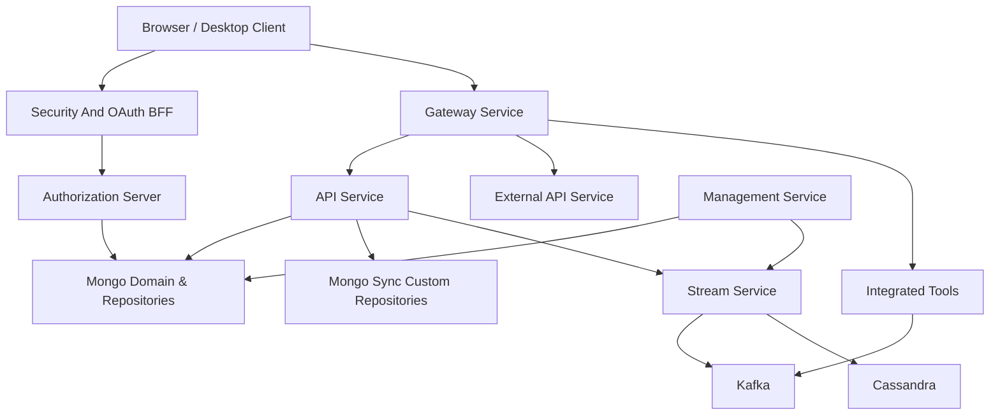
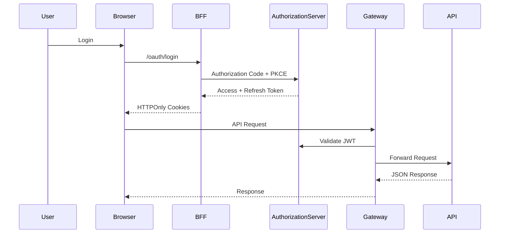
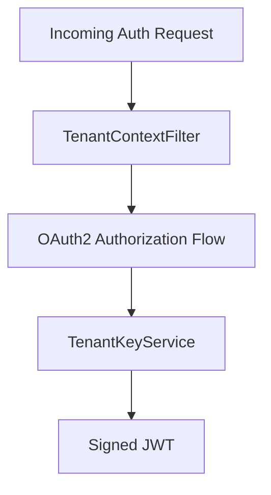
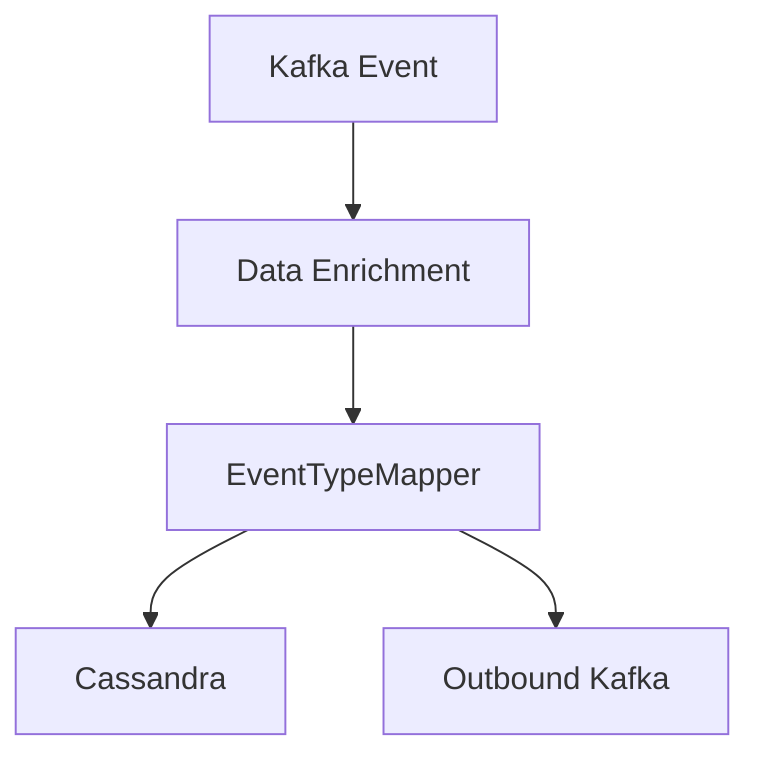

# OpenFrame OSS Tenant – Repository Overview

The **`openframe-oss-tenant`** repository is the open-source, multi-service tenant runtime of the OpenFrame platform. It packages all core services, shared libraries, and client modules required to run a full OpenFrame tenant stack, including:

- Identity & OAuth (multi-tenant Authorization Server)
- API & GraphQL layer
- Reactive Gateway & WebSocket proxy
- Stream processing & CDC ingestion
- Management control plane
- Mongo persistence layer
- Security & OAuth BFF
- Desktop Chat client core
- Shared API contracts and DTOs

It represents a **complete microservice-based architecture** designed for MSP environments, enabling secure multi-tenant operations, real-time event processing, and integrated tool orchestration.

---

# 1. Purpose of the Repository

The repository provides:

- ✅ A **multi-tenant SaaS-ready backend**
- ✅ Full **OAuth2 / OIDC identity provider**
- ✅ GraphQL + REST API runtime
- ✅ Reactive gateway with JWT & API key enforcement
- ✅ Kafka-based stream processing & enrichment
- ✅ MongoDB domain and advanced query layer
- ✅ Operational management & schedulers
- ✅ Secure OAuth BFF for browser clients
- ✅ Desktop Chat client integration

It enables deployment of:

- Single-tenant OSS clusters
- Shared multi-tenant SaaS clusters
- Edge gateway + tool proxy integrations
- Real-time MSP operations across devices, tickets, and events

---

# 2. End-to-End Platform Architecture

Below is the complete architectural flow of the `openframe-oss-tenant` stack.

---

## High-Level Responsibilities

| Layer | Responsibility |
|--------|----------------|
| Gateway | Edge routing, JWT validation, WebSocket proxy |
| Authorization Server | OAuth2, OIDC, multi-tenant identity |
| Security & OAuth BFF | Browser-safe PKCE login flows |
| API Service | Business logic (GraphQL + REST) |
| Management Service | Schedulers, migrations, tool orchestration |
| Stream Service | CDC ingestion, enrichment, event routing |
| Mongo Domain | Canonical document models |
| Mongo Sync | Advanced filtering, pagination, analytics |
| Chat Client Core | Desktop client GraphQL runtime |

---

# 3. Authentication & Request Flow

Security guarantees:

- PKCE enforced
- HTTPOnly cookie token storage
- Multi-issuer JWT validation
- Strict role-based route enforcement

---

# 4. Repository Structure & Core Modules

The repository is composed of modular service cores and entrypoints.

---

## 4.1 Chat Client Core  
**Path:** `clients/openframe-chat/src`

Provides the frontend runtime layer for the OpenFrame Chat desktop client.

### Core Components

- `DebugModeContextType`
- `DialogGraphQlService`
- `TicketGraphQlService`
- `TokenService`

### Responsibilities

- Token lifecycle management via Tauri
- GraphQL dialog & ticket communication
- Pagination & typed API integration
- Desktop runtime debug context

📘 See:  
`chat-client-core`

---

## 4.2 API Contracts and Mapping  
**Path:** `openframe-oss-lib/openframe-api-lib`

Defines shared DTOs, pagination primitives, filter contracts, and entity mappers.

### Key Features

- Relay-compatible `ConnectionArgs`
- `CursorCodec` (opaque Base64 cursors)
- Domain filter criteria (Device, Event, Ticket, Tool, Org)
- Centralized mappers (e.g., `OrganizationMapper`)

📘 See:  
`api-contracts-and-mapping`

---

## 4.3 API Service Core  
**Path:** `openframe-oss-lib/openframe-api-service-core`

Primary business API layer.

### Features

- REST Controllers
- GraphQL DataFetchers (Relay compliant)
- DataLoader batching
- JWT resource server integration
- Processor extension hooks

📘 See:  
`api-service-core`

---

## 4.4 Authorization Server Core  
**Path:** `openframe-oss-lib/openframe-authorization-service-core`

Multi-tenant OAuth2 / OIDC identity provider.

### Capabilities

- Authorization Code + PKCE
- Per-tenant RSA key generation
- JWT customization (`tenant_id`, roles)
- Google & Microsoft SSO
- Tenant onboarding & invitations

📘 See:  
`authorization-server-core`

---

## 4.5 Gateway Service Core  
**Path:** `openframe-oss-lib/openframe-gateway-service-core`

Reactive edge proxy built on Spring WebFlux.

### Features

- Multi-issuer JWT validation
- API key authentication
- Rate limiting
- WebSocket proxying
- Tool upstream resolution strategies

📘 See:  
`gateway-service-core`

---

## 4.6 Management Service Core  
**Path:** `openframe-oss-lib/openframe-management-service-core`

Operational control plane.

### Responsibilities

- Schedulers (ShedLock + Redis)
- Mongo migrations (Mongock)
- Tool lifecycle management
- Release version propagation
- NATS & stream initialization

📘 See:  
`management-service-core`

---

## 4.7 Stream Processing Core  
**Path:** `openframe-oss-lib/openframe-stream-service-core`

Kafka-based real-time enrichment engine.

### Responsibilities

- Debezium CDC consumption
- Tenant validation
- Device & org enrichment
- Unified event normalization
- Cassandra persistence
- Kafka Streams joins

📘 See:  
`stream-processing-core`

---

## 4.8 Mongo Domain and Repositories  
**Path:** `openframe-oss-lib/openframe-data-mongo-common`

Canonical Mongo document definitions:

- `AuthUser`
- `Organization`
- `Device`
- `Ticket`
- `Notification`
- `OAuthToken`
- `MongoRegisteredClient`

Defines indexing & multi-tenant constraints.

📘 See:  
`mongo-domain-and-repositories`

---

## 4.9 Mongo Sync Custom Repositories  
**Path:** `openframe-oss-lib/openframe-data-mongo-sync`

Advanced Mongo query implementations:

- Cursor-based pagination
- Aggregation analytics
- Bulk updates
- Composite sorting strategies

📘 See:  
`mongo-sync-custom-repositories`

---

## 4.10 Security and OAuth BFF  
**Path:** `openframe-oss-lib/openframe-security-core`  
**Path:** `openframe-oss-lib/openframe-security-oauth`

Provides:

- PKCE utilities
- RSA JWT encoder/decoder
- OAuth login orchestration
- Secure cookie management
- Redirect resolution logic

📘 See:  
`security-and-oauth-bff`

---

## 4.11 Service Entrypoints  
**Path:** `openframe/services`

Spring Boot main applications:

- API
- Authorization Server
- Gateway
- Stream
- Management
- External API
- Client Service
- Config Server

Each service is independently deployable and scalable.

📘 See:  
`service-entrypoints`

---

# 5. Multi-Tenant Design Principles

The entire repository enforces tenant isolation through:

- Tenant-aware JWT claims
- TenantContext filtering
- Per-tenant RSA signing keys
- Mongo compound indexes
- Tenant-scoped Redis locks
- Tenant validation in stream ingestion

---

# 6. Architectural Characteristics

| Characteristic | Implementation |
|----------------|----------------|
| Multi-Tenant | TenantContext + issuer-based JWT |
| Event-Driven | Kafka + Debezium + Streams |
| Reactive Edge | Spring WebFlux Gateway |
| Relay GraphQL | Cursor pagination + Node resolution |
| Strong Security | PKCE, RSA signing, issuer validation |
| Horizontal Scaling | Independent microservices |
| Observability | Structured event model |
| Extensibility | Processor hook pattern |

---

# 7. Summary

The **`openframe-oss-tenant`** repository is a full-stack, multi-service tenant runtime for OpenFrame.

It delivers:

- Identity (OAuth2 / OIDC)
- API & GraphQL runtime
- Secure gateway & proxy
- Real-time stream enrichment
- Mongo persistence layer
- Operational control plane
- Secure OAuth BFF
- Desktop Chat client integration

It forms the **complete OSS tenant deployment stack**, enabling MSP-focused, multi-tenant, event-driven IT automation infrastructure.