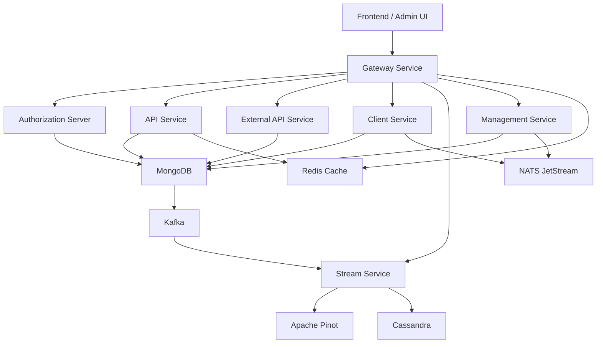
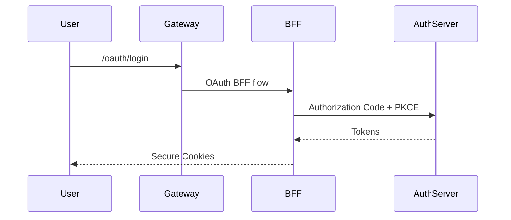
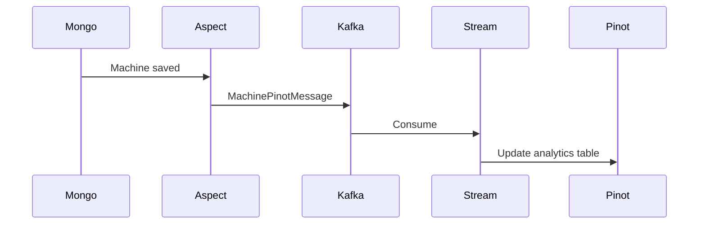
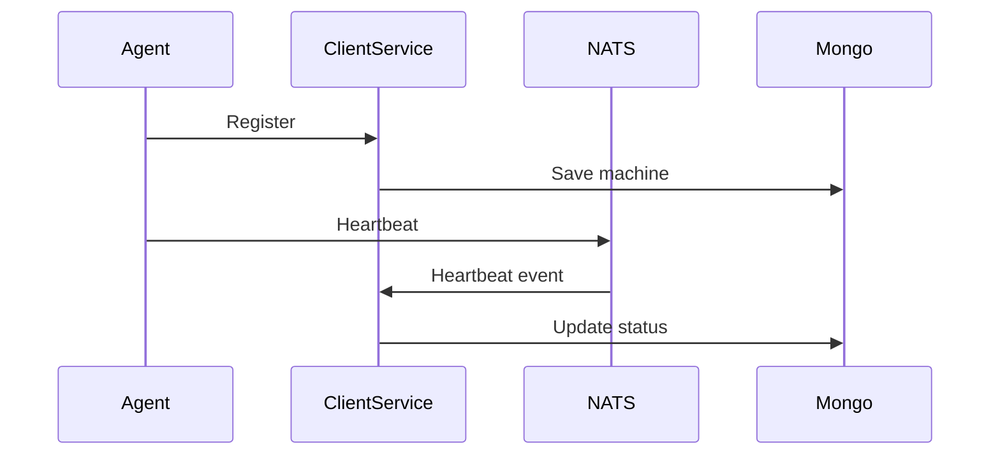

# OpenFrame OSS Tenant – Repository Overview

The **`openframe-oss-tenant`** repository is the open-source, multi-tenant foundation of the OpenFrame platform — the unified AI-driven MSP stack behind Flamingo.

It contains:

- ✅ All microservice entrypoints  
- ✅ Shared platform libraries (data, security, streaming, messaging)  
- ✅ Authorization and OAuth infrastructure  
- ✅ Gateway and API layers  
- ✅ Client and agent lifecycle services  
- ✅ Analytics and event processing backbone  
- ✅ Config, cache, notification, and infrastructure modules  
- ✅ Frontend Chat Client (React + Tauri)

This repository defines the **entire end-to-end backend control plane and data plane** of OpenFrame.

---

# 1️⃣ Purpose of the Repository

`openframe-oss-tenant` provides:

- A **multi-tenant MSP backend architecture**
- Full OAuth2 / OIDC identity management
- Device & tool lifecycle management
- API & GraphQL interfaces
- Event streaming & CDC processing
- Real-time analytics via Pinot
- Distributed messaging (Kafka + NATS)
- Centralized configuration
- Secure gateway edge layer
- Agent communication infrastructure

It is designed for:

- Managed Service Providers (MSPs)
- SaaS multi-tenant deployments
- Tool-integrated automation platforms
- AI-enhanced operations via OpenFrame

---

# 2️⃣ End-to-End Platform Architecture

Below is the complete system view of the repository.

---

# 3️⃣ Service-Level Architecture

## Edge Layer

- **Gateway Service Entrypoint**
- **Gateway Service Core**
- JWT validation
- API key enforcement
- Rate limiting
- WebSocket proxy
- Multi-tenant issuer resolution

## Identity Layer

- **Authorization Server Entrypoint**
- **Authorization Server Core**
- OAuth2 Authorization Code + PKCE
- OIDC support
- Per-tenant RSA key isolation
- SSO (Google, Microsoft)
- Dynamic client registration

## API Layer

- **API Service Entrypoint**
- **API Service Core Modules**
  - REST Controllers
  - GraphQL Layer
  - Domain Services
  - DTO Contracts

## External Integration Layer

- **External API Service Entrypoint**
- **External API Service Core**
- API key–secured REST APIs
- Tool proxy routing

## Client & Agent Layer

- **Client Service Entrypoint**
- **Client Service Core**
- Agent authentication
- Registration
- Heartbeats
- Tool connections
- NATS-driven lifecycle updates

## Stream & Analytics Layer

- **Stream Service Entrypoint**
- **Stream Processing Core**
- Kafka ingestion
- Debezium CDC
- Tool event normalization
- Pinot enrichment
- Cassandra persistence

## Infrastructure Layer

- **Config Service**
- **Data Persistence Mongo**
- **Data Cache Redis**
- **Data Transport Kafka**
- **Data Platform Pinot & Cassandra**
- **Notification Mail**
- **Shared Security & OAuth BFF**
- **Shared Core Utilities**

---

# 4️⃣ Microservice Interaction Flow

### Authentication Flow

---

### Device Update → Analytics Flow

---

### Agent Lifecycle Flow

---

# 5️⃣ Repository Structure Overview

The repository is divided into:

## 🟢 Service Entrypoints

- `api_service_entrypoint`
- `authorization_server_entrypoint`
- `gateway_service_entrypoint`
- `external_api_service_entrypoint`
- `management_service_entrypoint`
- `stream_service_entrypoint`
- `client_service_entrypoint`
- `config_service_entrypoint`

These modules are the executable Spring Boot applications.

---

## 🔵 Service Core Libraries

- `api_service_config_and_security`
- `api_service_rest_controllers`
- `api_service_graphql_layer`
- `api_service_domain_services_and_processors`
- `authorization_server_core`
- `gateway_service_core`
- `external_api_service_core`
- `management_service_core`
- `stream_processing_core`
- `client_service_core`
- `config_service_core`

These modules contain domain and business logic.

---

## 🟡 Shared Platform Libraries

- `data_persistence_mongo`
- `data_cache_redis`
- `data_transport_kafka`
- `data_platform_and_pinot_cassandra`
- `shared_security_and_oauth_bff`
- `shared_core_utilities`
- `notification_mail`

These modules are infrastructure and reusable foundations.

---

## 🟣 Frontend Client

- `frontend_chat_client`

React + Tauri desktop chat interface:
- TokenService
- GraphQL chat client
- SupportedModelsService
- DebugModeContext

---

# 6️⃣ Core Module Documentation References

Below are the most critical core documentation modules:

### Identity
- `authorization_server_core`
- `shared_security_and_oauth_bff`

### API Layer
- `api_service_rest_controllers`
- `api_service_graphql_layer`
- `api_service_domain_services_and_processors`
- `api_contracts_and_mapping`
- `api_service_dtos`

### Edge & Security
- `gateway_service_core`

### Data & Streaming
- `data_persistence_mongo`
- `data_transport_kafka`
- `data_platform_and_pinot_cassandra`
- `stream_processing_core`

### Client & Agents
- `client_service_core`

### Infrastructure
- `config_service_core`
- `data_cache_redis`
- `notification_mail`
- `shared_core_utilities`

---

# 7️⃣ Architectural Characteristics

| Characteristic | Description |
|---------------|-------------|
| Multi-Tenant | Tenant-aware JWT, per-tenant keys, tenant keyspaces |
| Event-Driven | Kafka + Debezium + NATS |
| Analytics-Ready | Pinot OLAP + Cassandra wide-column |
| Reactive Edge | WebFlux Gateway |
| OAuth2 First | Authorization Code + PKCE |
| Pluggable Infrastructure | Conditional Spring beans |
| Clean Layering | Controller → Service → Repository |
| Cursor Pagination | Consistent across GraphQL & REST |
| Extensible | Processor hooks with conditional beans |

---

# 8️⃣ System Philosophy

The repository embodies these principles:

- **Thin Entrypoints**
- **Infrastructure as Libraries**
- **Event-Driven Consistency**
- **Tenant Isolation**
- **Secure by Default**
- **Reactive at the Edge**
- **Analytical Separation**
- **Contract-Driven APIs**

---

# 9️⃣ Summary

The `openframe-oss-tenant` repository is a **complete, production-grade, multi-tenant MSP backend platform** composed of:

- 8+ microservices
- Shared infrastructure libraries
- OAuth2 identity provider
- Reactive API gateway
- REST + GraphQL APIs
- Kafka + NATS streaming
- Mongo operational storage
- Pinot analytics
- Cassandra event persistence
- Redis caching
- Config server
- Email notification layer
- Desktop AI chat client

It defines the entire OpenFrame backend control plane and serves as the open-source core of Flamingo’s AI-powered MSP platform.