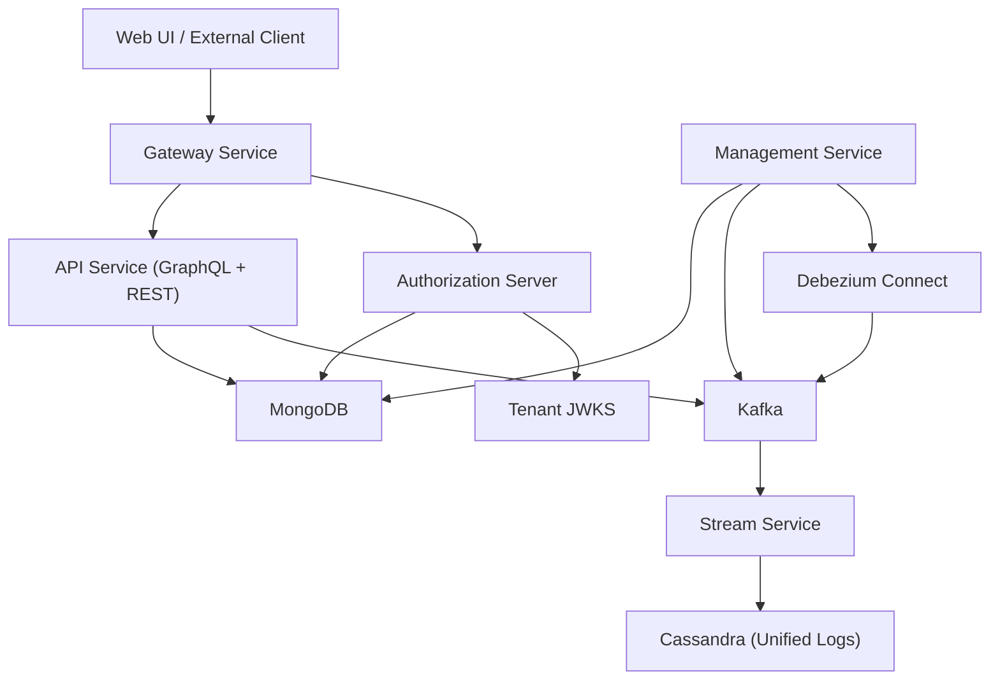
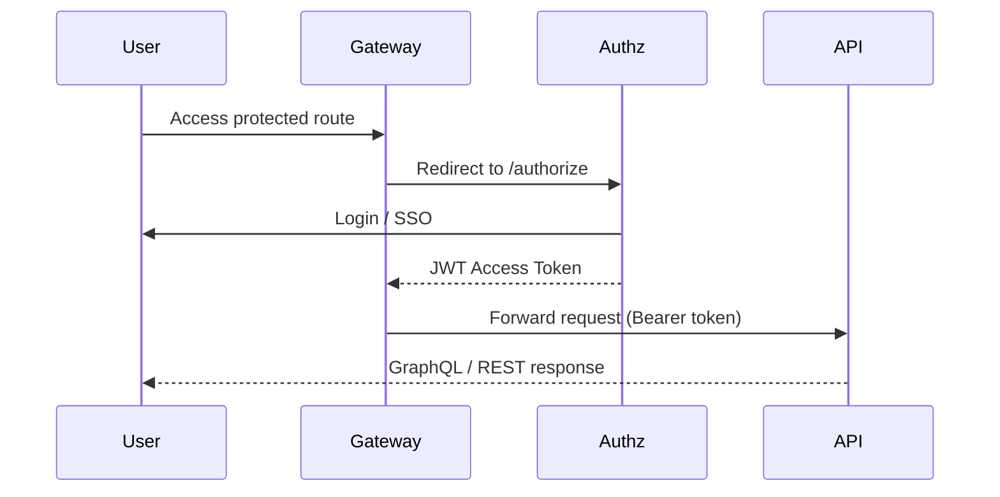
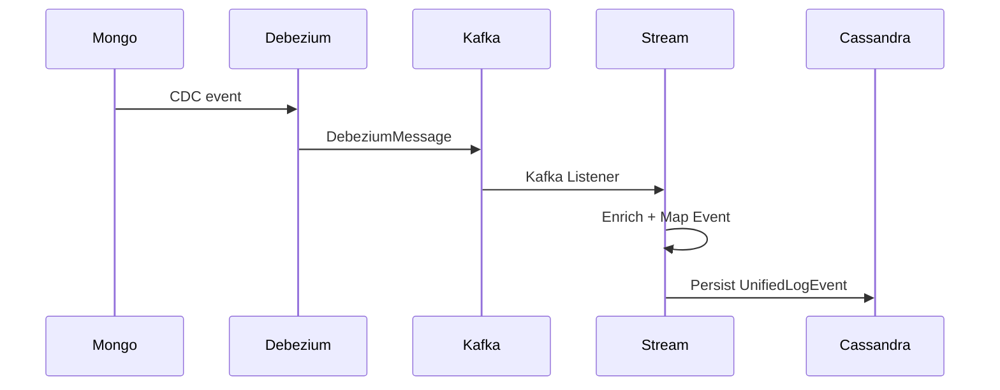
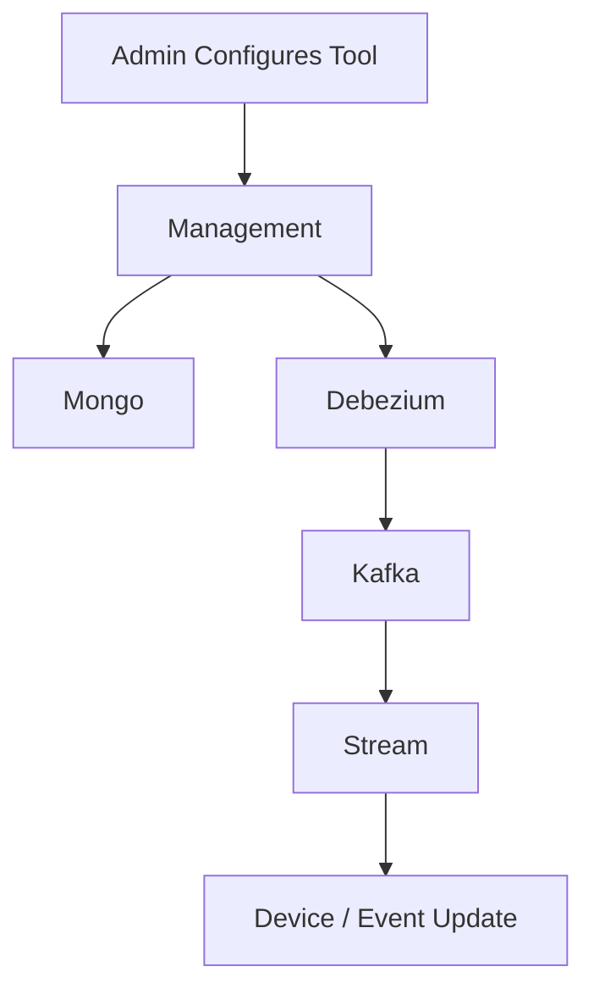
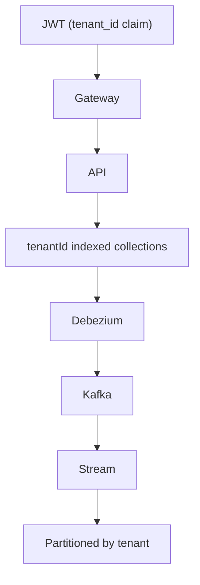

# OpenFrame OSS Tenant – Repository Overview

The **`openframe-oss-tenant`** repository is the open-source, multi-tenant backend platform powering OpenFrame.  
It provides a complete, production-ready stack for:

- Multi-tenant identity & OAuth2 (Authorization Server)
- Secure edge routing (Gateway)
- GraphQL + REST APIs (API Service)
- Event-driven processing (Kafka + Debezium + Streams)
- MongoDB domain modeling
- Distributed orchestration (Management Service)
- Tool integrations (RMM, MDM, MeshCentral, Tactical, etc.)

It is designed as a **modular microservice architecture** where each service composes reusable core libraries.

---

# 1. End-to-End Architecture

At runtime, OpenFrame OSS Tenant forms a layered, event-driven, multi-tenant platform.

### Architectural Characteristics

- ✅ Multi-tenant (tenant-scoped data, keys, connectors)
- ✅ OAuth2 / OIDC compliant
- ✅ GraphQL + Relay support
- ✅ Kafka-based CDC & streaming
- ✅ Debezium-managed tool synchronization
- ✅ Distributed scheduling with ShedLock
- ✅ Pluggable upstream tool routing
- ✅ Replaceable domain processors

---

# 2. Repository Structure

The repository is composed of:

## A. Core Libraries (`openframe-oss-lib/`)

These provide reusable infrastructure and domain logic.

| Module | Responsibility |
|--------|---------------|
| api-service-core-graphql-and-rest | REST + GraphQL orchestration layer |
| api-service-core-dataloaders-and-relay | GraphQL DataLoader + Relay node resolution |
| api-service-core-dto | API request/response contracts |
| api-service-core-domain-services | Business logic layer |
| api-contracts-and-mapping | Shared DTOs, filters, pagination, mapping |
| authorization-server-core | Multi-tenant OAuth2/OIDC server |
| gateway-service-core | Reactive edge gateway |
| management-service-core | Orchestration, schedulers, migrations |
| stream-service-core | Kafka + Debezium event processing |
| data-mongo-domain-and-repositories | MongoDB domain model |
| data-mongo-sync-configuration-and-custom-repositories | Custom Mongo repositories |
| data-kafka-and-debezium | Kafka + Debezium infrastructure |
| security-oauth-bff | OAuth Backend-for-Frontend layer |

---

## B. Executable Services (`openframe/services/`)

These are deployable Spring Boot applications:

| Application | Purpose |
|-------------|----------|
| openframe-api | Business API surface |
| openframe-authorization-server | OAuth2 identity provider |
| openframe-gateway | Edge routing and security |
| openframe-management | Operational control plane |
| openframe-stream | Event processing engine |
| openframe-external-api | Public integration surface |
| openframe-client | Client/backend integration layer |
| openframe-config | Central configuration server |

---

# 3. Core Service Interaction Flow

## 3.1 Authentication & API Access

- JWT contains:
  - `tenant_id`
  - `roles`
  - `userId`
- Gateway validates issuer per tenant
- API acts as OAuth2 resource server

---

## 3.2 Change Data Capture & Streaming

- Debezium connectors are auto-provisioned
- Connectors are health-monitored and rate-limited
- Stream Service normalizes tool events into unified taxonomy

---

## 3.3 Tool Integration Flow

- Integrated tools are stored in Mongo
- Debezium connectors stream their data
- Stream Service enriches with tenant/device context
- API layer exposes normalized data

---

# 4. Core Modules Documentation

Below are the key modules and their architectural roles.

---

## 4.1 API Service Core (GraphQL + REST)

**Purpose:** Application-layer orchestration.

- Exposes REST controllers
- Provides Relay-compliant GraphQL schema
- Uses DataLoaders to eliminate N+1 queries
- Delegates business logic to domain services
- Stateless and multi-tenant aware

Key Submodules:

- `api-service-core-graphql-and-rest`
- `api-service-core-dataloaders-and-relay`
- `api-service-core-dto`
- `api-service-core-domain-services`

---

## 4.2 Authorization Server Core

**Purpose:** Identity and token issuance.

- OAuth2 Authorization Code + PKCE
- Refresh token support
- Per-tenant RSA key pairs
- Dynamic SSO provider registration
- Mongo-backed OAuth persistence

Key components:

- `TenantContextFilter`
- `TenantKeyService`
- `MongoAuthorizationService`
- Dynamic client registration strategies

---

## 4.3 Gateway Service Core

**Purpose:** Reactive edge enforcement.

- JWT validation (multi-issuer)
- API key authentication + rate limiting
- WebSocket proxy for tools
- CORS handling
- Tool upstream resolution

Acts as the security boundary of the platform.

---

## 4.4 Data Mongo Domain Layer

**Purpose:** Tenant-scoped persistence model.

Defines:

- Users
- Organizations
- Devices
- Tickets
- Notifications
- OAuth clients
- Feature flags

Characteristics:

- Compound tenant indexes
- Soft deletion patterns
- Filter-object query pattern
- Technology-agnostic base repositories

---

## 4.5 Stream Service Core

**Purpose:** Event ingestion & normalization.

- Kafka listeners
- Tool-specific deserializers
- Event type mapping
- Tenant-aware enrichment
- Cassandra persistence

Supports:

- Tactical RMM
- MeshCentral
- Fleet MDM
- CDC events

---

## 4.6 Management Service Core

**Purpose:** Operational orchestration.

- Scheduled jobs
- Connector provisioning
- NATS stream initialization
- Ticket migrations
- Version propagation
- Tool lifecycle management

Uses:

- Spring Retry
- ShedLock (distributed scheduling)
- Mongock migrations

---

## 4.7 Kafka & Debezium Infrastructure

**Purpose:** Messaging backbone.

Provides:

- Tenant-aware Kafka configuration
- Topic auto-creation
- Debezium connector initializer
- Connector health reconciliation
- Mongo-backed recreation throttling

Ensures reliable CDC streaming.

---

## 4.8 Security OAuth BFF

**Purpose:** Cookie-based OAuth boundary.

- PKCE + state handling
- Token storage in HTTP-only cookies
- Refresh & logout endpoints
- Dev-ticket exchange for development

Prevents frontend token exposure.

---

# 5. Multi-Tenant Isolation Model

Tenant isolation exists at multiple layers:

Isolation mechanisms:

- Tenant-aware JWT issuer
- Per-tenant RSA keys
- Indexed `tenantId` in Mongo
- Tenant-scoped Debezium connectors
- Kafka topic separation
- Cassandra partition keys

---

# 6. Design Principles

The repository follows strict architectural principles:

- ✅ Clean layered architecture
- ✅ Replaceable default processors
- ✅ Domain-driven design
- ✅ Multi-tenant by default
- ✅ Event-driven communication
- ✅ Deterministic cursor pagination
- ✅ Strong validation boundaries (DTO layer)
- ✅ Infrastructure isolation from business logic

---

# 7. What This Repository Provides

The `openframe-oss-tenant` repository delivers:

- A fully multi-tenant backend platform
- Identity, API, and streaming infrastructure
- Tool integration foundation
- Event normalization and auditing backbone
- Operational control plane
- Extensible architecture for SaaS overlays

It is the **complete open-source tenant runtime** for OpenFrame.

---

# Summary

The **OpenFrame OSS Tenant** repository is a modular, multi-service backend platform built around:

- OAuth2 identity
- GraphQL + REST APIs
- Kafka + Debezium event streaming
- MongoDB multi-tenant domain modeling
- Distributed operational orchestration
- Secure gateway routing

It forms the foundation upon which OpenFrame builds intelligent MSP automation, tool unification, and AI-enhanced IT operations.