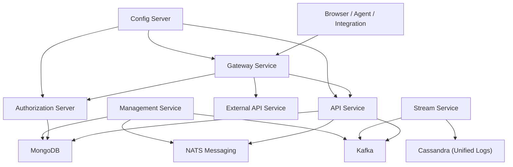
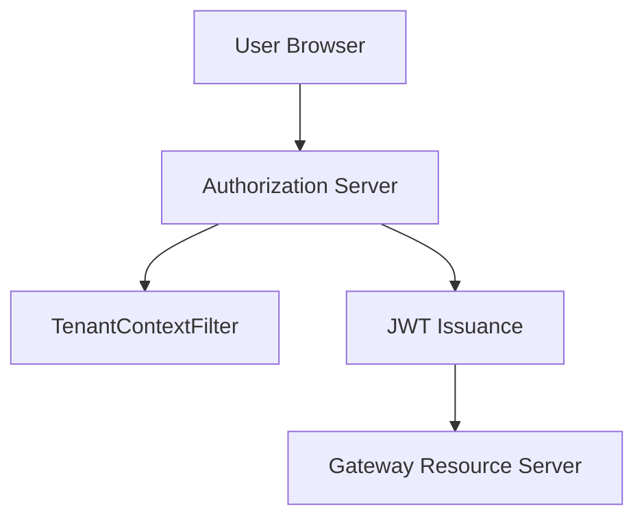
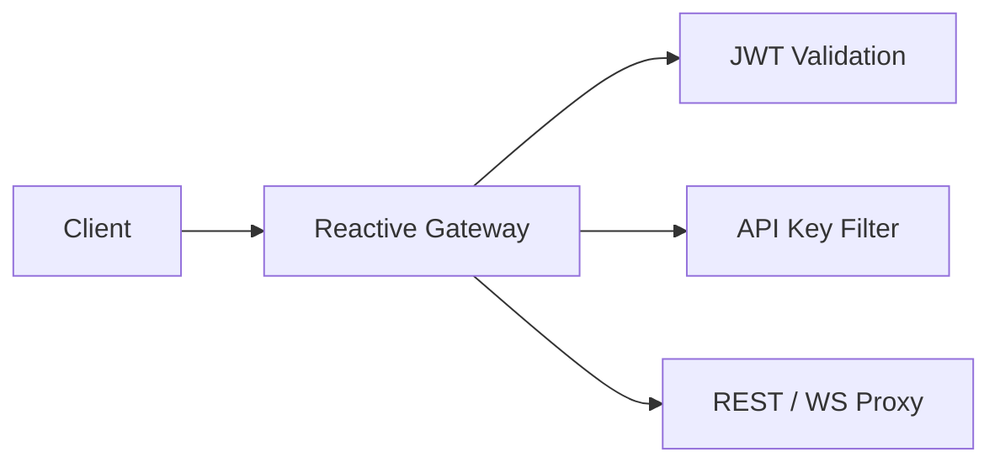
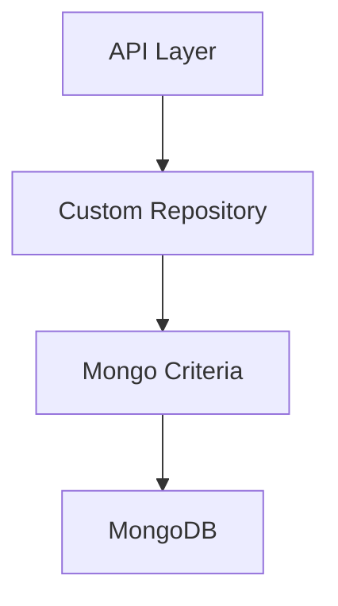
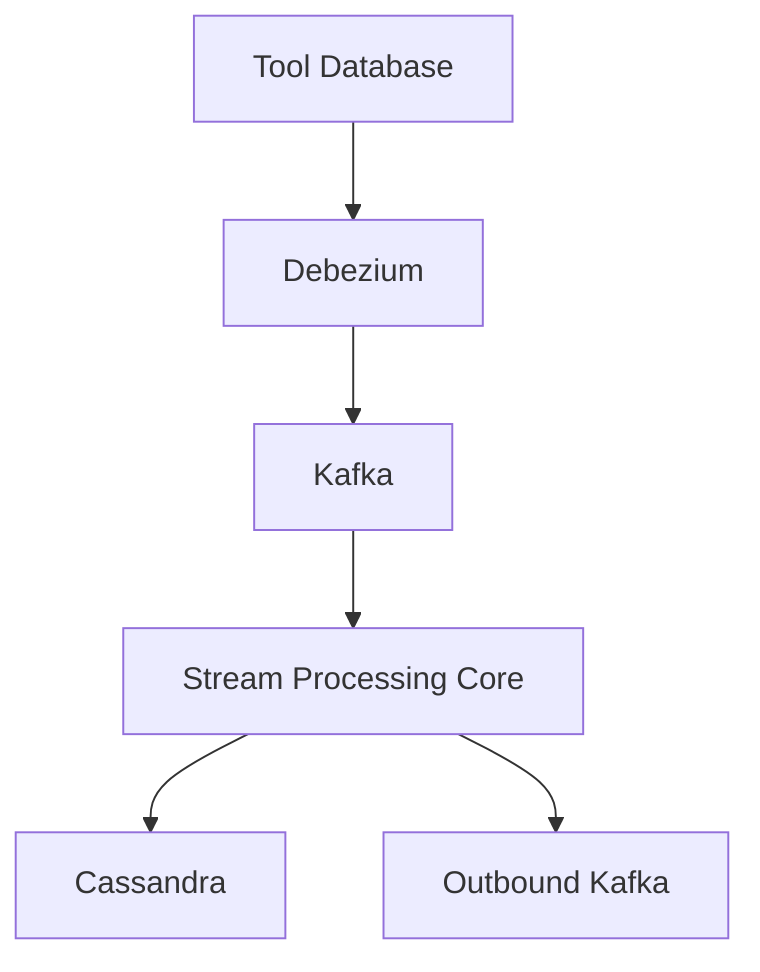
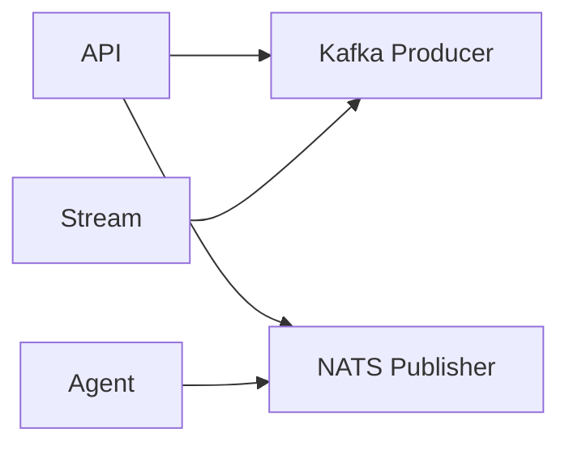
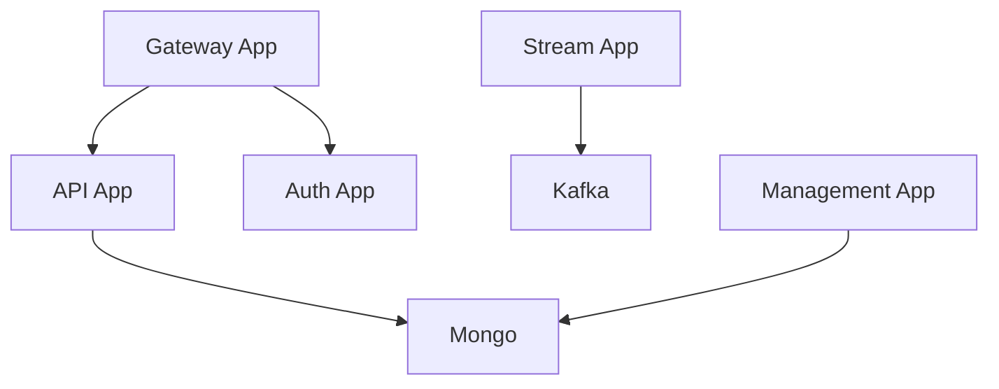
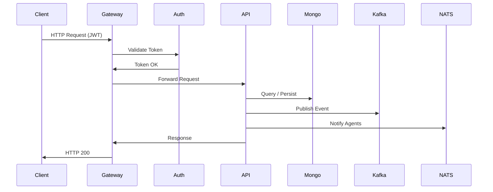

# OpenFrame OSS Tenant

The **`openframe-oss-tenant`** repository contains the full multi-tenant runtime stack of the OpenFrame platform.  
It assembles identity, API, routing, persistence, messaging, stream processing, and management services into a cohesive tenant-aware system.

OpenFrame is designed as a modular, library-driven architecture where:

- Core capabilities live in reusable libraries
- Runtime services compose those libraries into deployable applications
- Every layer is multi-tenant by design
- Kafka and NATS power event-driven communication
- MongoDB provides the primary persistence layer

This repository represents the **tenant runtime implementation** of the OpenFrame platform.

---

# Repository Purpose

The repository provides:

- ✅ Multi-tenant OAuth2 Authorization Server  
- ✅ GraphQL + REST API layer  
- ✅ Reactive Gateway with JWT and API key security  
- ✅ Mongo domain model and repositories  
- ✅ Kafka-based stream processing  
- ✅ NATS real-time agent messaging  
- ✅ Management service with schedulers and migrations  
- ✅ Executable Spring Boot runtime applications  

It forms a complete **tenant-scoped cloud-native backend**.

---

# High-Level End-to-End Architecture

The architecture follows strict separation of concerns:

| Layer | Responsibility |
|--------|---------------|
| Gateway | Routing, JWT validation, API key auth |
| Authorization Server | OAuth2, OIDC, SSO, tenant identity |
| API Service | GraphQL + REST orchestration |
| Data Layer | Mongo domain & repositories |
| Stream Layer | CDC ingestion, enrichment, unified logs |
| Messaging | Kafka (durable) + NATS (real-time) |
| Management | Initialization, migrations, schedulers |
| Runtime Apps | Executable Spring Boot services |

---

# Module Structure

The repository is organized into reusable libraries and runtime services.

## Core Libraries (`openframe-oss-lib`)

### 1️⃣ API Service Core (GraphQL & REST)

**Path:**  
`openframe-oss-lib/openframe-api-service-core`

Exposes tenant-facing APIs using:

- REST controllers
- Netflix DGS GraphQL
- OAuth2 Resource Server integration
- Relay-compliant global node resolution
- Domain service orchestration

📘 See:  
**API Service Core GraphQL And Rest**

---

### 2️⃣ API Contracts & Domain Services

**Path:**  
`openframe-oss-lib/openframe-api-lib`

Defines:

- DTOs for GraphQL & REST
- Filter models
- Relay pagination contracts
- Domain mappers
- Shared domain services

📘 See:  
**Api Lib Contracts And Domain Services**

---

### 3️⃣ Authorization Server Core

**Path:**  
`openframe-oss-lib/openframe-authorization-service-core`

Provides:

- OAuth2 + OIDC endpoints
- Multi-tenant JWT issuance
- Per-tenant RSA signing keys
- SSO (Google, Microsoft)
- Invitation & onboarding flows
- PKCE support
- Mongo-backed authorization storage

📘 See:  
**Authorization Server Core**

---

### 4️⃣ Gateway Service Core (Routing & Security)

**Path:**  
`openframe-oss-lib/openframe-gateway-service-core`

Built on:

- Spring Cloud Gateway
- Reactive WebFlux Security
- JWT multi-issuer validation
- API key + rate limiting
- REST & WebSocket proxying
- Tool-specific upstream resolvers

📘 See:  
**Gateway Service Core Routing And Security**

---

### 5️⃣ Data Mongo Domain & Repositories

**Path:**  
`openframe-oss-lib/openframe-data-mongo-*`

Defines:

- Core domain documents
- Multi-tenant `tenantId` enforcement
- Reactive + sync repositories
- Custom MongoTemplate queries
- Cursor-based pagination
- Aggregation pipelines
- Index governance

📘 See:  
**Data Mongo Domain And Repositories**

---

### 6️⃣ Stream Processing Core

**Path:**  
`openframe-oss-lib/openframe-stream-service-core`

Handles:

- Debezium CDC ingestion
- Kafka listeners
- Tool-specific deserialization
- Event normalization
- Tenant-aware enrichment
- Cassandra unified log storage
- Kafka Streams joins

📘 See:  
**Stream Processing Core**

---

### 7️⃣ Tenant Messaging (NATS & Kafka)

**Path:**  
`openframe-oss-lib/openframe-data-{nats,kafka}`

Provides:

- Multi-tenant Kafka configuration
- Topic auto-creation
- Kafka producers & recovery handlers
- Real-time NATS notifications
- Agent command messaging models

📘 See:  
**Tenant Messaging Nats And Kafka**

---

### 8️⃣ Management Service Core

**Path:**  
`openframe-oss-lib/openframe-management-service-core`

Responsible for:

- Startup initializers
- Tenant provisioning
- NATS stream creation
- Tactical RMM sync
- Mongock migrations
- Distributed schedulers (ShedLock + Redis)
- Backfill jobs

📘 See:  
**Management Service Core Initialization And Scheduling**

---

## Runtime Applications (`openframe/services`)

Each service is an independent Spring Boot deployment unit:

- `openframe-api`
- `openframe-authorization-server`
- `openframe-gateway`
- `openframe-stream`
- `openframe-management`
- `openframe-external-api`
- `openframe-client`
- `openframe-config`

📘 See:  
**Service Runtime Applications**

---

# Cross-Cutting Design Principles

### ✅ Multi-Tenant Isolation
- `tenantId` enforced at domain level
- Tenant-aware JWTs
- Per-tenant signing keys
- Tenant-scoped messaging

### ✅ Event-Driven Backbone
- Kafka for durable streaming
- NATS for real-time agent messaging
- Debezium for CDC ingestion

### ✅ Library-First Architecture
- Core logic lives in reusable libraries
- Runtime apps assemble them

### ✅ Security-First Edge
- Gateway validates JWT
- Authorization Server is root of trust
- API keys for external integrations

### ✅ Reactive + Blocking Separation
- Gateway and some APIs are reactive
- Management & stream components may use blocking repositories
- Clear repository abstraction boundaries

---

# End-to-End Request Lifecycle

---

# Summary

The **`openframe-oss-tenant`** repository is the full tenant runtime implementation of OpenFrame.

It delivers:

- Multi-tenant identity & OAuth2
- Secure reactive gateway routing
- GraphQL + REST APIs
- Mongo-backed domain model
- Kafka-based stream processing
- Real-time NATS messaging
- Operational management & scheduling
- Cloud-native deployable services

It represents a **complete, modular, event-driven, multi-tenant backend platform** designed for extensibility, scalability, and security across the entire OpenFrame ecosystem.