# OpenFrame AI and Analytics

This document details the AI and Analytics capabilities of OpenFrame.

## Overview

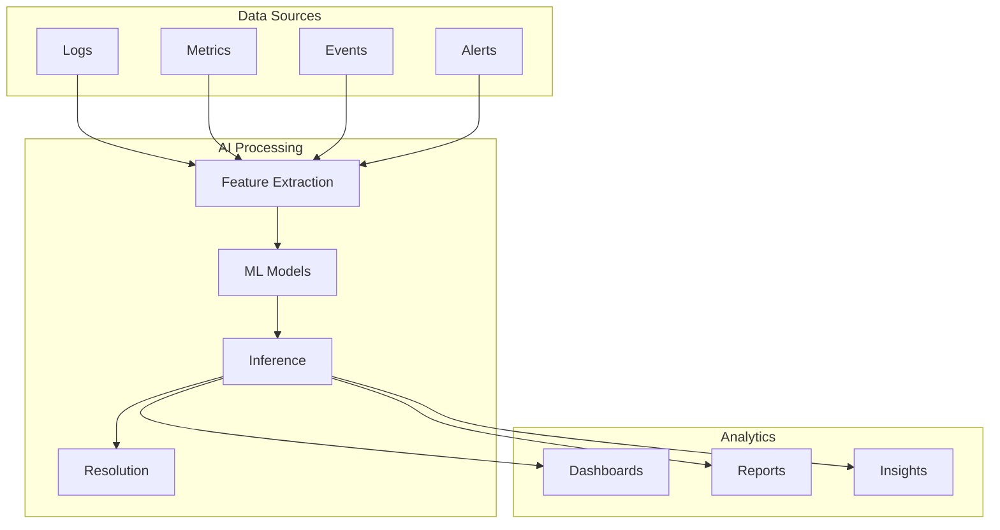

## AI Components

### Machine Learning Pipeline
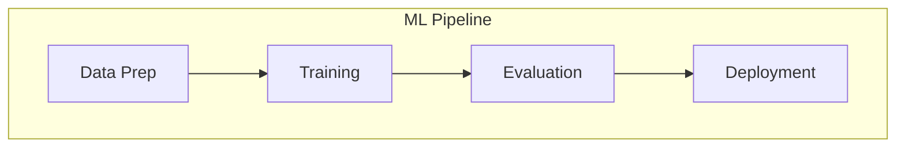

### Model Types
- Anomaly Detection
- Pattern Recognition
- Predictive Analytics
- Natural Language Processing

## Analytics Capabilities

### Real-time Analytics
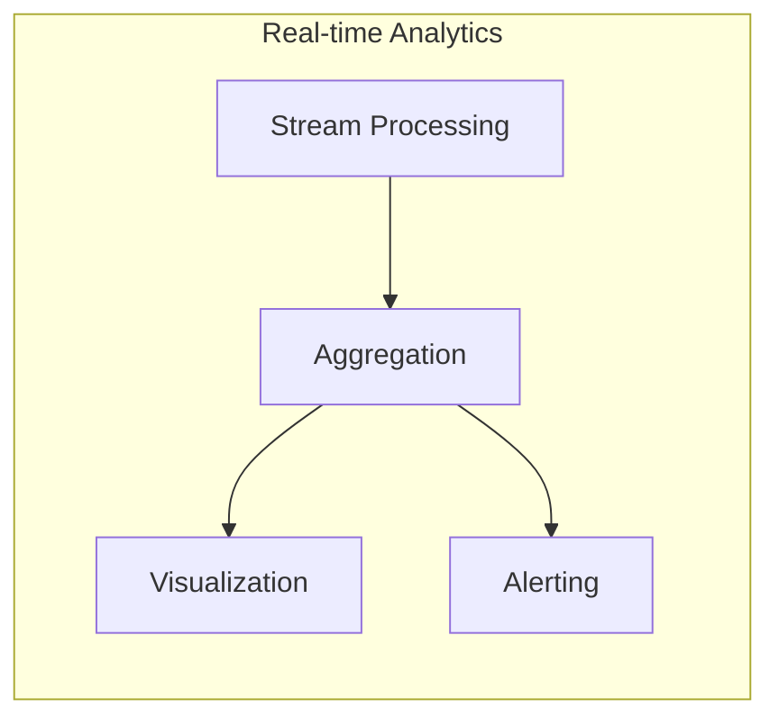

### Historical Analytics
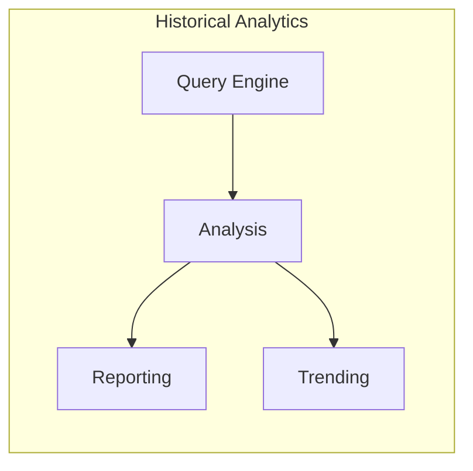

## AI Use Cases

### Anomaly Detection
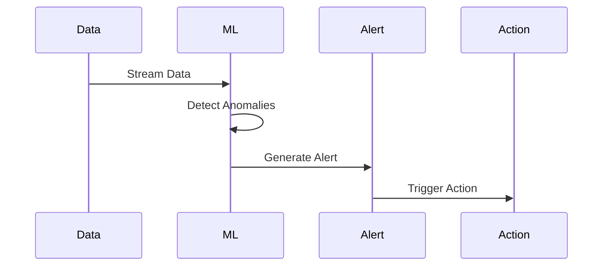

### Issue Resolution
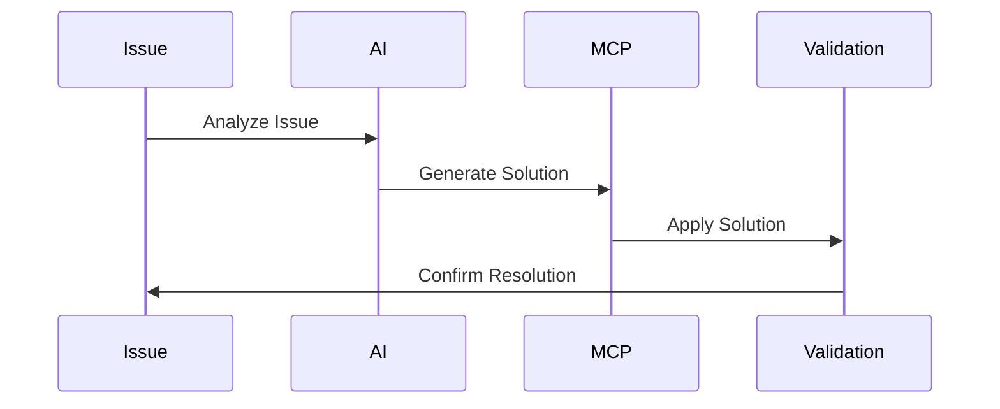

## Analytics Features

### Dashboard Analytics
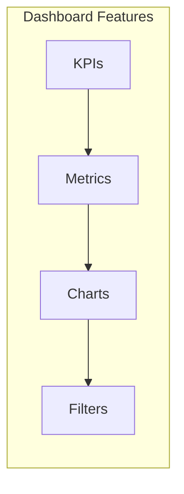

### Reporting
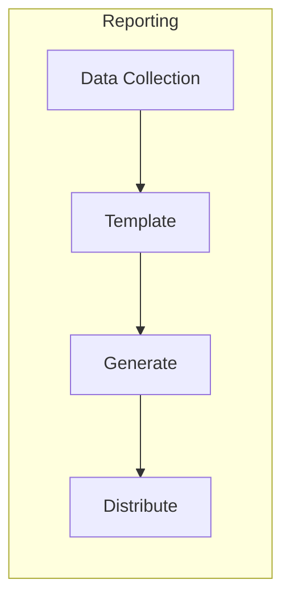

## AI Models

### Model Training
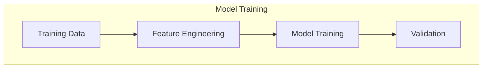

### Model Deployment
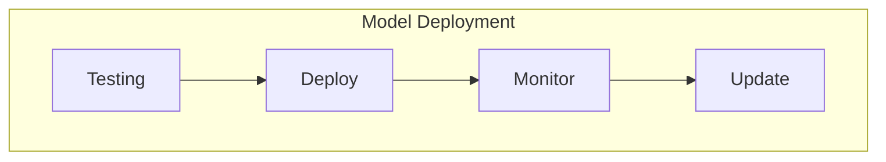

## Analytics Integration

### Data Sources
- Logs
- Metrics
- Events
- Alerts
- User interactions

### Output Destinations
- Dashboards
- Reports
- Alerts
- Actions
- Notifications

## Performance Monitoring

### Model Performance
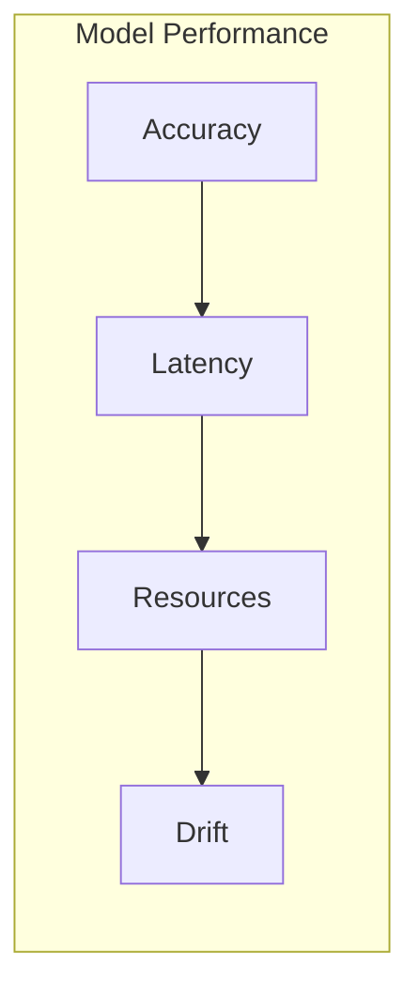

### Analytics Performance
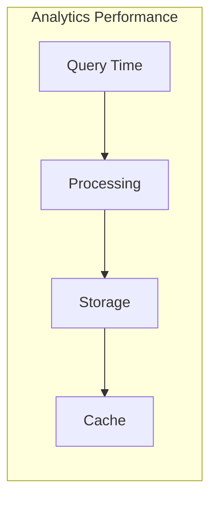

## Next Steps

- [API Integration](./api-integration/)
- [Security Implementation](../security/)
- [Deployment Guide](../deployment/)
- [Development Guide](../development/) 