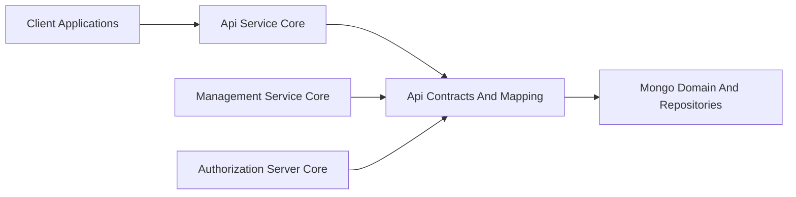
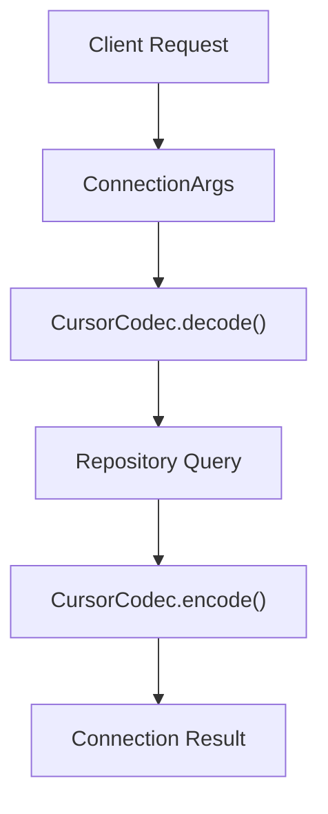
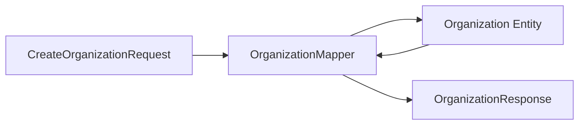
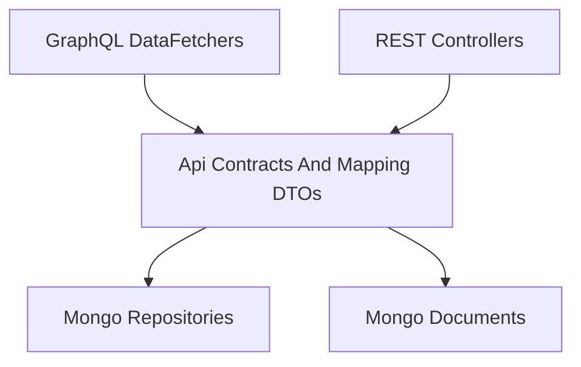

# Api Contracts And Mapping

## Overview

The **Api Contracts And Mapping** module defines the shared Data Transfer Objects (DTOs), filter contracts, pagination primitives, and entity-to-DTO mappers used across the OpenFrame platform.

It acts as the **contract boundary** between:

- API layers (GraphQL and REST)
- Domain and persistence layers (Mongo documents and repositories)
- External consumers (UI clients, integrations, BFF)

This module is intentionally free of transport-specific concerns (no controllers, no data fetchers). It provides:

- Standardized query result wrappers
- Relay-compatible pagination contracts
- Rich filtering criteria for domain aggregates
- Response DTOs shared across services
- Mapping logic between domain entities and API responses

It is primarily consumed by:

- [Api Service Core](../api-service-core/api-service-core.md)
- [Management Service Core](../management-service-core/management-service-core.md)
- [Authorization Server Core](../authorization-server-core/authorization-server-core.md)
- [Gateway Service Core](../gateway-service-core/gateway-service-core.md)

---

## Architectural Role in the Platform



### Responsibilities

The Api Contracts And Mapping module is responsible for:

1. **Defining API DTOs** independent of persistence models.
2. **Providing filter criteria contracts** for complex queries.
3. **Standardizing pagination behavior** (Relay-style cursor connections).
4. **Encapsulating entity mapping logic** in reusable mappers.
5. **Ensuring cross-service consistency** for shared responses (e.g., `OrganizationResponse`).

---

# Core Concepts

## 1. Generic Query Results

### CountedGenericQueryResult

```text
CountedGenericQueryResult<T>
  └── extends GenericQueryResult<T>
        ├── items
        ├── pageInfo
        └── totalCount
  └── filteredCount
```

`CountedGenericQueryResult<T>` extends a generic query result by adding:

- `filteredCount` → number of items after filters are applied.

This is commonly used for:

- Device queries
- Event queries
- Log queries
- Tool queries

It allows the UI to:

- Display total items
- Display filtered subset counts
- Maintain consistent pagination metadata

---

## 2. Relay-Compatible Pagination

### ConnectionArgs

The `ConnectionArgs` DTO implements the Relay Connection specification:

- Forward pagination → `first` + `after`
- Backward pagination → `last` + `before`

Validation constraints:

- `first` and `last` must be between 1 and 100



### CursorCodec

`CursorCodec` ensures cursors are:

- Opaque
- Base64 encoded
- Detached from internal storage details (e.g., Mongo ObjectIds)

This guarantees:

- No exposure of database internals
- Stable pagination contracts
- Forward compatibility if storage changes

---

## 3. Standardized Mutation Inputs

### MutationDeleteInput

```text
MutationDeleteInput
  - id (required)
```

Used across mutations that delete entities.

Advantages:

- Consistent mutation signatures
- Shared validation logic
- Predictable client integration

---

# Domain Filter Contracts

Filtering is standardized using dedicated criteria and filter DTOs.

Each domain follows a two-layer model:

1. `*FilterCriteria` → Query input from client
2. `*Filters` or `*FilterOption` → Available filter metadata for UI

---

## Audit & Logs

### LogFilterCriteria

Supports filtering by:

- Date range
- Event types
- Tool types
- Severities
- Organization IDs
- Device ID

### LogFilters

Provides:

- Available tool types
- Event types
- Severities
- Organization filter options

### OrganizationFilterOption

```text
OrganizationFilterOption
  - id
  - name
```

Used for dropdown selections in log filtering.

---

## Devices

### DeviceFilterCriteria

Supports:

- Statuses
- Device types
- OS types
- Organization IDs
- Tag key/value filtering

### DeviceFilters

Provides UI metadata:

- Status options
- Device type options
- OS type options
- Organization options
- Tag key options
- `filteredCount`

### TagFilterOption

```text
TagFilterOption
  - key
  - value
  - count
```

Enables faceted filtering on device tags.

---

## Events

### EventFilterCriteria

Filters by:

- User IDs
- Event types
- Date range

### EventFilters

Exposes filterable dimensions for UI rendering.

---

## Knowledge Base

### KnowledgeBaseFilterCriteria

Supports:

- Parent ID (hierarchical structure)
- Item type
- Tag IDs
- Article status

Designed to support tree-based content browsing.

---

## Organizations

### OrganizationFilterOptions

Internal filter contract including:

- Category
- Employee range
- Active contract flag
- Status

### OrganizationList

Simple list wrapper:

```text
OrganizationList
  - List<Organization>
```

### OrganizationResponse

Shared DTO used by:

- GraphQL (Api Service Core)
- REST (External API)

Includes:

- Core metadata
- Revenue & contract information
- Contact information
- Status lifecycle fields

---

## Tools

### ToolFilterCriteria

Filters by:

- Enabled state
- Type
- Category
- Platform category

### ToolFilters

Provides available filter dimensions for UI.

### ToolList

```text
ToolList
  - List<IntegratedTool>
```

---

# Mapping Layer

## OrganizationMapper

The `OrganizationMapper` centralizes entity-to-DTO and DTO-to-entity transformations.



### Key Behaviors

#### 1. Entity Creation

- Generates `organizationId` as UUID
- Sets `isDefault` to false
- Maps nested contact information

#### 2. Partial Updates

- Only non-null request fields update the entity
- `organizationId` is immutable

#### 3. Nested Mapping

Handles:

- Contact information
- Physical and mailing addresses
- Contact persons

Includes special logic:

- If `mailingAddressSameAsPhysical` is true → clones physical address

This avoids duplication of mapping logic across services.

---

# Cross-Module Interaction



### Api Service Core

- Uses filter criteria in GraphQL data fetchers
- Uses response DTOs in resolvers
- Uses mappers before returning data

### Management Service Core

- Uses shared DTOs for tool and organization management

### Authorization Server Core

- May reuse shared DTO conventions for tenant or organization exposure

---

# Design Principles

## 1. Transport-Agnostic Contracts

DTOs are not tied to REST or GraphQL specifically.

## 2. Explicit Filtering

Each domain has:

- Clear input criteria
- Clear UI filter metadata

## 3. Stable Pagination

Relay-style cursor pagination ensures:

- Frontend consistency
- Backend flexibility
- Opaque cursors via `CursorCodec`

## 4. Centralized Mapping

Mapping logic is not scattered across controllers or services.

Benefits:

- Easier maintenance
- Reduced duplication
- Safer domain evolution

---

# Summary

The **Api Contracts And Mapping** module is the contract foundation of the OpenFrame platform.

It provides:

- Standardized pagination primitives
- Rich domain filtering contracts
- Shared response DTOs
- Centralized entity mapping logic

Without this module, each service would implement inconsistent DTOs and filters. By centralizing contracts here, the platform ensures:

- API consistency
- Predictable client integration
- Clean separation between API and persistence
- Safer cross-service evolution
