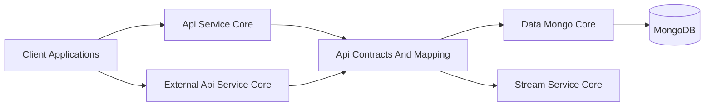
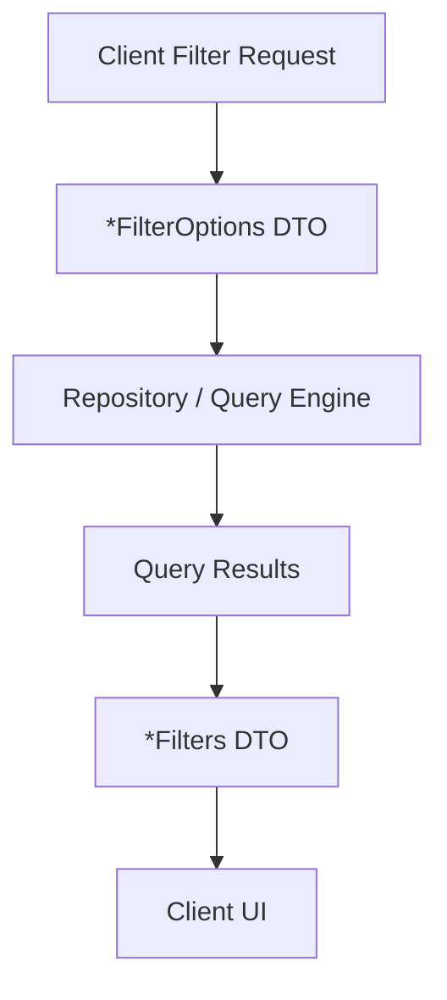
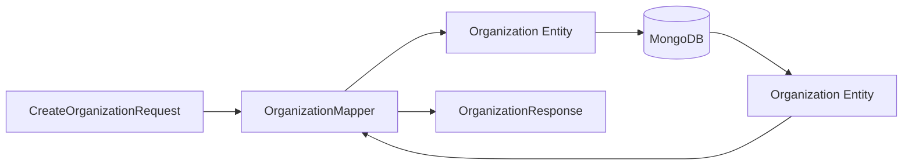
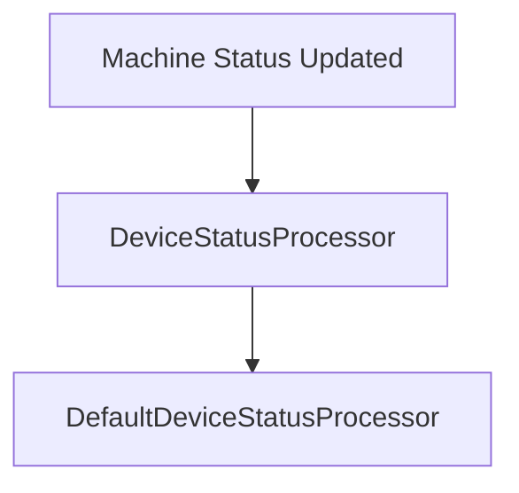
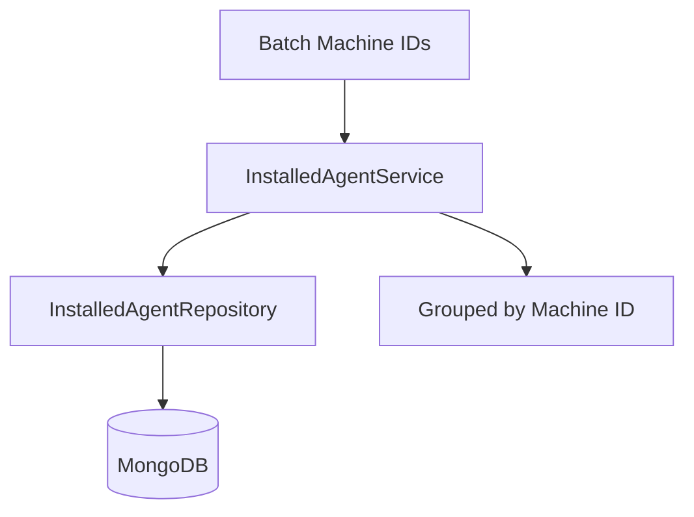
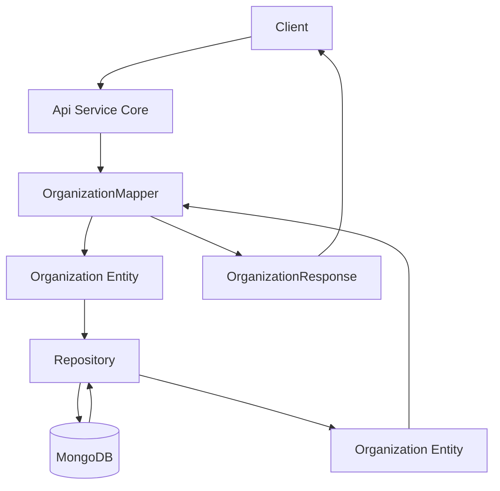

# Api Contracts And Mapping

## Overview

The **Api Contracts And Mapping** module defines the shared data transfer objects (DTOs), filter models, pagination contracts, and mapping utilities used across the OpenFrame platform.

It acts as the **contract layer** between:

- API entry points in [Api Service Core](../api-service-core/api-service-core.md)
- External REST interfaces in [External Api Service Core](../external-api-service-core/external-api-service-core.md)
- Data persistence in [Data Mongo Core](../data-mongo-core/data-mongo-core.md)
- Streaming enrichment and event pipelines in [Stream Service Core](../stream-service-core/stream-service-core.md)

This module ensures:

- Consistent API contracts across GraphQL and REST
- Stable filtering and pagination semantics
- Clear separation between persistence models and API-facing DTOs
- Reusable mapping logic between entities and API responses

---

## Architectural Role



### Responsibilities

The Api Contracts And Mapping module provides:

1. **DTO definitions** for devices, logs, events, organizations, tools
2. **Filter models** for complex querying
3. **Cursor-based pagination input**
4. **Generic query result wrappers**
5. **Entity ↔ DTO mapping utilities**
6. **Shared service utilities used by DataLoaders**
7. **Extensible processors for domain hooks**

It does **not** expose endpoints directly. Instead, it supports higher-level modules such as Api Service Core and External Api Service Core.

---

# Core Design Patterns

## 1. Contract Isolation Pattern

Persistence models (e.g., `Organization`, `Machine`, `IntegratedTool`) live in Data Mongo Core. API responses are defined separately in this module (e.g., `OrganizationResponse`).

This ensures:

- Database schema changes do not automatically leak to API clients
- API contracts remain stable and versionable
- Mapping logic is centralized

---

## 2. Filter + FilterOptions Pattern

Across domains (devices, logs, events, tools), the module consistently separates:

- **FilterOptions** → input criteria for querying
- **Filters** → response metadata for UI filtering

Example domains:

- `DeviceFilterOptions` vs `DeviceFilters`
- `LogFilterOptions` vs `LogFilters`
- `EventFilterOptions` vs `EventFilters`
- `ToolFilterOptions` vs `ToolFilters`



This design supports:

- Dynamic filter panels in UI
- Aggregation-based counts
- Server-driven filter suggestions

---

# DTO Layer

## Generic Query Wrapper

### CountedGenericQueryResult

Extends a generic query result by adding a filtered count.

```java
public class CountedGenericQueryResult<T> extends GenericQueryResult<T> {
    private int filteredCount;
}
```

**Purpose:**

- Return paginated results
- Include total/filtered counts
- Support UI table rendering

---

## Cursor Pagination

### CursorPaginationInput

```java
public class CursorPaginationInput {
    @Min(1)
    @Max(100)
    private Integer limit;
    private String cursor;
}
```

**Key characteristics:**

- Enforces minimum and maximum limits
- Enables cursor-based pagination (preferred over offset pagination)
- Designed for scalable queries across large datasets

---

# Domain Contracts

## 1. Organization Contracts

### OrganizationResponse

Shared response DTO used by:

- GraphQL (Api Service Core)
- REST (External Api Service Core)

Contains:

- Core metadata (id, name, organizationId)
- Business fields (category, revenue, contract dates)
- Contact information
- Audit fields (createdAt, updatedAt, deleted)

### OrganizationList

Wrapper DTO for returning multiple organizations.

### OrganizationFilterOptions

Supports internal filtering by:

- Category
- Employee range
- Active contract status

---

## Organization Mapping

### OrganizationMapper

Centralized mapping component:

- `toEntity(CreateOrganizationRequest)`
- `updateEntity(Organization, UpdateOrganizationRequest)`
- `toResponse(Organization)`



### Important Design Decisions

- `organizationId` is immutable after creation
- Partial updates only modify non-null fields
- Mailing address can mirror physical address automatically
- UUID is generated internally for organizationId

This ensures strict domain integrity and consistent API behavior.

---

## 2. Device Contracts

### DeviceFilterOptions

Defines query input criteria:

- Statuses
- Device types
- OS types
- Organization IDs
- Tag names

### DeviceFilters

Defines response-side metadata:

- Filter options with counts
- Filtered result count

### TagFilterOption & DeviceFilterOption

Used to represent UI filter choices with:

- value
- label
- count

---

## Device Status Processing Hook

### DefaultDeviceStatusProcessor

Provides a default implementation of `DeviceStatusProcessor`.



Characteristics:

- Activated only if no custom bean exists
- Logs status updates
- Allows extensibility in platform deployments

---

## 3. Log & Audit Contracts

### LogEvent

Lightweight audit event model for list views.

### LogDetails

Extended audit model including:

- Message
- Details
- Full context metadata

### LogFilterOptions

Supports filtering by:

- Date range
- Event types
- Tool types
- Severity
- Organization
- Device

### LogFilters

Response metadata for UI filter construction.

This contract layer integrates tightly with:

- Stream Service Core (event ingestion and enrichment)
- Data Mongo Core (event persistence)

---

## 4. Event Contracts

### EventFilterOptions

Defines:

- User IDs
- Event types
- Date range

### EventFilters

Defines available filter values returned to clients.

---

## 5. Tool Contracts

### ToolFilterOptions

Filtering input by:

- Enabled flag
- Type
- Category
- Platform category

### ToolFilters

Response-side filtering metadata.

### ToolList

Wrapper around `IntegratedTool` entities for list responses.

---

# Shared Service Utilities

## InstalledAgentService

Provides reusable logic for resolving installed agents.

Primary use case:

- GraphQL DataLoader batching



Key capabilities:

- Batch retrieval for multiple machines
- Grouping by machineId
- Optimized for N+1 query prevention

---

## ToolConnectionService

Similar batching strategy for tool connections:

- Fetch by machine IDs
- Group results
- Support GraphQL resolvers

---

# Cross-Module Integration

## With Api Service Core

- GraphQL resolvers consume DTOs defined here
- DataFetchers use filter DTOs
- DataLoaders use InstalledAgentService and ToolConnectionService

## With External Api Service Core

- REST controllers reuse OrganizationResponse and other DTOs
- Shared mapping logic prevents duplication

## With Data Mongo Core

- Entities are mapped to response DTOs
- Repositories are used indirectly via services

## With Stream Service Core

- Event and log DTOs align with enriched streaming models

---

# Data Flow Example: Organization Lifecycle



---

# Extensibility Strategy

The Api Contracts And Mapping module is designed for extension via:

- Custom `DeviceStatusProcessor` implementations
- Additional filter DTOs
- Alternative mappers
- Extended service logic

Because higher-level modules depend on this contract layer, changes must:

- Preserve backward compatibility
- Avoid leaking persistence models directly
- Maintain strict DTO/entity separation

---

# Summary

The **Api Contracts And Mapping** module is the structural backbone of OpenFrame’s API layer.

It provides:

- Stable, reusable API contracts
- Filtering and pagination standards
- Shared mapping logic
- Batch-aware service utilities
- Domain-level extensibility hooks

By centralizing contracts and mappings, the platform ensures consistent behavior across:

- GraphQL APIs
- REST APIs
- Streaming pipelines
- Data persistence layers

This module is foundational for maintaining clean boundaries, scalability, and long-term API stability across the OpenFrame ecosystem.
