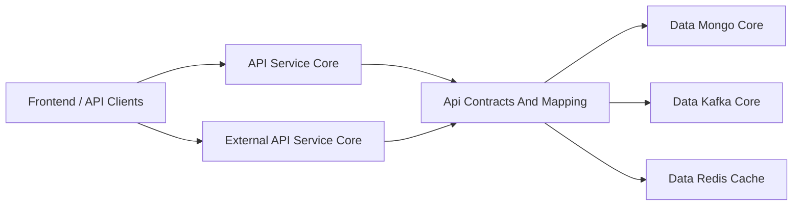
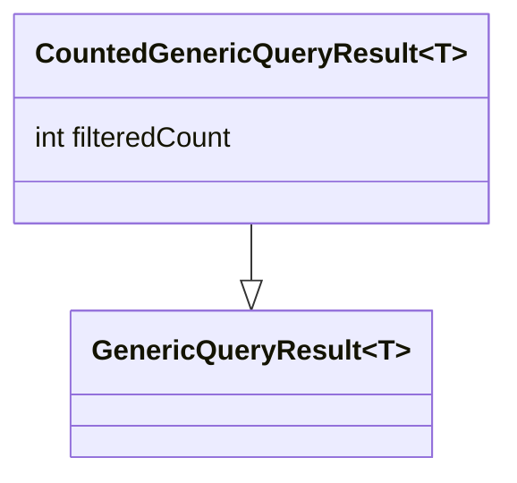
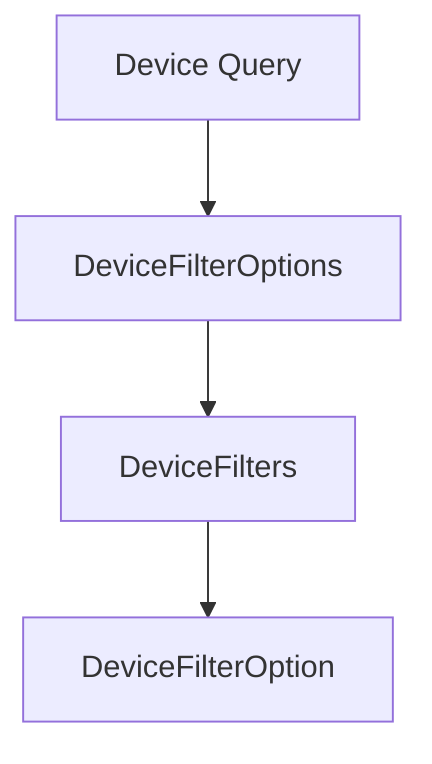
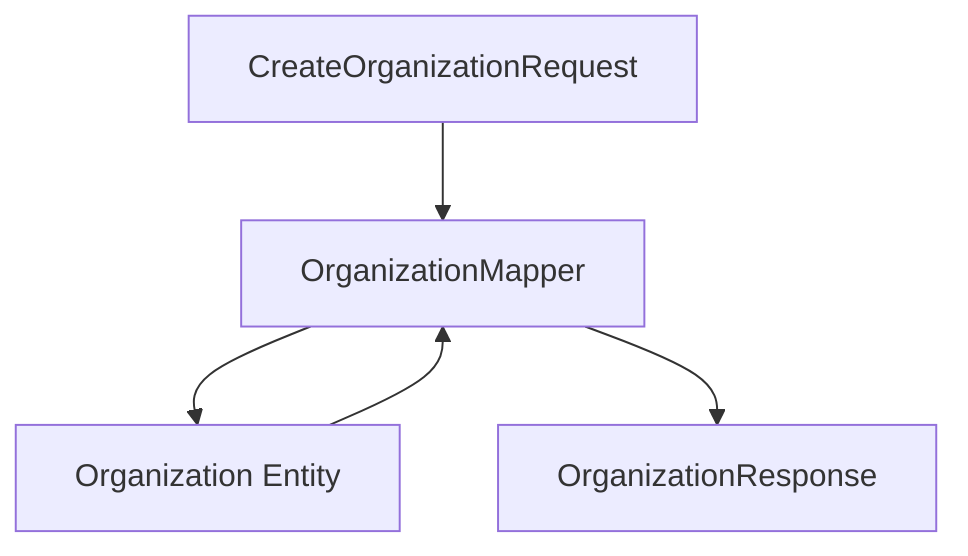
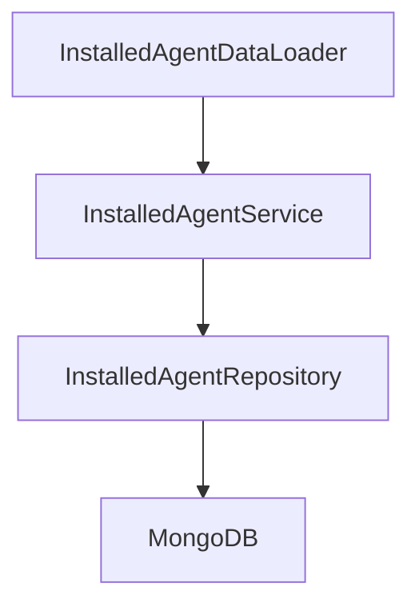
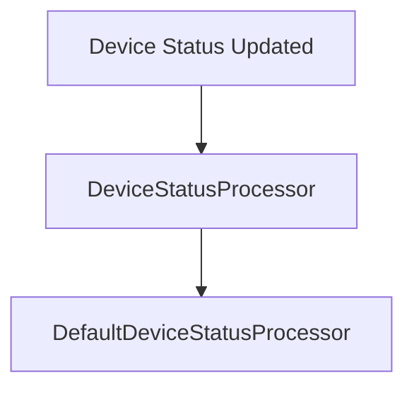
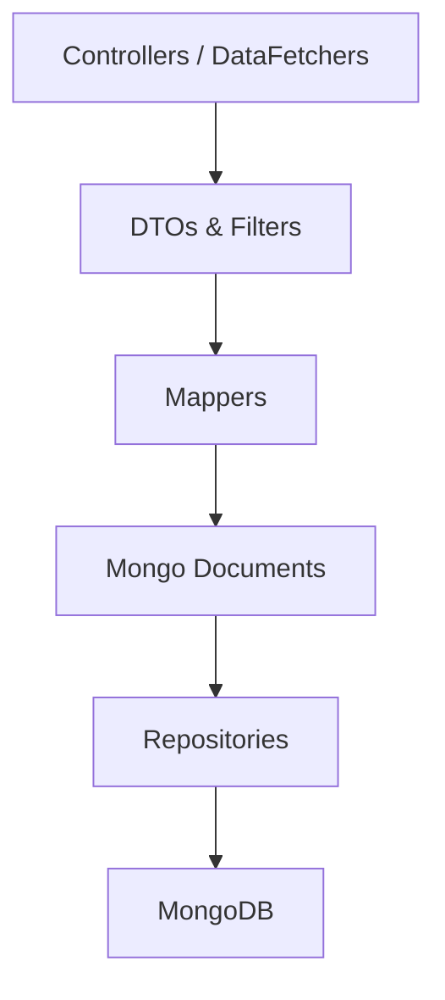

# Api Contracts And Mapping

## Overview

The **Api Contracts And Mapping** module defines the shared data contracts, filter models, pagination inputs, mappers, and supporting services that standardize how data is exposed across the OpenFrame platform.

It acts as a **boundary layer** between:

- API-facing modules such as:
  - `api-service-core` (GraphQL API)
  - `external-api-service-core` (REST API)
- Data access modules such as:
  - `data-mongo-core`
  - `data-redis-cache`
  - `data-kafka-core`

This module ensures that:

- API responses are stable and consistent
- Filtering and pagination are standardized
- Entity-to-DTO mapping is centralized
- Cross-service contracts remain reusable and versionable

---

## Architectural Role in the Platform

### Responsibilities

1. Define shared DTOs (Devices, Events, Organizations, Tools, Logs)
2. Define filter models for queryable resources
3. Provide pagination contracts
4. Provide entity-to-DTO mappers
5. Provide shared API-level services used by DataLoaders and controllers
6. Provide default processors for extensibility

---

# Core Areas

The module can be logically divided into the following areas:

1. Query Results and Pagination
2. Device Contracts and Filters
3. Event and Audit Contracts
4. Organization Contracts and Mapping
5. Tool Contracts
6. Shared Services
7. Extensibility Processors

---

# 1. Query Results and Pagination

## CountedGenericQueryResult

`CountedGenericQueryResult<T>` extends a generic query result and introduces:

- `filteredCount` — total number of items matching the applied filters

This is typically used for:

- GraphQL list responses
- REST paginated endpoints
- Filtered search results

---

## CursorPaginationInput

Defines standardized cursor-based pagination:

- `limit` (1–100, validated)
- `cursor`

This contract is used across APIs to ensure:

- Predictable pagination limits
- Backend-controlled upper bounds
- Cursor-based navigation instead of offset-based queries

---

# 2. Device Contracts and Filters

Device-related DTOs standardize how devices are filtered and returned.

## DeviceFilterOptions

Represents available filter dimensions:

- Statuses
- Device types
- OS types
- Organization IDs
- Tag names

## DeviceFilters

Represents computed filter results:

- List of filter options with counts
- `filteredCount` for current result set

## DeviceFilterOption

Encapsulates:

- `value`
- `label`
- `count`

This structure enables dynamic filtering UIs where:

- The backend returns available filter values
- Each value includes a result count

---

# 3. Event and Audit Contracts

The module defines a consistent event and log model for audit and activity tracking.

## LogEvent

Lightweight audit representation including:

- toolEventId
- eventType
- toolType
- severity
- timestamp
- organization and device metadata

## LogDetails

Extended log representation including:

- Full message
- Details payload

## LogFilterOptions

Used to filter logs by:

- Date range
- Event types
- Tool types
- Severities
- Organization IDs
- Device ID

## LogFilters

Computed filter metadata for frontend usage.

---

## EventFilterOptions and EventFilters

Used for querying event streams:

- Filter by user IDs
- Filter by event types
- Optional date constraints

These contracts are consumed by:

- `api-service-core` data fetchers
- `external-api-service-core` controllers
- Stream-backed queries via `stream-processing-core`

---

# 4. Organization Contracts and Mapping

Organization models are shared between GraphQL and REST APIs.

## OrganizationResponse

Unified API-facing representation including:

- Identity fields
- Contact information
- Revenue and contract dates
- Lifecycle metadata (created, updated, deleted)

## OrganizationList

Wrapper DTO for list responses.

## OrganizationFilterOptions

Supports filtering by:

- Category
- Employee count range
- Active contract

---

## OrganizationMapper

The `OrganizationMapper` centralizes entity ↔ DTO transformations.

### Responsibilities

1. Convert create requests into `Organization` entities
2. Generate `organizationId` automatically using UUID
3. Apply partial updates safely
4. Convert entity to `OrganizationResponse`
5. Map nested contact information and addresses

### Key Design Principles

- `organizationId` is immutable once generated
- Partial updates only modify non-null fields
- Mailing address can mirror physical address
- Mapping logic is centralized to avoid duplication across APIs

This ensures consistent behavior between:

- `api-service-core`
- `external-api-service-core`

---

# 5. Tool Contracts

Tool-related DTOs define how integrations and tools are queried and returned.

## ToolFilterOptions

Defines filtering parameters:

- Enabled flag
- Type
- Category
- Platform category

## ToolFilters

Represents applied filter sets.

## ToolList

Wrapper DTO around a list of `IntegratedTool` entities.

These contracts are consumed by:

- Tool controllers in external APIs
- GraphQL data fetchers
- Management and integration services

---

# 6. Shared Services

The module provides shared service abstractions used primarily by GraphQL DataLoaders and controllers.

## InstalledAgentService

Provides:

- Batch loading for multiple machine IDs
- Single machine agent retrieval
- Lookup by ID
- Lookup by machine ID and agent type

### Design Goal

Batching multiple machine IDs reduces N+1 query problems in GraphQL resolvers.

---

## ToolConnectionService

Provides batched and per-machine retrieval of tool connections.

This service:

- Groups results by machine ID
- Returns results in input order
- Supports DataLoader usage

---

# 7. Extensibility Processors

## DefaultDeviceStatusProcessor

Provides a default implementation of `DeviceStatusProcessor`.

- Annotated with `@ConditionalOnMissingBean`
- Allows overriding via custom implementations
- Logs device status updates

### Extensibility Pattern

If another bean of type `DeviceStatusProcessor` is defined, the default implementation is automatically disabled.

This supports:

- Custom event publishing
- Integration-specific logic
- Observability hooks

---

# How Api Contracts And Mapping Fits into the System

## Layer Alignment

| Layer | Responsibility |
|--------|----------------|
| DTO Layer | Public API contract |
| Filter Layer | Search and filtering abstraction |
| Mapper Layer | Entity ↔ DTO conversion |
| Service Layer | Batch loading and shared API logic |
| Data Layer | Mongo entities and repositories |

---

# Design Principles

1. API-First Contracts
   - DTOs are stable and decoupled from persistence models.

2. Centralized Mapping
   - All transformation logic is consolidated.

3. Reusability
   - Shared between GraphQL and REST APIs.

4. Extensibility
   - Processors and services can be overridden.

5. Query Standardization
   - Uniform filter and pagination models.

---

# Summary

The **Api Contracts And Mapping** module is the canonical definition of API-level data structures in OpenFrame.

It ensures:

- Consistent API responses
- Centralized mapping logic
- Standardized filtering and pagination
- Reduced duplication across services
- Extensible processing hooks

Without this module, each service would redefine contracts independently, increasing inconsistency and maintenance cost.

By centralizing contracts and mapping, the platform achieves strong separation of concerns between:

- API representation
- Business logic
- Data persistence
- Stream processing
