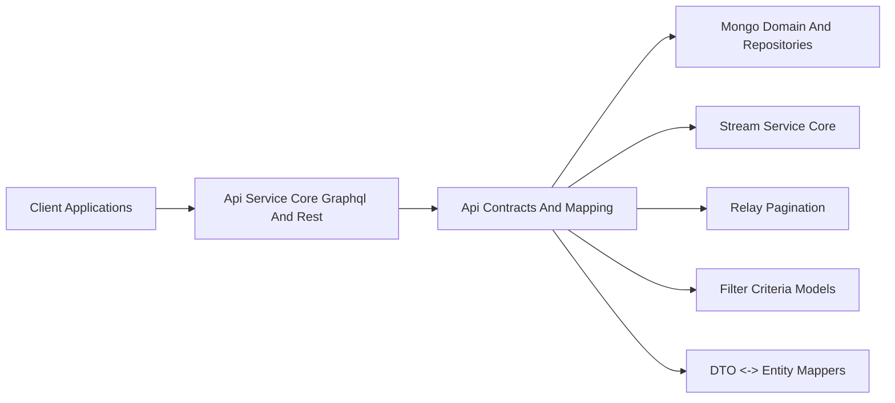
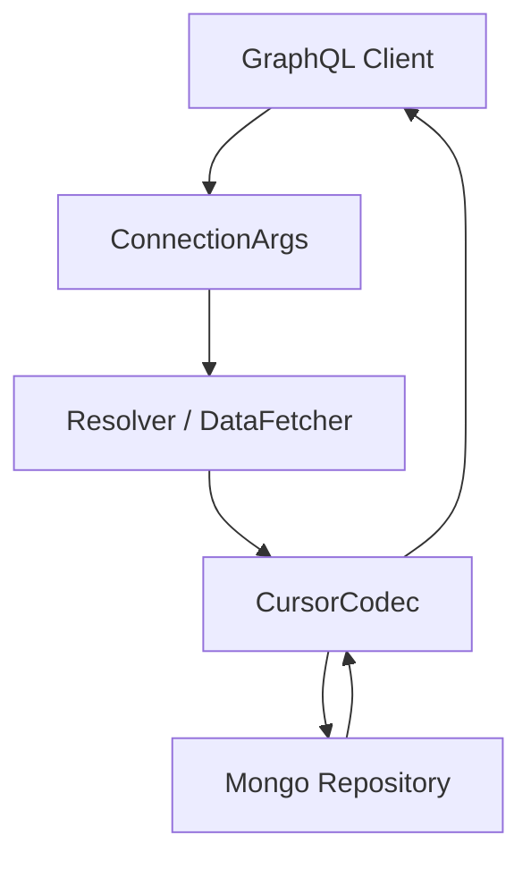
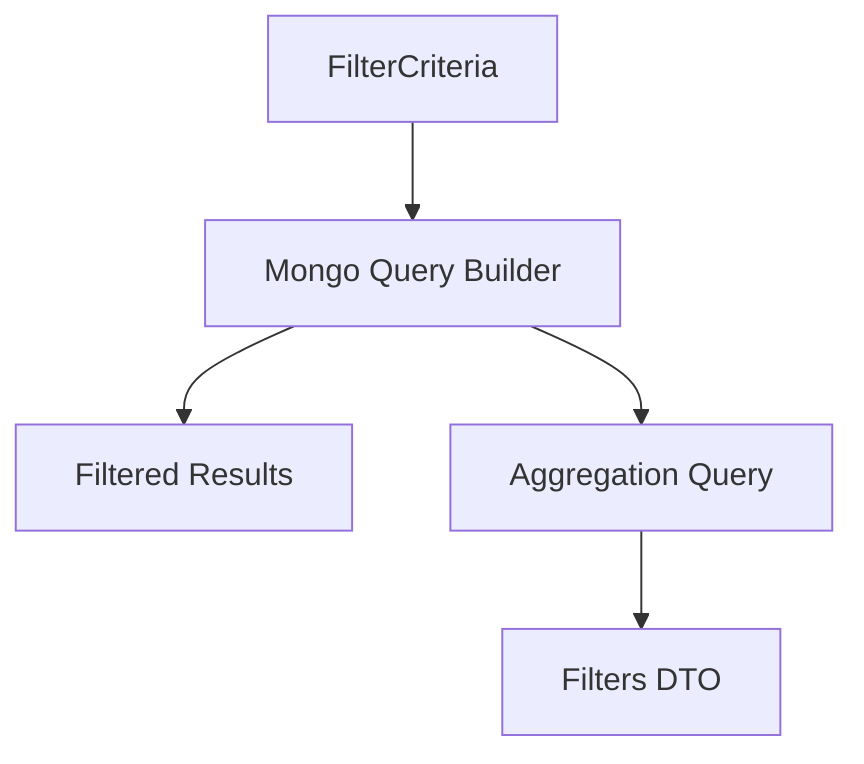
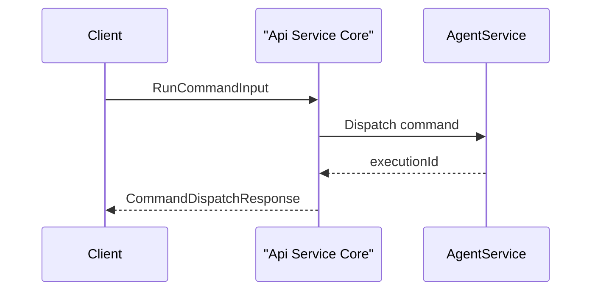
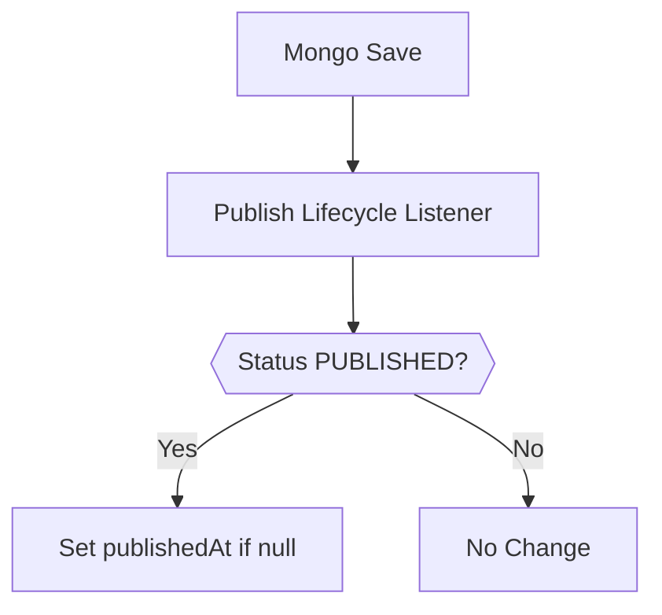
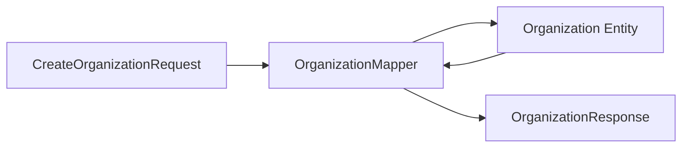
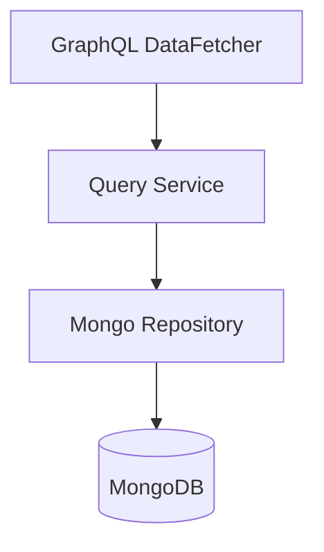
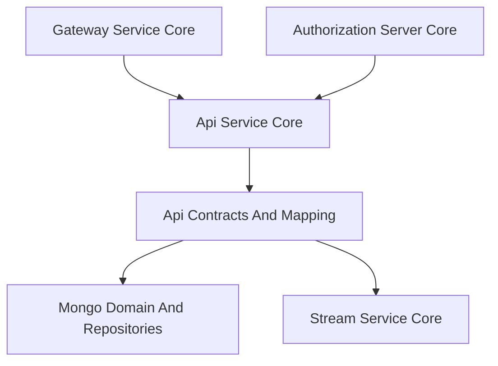

# Api Contracts And Mapping

The **Api Contracts And Mapping** module defines the shared API contracts, filtering models, pagination primitives, mapping logic, and cross-cutting services used across the OpenFrame platform.

It acts as the canonical boundary layer between:

- External API surfaces (GraphQL and REST)
- Domain entities stored in MongoDB
- Stream and integration layers

This module ensures:

- Stable, reusable DTOs across services
- Consistent filtering semantics
- Relay-compatible pagination
- Clear separation between transport models and persistence models

It is consumed primarily by:

- [Api Service Core Graphql And Rest](../api-service-core-graphql-and-rest/api-service-core-graphql-and-rest.md)
- External API applications in `service-applications`

---

## Architectural Role

### Responsibilities

1. Define API-level DTOs (inputs + responses)
2. Provide filter criteria and filter option models
3. Implement Relay-style pagination primitives
4. Map domain entities to API responses
5. Provide shared domain-facing query services
6. Supply lifecycle listeners and processors

---

# Core Areas

## 1. Generic Query & Pagination Contracts

### CountedGenericQueryResult

`CountedGenericQueryResult<T>` extends a generic query result with:

- `filteredCount` — total items matching filters (independent of page size)

This enables UI features like:

- Showing total result count
- Displaying filtered vs unfiltered counts
- Supporting infinite scroll with summary metadata

### Relay Pagination Support

The module provides Relay-compatible primitives:

- `ConnectionArgs`
- `CursorCodec`

#### ConnectionArgs

Supports:

- `first` + `after` (forward pagination)
- `last` + `before` (backward pagination)

Validation constraints enforce:

- Minimum page size = 1
- Maximum page size = 100

#### CursorCodec

Encodes internal cursors into opaque Base64 strings.

This ensures:

- Internal database keys are hidden
- Pagination remains stable even if persistence changes
- Clients cannot manipulate raw identifiers

---

## 2. Filtering Model Architecture

The module defines a consistent pattern:

- `*FilterCriteria` → server-side filtering rules
- `*Filters` → available filter options for UI
- `*FilterOption` → value + label + count

### Implemented Filter Domains

- **Logs**
  - `LogFilterCriteria`
  - `LogFilters`
  - `OrganizationFilterOption`

- **Devices**
  - `DeviceFilterCriteria`
  - `DeviceFilters`
  - `DeviceFilterOption`
  - `TagFilterOption`

- **Events**
  - `EventFilterCriteria`
  - `EventFilters`

- **Knowledge Base**
  - `KnowledgeBaseFilterCriteria`

- **Scripts**
  - `ScriptFilterInput`

- **Tools**
  - `ToolFilterCriteria`
  - `ToolFilters`

- **Organizations**
  - `OrganizationFilterOptions`

This pattern enables:

- Strongly typed query filters
- Aggregated filter metadata for faceted search
- Consistent API semantics across domains

---

## 3. Command & Execution Contracts

The module defines GraphQL-ready input and response DTOs for command dispatch:

- `RunCommandInput`
- `CancelExecutionInput`
- `CommandDispatchResponse`
- `CancelDispatchResponse`

Key characteristics:

- Validation annotations enforce required fields
- Machine-scoped execution model
- Explicit privilege level and shell type
- Timeout support

These contracts are consumed by GraphQL DataFetchers in the API service layer.

---

## 4. Knowledge Base Contracts

### CreateArticleCommand
### UpdateArticleCommand
### KnowledgeBaseAttachmentUpload

The Knowledge Base DTOs:

- Support hierarchical structures (via `parentId`)
- Track assignment to:
  - Organizations
  - Devices
  - Tickets
  - Other articles
- Support lifecycle state (e.g., `PUBLISHED`)

### Publish Lifecycle Listener

`KnowledgeBasePublishLifecycleListener` ensures:

- `publishedAt` is set on first publish
- Timestamp is never overwritten

This enforces canonical publication semantics.

---

## 5. Script Contracts

Script-related DTOs:

- `CreateScriptInput`
- `UpdateScriptInput`
- `ScriptResponse`
- `ScriptEnvVarInput`

Design principles:

- Tenant ID never travels over the wire
- PUT semantics for updates (full replacement)
- Environment variables support secret flag
- Platform and shell types use enum-backed safety

This ensures safe automation and controlled execution configuration.

---

## 6. Organization Mapping Layer

### OrganizationResponse
### OrganizationList
### OrganizationMapper

The `OrganizationMapper` provides:

- DTO → Entity conversion
- Partial update logic
- Nested mapping for:
  - ContactInformation
  - Address
  - ContactPerson

Key rules:

- `organizationId` is immutable
- UUID generated at creation time
- Partial update only mutates non-null fields

This centralizes mapping logic and prevents duplication in controllers or resolvers.

---

## 7. Shared Query Services

The module includes shared domain-facing services used by GraphQL DataLoaders and resolvers.

### InstalledAgentService

Provides:

- Batched machine lookups
- DataLoader-optimized bulk retrieval

### ToolConnectionService

Provides:

- Bulk machine-based connection lookup
- Efficient grouping by machineId

### TicketQueryService

Provides:

- Filter-based search
- Search + cursor-based retrieval
- Descending creation time sorting

These services:

- Encapsulate query-building logic
- Keep DataFetchers thin
- Provide reusable, testable query operations

---

## 8. Device Status Processor Extension Point

`DefaultDeviceStatusProcessor` provides a fallback implementation for:

- Post-processing device status updates

It is:

- Annotated with `@ConditionalOnMissingBean`
- Overridable by downstream services

This enables platform-specific status behavior without modifying the core library.

---

# How This Module Fits the Platform

### Dependency Direction

- Controllers and DataFetchers depend on this module
- This module depends only on domain models and repositories
- No upward dependency on API transport layers

This enforces clean layering:

- Transport (GraphQL / REST)
- Contracts & Mapping (this module)
- Domain & Persistence
- Streaming & Integration

---

# Design Principles

1. **DTO Isolation** – No domain entities exposed directly
2. **Strong Validation** – Jakarta validation annotations at boundary
3. **Immutable Identifiers** – e.g., `organizationId`
4. **Opaque Pagination** – via Base64 cursor encoding
5. **Extensibility Hooks** – conditional processors and listeners
6. **Consistent Filter Pattern** – uniform `Criteria` + `Filters` modeling

---

# Summary

The **Api Contracts And Mapping** module is the canonical API contract layer of the OpenFrame platform.

It:

- Standardizes request/response models
- Centralizes filtering logic structures
- Implements Relay-compatible pagination
- Encapsulates DTO ↔ entity mapping
- Provides reusable query services
- Supplies lifecycle hooks and extension points

Without this module, each API surface would duplicate filtering, pagination, and mapping logic. With it, the platform maintains consistency, safety, and evolvability across GraphQL, REST, and future transport layers.
