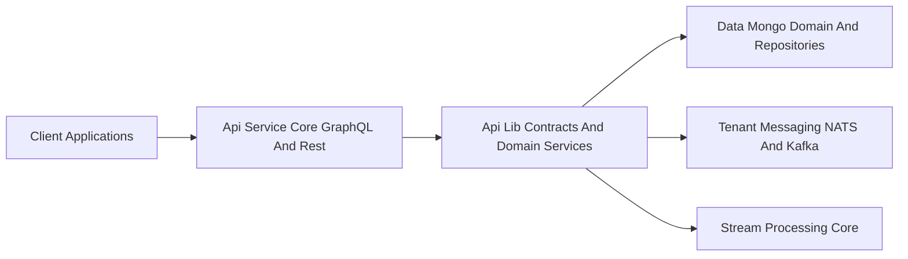
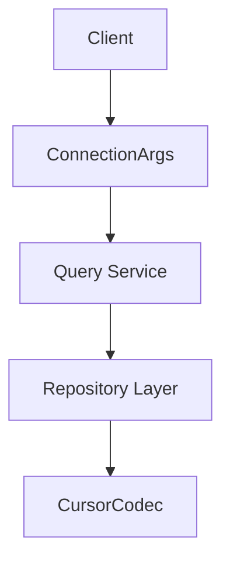
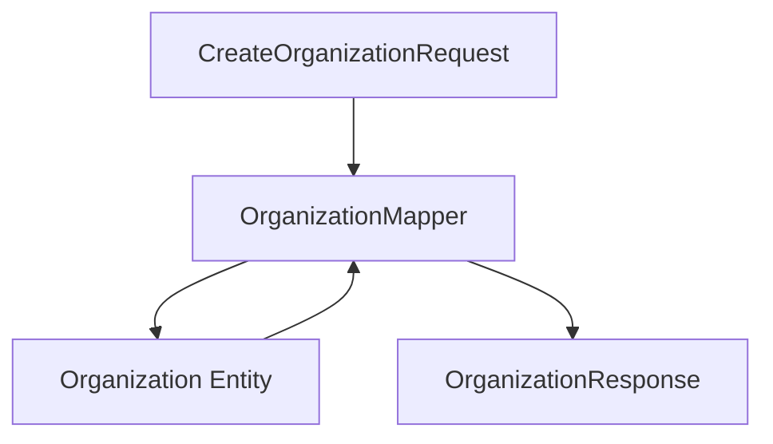
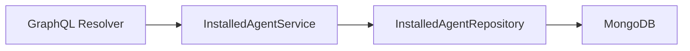
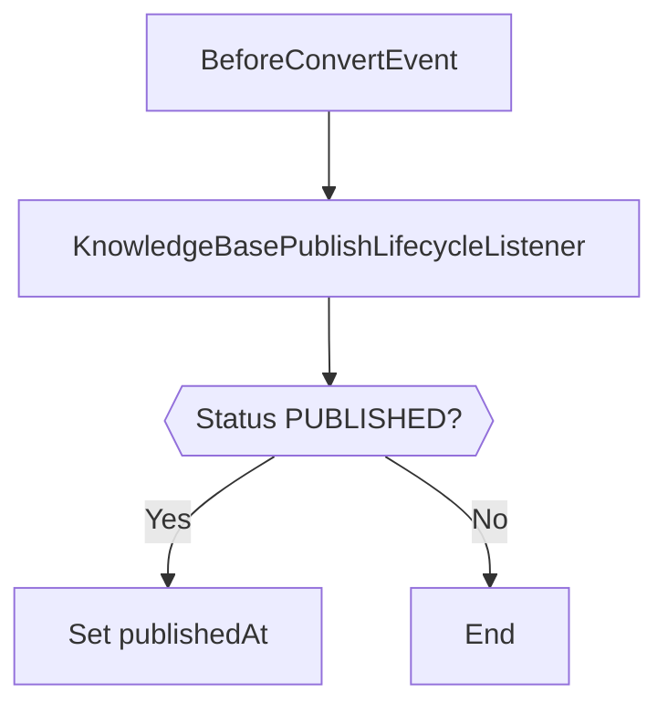
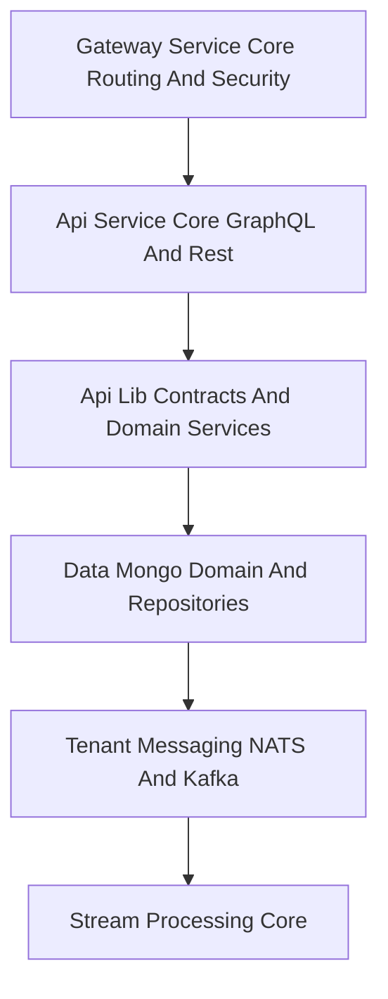

# Api Lib Contracts And Domain Services

## Overview

The **Api Lib Contracts And Domain Services** module is the shared contract and domain abstraction layer for the OpenFrame platform. It defines:

- Cross-service DTOs used by GraphQL and REST APIs  
- Filtering and pagination models  
- Command and mutation input contracts  
- Domain-to-DTO mappers  
- Lightweight domain services reused by API-facing modules  

This module contains **no controllers and no transport-layer logic**. Instead, it provides stable API contracts and reusable services that are consumed by:

- Api Service Core GraphQL And Rest  
- External API applications  
- Management and Stream services (indirectly via shared domain models)  

It acts as the **boundary between transport (GraphQL/REST) and domain (Mongo, messaging, processors)**.

---

## Architectural Position

### Responsibilities in the Stack

| Layer | Responsibility |
|-------|----------------|
| Gateway | Routing, security, JWT validation |
| API Service | Controllers, GraphQL resolvers, request orchestration |
| **Api Lib Contracts And Domain Services** | DTOs, filters, mappers, shared services |
| Data Mongo | Entities, repositories, persistence |
| Messaging & Stream | Event propagation and processing |

---

## Module Structure

The module can be logically grouped into the following areas:

1. **Shared Query & Pagination Contracts**  
2. **Domain-Specific DTOs (Device, Event, Log, Tool, Script, Organization, Knowledge Base)**  
3. **Command & Mutation Inputs**  
4. **Mappers**  
5. **Reusable Domain Services**  
6. **Lifecycle & Processor Hooks**

---

# 1. Shared Query & Pagination Contracts

### CountedGenericQueryResult<T>

Extends a base `GenericQueryResult<T>` and adds:

- `filteredCount` — number of records after filters are applied  

Used when APIs need both:
- A page of data  
- The total number of filtered records  

---

### ConnectionArgs (Relay Pagination)

Implements Relay-style cursor pagination arguments:

- `first` + `after` → forward pagination  
- `last` + `before` → backward pagination  

Validation rules:
- Minimum 1  
- Maximum 100  

---

### CursorCodec

Utility for encoding and decoding opaque cursors using Base64.

- `encode(raw)` → base64 string  
- `decode(opaque)` → raw internal cursor  

This prevents leaking internal identifiers (Mongo IDs, composite keys) to API consumers.

---

### MutationDeleteInput

Simple shared mutation contract:

- `id` (required)

Used across GraphQL and REST delete operations.

---

# 2. Domain-Specific DTOs

The module defines API-facing contracts for multiple domains.

## 2.1 Device Domain

### DeviceFilterCriteria

Filtering by:

- Status  
- Device type  
- OS types  
- Organization IDs  
- Tag keys & values  

### DeviceFilters

Provides available filter options for UI:

- Statuses  
- Device types  
- OS types  
- Organization IDs  
- Tag keys  
- `filteredCount`

### DeviceFilterOption & TagFilterOption

Reusable filter option model:

- `value` / `label`  
- `count`

---

## 2.2 Log & Audit Domain

### LogFilterCriteria

Filters logs by:

- Date range  
- Event types  
- Tool types  
- Severities  
- Organization IDs  
- Device ID  

### LogFilters

Returns filter option metadata for UI dropdowns.

### OrganizationFilterOption

Lightweight ID + name projection for dropdown usage.

---

## 2.3 Event Domain

### EventFilterCriteria

- User IDs  
- Event types  
- Date range  

### EventFilters

Available event filter options.

---

## 2.4 Organization Domain

### OrganizationResponse

Shared API response used by:

- GraphQL API  
- REST External API  

Contains:

- Identity fields  
- Business metadata  
- Contact information  
- Revenue & contract lifecycle  
- Status and timestamps  

### OrganizationList

Wrapper for returning multiple `Organization` documents.

### OrganizationFilterOptions

Internal filter model (category, employee range, contract state).

---

## 2.5 Script Domain

### CreateScriptInput / UpdateScriptInput

Defines script lifecycle operations:

- Name  
- Shell  
- Script body  
- Supported platforms  
- Timeout  
- Environment variables  

`UpdateScriptInput` follows **PUT semantics**:

- All writable fields must be provided  
- Null clears the stored value  

### ScriptEnvVarInput

Symmetric DTO for both input and output.

Includes `secret` flag for sensitive variables.

### ScriptFilterInput

Filter scripts by:

- Shell  
- Status  
- Supported platforms  
- Tag

### ScriptResponse

API-safe representation of a script:

- Omits tenantId  
- Serializes enums as strings  
- Includes lifecycle timestamps

---

## 2.6 Command Domain

### RunCommandInput

GraphQL input for dispatching ad-hoc shell commands:

- Machine ID  
- Command  
- Shell  
- Privilege level  
- Timeout  

### CancelExecutionInput

- Machine ID  
- Execution ID  

### CommandDispatchResponse / CancelDispatchResponse

Return execution identifiers for tracking command lifecycle.

---

## 2.7 Knowledge Base Domain

### CreateArticleCommand / UpdateArticleCommand

Defines content lifecycle:

- Hierarchy (`parentId`)  
- Content & summary  
- Status  
- Tag assignments  
- Cross-entity assignments (devices, tickets, organizations)

### KnowledgeBaseFilterCriteria

Filter by:

- Parent  
- Type  
- Tags  
- Status

### KnowledgeBaseAttachmentUpload

Contains:

- Attachment metadata  
- Pre-signed upload URL

---

## 2.8 Tool Domain

### ToolFilterCriteria

Filter tools by:

- Enabled state  
- Type  
- Category  
- Platform category

### ToolFilters

Available tool filter options.

### ToolList

Wrapper for returning `IntegratedTool` entities.

---

# 3. Mappers

## OrganizationMapper

Centralized mapping between:

- DTOs (Create / Update / Response)  
- Mongo domain entities  

### Key Behaviors

- Generates `organizationId` as UUID  
- Partial update support (non-null overwrite)  
- Immutable `organizationId`  
- Deep mapping of nested contact information  
- Copying physical → mailing address when flagged  

This ensures consistent transformation logic across GraphQL and REST.

---

# 4. Reusable Domain Services

These services provide domain-level read operations and shared logic used by resolvers and controllers.

## InstalledAgentService

Responsibilities:

- Fetch installed agents per machine  
- Batch retrieval for DataLoader optimization  
- Lookup by machine + agent type  

---

## ToolConnectionService

Provides:

- Per-machine tool connections  
- Batched lookup for GraphQL DataLoader  
- ID-based retrieval

---

## TicketQueryService

Search and query abstraction over `TicketRepository`:

- `findById`  
- `searchTickets(filter, search, limit)`  

Encapsulates:

- Query building  
- Sorting (createdAt DESC)  
- Cursor-ready repository usage

---

# 5. Lifecycle & Processor Hooks

## KnowledgeBasePublishLifecycleListener

Mongo event listener that:

- Stamps `publishedAt` when status becomes `PUBLISHED`  
- Never overwrites once set  

Ensures canonical "first published at" semantics.

---

## DefaultDeviceStatusProcessor

Default no-op implementation of `DeviceStatusProcessor`.

- Logs device status updates  
- Can be overridden by providing a custom bean  

Uses Spring's `@ConditionalOnMissingBean` to allow extension without modifying core.

---

# Cross-Cutting Design Principles

### 1. Tenant Isolation

- Tenant IDs are never exposed in DTOs when unnecessary  
- Tenant context derived from authentication layer  

### 2. API Contract Stability

- DTOs are transport-stable  
- Internal entities may evolve independently  

### 3. Clear Layer Boundaries

- DTOs do not contain persistence logic  
- Services do not contain controller logic  
- Mappers isolate transformation rules  

### 4. GraphQL + REST Symmetry

Shared contracts allow:

- GraphQL resolvers  
- REST controllers  

To reuse identical payload structures.

---

# How This Module Fits the Overall System

### Summary

The **Api Lib Contracts And Domain Services** module:

- Defines the public API surface for domain interactions  
- Shields API layers from persistence details  
- Centralizes mapping and query abstractions  
- Provides reusable domain services  
- Enables consistent behavior across GraphQL and REST  

It is the **contract backbone** of the OpenFrame API layer and a critical stability boundary within the platform architecture.
