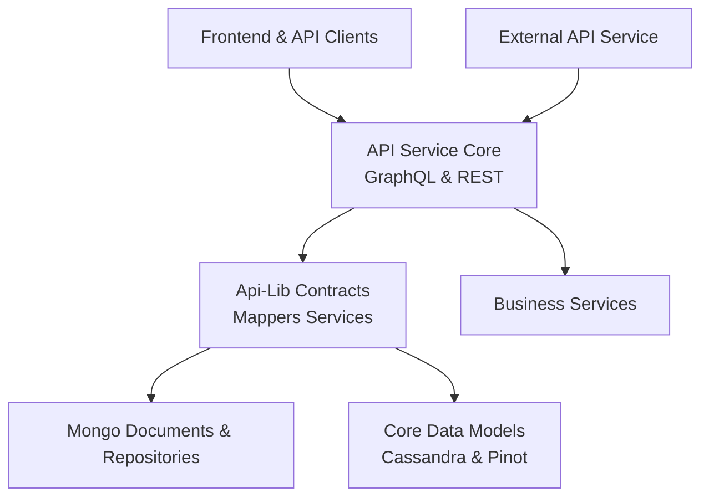
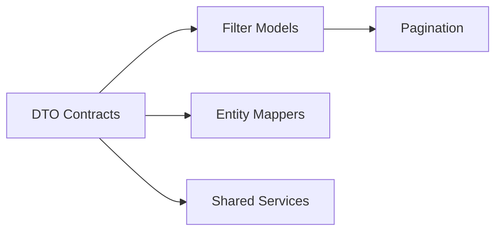
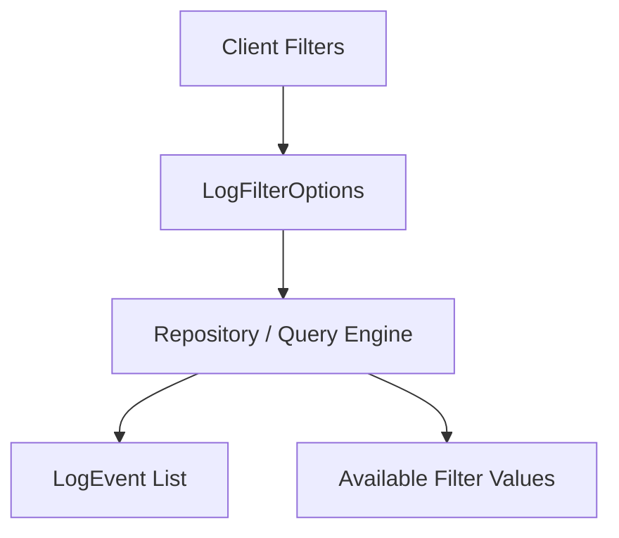
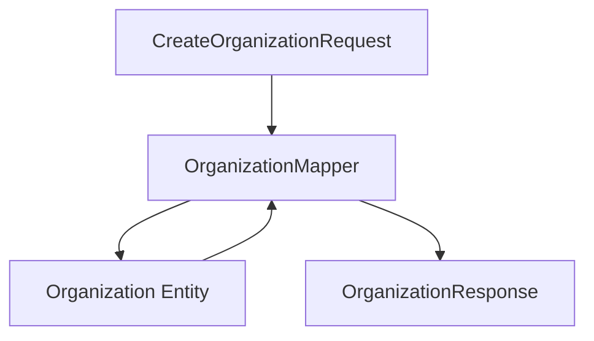
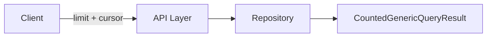
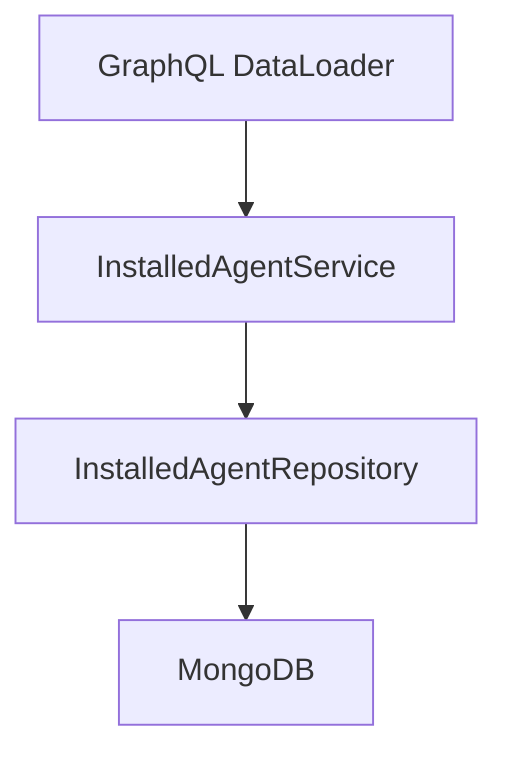
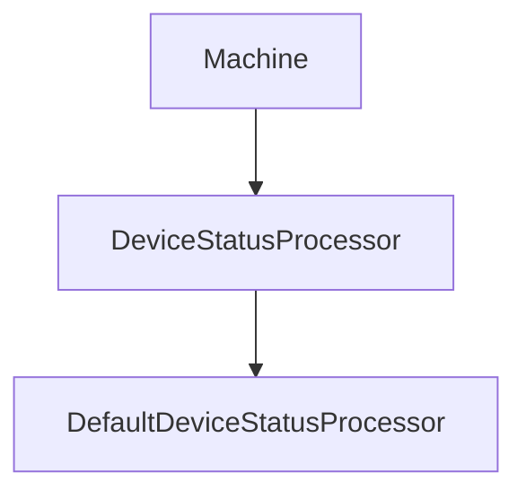

# Api-Lib Contracts Mappers Services

## Overview

The **Api-Lib Contracts Mappers Services** module is a shared library that defines reusable API contracts, filter models, pagination primitives, mappers, and lightweight domain services used across multiple backend services in the OpenFrame platform.

This module acts as a **cross-cutting integration layer** between:

- API layers (GraphQL and REST)
- Data access layers (MongoDB, Cassandra, Pinot, Kafka)
- Business services
- External API services

It ensures consistent DTOs, filtering semantics, pagination patterns, and entity-to-DTO transformations across the platform.

---

## Architectural Role in the Platform

The module sits between service implementations and data/document models, providing shared contracts and mapping logic.



### Responsibilities

1. Define **shared DTO contracts** used by multiple services.
2. Provide **filter and pagination models** for consistent querying.
3. Offer **entity ↔ DTO mappers** for domain objects.
4. Provide small reusable services used by API layers.
5. Standardize query result wrapping and filtered counts.

---

# Module Structure

The Api-Lib Contracts Mappers Services module can be logically divided into five major areas:



- DTO Contracts
- Filter Models
- Pagination & Query Results
- Entity Mappers
- Shared Domain Services & Processors

---

# DTO Contracts

DTOs in this module are **shared between GraphQL (api-service-core) and REST (external-api-service)**.

They represent:

- Logs
- Devices
- Events
- Organizations
- Tools
- Shared query result wrappers

## Counted Generic Query Result

`CountedGenericQueryResult<T>` extends a generic query result with an additional `filteredCount` field.

### Purpose

Used when:

- Returning paginated results
- Supporting filtered search queries
- Providing both total and filtered counts

```java
public class CountedGenericQueryResult<T> extends GenericQueryResult<T> {
    private int filteredCount;
}
```

This enables UI components to:

- Display total records
- Show filtered record counts
- Render accurate pagination controls

---

## Log DTOs

### LogEvent

Represents summarized audit log information:

- toolEventId
- eventType
- severity
- organizationId
- timestamp

Used in list views and search results.

### LogDetails

Extends the log concept with detailed information:

- message
- details
- hostname
- userId
- deviceId

Used for detailed inspection views.

### LogFilterOptions and LogFilters

Two complementary models:

- `LogFilterOptions` – input filter criteria (dates, severities, event types)
- `LogFilters` – resolved filter metadata for UI dropdowns



This separation enables:

- Dynamic filter population
- Efficient backend filtering
- Consistent audit search experience

---

# Device Filtering Models

Device filtering is structured around **option objects** rather than raw strings.

## DeviceFilterOptions

Represents filter input:

- statuses
- deviceTypes
- osTypes
- organizationIds
- tagNames

## DeviceFilters

Represents resolved filter output including counts:

- statuses (with counts)
- deviceTypes (with counts)
- tags (with counts)
- filteredCount

### TagFilterOption & DeviceFilterOption

Each option contains:

- value
- label
- count

This structure supports advanced UI filtering and analytics dashboards.

---

# Event Filtering Models

## EventFilterOptions

- userIds
- eventTypes
- startDate
- endDate

## EventFilters

Simplified resolved filter sets for UI rendering.

These models integrate with stream-processed event data and repository queries.

---

# Organization DTOs and Mapping

## OrganizationResponse

Shared response DTO used by:

- GraphQL API
- External REST API

Contains:

- Identification fields
- Contract data
- Revenue data
- Contact information
- Soft deletion metadata

This ensures consistency across service boundaries.

---

# Organization Mapper

`OrganizationMapper` is a Spring component responsible for:

- Creating entities from request DTOs
- Updating existing entities (partial update)
- Mapping entities to response DTOs
- Handling nested contact and address objects



### Key Behaviors

1. Automatically generates `organizationId` as UUID.
2. Prevents modification of immutable fields.
3. Supports partial updates.
4. Copies physical address when `mailingAddressSameAsPhysical` is true.
5. Converts nested contact objects safely.

This encapsulates transformation logic and prevents duplication in controllers or services.

---

# Pagination Model

## CursorPaginationInput

Defines cursor-based pagination:

- `limit` (min 1, max 100)
- `cursor`



Benefits:

- Efficient large dataset traversal
- Stable pagination under data mutation
- Consistent pagination semantics across services

---

# Tool DTOs

## ToolFilterOptions

Defines filtering inputs:

- enabled
- type
- category
- platformCategory

## ToolFilters

Defines resolved filter categories:

- types
- categories
- platformCategories

## ToolList

Wrapper for returning lists of integrated tools.

---

# Shared Domain Services

The module provides lightweight service implementations reused by API services.

## InstalledAgentService

Provides:

- Fetching installed agents by machine
- Batch loading for multiple machines
- Optimized grouping logic

Designed specifically to support GraphQL DataLoader patterns.



### Batch Loading Strategy

1. Accept list of machine IDs.
2. Query repository using `findByMachineIdIn`.
3. Group results by machineId.
4. Return ordered nested list.

This avoids N+1 query problems.

---

## ToolConnectionService

Similar structure to InstalledAgentService:

- Batch fetch connections
- Group by machineId
- Read-only transactional boundary

Used in API resolvers and REST services.

---

# Device Status Processing Extension Point

## DefaultDeviceStatusProcessor

Provides a default implementation of `DeviceStatusProcessor`.

Characteristics:

- Marked with `@ConditionalOnMissingBean`
- Acts as fallback implementation
- Logs device status changes



This enables:

- Pluggable behavior
- Custom status side-effects
- Clean extension mechanism without modifying core code

---

# Design Principles

The Api-Lib Contracts Mappers Services module follows several architectural principles:

### 1. Contract Centralization
All shared DTOs are defined once and reused everywhere.

### 2. Separation of Input and Output Filters
Distinguishes between:

- Filter input models
- Filter metadata models

### 3. Mapper Encapsulation
All entity-to-DTO transformation logic is centralized.

### 4. Batch-Friendly Services
Services are optimized for:

- GraphQL DataLoader
- Bulk repository access

### 5. Framework-Agnostic DTOs
DTOs are not tightly coupled to specific controllers.

---

# How This Module Fits into the Overall System

The Api-Lib Contracts Mappers Services module acts as:

- A **shared contract library**
- A **mapping abstraction layer**
- A **query and filtering standardization module**
- A **batch-optimized support layer for API services**

Without this module, each service would:

- Duplicate DTO definitions
- Reimplement filter models
- Repeat entity mapping logic
- Risk inconsistent API contracts

By centralizing these responsibilities, the platform achieves:

- Consistency
- Reusability
- Reduced duplication
- Cleaner service architecture
- Easier evolution of API contracts

---

# Summary

The **Api-Lib Contracts Mappers Services** module is a foundational shared library in the OpenFrame ecosystem.

It provides:

- Shared DTO contracts
- Filtering and pagination models
- Entity mapping logic
- Batch-optimized domain services
- Extensible processing hooks

It enables cohesive communication between:

- API services
- Business services
- Data repositories
- Stream processing layers
- Frontend clients

This module is critical for maintaining consistency and scalability across the distributed OpenFrame platform.
