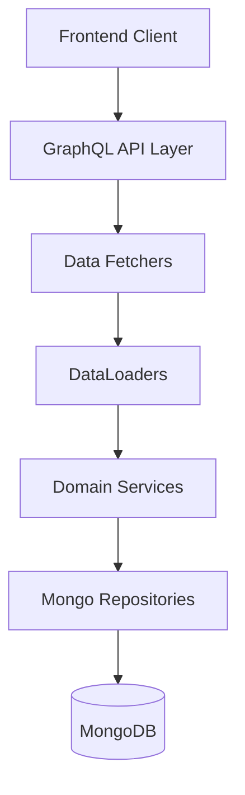
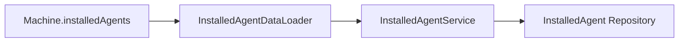
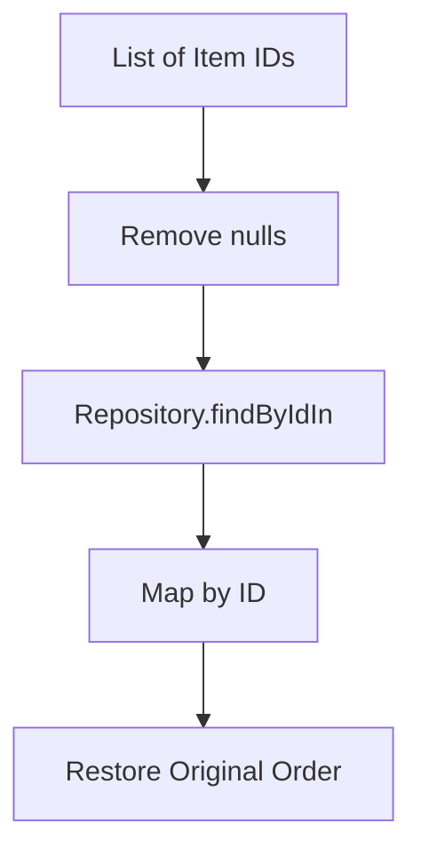
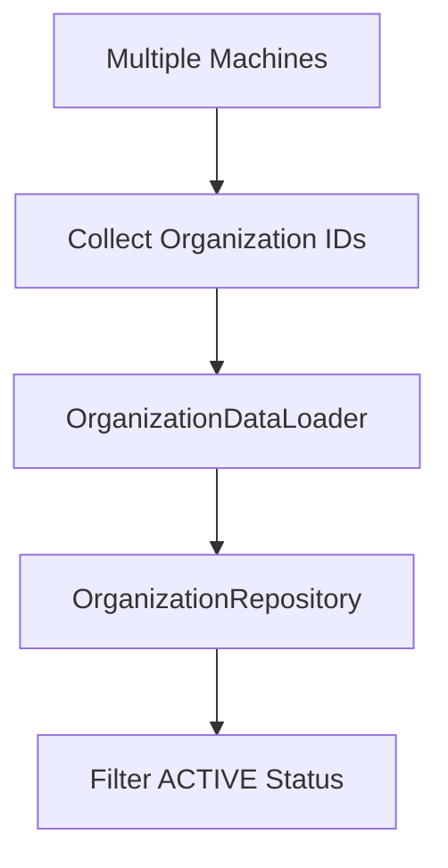
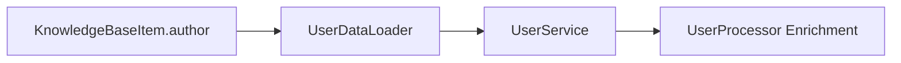
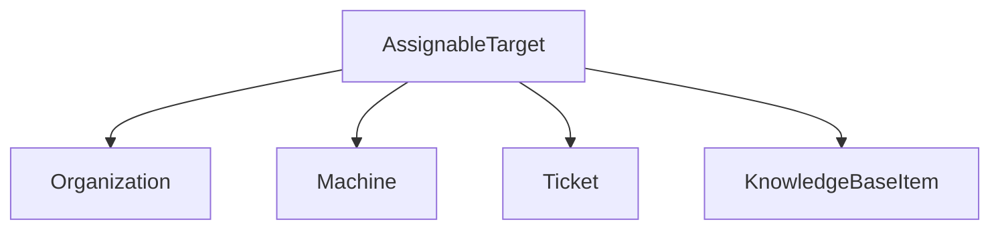
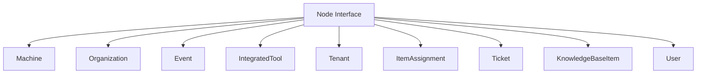
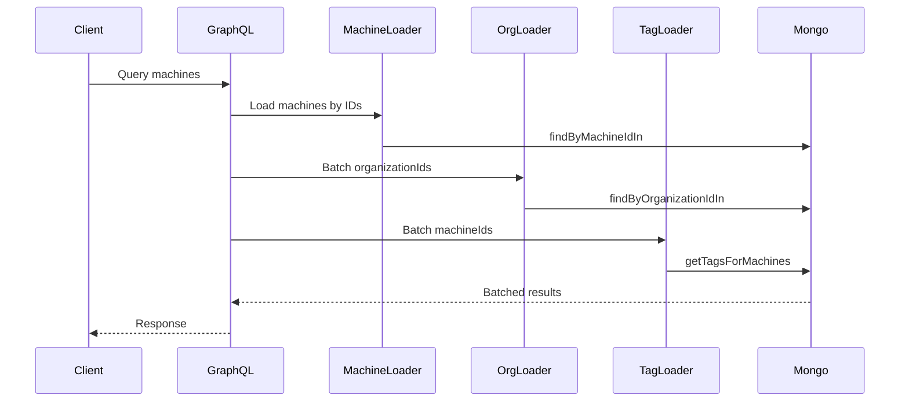

# Api Service Core Dataloaders And Relay

## Overview

The **Api Service Core Dataloaders And Relay** module provides the GraphQL data loading and type resolution infrastructure for the OpenFrame API layer.

It is responsible for:

- Preventing N+1 query issues in GraphQL queries
- Efficient batch loading of domain entities
- Supporting Relay-style `Node` resolution
- Resolving polymorphic GraphQL interfaces (e.g., `AssignableTarget`)
- Coordinating with repositories and domain services for optimized data access

This module is tightly integrated with:

- `api-service-core-graphql-and-rest` (GraphQL schema & data fetchers)
- `api-service-core-domain-services` (business logic)
- `data-mongo-domain-and-repositories` (MongoDB persistence)
- `api-contracts-and-mapping` (shared services and contracts)

It acts as the **performance and polymorphism layer** of the GraphQL API.

---

## Architectural Context

### High-Level Placement



The Api Service Core Dataloaders And Relay module sits between:

- GraphQL Data Fetchers (field-level resolvers)
- Domain Services / Repositories

It ensures:

- Batched retrieval
- Ordered results matching input keys
- Soft-deletion awareness (e.g., active organizations only)
- Proper GraphQL interface resolution

---

# Core Responsibilities

## 1. DataLoader Infrastructure

All DataLoaders are implemented using:

- `@DgsDataLoader`
- `org.dataloader.BatchLoader`
- `CompletableFuture`

Each DataLoader:

- Accepts a list of keys
- Removes nulls
- Deduplicates keys
- Performs a single batch query
- Maps results back to the original input order

This eliminates classic N+1 problems in nested GraphQL queries.

---

## 2. Relay and GraphQL Type Resolution

This module implements:

- `Node` interface resolution
- `AssignableTarget` polymorphic resolution

These resolvers allow GraphQL to dynamically determine the correct type at runtime.

---

# DataLoader Components

## InstalledAgentDataLoader

**Purpose:** Batch loads installed agents for multiple machines.

- Key: `machineId`
- Return: `List<InstalledAgent>` per machine
- Delegates to: `InstalledAgentService`



---

## KnowledgeBaseAttachmentDataLoader

**Purpose:** Batch loads attachments for Knowledge Base articles.

- Key: `articleId`
- Return: `List<KnowledgeBaseItemAttachment>`
- Delegates to: `KnowledgeBaseAttachmentService`

Includes debug logging for batch size visibility.

---

## KnowledgeBaseItemDataLoader

**Purpose:** Loads `KnowledgeBaseItem` by ID.

Used primarily by:

- `AssignableTarget` resolution when type = `KNOWLEDGE_ARTICLE`

Key behaviors:

- Filters null IDs
- Deduplicates
- Uses repository `findByIdIn`
- Restores input order



---

## KnowledgeBaseTagDataLoader

**Purpose:** Batch loads tags for Knowledge Base items.

- Key: `itemId`
- Delegates to: `KnowledgeBaseTagService`
- Return: `List<Tag>` per article

---

## MachineDataLoader

**Purpose:** Batch loads `Machine` entities.

Used by:

- `AssignableTarget` when target type = `DEVICE`
- GraphQL field resolvers referencing machines

Behavior:

- Calls `MachineRepository.findByMachineIdIn`
- Returns ordered list

---

## OrganizationDataLoader

**Purpose:** Loads `Organization` entities by ID.

Key characteristics:

- Filters soft-deleted organizations
- Returns only `OrganizationStatus.ACTIVE`
- Prevents N+1 when machines reference organizations



---

## TagDataLoader

**Purpose:** Batch loads tags assigned to machines.

- Key: `machineId`
- Delegates to: `TagService`
- Return: `List<Tag>` per machine

---

## TicketDataLoader

**Purpose:** Loads `Ticket` by ID.

Used in:

- `AssignableTarget` when target type = `TICKET`

Behavior mirrors other ID-based loaders:

- Deduplicate
- Batch fetch via repository
- Restore input ordering

---

## ToolConnectionDataLoader

**Purpose:** Batch loads tool connections for machines.

- Key: `machineId`
- Delegates to: `ToolConnectionService`

Enables efficient retrieval of integrated tool state per device.

---

## UserDataLoader

**Purpose:** Loads `UserResponse` objects.

Used by:

- `KnowledgeBaseItem.author` field resolver

Important distinction:

- Goes through `UserService`
- Allows SaaS implementations to enrich user data (e.g., avatar image)



---

# Relay Type Resolvers

## AssignableTargetTypeResolver

Resolves the GraphQL interface:

```
AssignableTarget
```

Supported concrete types:

- Organization
- Machine
- Ticket
- KnowledgeBaseItem



If an unsupported type is encountered, an `IllegalArgumentException` is thrown.

---

## NodeTypeResolver

Resolves the GraphQL `Node` interface for Relay support.

Supported types include:

- Machine
- Organization
- Event
- IntegratedTool
- Tenant
- ItemAssignment
- Ticket
- KnowledgeBaseItem
- User



This enables Relay-style global node fetching.

---

# Interaction with Other Modules

The Api Service Core Dataloaders And Relay module interacts with:

- `api-service-core-graphql-and-rest` for schema and data fetchers
- `api-service-core-domain-services` for business logic
- `data-mongo-domain-and-repositories` for persistence
- `api-contracts-and-mapping` for shared services

It does not implement business logic itself — it optimizes and orchestrates data access.

---

# End-to-End Flow Example

Example: Query fetching machines with organization and tags.



This demonstrates:

- Parallel batched execution
- Reduced DB roundtrips
- Ordered deterministic results

---

# Design Principles

The module follows these architectural principles:

- ✅ Separation of concerns (no business logic in loaders)
- ✅ Batch-first design
- ✅ Order preservation guarantee
- ✅ Null-safe handling
- ✅ GraphQL polymorphism support
- ✅ Async execution using `CompletableFuture`

---

# Summary

The **Api Service Core Dataloaders And Relay** module is the performance backbone of the OpenFrame GraphQL API.

It:

- Eliminates N+1 query issues
- Enables Relay compatibility
- Supports polymorphic GraphQL interfaces
- Bridges GraphQL resolvers and persistence
- Ensures scalable, efficient API execution

Without this layer, complex nested queries would result in excessive database calls and degraded performance.

This module ensures that OpenFrame’s API remains efficient, extensible, and GraphQL-native.
