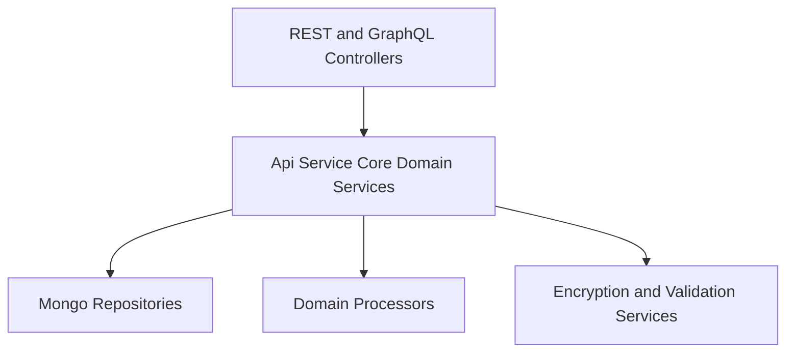
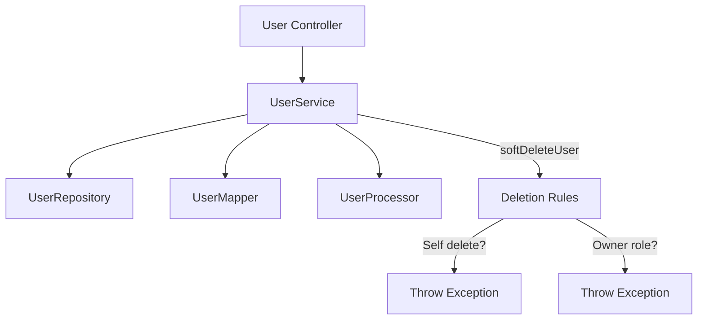
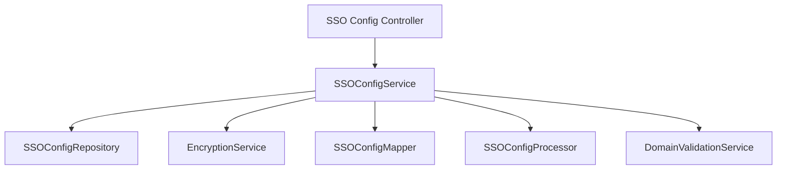
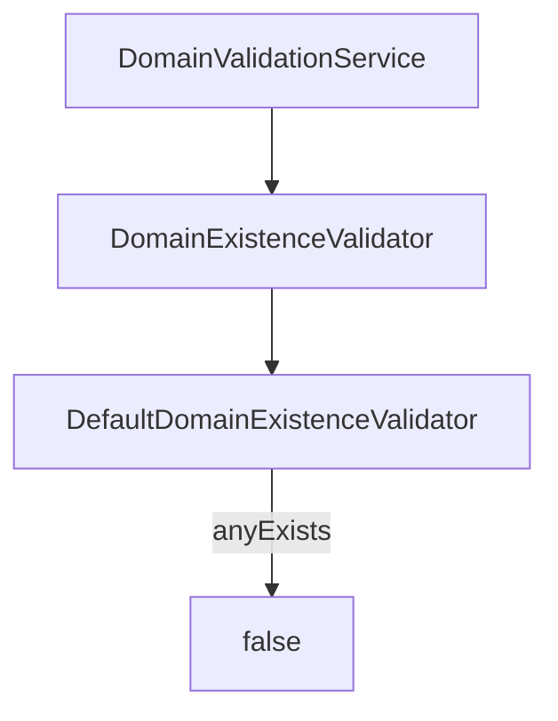
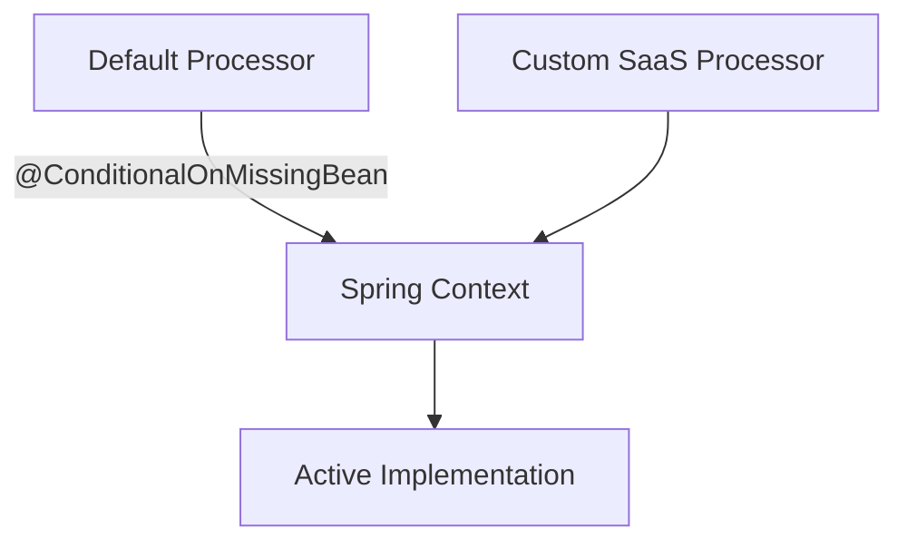

# Api Service Core Domain Services

## Overview

The **Api Service Core Domain Services** module contains the core business logic layer for the OpenFrame API service. It sits between controllers (REST and GraphQL) and the data access layer (Mongo repositories), encapsulating domain rules, validation, orchestration, and post-processing hooks.

This module is responsible for:

- User lifecycle management
- SSO (Single Sign-On) configuration management
- Agent registration secret processing
- Invitation lifecycle processing
- Domain validation policies
- Extensible domain event post-processing via processor interfaces

It provides default implementations that can be overridden in SaaS or tenant-specific deployments using Spring’s `@ConditionalOnMissingBean` mechanism.

---

## Architectural Position

The Api Service Core Domain Services module operates in the service layer of the API service.

### Key Characteristics

- **Transactional domain logic** lives here.
- **DTO mapping** is delegated to mappers.
- **Persistence** is delegated to repositories.
- **Cross-cutting side effects** are delegated to processor interfaces.
- **Multi-tenant and SaaS overrides** are enabled via conditional beans.

---

## Core Components

### 1. UserService

**Class:** `UserService`

The `UserService` manages user retrieval, updates, pagination, and soft deletion.

#### Responsibilities

- Fetch users by ID or email
- List users with pagination
- Update user profile fields
- Soft-delete users with business rule enforcement
- Invoke post-processing hooks via `UserProcessor`

#### Business Rules

- Users cannot delete themselves (`UserSelfDeleteNotAllowedException`).
- Users with role `OWNER` cannot be deleted (`OperationNotAllowedException`).
- Deletion is implemented as a status transition to `DELETED` (soft delete).

#### Extension Point

The `UserProcessor` interface allows custom logic to run after:

- User fetch
- User update
- User deletion

The default implementation is `DefaultUserProcessor`, which logs debug information.

---

### 2. SSOConfigService

**Class:** `SSOConfigService`

This service manages the lifecycle of SSO provider configurations per tenant.

#### Responsibilities

- Retrieve enabled SSO providers for login UI
- Provide available provider metadata
- Get full configuration for admin editing
- Create, update, delete SSO configurations
- Toggle provider enablement
- Validate domain and provisioning rules

#### Internal Dependencies

- `SSOConfigRepository`
- `EncryptionService` (for client secret encryption/decryption)
- `SSOConfigMapper`
- `SSOConfigProcessor`
- `DomainValidationService`

#### Auto-Provision Validation Logic

When `autoProvisionUsers` is enabled:

- `allowedDomains` must not be empty.
- Domains are normalized (trimmed, lowercase, deduplicated).
- Public generic domains are validated.
- Domain existence is validated.
- For Microsoft providers, `msTenantId` is mandatory.

This ensures strict domain-scoped onboarding and prevents misconfiguration of multi-tenant SSO flows.

#### Processor Hook

The `SSOConfigProcessor` enables custom behavior when:

- A configuration is saved
- A configuration is deleted
- A configuration is toggled

The default implementation `DefaultSSOConfigProcessor` logs state changes.

---

### 3. DefaultDomainExistenceValidator

**Class:** `DefaultDomainExistenceValidator`

This is the default implementation of the `DomainExistenceValidator` interface.

#### Behavior

- Always returns `false` for `anyExists(List<String> domains)`.
- Does not block based on domain existence.

This is designed for OSS deployments. SaaS or enterprise distributions can override this bean to enforce stricter domain validation.

---

## Domain Processors

The module defines several processor extension points. Each has a default no-op or logging implementation.

### 1. DefaultAgentRegistrationSecretProcessor

Handles post-processing for agent registration secrets.

Hooks:
- `postProcessSecretGenerated`
- `postProcessSecretDeactivated`

Default behavior: debug logging only.

---

### 2. DefaultInvitationProcessor

Handles invitation lifecycle events.

Hooks:
- `postProcessInvitationCreated`
- `postProcessInvitationRevoked`

Default behavior: debug logging.

---

### 3. DefaultSSOConfigProcessor

Handles SSO configuration lifecycle events.

Hooks:
- `postProcessConfigSaved`
- `postProcessConfigDeleted`
- `postProcessConfigToggled`

Default behavior: debug logging.

---

### 4. DefaultUserProcessor

Handles user lifecycle post-processing.

Hooks:
- `postProcessUserGet`
- `postProcessUserUpdated`
- `postProcessUserDeleted`

Default behavior: debug logging.

---

## Extension and Override Model

A key architectural design principle of the Api Service Core Domain Services module is **replaceable default implementations**.

All default processors and validators use:

- `@Component`
- `@ConditionalOnMissingBean`

This allows downstream services (e.g., SaaS builds) to:

- Override validation strategies
- Publish domain events
- Trigger external integrations
- Enforce organization-level policies

If a custom implementation is present, Spring will wire it instead of the default.

---

## Interaction with Other Layers

Although this module contains domain services, it depends on:

- DTOs from the API layer
- Mongo documents and repositories from the data layer
- Encryption services from the core crypto module
- Validation services for domain rules

It does not:

- Expose HTTP endpoints directly
- Contain controller logic
- Contain infrastructure configuration

This strict layering improves testability, modularity, and replaceability.

---

## Summary

The **Api Service Core Domain Services** module is the central domain orchestration layer of the OpenFrame API service. It:

- Encapsulates core business logic
- Enforces domain-specific rules
- Coordinates persistence and mapping
- Provides extensibility via processor interfaces
- Enables SaaS overrides without modifying OSS defaults

It is a foundational module that ensures clean separation between transport, business logic, and persistence while supporting tenant-aware extensibility.