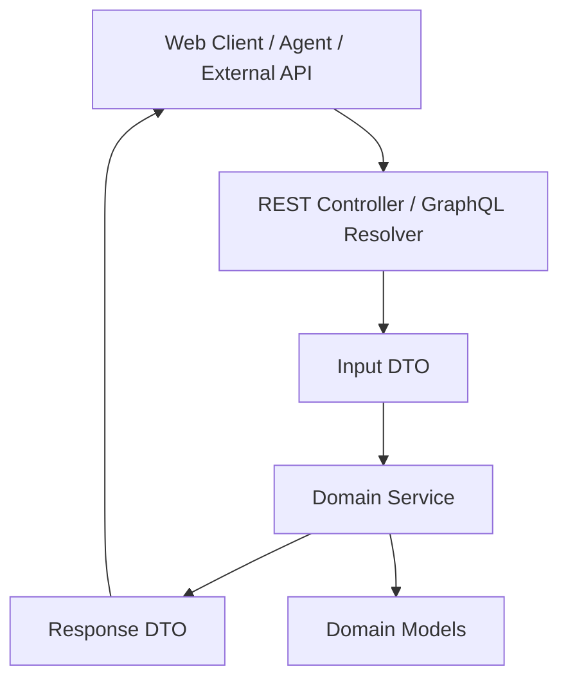
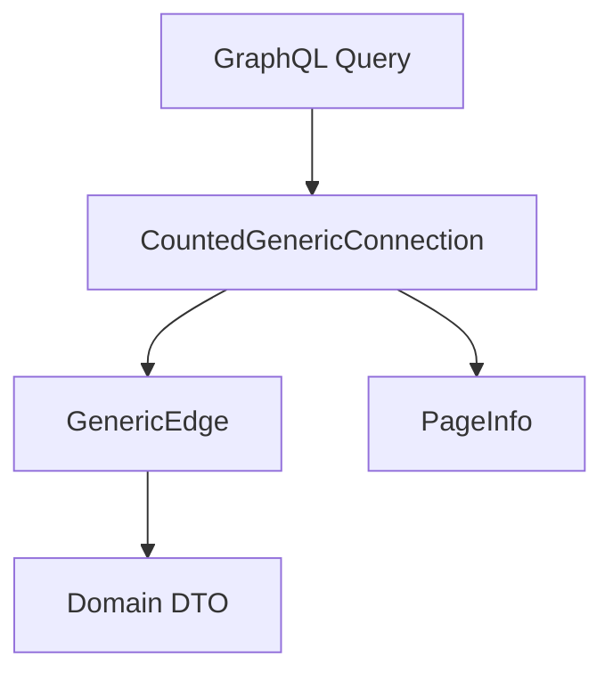
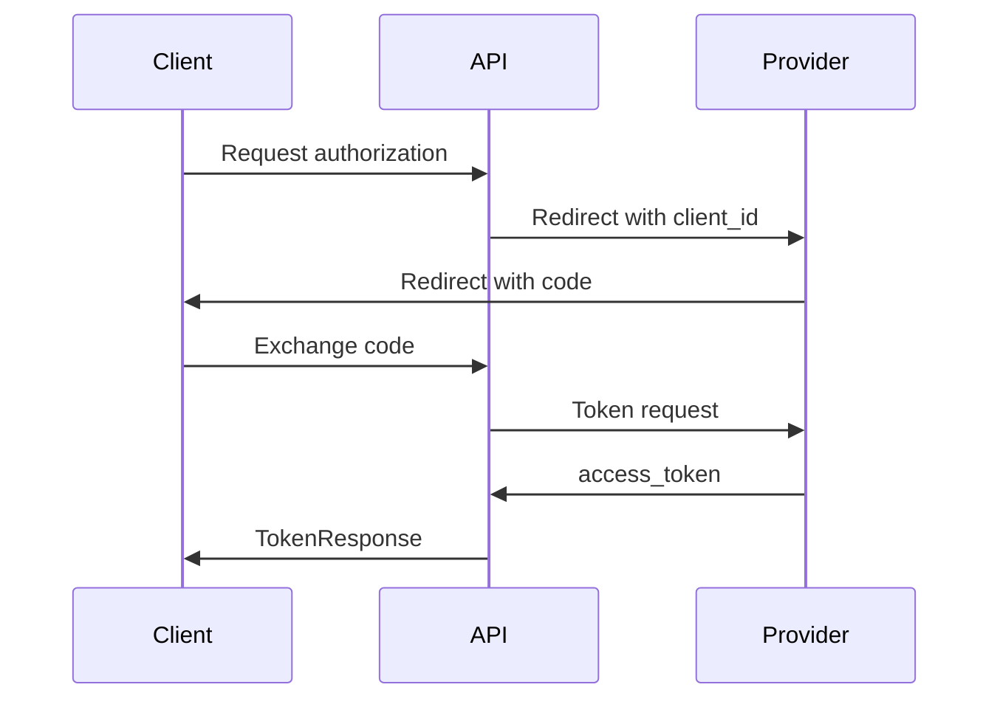
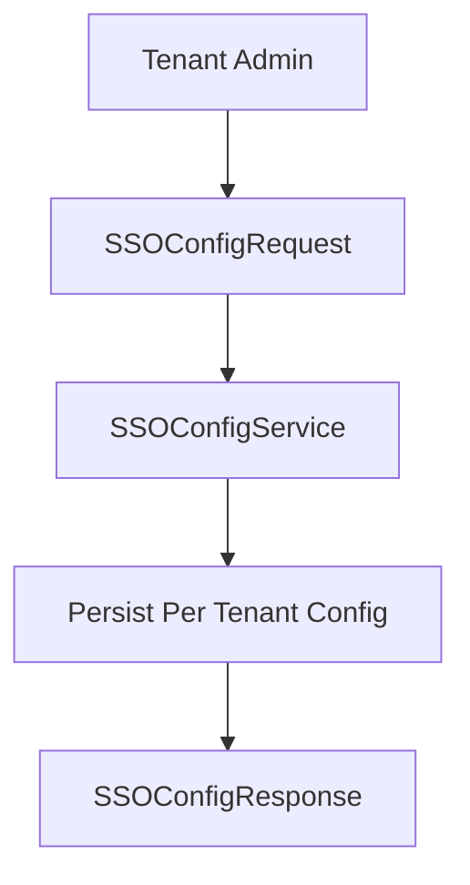
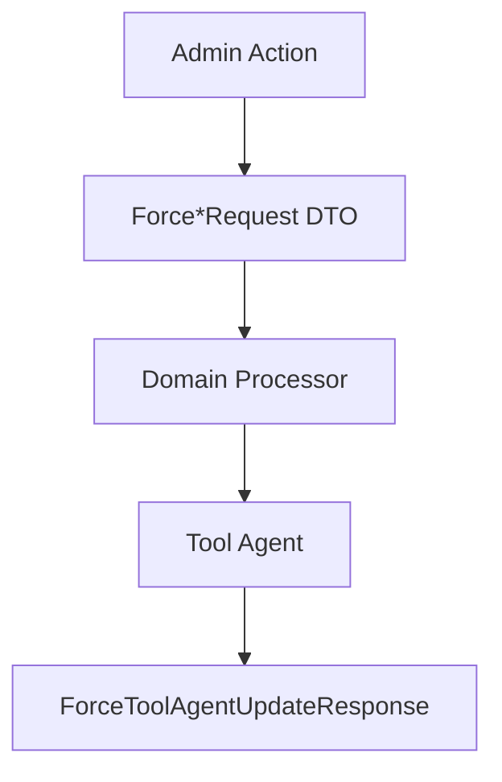

# Api Service Core Dto

## Overview

The **Api Service Core Dto** module defines the Data Transfer Objects (DTOs) used by the API layer of the OpenFrame platform. These DTOs represent:

- REST request and response payloads  
- GraphQL input and connection models  
- OAuth2 / OIDC integration payloads  
- SSO configuration contracts  
- Domain-specific command and filter inputs  

This module acts as the **contract boundary** between:

- API controllers and GraphQL data fetchers  
- Domain services and processors  
- External clients (Web UI, agents, integrations)  

It contains no business logic. Its responsibility is to provide strongly typed, validated, and serialization-ready models.

---

## Architectural Role

Within the overall OpenFrame architecture, Api Service Core Dto sits between the API layer and the domain layer.

### Key Responsibilities

1. **Request Modeling** – Encapsulate client-provided data.
2. **Response Modeling** – Define stable API response structures.
3. **Validation Layer** – Enforce field-level constraints via Jakarta Validation.
4. **Serialization Contracts** – Control JSON field names via Jackson annotations.
5. **GraphQL Compatibility** – Provide connection and input types aligned with schema design.

---

## Module Structure

The DTOs are organized by functional domain:

- Core & Generic API DTOs  
- Authentication & OAuth  
- SSO Configuration  
- User & Organization  
- Device & Tool Filtering  
- Events & Audit  
- Knowledge Base  
- Invitations  
- Force / Update Operations  
- Notifications  
- GraphQL Relay Support  

Each section below explains how these groups support the API layer.

---

# 1. Core & Generic API DTOs

## GenericEdge<T>

Represents a single edge in a GraphQL Relay-style connection.

- `node` – The actual object  
- `cursor` – Encoded pagination cursor  

## CountedGenericConnection<T extends GenericEdge>

Extends a generic connection model and introduces:

- `filteredCount` – Number of items after filtering  

Used in GraphQL list queries where both pagination and filtered counts are required.

### GraphQL Connection Model

This pattern ensures consistent pagination across all GraphQL endpoints.

---

# 2. Authentication & OAuth DTOs

These DTOs model OAuth2 and OpenID Connect interactions.

## OAuth Flow DTOs

- AuthorizationResponse  
- GoogleTokenRequest  
- SocialAuthRequest  
- TokenResponse  

### OAuth Authorization Code Flow Representation

### TokenResponse

Defines the standard OAuth token structure:

- access_token  
- refresh_token  
- token_type  
- expires_in  

Jackson `@JsonProperty` annotations ensure RFC-compliant field naming.

---

# 3. SSO Configuration DTOs

Used to configure and manage Single Sign-On providers per tenant.

## SSOConfigRequest

Contains:

- clientId  
- clientSecret  
- autoProvisionUsers  
- msTenantId  
- allowedDomains  

Validation constraints enforce required fields.

## SSOConfigResponse

Represents stored configuration including:

- provider  
- enabled  
- allowedDomains  

## SSOConfigStatusResponse

Lightweight status check object.

## SSOProviderInfo

Describes available provider metadata for UI selection.

### SSO Configuration Lifecycle

---

# 4. User & Organization DTOs

## UserResponse

Defines the public-facing representation of a user:

- id  
- email  
- roles  
- status  
- image  
- createdAt / updatedAt  

## UpdateUserRequest

Supports partial updates with field length constraints.

## OrganizationFilterInput

GraphQL input model supporting:

- category  
- employee range  
- contract status  
- status  

---

# 5. Device & Tool Filtering DTOs

## DeviceFilterInput

Supports filtering by:

- statuses  
- deviceTypes  
- OS types  
- organizationIds  
- tags  

## ToolFilterInput

Filters tools by:

- enabled  
- type  
- category  
- platformCategory  

These inputs are optimized for GraphQL schema compatibility.

---

# 6. Events & Audit DTOs

## CreateEventInput

Defines event creation payload:

- userId  
- type  
- data  

## EventFilterInput

Supports filtering by:

- userIds  
- eventTypes  
- date range  

## LogFilterInput

Audit filtering model including:

- eventTypes  
- toolTypes  
- severities  
- organizationIds  
- deviceId  

---

# 7. Knowledge Base DTOs

Supports content management for articles and folders.

## CreateArticleInput

Allows defining:

- parentId  
- summary  
- tags  
- assignment targets  

Includes size limits to protect system integrity.

## UpdateArticleInput

Allows safe modification of article metadata.

## Attachment DTOs

- CreateKnowledgeBaseAttachmentInput  
- CreateKnowledgeBaseTempAttachmentInput  
- LinkKnowledgeBaseTempAttachmentsInput  

## DeleteFolderInput

Defines folder deletion behavior and child handling strategy.

---

# 8. Invitation DTOs

## CreateInvitationRequest

- email (validated)  
- roles  

## UpdateInvitationStatusRequest

Enforces non-null invitation status.

## InvitationPageResponse

Extends paginated response model for invitation listings.

---

# 9. Force & Update Operation DTOs

Used to trigger remote actions on agents or tools.

## ForceClientUpdateRequest (force.request)

- machineIds  

## ForceToolInstallationAllRequest

- toolAgentId  

## ForceToolReinstallationRequest

- machineIds  
- toolAgentId  

## ForceToolUpdateRequest

- machineIds  
- toolAgentId  

## ForceToolAgentUpdateResponse

Contains list of response items for bulk operations.

### Command Execution Flow

---

# 10. Notifications

## NotificationFilterInput

Supports filtering by read/unread status.

Designed for lightweight polling or GraphQL subscription filtering.

---

# 11. Agent & API Key DTOs

## AgentRegistrationSecretResponse

Represents agent registration secrets:

- id  
- key  
- createdAt  
- active  

## ApiKeyResponse

API key metadata without exposing the secret:

- name  
- enabled  
- usage statistics  
- expiration  

This separation ensures secure secret handling.

---

# Validation & Serialization Strategy

The module uses:

- Jakarta Validation annotations (`@NotBlank`, `@NotNull`, `@Size`)  
- Jackson `@JsonProperty` for field name control  
- Lombok (`@Data`, `@Builder`, `@Getter`) for boilerplate reduction  

This guarantees:

- Consistent API contracts  
- Clean serialization boundaries  
- Reduced duplication  
- Strict input validation before domain processing  

---

# Design Principles

1. DTOs are immutable where possible (Builder pattern).  
2. No business logic inside DTOs.  
3. Clear separation between domain models and API contracts.  
4. GraphQL-friendly design using connection patterns.  
5. OAuth and OIDC compliance via RFC-aligned naming.  

---

# Summary

The **Api Service Core Dto** module defines the contract surface of the OpenFrame API layer. It:

- Standardizes request and response models  
- Enables secure authentication and SSO integration  
- Supports Relay-style GraphQL pagination  
- Provides strongly typed filter and command inputs  
- Ensures validation and serialization consistency  

By isolating API-facing models from internal domain models, this module preserves architectural boundaries and guarantees long-term API stability.