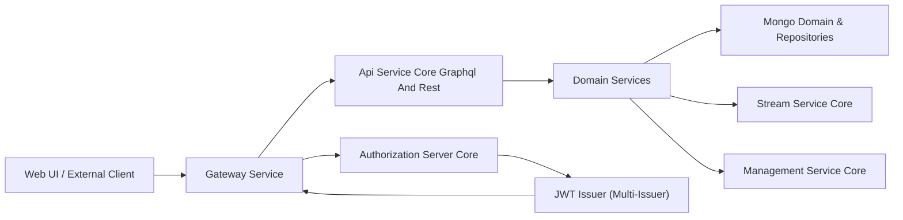
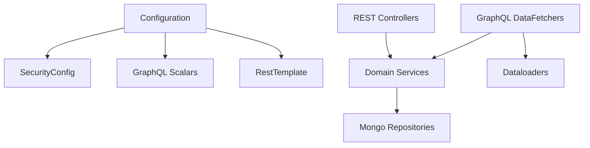
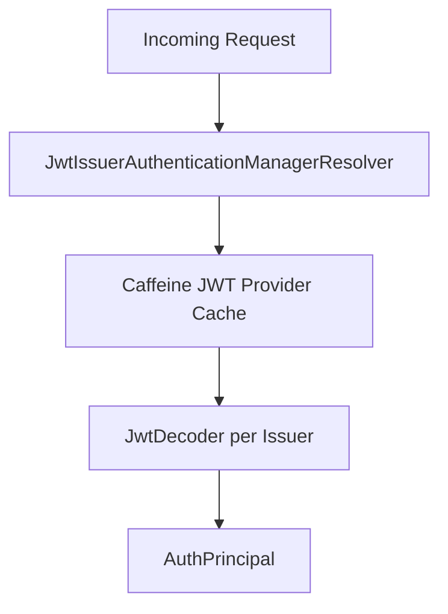
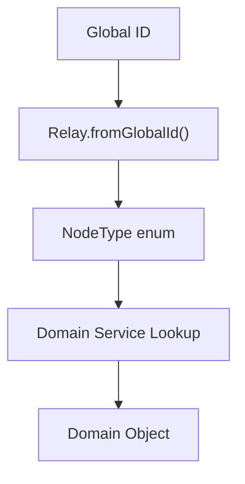
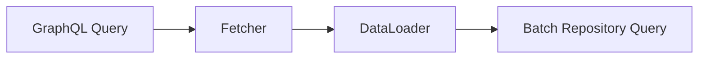

# Api Service Core Graphql And Rest

## Overview

The **Api Service Core Graphql And Rest** module is the primary application-layer interface for the OpenFrame platform. It exposes both:

- **REST endpoints** for operational, administrative, and internal workflows
- **GraphQL APIs** (via Netflix DGS) for rich, client-driven querying with Relay support

This module acts as the orchestration layer between:

- Domain services (user, organization, device, knowledge base, notification, etc.)
- Mongo-based repositories and query services
- Kafka / streaming pipelines (indirectly through services)
- OAuth2 / JWT authentication (via Authorization Server and Gateway)

It is designed to be **stateless**, **multi-tenant aware**, and **gateway-integrated**.

---

## Architectural Position in the Platform



### Responsibilities

- Accept authenticated requests from the Gateway
- Expose REST controllers for imperative operations
- Expose GraphQL schema and resolvers for rich data querying
- Translate DTOs ↔ domain objects
- Enforce multi-tenant scoping through services
- Provide Relay-compliant node resolution

The Gateway handles:

- JWT validation
- Cookie-to-header propagation
- PermitAll path handling
- CORS and edge security

The Api Service Core Graphql And Rest module focuses purely on **application logic and API exposure**.

---

## Internal Structure

The module is logically divided into:

1. Configuration
2. REST Controllers
3. GraphQL Data Fetchers
4. Relay & Node Resolution
5. Security Integration
6. DTO and Mapper Integration



---

# 1. Configuration Layer

## ApiApplicationConfig

Provides shared infrastructure beans such as:

- `PasswordEncoder` (BCrypt)

Ensures consistent password hashing across user-related flows.

---

## AuthenticationConfig

Registers a custom `AuthPrincipalArgumentResolver` enabling:

- `@AuthenticationPrincipal AuthPrincipal` injection in controllers

This abstracts JWT decoding from controllers and standardizes authenticated user access.

---

## SecurityConfig

This module runs as an **OAuth2 Resource Server**.

Key characteristics:

- CSRF disabled
- All routes `permitAll()` at HTTP level
- JWT validation via `JwtIssuerAuthenticationManagerResolver`
- Multi-issuer support
- Caffeine-based JWT provider cache



The Gateway already enforces edge security; this layer enables:

- `@AuthenticationPrincipal`
- `@PreAuthorize`
- JWT-based role extraction

---

## DataInitializer

Boot-time initialization logic:

- Ensures default OAuth client exists
- Updates secret if configuration changes

This guarantees consistent OAuth client setup in multi-environment deployments.

---

## GraphQL Scalar Configuration

Custom scalars:

- `Date` → `LocalDate`
- `Instant` → `Instant`
- `Long` → 64-bit values beyond GraphQL Int limit

These ensure:

- Strict format validation
- Consistent serialization
- Schema-level type safety

---

# 2. REST API Layer

REST controllers provide imperative and administrative operations.

## Core REST Controllers

| Controller | Responsibility |
|------------|---------------|
| HealthController | Liveness probe |
| MeController | Current authenticated user |
| ApiKeyController | API key CRUD and regeneration |
| UserController | User management |
| InvitationController | User invitations |
| OrganizationController | Organization mutations |
| SSOConfigController | SSO provider configuration |
| AgentRegistrationSecretController | Agent registration secrets |
| ForceAgentController | Force install/update operations |
| DeviceController | Device status updates |
| ReleaseVersionController | Release version lookup |
| OpenFrameClientConfigurationController | Client configuration |

### Design Characteristics

- Controllers are thin
- Business logic delegated to services
- DTO-based request/response models
- Explicit HTTP status handling
- Validation via `@Valid`

---

# 3. GraphQL Layer (Netflix DGS)

The GraphQL API enables flexible querying, filtering, pagination, and mutation.

## Core Patterns

- `@DgsQuery` for queries
- `@DgsMutation` for mutations
- Relay global IDs
- Cursor-based pagination
- DataLoader-based N+1 mitigation

---

## Relay and Global Node Support

Global ID pattern:

```text
Base64("TypeName:rawId")
```

Resolution flow:



The `NodeDataFetcher` supports:

- Single `node(id)`
- Batch `nodes(ids)`
- Multiple domain entity types

---

# 4. GraphQL Data Fetcher Domains

The module contains domain-specific resolvers:

## Device

- Query devices with filters
- Cursor-based pagination
- Tag, tool connection, installed agent resolution via DataLoader

## Organization

- Filtered organization queries
- Node resolution
- Archive capability checks

## Event

- Event creation and update
- Filtered queries
- Cursor pagination

## Knowledge Base

- Folder tree
- Article CRUD
- Tag management
- Publish/unpublish
- Attachment upload URL generation
- Temp attachment linking

## Notifications

- Per-user / per-agent notifications
- Read state tracking
- Category unread counts
- Role-based access via `@PreAuthorize`

## Assignment

- Assign/unassign domain entities
- Count assigned targets

## Scripts (RMM)

- Script CRUD
- Pagination
- Filtering and sorting

## Tools

- Integrated tool querying
- Tool filters

## Logs (Conditional)

Enabled when Cassandra logging is active.

---

# 5. DataLoader Integration

GraphQL DataLoaders are used for:

- Organization resolution
- Machine resolution
- Ticket resolution
- Knowledge base attachments
- Tags
- Installed agents
- Users

This prevents N+1 query issues.



---

# 6. Multi-Tenancy

Multi-tenancy is enforced through:

- JWT tenant claims
- Tenant-aware services
- Repository-level scoping
- Tenant repository support in Node resolution

The API layer does not manually enforce tenant filters; services are responsible for scoping.

---

# 7. Security Model

| Layer | Responsibility |
|--------|--------------|
| Gateway | Edge validation, header enrichment |
| Authorization Server | Token issuance |
| Api Service Core Graphql And Rest | Resource server, principal extraction |

Role-based enforcement is used in specific GraphQL operations (e.g., notifications).

---

# 8. Interaction With Other Modules

The Api Service Core Graphql And Rest module collaborates with:

- Authorization Server Core (JWT issuance)
- Gateway Service Core (edge routing and authentication)
- Data Mongo Domain and Repositories (persistence)
- Data Mongo Sync Configuration and Custom Repositories (custom queries and indexes)
- Data Kafka and Debezium (event propagation indirectly via services)
- Stream Service Core (event ingestion and enrichment)
- Management Service Core (background jobs and initializers)

It acts as the **API façade** of the platform.

---

# 9. Design Principles

- Thin controllers and fetchers
- Strong separation of DTO and domain
- Relay-compliant GraphQL
- Cursor-based pagination everywhere
- Multi-issuer JWT support
- Modular service-driven architecture
- Extensible GraphQL type resolution

---

# Conclusion

The **Api Service Core Graphql And Rest** module is the central API orchestration layer of OpenFrame.

It provides:

- Unified REST and GraphQL exposure
- Relay-compliant node architecture
- Multi-tenant JWT integration
- Domain-driven service orchestration
- Scalable, DataLoader-optimized querying

This module is intentionally focused on API concerns while delegating domain logic, persistence, and streaming responsibilities to their respective core modules.