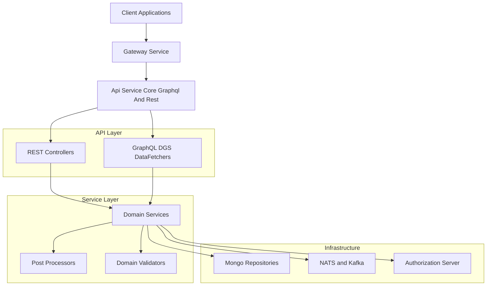
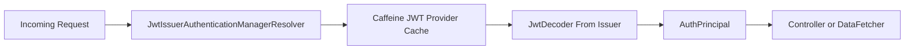
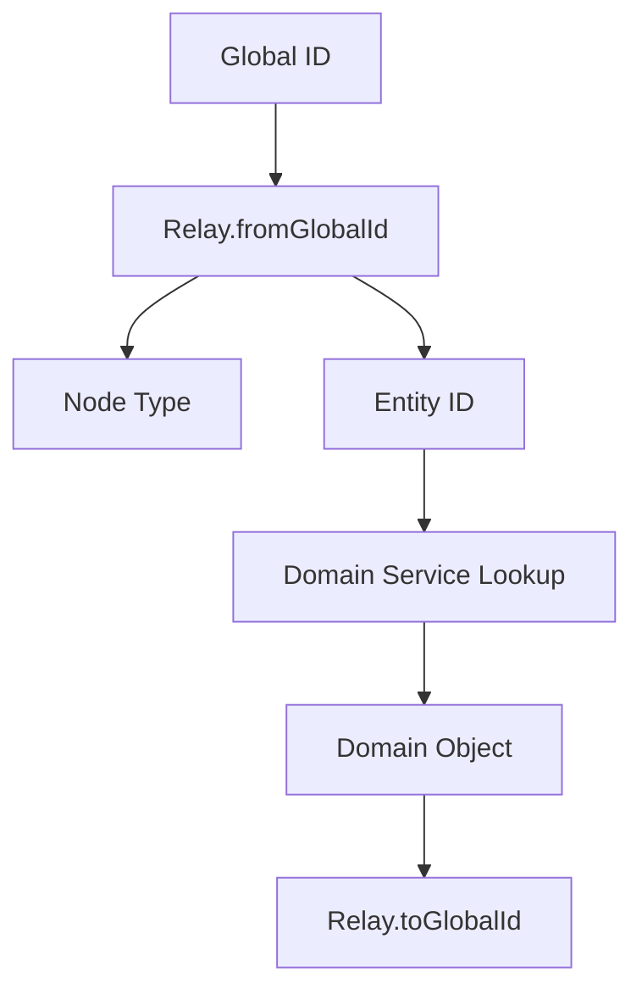
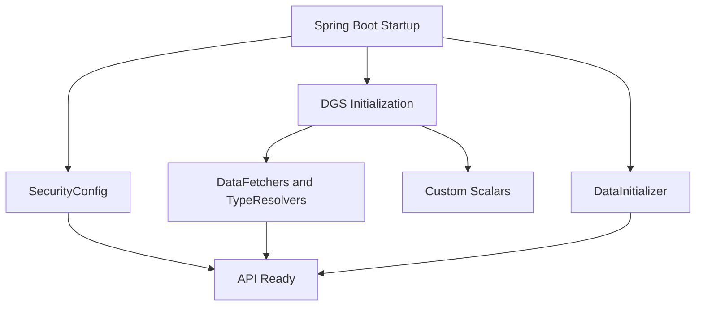

# Api Service Core Graphql And Rest

The **Api Service Core Graphql And Rest** module is the primary application-layer entry point for OpenFrame tenant services. It exposes both **REST** and **GraphQL** APIs, integrates with the security infrastructure, orchestrates domain services, and bridges client-facing operations with the underlying data, messaging, and authorization layers.

This module is designed to:

- Expose internal and tenant-scoped REST endpoints
- Provide a GraphQL API using the Netflix DGS framework
- Integrate with JWT-based OAuth2 Resource Server security
- Support Relay-style global node resolution
- Delegate business logic to domain services and processors
- Remain extensible via default processor implementations

---

## High-Level Architecture

### Key Principles

- **Gateway-first security**: The Gateway handles most authentication and header normalization. This module enables OAuth2 Resource Server primarily to support `@AuthenticationPrincipal` resolution.
- **Thin controllers, rich services**: Controllers and DataFetchers delegate to domain services.
- **Relay-compliant GraphQL**: Global IDs and type resolvers ensure consistent node resolution.
- **Extensible processing hooks**: Default processors can be overridden in SaaS or enterprise deployments.

---

# Configuration Layer

The configuration classes define security, GraphQL scalars, beans, and bootstrap behavior.

## Core Configuration Components

- **ApiApplicationConfig** – Provides shared beans such as `PasswordEncoder` using BCrypt.
- **AuthenticationConfig** – Registers `AuthPrincipalArgumentResolver` for REST controllers.
- **SecurityConfig** – Configures OAuth2 Resource Server with issuer-based JWT resolution and Caffeine-backed provider caching.
- **RestTemplateConfig** – Registers a shared `RestTemplate` bean.
- **DataInitializer** – Bootstraps default OAuth clients at application startup.

## GraphQL Custom Scalars

The module defines custom scalars using DGS:

- `Date` → `LocalDate` in `yyyy-MM-dd`
- `Instant` → ISO-8601 timestamp
- `Long` → 64-bit numeric support beyond GraphQL Int limits

These scalars ensure correct serialization, validation, and schema clarity.

---

# Security Model

Although authentication is primarily enforced by the Gateway, this module enables JWT validation for internal resolution.

### Characteristics

- CSRF disabled (stateless API model)
- `anyRequest().permitAll()` – Access filtering is expected upstream
- Multi-issuer support via dynamic JWT provider resolution
- `AuthPrincipal` extracted from JWT claims

---

# REST API Layer

REST controllers provide internal mutation and operational endpoints.

## Administrative and Operational Controllers

- **HealthController** – Liveness endpoint (`/health`)
- **ReleaseVersionController** – Current application version
- **OpenFrameClientConfigurationController** – Client configuration retrieval

## Identity and Access

- **ApiKeyController** – CRUD and regeneration of API keys
- **UserController** – User listing, update, soft deletion
- **InvitationController** – User invitation lifecycle
- **SSOConfigController** – SSO provider configuration

## Organization and Device Management

- **OrganizationController** – Create, update, archive logic
- **DeviceController** – Patch device status
- **ForceAgentController** – Force install/update/reinstall operations
- **AgentRegistrationSecretController** – Manage agent registration secrets

REST controllers:

- Accept validated DTOs
- Resolve authenticated principal where required
- Delegate to domain services
- Convert exceptions into HTTP responses

---

# GraphQL API Layer

GraphQL is implemented using **Netflix DGS**.

## Query and Mutation DataFetchers

Major domains include:

- **DeviceDataFetcher** – Device querying and filtering
- **OrganizationDataFetcher** – Organization pagination and filters
- **EventDataFetcher** – Event timeline and filters
- **KnowledgeBaseDataFetcher** – Folder/article lifecycle and attachments
- **NotificationDataFetcher** – Notification listing and read state
- **ScriptDataFetcher** – RMM script CRUD
- **CommandDataFetcher** – Remote command dispatch
- **AssignmentDataFetcher** – Assignable item management
- **TagDataFetcher** – Tag management
- **ToolsDataFetcher** – Integrated tool querying
- **LogDataFetcher** – Conditional Cassandra-backed audit logs
- **NodeDataFetcher** – Global node and nodes resolution

### Relay Support

Global IDs are encoded and decoded using `Relay`.

### Type Resolvers

- **NodeTypeResolver** – Maps domain objects to GraphQL Node types
- **AssignableTargetTypeResolver** – Polymorphic resolution
- **NotificationContextGraphQlTypeResolver** – Context discriminator mapping

---

# Service and Processor Layer

The service layer encapsulates business logic and domain orchestration.

## Core Services

- **UserService** – User lifecycle and soft deletion logic
- **SSOConfigService** – SSO configuration persistence and validation
- Device, Event, Tool, Notification, Assignment, and Script services

## Post-Processing Hooks

Default implementations are provided and may be overridden:

- DefaultAgentRegistrationSecretProcessor
- DefaultInvitationProcessor
- DefaultSSOConfigProcessor
- DefaultUserProcessor

These allow SaaS or enterprise deployments to attach side effects such as:

- Email notifications
- Audit logging
- Domain policy enforcement
- External synchronization

## Domain Validation

- **DefaultDomainExistenceValidator** – No-op by default
- Intended for override in SaaS tenant validation scenarios

---

# Data and Integration Dependencies

The module interacts with:

- Mongo domain repositories
- Messaging (NATS and Kafka)
- Authorization Server (OAuth2, SSO flows)
- Tenant-aware repositories

It does not directly implement persistence logic but orchestrates domain-layer components.

---

# Application Lifecycle

At runtime:

1. OAuth clients are initialized (DataInitializer).
2. Security filter chain is configured.
3. DGS schema is registered with custom scalars.
4. Controllers and DataFetchers are wired.
5. Domain services delegate to repositories and messaging.

---

# Responsibilities Within the Platform

The **Api Service Core Graphql And Rest** module acts as:

- The **application boundary** for tenant APIs
- The **GraphQL schema executor**
- The **REST mutation layer**
- A **security-aware orchestration layer**
- A bridge between Gateway, Authorization Server, Mongo data, and Messaging

It intentionally avoids deep infrastructure concerns, instead delegating to:

- Domain services for business logic
- Repositories for persistence
- Messaging layers for event propagation
- Gateway for request normalization and enforcement

---

# Summary

The **Api Service Core Graphql And Rest** module provides a unified API surface combining REST and GraphQL under a security-aware, extensible architecture. It follows clean layering principles, supports multi-tenant JWT validation, integrates Relay-compliant GraphQL patterns, and enables extensibility through processor hooks and validation abstractions.

It is the central execution engine for tenant-scoped application logic within the OpenFrame platform.