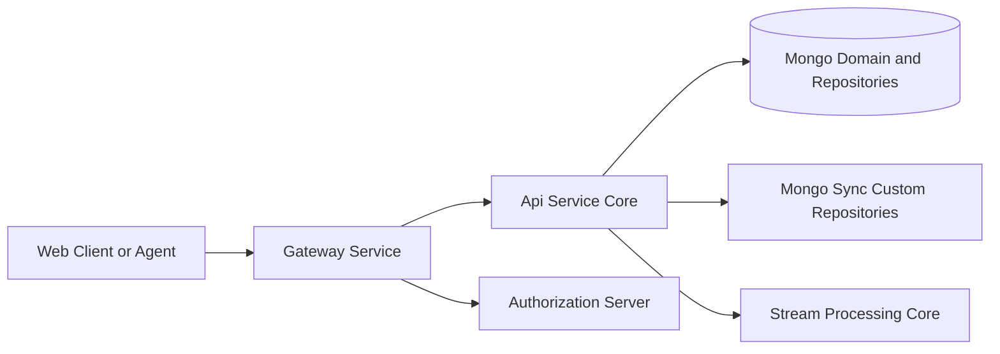
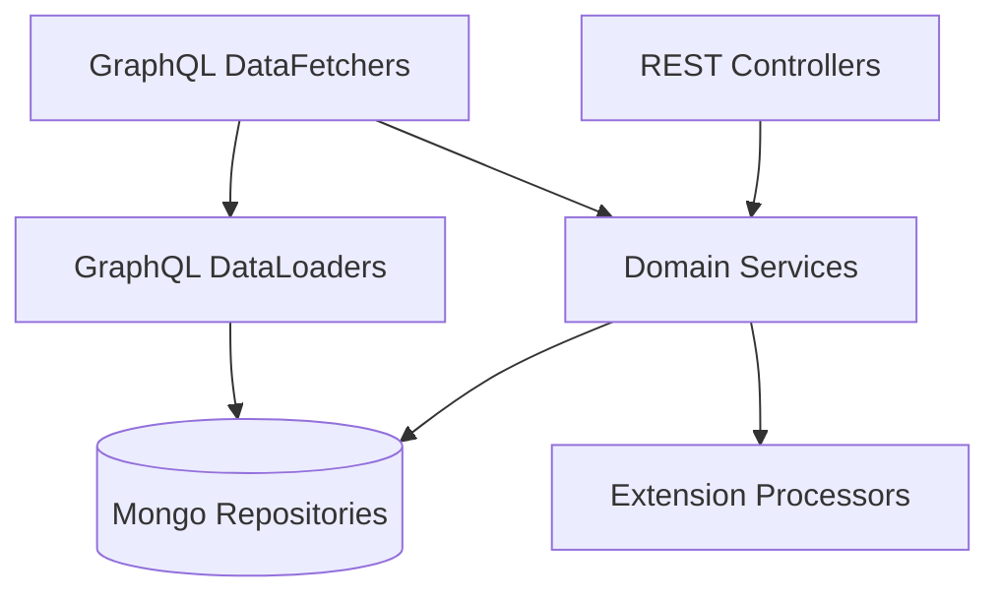
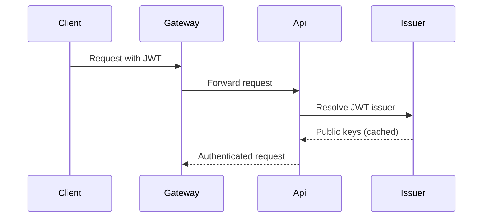
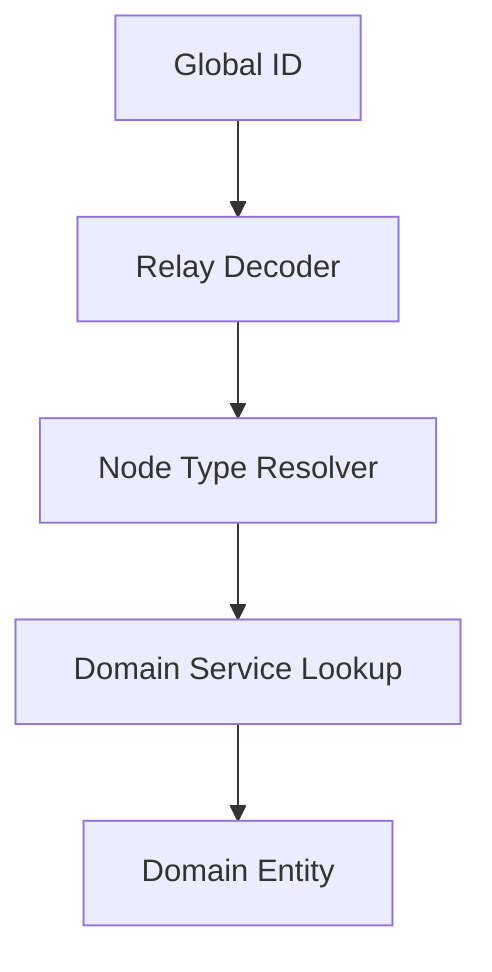
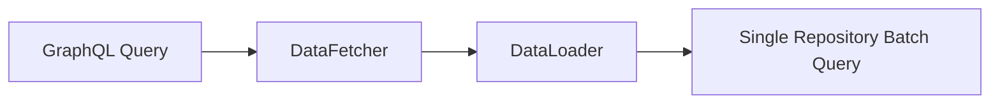
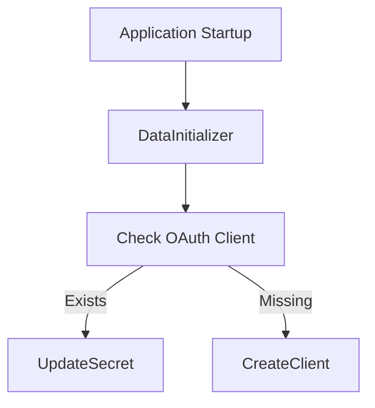

# Api Service Core

The **Api Service Core** module is the central business API layer of the OpenFrame platform. It exposes REST and GraphQL endpoints that power the UI, client applications, and internal services.

It sits behind the Gateway and Authorization Server and is responsible for:

- Business-oriented REST endpoints (users, organizations, SSO, API keys, devices, etc.)
- GraphQL API (queries, mutations, Relay node support)
- DataLoader-based batching and N+1 prevention
- JWT-based resource server validation
- Multi-tenant-aware domain access
- Extension hooks via processor interfaces

---

## 1. Architectural Position in the Platform

The Api Service Core acts as the primary domain façade over Mongo repositories and domain services.

### Responsibilities Boundaries

- **Gateway Service**: Handles CORS, rate limiting, JWT validation, header normalization.
- **Authorization Server**: Issues OAuth2 tokens and manages identity flows.
- **Api Service Core**: Enforces business rules, aggregates domain logic, exposes REST + GraphQL APIs.
- **Mongo Layers**: Persist domain documents.

---

## 2. Internal Architecture Overview

The Api Service Core follows a layered architecture:

### Key Layers

| Layer | Responsibility |
|--------|----------------|
| Configuration | Security, GraphQL scalars, application beans |
| Controllers | REST endpoints |
| DataFetchers | GraphQL queries and mutations |
| DataLoaders | Batch loading to prevent N+1 problems |
| Services | Business logic orchestration |
| Processors | Post-processing extension hooks |
| Relay Resolvers | Node and interface resolution |

---

## 3. Configuration Layer

### Core Configuration Classes

- `ApiApplicationConfig` – Defines shared beans (e.g., `PasswordEncoder`).
- `AuthenticationConfig` – Registers custom argument resolver for `@AuthenticationPrincipal`.
- `SecurityConfig` – Configures OAuth2 resource server with issuer-based JWT resolution.
- `RestTemplateConfig` – Provides REST client bean.
- `DataInitializer` – Initializes default OAuth client at startup.

### GraphQL Scalar Configuration

Custom scalars enable strong typing in GraphQL:

- `DateScalarConfig` → `Date` (yyyy-MM-dd)
- `InstantScalarConfig` → `Instant` (ISO-8601)
- `LongScalarConfig` → 64-bit long values

These scalars ensure strict parsing, validation, and serialization at the GraphQL boundary.

---

## 4. Security Model

The Api Service Core runs as an OAuth2 **Resource Server**.

### JWT Issuer Resolution

- Uses `JwtIssuerAuthenticationManagerResolver`
- Caches `JwtAuthenticationProvider` instances via Caffeine
- Supports multi-issuer environments

> The Gateway handles primary JWT validation and authorization routing. The Api Service Core enables authentication context for `@AuthenticationPrincipal` support and domain logic.

---

## 5. REST Controllers

The REST layer exposes mutation-oriented and administrative endpoints.

### Key Controllers

| Controller | Responsibility |
|------------|----------------|
| `HealthController` | Liveness check |
| `MeController` | Current authenticated user |
| `UserController` | User CRUD and soft-delete |
| `InvitationController` | Invitation lifecycle |
| `ApiKeyController` | API key management |
| `OrganizationController` | Organization mutations |
| `SSOConfigController` | SSO provider configuration |
| `DeviceController` | Device status updates |
| `ForceAgentController` | Forced installations and updates |
| `ReleaseVersionController` | Release metadata |
| `OpenFrameClientConfigurationController` | Client config retrieval |
| `AgentRegistrationSecretController` | Agent registration secrets |

REST endpoints are primarily used for:
- Administrative operations
- Internal service calls
- Actions requiring immediate consistency

---

## 6. GraphQL Layer (DGS Framework)

The GraphQL API is implemented using Netflix DGS and follows Relay conventions.

### GraphQL Capabilities

- Cursor-based pagination
- Relay global IDs
- Node interface resolution
- Connection/Edge models
- DataLoader-based batching

### Major DataFetchers

| DataFetcher | Domain |
|-------------|--------|
| `DeviceDataFetcher` | Devices and filters |
| `EventDataFetcher` | Events and logs |
| `OrganizationDataFetcher` | Organizations |
| `KnowledgeBaseDataFetcher` | Articles and folders |
| `AssignmentDataFetcher` | Assignable relationships |
| `NotificationDataFetcher` | User/Agent notifications |
| `TagDataFetcher` | Tag management |
| `ToolsDataFetcher` | Integrated tools |
| `NodeDataFetcher` | Relay node resolution |

---

## 7. Relay & Node Resolution

Global IDs follow the Relay pattern.

### Resolvers

- `NodeTypeResolver` – Maps domain object to GraphQL `Node` type.
- `AssignableTargetTypeResolver` – Resolves polymorphic assignment targets.
- `NodeDataFetcher` – Fetches nodes by global ID.

This enables uniform client-side object identification.

---

## 8. DataLoader Strategy (N+1 Prevention)

To prevent N+1 query issues, DataLoaders batch domain lookups.

### Key DataLoaders

- `MachineDataLoader`
- `OrganizationDataLoader`
- `TagDataLoader`
- `TicketDataLoader`
- `InstalledAgentDataLoader`
- `ToolConnectionDataLoader`
- `UserDataLoader`

This ensures scalable GraphQL execution even under high relational depth.

---

## 9. Domain Services & Extension Processors

Services orchestrate domain logic and call repositories.

Extension points are provided through processor interfaces:

- `UserProcessor`
- `InvitationProcessor`
- `SSOConfigProcessor`
- `AgentRegistrationSecretProcessor`

Default implementations (e.g., `DefaultUserProcessor`) are conditionally registered and act as no-ops.

This enables:
- SaaS-specific extensions
- Event publishing hooks
- Audit logging integrations
- Custom post-processing logic

---

## 10. SSO Configuration Management

`SSOConfigService` manages SSO provider configuration.

Features:
- Encrypted client secrets
- Provider enable/disable
- Auto-provisioning validation
- Domain validation
- Post-processing hooks

Supports multi-provider scenarios such as Microsoft and Google.

---

## 11. User Management

`UserService` provides:

- Paginated listing
- Update operations
- Soft deletion
- Owner protection rules
- Self-delete prevention

Soft deletion sets status to `DELETED` instead of removing records.

---

## 12. Initialization & Bootstrap

`DataInitializer` ensures a default OAuth client exists at startup.

This ensures the API always has a valid OAuth client configuration.

---

## 13. Design Principles

The Api Service Core is designed with the following principles:

- **Separation of concerns** between Gateway, Authorization, and API layers
- **Relay-compliant GraphQL** for scalable frontends
- **Batching and pagination-first design**
- **Extension via processors** rather than modification
- **Multi-tenant-ready JWT issuer resolution**
- **Soft-deletion over hard deletion** for auditability

---

# Summary

The **Api Service Core** module is the central business API engine of OpenFrame. It combines:

- REST endpoints for mutation-heavy workflows
- A Relay-compliant GraphQL API for rich UI interactions
- Secure OAuth2 resource server integration
- Efficient batching with DataLoaders
- Extensible processor hooks for SaaS and enterprise customizations

It acts as the orchestrator between client-facing APIs and the underlying domain and persistence layers, forming the backbone of the OpenFrame platform’s application logic.