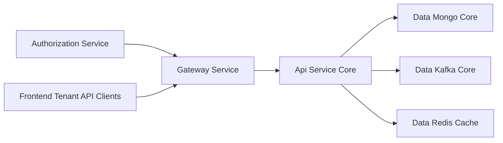
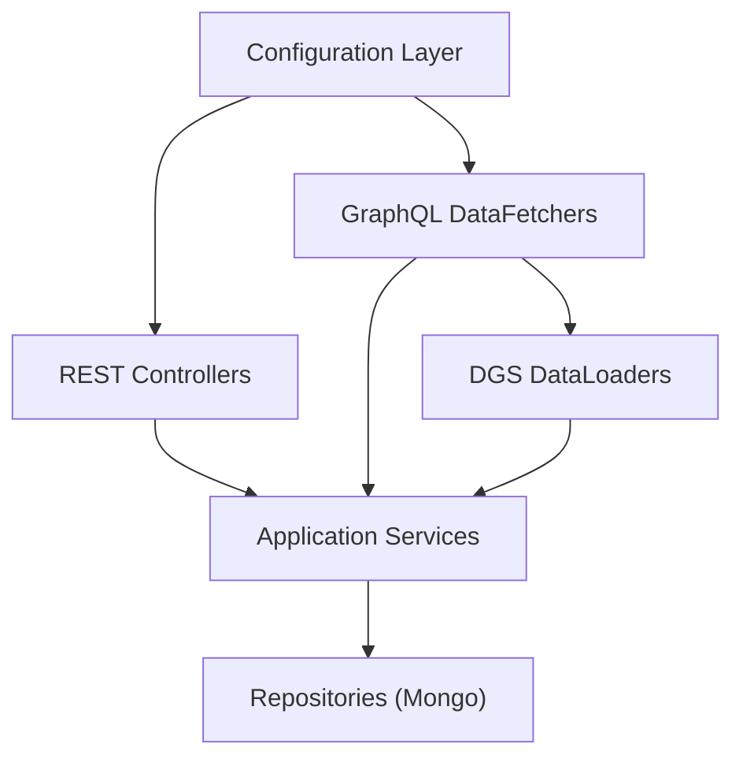
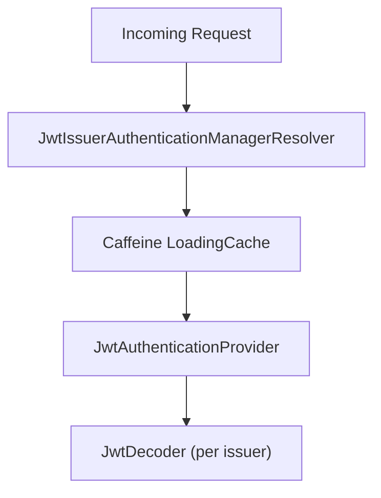
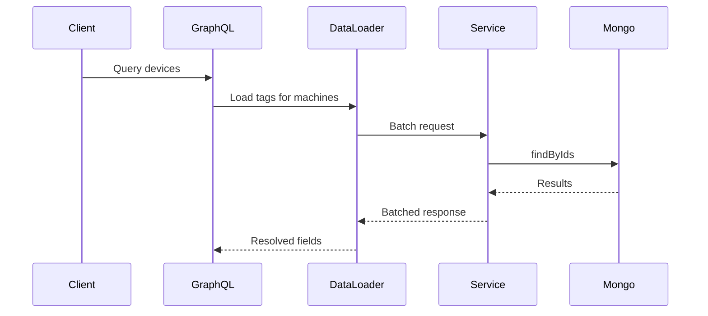
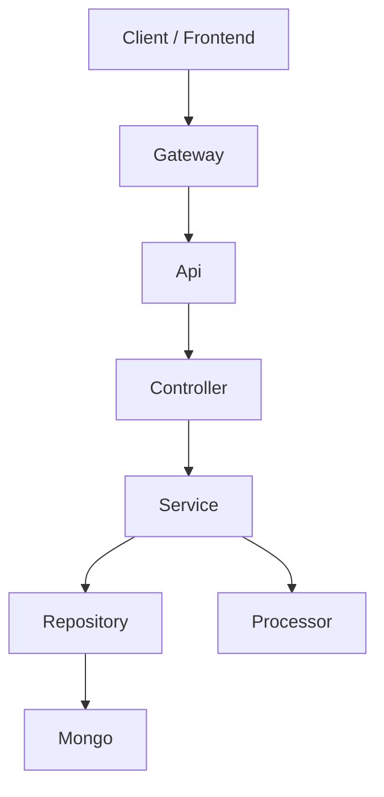

# Api Service Core

## Overview

The **Api Service Core** module is the internal application layer of OpenFrame responsible for:

- Exposing REST endpoints for internal operations
- Providing GraphQL queries and mutations for the frontend
- Orchestrating domain services for devices, organizations, users, tools, logs, and events
- Integrating authentication context into business logic
- Coordinating SSO configuration and user lifecycle hooks

It acts as the primary **application service boundary** between:

- Gateway and Authorization layers (authentication + routing)
- Data modules (MongoDB, Kafka, Redis)
- Frontend GraphQL clients
- Domain services and repositories

The module is implemented using Spring Boot, Spring Security (OAuth2 Resource Server), and Netflix DGS for GraphQL.

---

## Architectural Role in the Platform

Within the broader OpenFrame system, the Api Service Core:

- Relies on the Gateway Service for authentication and JWT validation at the edge
- Uses the Authorization Service for OAuth2/OIDC flows
- Uses Mongo repositories for persistence
- Uses Kafka-based stream processing indirectly via domain services
- Serves GraphQL and internal REST endpoints consumed by frontend clients

### High-Level Architecture

The Api Service Core focuses strictly on application orchestration and domain coordination.

---

## Internal Module Structure

The module can be logically divided into the following layers:

1. Configuration Layer
2. REST Controllers
3. GraphQL Data Fetchers
4. DataLoaders (Batching Layer)
5. Application Services
6. Post-Processing Hooks (Processors)

### Internal Layered View

---

# 1. Configuration Layer

## ApiApplicationConfig

Provides application-level beans.

Key responsibility:

- Registers a `PasswordEncoder` using `BCryptPasswordEncoder`.

This encoder is used for secure password hashing in user-related flows.

---

## AuthenticationConfig

Registers a custom Spring MVC argument resolver:

- `AuthPrincipalArgumentResolver`

This enables the use of:

- `@AuthenticationPrincipal AuthPrincipal`

inside controllers such as `MeController`, allowing direct access to the authenticated user context.

---

## SecurityConfig

The security configuration is intentionally minimal.

Design principle:

- Gateway handles authentication, JWT validation, filtering, and cookie-to-header mapping.
- Api Service Core enables OAuth2 Resource Server only to support `@AuthenticationPrincipal`.

Key components:

- `JwtIssuerAuthenticationManagerResolver`
- Caffeine-based cache for `JwtAuthenticationProvider`

### JWT Provider Cache Flow

Security filter chain behavior:

- CSRF disabled
- All requests permitted (authorization enforced upstream)
- OAuth2 resource server enabled for principal resolution

---

# 2. REST Controllers

REST controllers expose internal mutation APIs.

## HealthController

Endpoint:

- `GET /health`

Used for service health checks and readiness validation.

---

## MeController

Endpoint:

- `GET /me`

Responsibilities:

- Extracts `AuthPrincipal`
- Returns authenticated user metadata
- Returns 401 if no principal is available

This endpoint is critical for frontend session validation.

---

## DeviceController

Endpoint:

- `PATCH /devices/{machineId}`

Responsibility:

- Updates device status through `DeviceService`

This is used internally for lifecycle updates.

---

## OrganizationController

Endpoints:

- `POST /organizations`
- `PUT /organizations/{id}`
- `DELETE /organizations/{id}`

Responsibilities:

- Create organization
- Update organization
- Delete organization (with conflict protection)

Handles domain exceptions such as:

- OrganizationHasMachinesException → 409 Conflict

Uses:

- `OrganizationCommandService`
- `OrganizationMapper`

---

# 3. GraphQL Data Fetchers

GraphQL is implemented using Netflix DGS.

Each DataFetcher maps GraphQL queries/mutations to application services.

## DeviceDataFetcher

Queries:

- `deviceFilters`
- `devices`
- `device`

Field resolvers (via DataLoader):

- tags
- toolConnections
- installedAgents
- organization

Uses:

- `DeviceService`
- `DeviceFilterService`
- `GraphQLDeviceMapper`

---

## EventDataFetcher

Queries:

- `events`
- `eventById`
- `eventFilters`

Mutations:

- `createEvent`
- `updateEvent`

Uses:

- `EventService`
- `GraphQLEventMapper`

---

## LogDataFetcher

Queries:

- `logFilters`
- `logs`
- `logDetails`

Provides audit visibility with cursor-based pagination.

---

## OrganizationDataFetcher

Queries:

- `organizations`
- `organization`
- `organizationByOrganizationId`

Uses:

- `OrganizationQueryService`
- `OrganizationService`

---

## ToolsDataFetcher

Queries:

- `integratedTools`
- `toolFilters`

Uses:

- `ToolService`

---

# 4. DGS DataLoaders (Batching Layer)

DataLoaders solve the N+1 problem in GraphQL.

## InstalledAgentDataLoader

- Batches machineId lookups
- Uses `InstalledAgentService`

## OrganizationDataLoader

- Batch loads organizations by organizationId
- Filters soft-deleted records

## TagDataLoader

- Loads tags for machines

## ToolConnectionDataLoader

- Loads tool connections for machines

### DataLoader Pattern

---

# 5. Application Services

## SSOConfigService

Manages SSO provider configurations.

Capabilities:

- Get enabled providers
- Upsert provider configuration
- Toggle provider enablement
- Delete configuration
- Validate allowed domains
- Encrypt/decrypt client secrets

Collaborators:

- `SSOConfigRepository`
- `EncryptionService`
- `DomainValidationService`
- `SSOConfigProcessor`

Ensures:

- Microsoft-specific validation for auto-provision
- Domain normalization and validation

---

## UserService

Handles user lifecycle operations.

Key operations:

- List users (paginated)
- Update user
- Soft delete user

Business rules:

- Users cannot delete themselves
- OWNER role cannot be deleted
- Soft deletion sets status to DELETED

Uses:

- `UserRepository`
- `UserMapper`
- `UserProcessor`

---

# 6. Processor Extension Points

Processors allow customization without modifying core logic.

## DefaultInvitationProcessor

Hooks:

- postProcessInvitationCreated
- postProcessInvitationRevoked

---

## DefaultSSOConfigProcessor

Hooks:

- postProcessConfigSaved
- postProcessConfigDeleted
- postProcessConfigToggled

---

## DefaultUserProcessor

Hooks:

- postProcessUserDeleted
- postProcessUserUpdated
- postProcessUserGet

These are registered conditionally and can be overridden by custom implementations.

---

# Request Lifecycle Summary

---

# Design Principles

1. Thin Controllers – orchestration only
2. Service-Oriented Application Layer
3. GraphQL-first for read operations
4. REST for internal mutations
5. Batch loading to prevent N+1
6. Extension points via processors
7. Authentication delegated to Gateway

---

# Summary

The Api Service Core is the central application service layer of OpenFrame.

It:

- Exposes internal REST endpoints
- Implements GraphQL queries and mutations
- Batches and optimizes data fetching
- Coordinates domain services
- Integrates authentication context
- Provides SSO and user lifecycle orchestration
- Offers extension points for customization

It forms the backbone of tenant-facing business operations while remaining decoupled from edge security and infrastructure concerns.