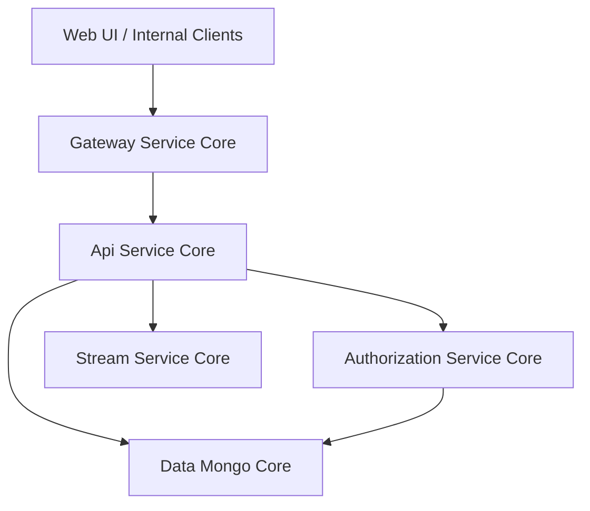
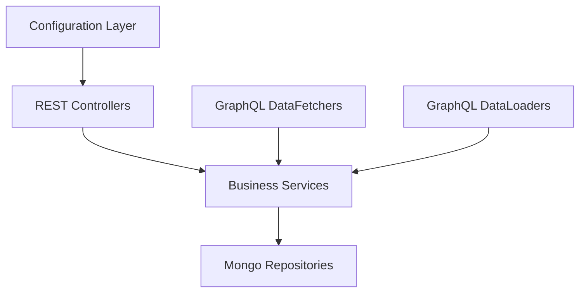
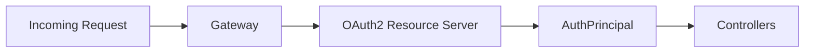
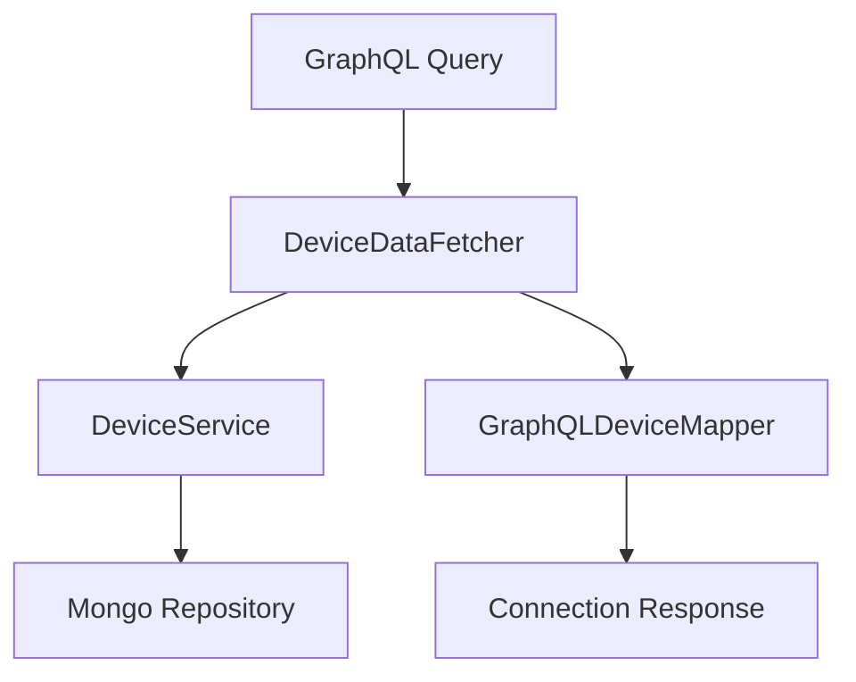
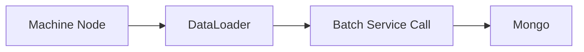
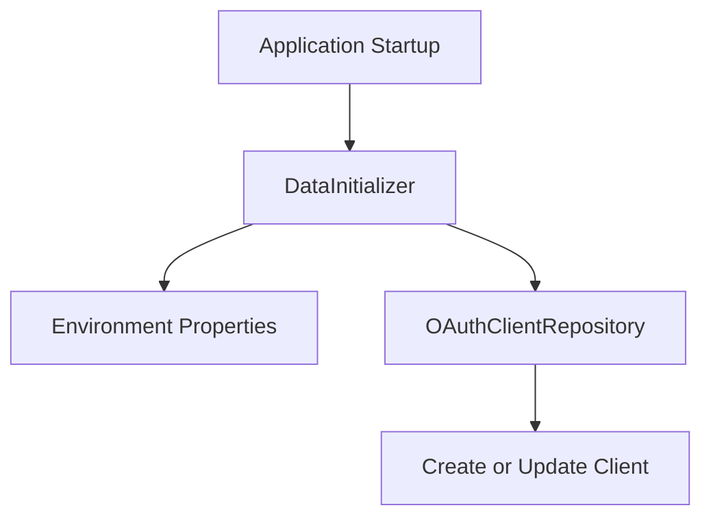

# Api Service Core

The **Api Service Core** module is the central internal API layer of the OpenFrame platform. It exposes REST and GraphQL endpoints used by the Web UI, administrative tools, and internal services. 

It focuses on:

- Internal business operations (users, organizations, API keys, SSO configuration)
- Device and event querying via GraphQL
- Secure integration with the Authorization and Gateway layers
- Coordination with Mongo persistence and downstream services

This module is part of a larger service ecosystem and works closely with:

- [Authorization Service Core](../authorization-service-core/authorization-service-core.md)
- [Gateway Service Core](../gateway-service-core/gateway-service-core.md)
- [Data Mongo Core](../data-mongo-core/data-mongo-core.md)
- [Security OAuth Core](../security-oauth-core/security-oauth-core.md)
- [External API Service Core](../external-api-service-core/external-api-service-core.md)

---

## High-Level Architecture

The Api Service Core acts as a **business API layer** behind the Gateway. The Gateway handles edge security and routing, while this module provides application logic and data access.

### Responsibilities Separation

- **Gateway Service Core**: JWT validation, CORS, rate limiting, header normalization.
- **Authorization Service Core**: OAuth2/OIDC flows, tenant isolation, key management.
- **Api Service Core**: Business logic, internal REST APIs, GraphQL APIs, orchestration.
- **Data Mongo Core**: Persistence layer and repositories.

---

## Internal Structure Overview

The Api Service Core is organized into the following layers:

### 1. Configuration Layer

Key configuration classes:

- `ApiApplicationConfig` – Provides `PasswordEncoder` bean (BCrypt).
- `AuthenticationConfig` – Registers `AuthPrincipalArgumentResolver`.
- `SecurityConfig` – Configures OAuth2 Resource Server support.
- `RestTemplateConfig` – Defines `RestTemplate` bean.
- `DateScalarConfig` / `InstantScalarConfig` – GraphQL scalar types.
- `DataInitializer` – Initializes default OAuth clients at startup.

#### Security Model

Unlike the Gateway, this module **does not perform primary JWT validation**. Instead:

- Gateway validates tokens.
- Api Service Core enables OAuth2 Resource Server support to resolve `@AuthenticationPrincipal`.
- JWT issuers are resolved dynamically and cached via Caffeine.

---

## REST Controllers

The REST layer exposes internal operational endpoints.

### User & Identity

- `UserController` – User listing, update, soft delete.
- `MeController` – Current authenticated user info.
- `InvitationController` – Invitation lifecycle.
- `SSOConfigController` – SSO provider management.
- `ApiKeyController` – API key lifecycle (create, update, revoke, regenerate).

These rely heavily on:

- `UserService`
- `SSOConfigService`
- `ApiKeyService`

### Organization Management

- `OrganizationController` – Create, update, delete organizations.

Read operations are handled separately in External API for public-facing queries.

### Device & Agent Operations

- `DeviceController` – Internal device status updates.
- `AgentRegistrationSecretController` – Agent registration secrets.
- `ForceAgentController` – Force install/update/reinstall tool agents and clients.

### Platform & Operational

- `HealthController` – Liveness endpoint.
- `ReleaseVersionController` – Current platform version.
- `OpenFrameClientConfigurationController` – Client runtime configuration.

---

## GraphQL Layer

The Api Service Core uses Netflix DGS for GraphQL support.

### Data Fetchers

- `DeviceDataFetcher`
- `EventDataFetcher`
- `LogDataFetcher`
- `OrganizationDataFetcher`
- `ToolsDataFetcher`

Each fetcher:

1. Validates input.
2. Maps GraphQL inputs to filter options.
3. Delegates to a service.
4. Maps results into connection types.

### GraphQL Query Flow Example

### DataLoader Optimization

To prevent N+1 problems, the module defines:

- `InstalledAgentDataLoader`
- `OrganizationDataLoader`
- `TagDataLoader`
- `ToolConnectionDataLoader`

These batch-load related entities per request.

---

## Core Services

### User Service

`UserService` handles:

- Pagination and mapping
- Soft delete logic
- Role validation (cannot delete OWNER)
- Self-delete protection

Soft delete sets status to `DELETED` instead of removing data.

### SSO Configuration Service

`SSOConfigService` manages provider configuration:

- Encrypted client secrets
- Domain validation
- Auto-provision rules
- Provider toggling

It integrates with:

- EncryptionService
- DomainValidationService
- SSOConfigProcessor (extensible post-processing hook)

### Invitation & User Processors

Default processors:

- `DefaultInvitationProcessor`
- `DefaultSSOConfigProcessor`
- `DefaultUserProcessor`

These allow extension via Spring bean replacement.

---

## Startup Initialization

`DataInitializer` ensures a default OAuth client exists at boot time:

This guarantees consistent OAuth configuration across deployments.

---

## Interaction with Other Modules

### With Authorization Service Core

- JWT issuer resolution
- OIDC and SSO configuration
- Tenant-aware identity

### With Data Mongo Core

- Uses repositories for Users, Organizations, Devices, Events
- Relies on Mongo documents and indexes

### With Gateway Service Core

- Receives authenticated and normalized requests
- Assumes JWT validation already performed

---

## Key Design Principles

1. **Separation of concerns** – Gateway handles edge security; this module handles business logic.
2. **Extensibility** – Processor interfaces allow custom behavior.
3. **GraphQL efficiency** – DataLoader prevents N+1 queries.
4. **Soft deletion strategy** – Critical entities are not physically removed.
5. **Multi-tenant aware** – Integrates with Authorization layer for tenant resolution.

---

## Summary

The **Api Service Core** module is the internal backbone of OpenFrame's application layer. It:

- Exposes secure REST and GraphQL APIs
- Implements core business logic
- Coordinates identity, SSO, API keys, devices, and organizations
- Connects persistence (Mongo) with higher-level services

It operates behind the Gateway and alongside the Authorization Service, forming the heart of the platform's internal API surface.